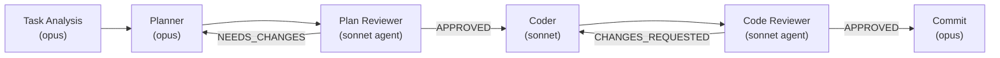

# Recent Changes Summary (115a7b1..HEAD)

## Overview
Major architectural refactoring of Claude Kit workflow (commits 115a7b1 to 70c7602, ~10 commits).

**Key theme:** Migration from commands-only to command + agent hybrid. Review phases (plan-review, code-review) extracted from commands into standalone sonnet agents. CLI entry points simplified. New skill system introduced for rule bundles and protocol documentation.

---

## 1. Pipeline Transformation

### Before
```
/workflow (opus) → /planner (opus) → /plan-review (command, opus)
  → /coder (opus) → /code-review (command, opus)
```

### After
```
/workflow (opus) → /planner (opus) → plan-reviewer (agent, sonnet)
  → /coder (sonnet) → code-reviewer (agent, sonnet)
```

**Changes:**
- `/plan-review` command DELETED → **plan-reviewer agent** (new, standalone)
- `/code-review` command DELETED → **code-reviewer agent** (new, standalone)
- `/coder` model downgraded: opus → sonnet (saves cost, follows workflow design)
- Both review agents now isolated (clean context, no creation bias)
- Workflow remains in opus (coordination complexity justifies cost)

---

## 2. Files Changed by Category

### A. Commands (Major Refactoring)

| File | Change | Impact |
|------|--------|--------|
| `.claude/commands/workflow.md` | 72 lines | Translated Russian → English, simplified autonomy rules, added phase-to-phase transition logic, removed verbose section dividers |
| `.claude/commands/planner.md` | ~30 lines | Translated English, simplified handoff format reference (now points to skill), added code-researcher Task tool trigger |
| `.claude/commands/coder.md` | ~40 lines | Model opus → sonnet, translated English, simplified handoff, added evaluate protocol reference, added code-researcher trigger for evaluate phase |
| `.claude/commands/code-review.md` | **DELETED** | 250+ lines. Extracted to **code-reviewer agent** |
| `.claude/commands/plan-review.md` | **DELETED** | 200+ lines. Extracted to **plan-reviewer agent** |

**Handoff Refactoring Pattern:**
- **Before:** Full handoff format embedded in each command
- **After:** Handoff format reference → skill [handoff-protocol.md]
- Saves duplication, centralizes contract updates

### B. New Agents (Standalone)

| Agent | File | Lines | Model | Role |
|-------|------|-------|-------|------|
| **code-reviewer** | `.claude/agents/code-reviewer.md` | 227 | sonnet | Reviews code: architecture, security, error handling, test coverage |
| **plan-reviewer** | `.claude/agents/plan-reviewer.md` | ~200 | sonnet | Validates plan against architecture, completeness |
| **code-researcher** | `.claude/agents/code-researcher.md` | (existing, updated) | haiku | Read-only codebase exploration (Task tool subagent) |

**Structural Pattern (agents):**
- YAML frontmatter: name, model, tools, skills, memory, maxTurns, isolation
- Role: identity + owns/does_not_own + output_contract + success_criteria
- Rules (CRITICAL sections): no-fix, no-approve-with-blockers, etc.
- Autonomy: stop/continue conditions
- Process: numbered steps (STARTUP, QUICK CHECK, GET CHANGES, REVIEW, VERDICT)
- Output format: verdict matrix + issues structured by severity + handoff payload

---

## 3. New Skills System (Major Addition)

### 3a. Workflow Protocols Skill

**Location:** `.claude/skills/workflow-protocols/`

**Files Created:**
- `SKILL.md` (96 lines) — skill index, event-driven protocol loading
- `autonomy.md` — 3 modes (INTERACTIVE/AUTONOMOUS/RESUME), stop/continue conditions
- `beads.md` — beads integration (priorities, commands, per-command matrix)
- `checkpoint-protocol.md` — session recovery, checkpoint format (12 fields), recovery heuristics
- `handoff-protocol.md` — 4 contracts (planner→plan-review, plan-review→coder, coder→code-review, code-review→completion)
- `orchestration-core.md` (128 lines) — pipeline phases, loop limits (max 3), session recovery strategy
- `pipeline-metrics.md` — completion tracking (12 fields), MCP Memory storage
- `re-routing.md` — complexity mismatch handling
- `examples-troubleshooting.md` — execution examples, common mistakes

**Key Insight:** Protocols extracted from inline commands → reusable, version-controlled skill files. Loaded event-driven (not all upfront).

### 3b. Other New Skills

- `.claude/skills/planner-rules/` — planner-specific checks, MCP tool patterns, sequential-thinking guide
- `.claude/skills/coder-rules/` — coder CRITICAL rules (5), evaluate protocol, mcp-tools (language profile)
- `.claude/skills/code-review-rules/` — review checklist, security checklist, examples, troubleshooting
- `.claude/skills/plan-review-rules/` — plan validation checklist, troubleshooting
- `.claude/skills/tdd-go/` — Go-specific TDD patterns (conditional load if "## TDD" in plan)

**Rationale:** Rules bundled by phase/command. Agents/commands load via frontmatter `skills:` field.

---

## 4. Rules Directory (New)

**Location:** `.claude/rules/`

**Files Created:**
- `workflow.md` — orchestration rules, loop limits, agents vs commands
- `architecture.md` — import matrix, domain purity (Go-specific)
- `go-conventions.md` — error wrapping, concurrency, config
- `testing.md` — table-driven tests, race detector, mocks
- `handler-rules.md` — handler layer specifics
- `service-rules.md` — service layer specifics
- `repository-rules.md` — repository layer specifics
- `models-rules.md` — domain models (stdlib-only, constructors)

**Loaded:** CLAUDE.md automatically loads rules per file pattern (e.g., `handler/**/*.go` loads handler-rules.md).

---

## 5. Settings Transformation

**File:** `.claude/settings.json`

**Major Changes:**
- **Permissions:** Expanded from 4 wildcards to 48 specific Bash commands (whitelist + deny list)
- **Hooks:** Restructured from simple command refs to nested hook arrays
  - Added PreToolUse: protect-files.sh, check-artifact-size.sh, block-dangerous-commands.sh
  - Added PostToolUse: auto-fmt-go.sh, yaml-lint.sh, check-references.sh, check-plan-drift.sh
  - Added PreCompact: save-progress-before-compact.sh
  - Added SubagentStop: save-review-checkpoint.sh (plan-reviewer, code-reviewer)
  - Added UserPromptSubmit: enrich-context.sh
  - Added Stop: verify-phase-completion.sh, check-uncommitted.sh
  - Added SessionEnd: session-analytics.sh
  - Added Notification: notify-user.sh

**New Fields:**
- `autoMemoryEnabled: true` — auto-memory for preferences, build state, debugging

**Deleted:**
- PostFileEdit/PostFileWrite hooks (replaced by PostToolUse hooks on Write/Edit)

**Template Added:** `.claude/settings.local.json` for personal overrides (gitignored).

---

## 6. Deleted / Migrated Files

| File | Status | Migration |
|------|--------|-----------|
| `.claude/commands/code-review.md` | DELETED | → `.claude/agents/code-reviewer.md` |
| `.claude/commands/plan-review.md` | DELETED | → `.claude/agents/plan-reviewer.md` |
| `.claude/commands/deps/shared-core.md` | DELETED | Split into skills (autonomy.md, beads.md, etc.) + rules/ |
| `.claude/commands/deps/planner/sequential-thinking-guide.md` | DELETED | → `.claude/skills/planner-rules/sequential-thinking-guide.md` |
| `.claude/commands/deps/plan-review/sequential-thinking-guide.md` | DELETED | → `.claude/skills/plan-review-rules/` |
| `.claude/prompts/workflow-migration.md` | DELETED | 250 lines (migration guidance, now in CLAUDE.md + README.md) |

---

## 7. CLI Entry Points (Simplified)

**Before:**
- `/workflow` (orchestrator)
- `/planner` (planner command)
- `/plan-review` (plan-reviewer command)
- `/coder` (coder command)
- `/code-review` (code-reviewer command)
- `/project-researcher` (researcher command)
- `/meta-agent` (meta-agent command)

**After:**
- `/workflow` (orchestrator) — same
- `/planner` (planner command) — same
- `/coder` (coder command) — same, model downgraded to sonnet
- `plan-reviewer` (agent) — no CLI, invoked via `/workflow` → plan-review phase
- `code-reviewer` (agent) — no CLI, invoked via `/workflow` → code-review phase
- `/project-researcher` (command) — unchanged
- `/meta-agent` (command) — unchanged

**User Experience:** Always use `/workflow`. Never call review agents directly (they're invoked automatically).

---

## 8. Language & Localization

**Major Change:** All Russian text translated to English.

**Files Affected:**
- `.claude/commands/workflow.md` — 72 lines (description, role, examples, prompts)
- `.claude/commands/planner.md` — all descriptions
- `.claude/commands/coder.md` — all descriptions
- `.claude/templates/skill.md` — 58 lines (template notes, constraints, examples)

**Rationale:** Supports global teams, simplifies maintenance, aligns with code (English).

---

## 9. New Documentation

**File:** `README.md` (545 lines, newly created)

**Contents:**
- Installation (copy .claude/, CLAUDE.md)
- Quick start (/meta-agent onboard, /project-researcher)
- Commands section: /workflow, /planner, /coder, /project-researcher, /meta-agent, /db-explorer
- Concepts: tasks, complexity, routes, checkpoints, agents, handoffs, memory
- Configuration: settings.json, settings.local.json, CLAUDE.md, PROJECT-KNOWLEDGE.md
- Architecture: directory structure, extension points

**Updated:** CLAUDE.md with new rules directory references.

---

## 10. Mermaid Diagram Impact

**Relevant for README.md diagrams:**

### Pipeline Flow
**Before (implicit in code):**
```
opus-planner → opus-plan-review → opus-coder → opus-code-review
```

**After (explicit in skills):**
```
opus-planner → sonnet-plan-review-agent → sonnet-coder → sonnet-code-review-agent
```

**Color scheme (recent commit 7db0fd6):**
- opus = blue
- sonnet = purple (CHANGED from blue in code-reviewer diagrams)
- haiku = yellow/orange
- agents = dashed/rounded boxes (vs commands = solid)

### Example Diagram Update Needed:


---

## 11. Key Behavior Changes

### A. Handoff Protocol
- **Before:** Embedded in each command file
- **After:** Centralized in [handoff-protocol.md](workflow-protocols/handoff-protocol.md)
- **Impact:** Commands now reference skill instead of embedding (DRY principle)

### B. Autonomy Modes
- **Before:** Inline in workflow.md
- **After:** Skill [autonomy.md](workflow-protocols/autonomy.md)
- **Behavior unchanged:** INTERACTIVE (default), AUTONOMOUS (--auto), RESUME (--from-phase N)

### C. Loop Limits
- **Before:** Implicit ("max 3 iterations")
- **After:** Explicit in [orchestration-core.md](workflow-protocols/orchestration-core.md)
- **New:** Checkpoint-based tracking, heuristic recovery if checkpoint missing
- **Guard check:** Runs BEFORE phase launch, not after verdict

### D. Code Review Workflow
- **Before:** Inline in /code-review command (opus-powered)
- **After:** Standalone code-reviewer agent (sonnet)
- **Impact:** Parallel reviews possible, clean context, faster, cheaper
- **Rules:** RULE_1 (no fix), RULE_2 (no approve with blockers), RULE_3 (tests first), RULE_4 (always check architecture)

### E. Plan Review Workflow
- **Before:** Inline in /plan-review command
- **After:** Standalone plan-reviewer agent (sonnet)
- **New phase:** Complexity classification (S/M/L/XL) → route selection at start of /workflow

---

## 12. New Trigger: Code-Researcher Agent

**Added to `/planner` and `/coder`:**

In `/planner`:
```yaml
- tool: "code-researcher (via Task tool)"
  when: "Research scope > 3 packages OR complexity L/XL (and not --minimal)"
  usage: "Delegate codebase exploration to haiku agent"
  skip_when: "S/M complexity, --minimal mode"
```

In `/coder`:
```yaml
- if: "Evaluate phase finds unfamiliar pattern or unclear existing implementation"
  then: "Use code-researcher agent via Task tool for investigation before implementing"
```

**Benefit:** Haiku agent handles read-only exploration, saves token budget in main command.

---

## Summary of Structural Changes

| Aspect | Before | After | Impact |
|--------|--------|-------|--------|
| Review phases | Commands | Agents | Clean review context, parallel possible |
| Handoff docs | Embedded | Skill files | DRY, centralized, version-controlled |
| Rules | Implicit | Explicit files | Checkable, auditable, tool-enforced |
| Hooks | Simple refs | Nested arrays | More control, event-driven |
| Permissions | Wildcards | Whitelist+deny | Security, explicitness |
| Language | Russian+English | English only | Global accessibility |
| Coder model | opus | sonnet | Cost optimization (opus → orchestration only) |
| Skills system | Minimal | Comprehensive | Rule bundling, protocol reusability |

---

## Files Most Likely to Need README Updates

1. **Pipeline diagram** — add agent nodes, show sonnet colors
2. **Phase breakdown** — clarify that plan-review/code-review are agents, not commands
3. **Loop limits** — document 3-iteration max per cycle, checkpoint recovery
4. **New sections needed:**
   - Skills system overview
   - Rules directory + enforcement
   - Hooks architecture
   - Agent isolation & model routing

