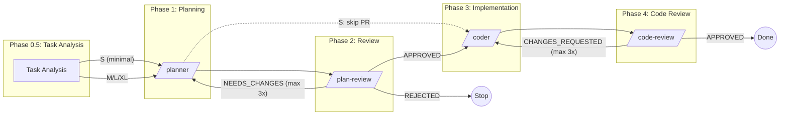

# Workflow Phases Reference

## PIPELINE DIAGRAM

```
task-analysis → /planner → /plan-review → /coder → /code-review
     ↓              ↓           ↓            ↓           ↓
  Classify        План    Валидация       Код       Ревью
  S → skip PR              ↓ FAIL         ↓ FAIL
                          ← назад ←      ← назад ←
                          (max 3x)       (max 3x)
```



---

## LOOP LIMITS

```yaml
loop_limits:
  plan_review_cycle:
    max_iterations: 3
    description: "planner ↔ plan-review"
    tracking: "TodoWrite: 'Phase 2: Plan Review (iteration N/3)'"
    on_exceeded: |
      STOP workflow. Вывести:
      1. Summary каждой итерации (что было запрошено, что исправлено)
      2. Какие issues остались нерешёнными
      3. Запросить user intervention: упростить задачу или дать guidance

  code_review_cycle:
    max_iterations: 3
    description: "coder ↔ code-review"
    tracking: "TodoWrite: 'Phase 4: Code Review (iteration N/3)'"
    on_exceeded: |
      STOP workflow. Вывести:
      1. Summary каждой итерации (какие issues, что исправлено)
      2. Какие issues остались нерешёнными
      3. Запросить user intervention: исправить вручную или изменить подход

  total_phases:
    max: 12
    description: "Суммарно фаз за один /workflow запуск"
    on_exceeded: "STOP → полный отчёт по всем фазам → запросить user intervention"

  anti_pattern: |
    ❌ Бесконечный цикл: plan → review(NEEDS_CHANGES) → plan → review(NEEDS_CHANGES) → ...
    ✅ С лимитом: plan → review(NEEDS_CHANGES) → plan → review(NEEDS_CHANGES) → plan → review(NEEDS_CHANGES) → STOP
```

---

## CONTEXT ISOLATION

```yaml
context_isolation:
  purpose: "Reviewer НЕ должен быть biased процессом создания артефакта"
  severity: CRITICAL

  rule: "Review-фазы ДОЛЖНЫ работать с чистым контекстом + narrative casting"

  implementation:
    preferred:
      method: "Запуск через Task tool (subagent)"
      benefit: "Reviewer НЕ видит процесс создания — объективное ревью"
      example: |
        Task tool:
          subagent_type: "general-purpose"
          prompt: |
            Review the plan at .claude/prompts/{feature}.md against project architecture.

            [Контекст от planner]:
            - Planner исследовал 3 подхода: {alternatives}
            - Выбран {approach} (обоснование в секции Architecture Decision)
            - Основной risk: {risk description}
            - Рекомендации: обратить внимание на Part N ({reason})

    fallback:
      method: "Если в том же контексте — ОБЯЗАТЕЛЬНО перечитать артефакт с нуля"
      rule: "Reviewer должен начать с Read файла, а НЕ полагаться на контекст"

  narrative_casting:
    purpose: "Передать reviewer'у ЧТО было сделано без bias КАК было сделано"
    severity: CRITICAL
    format: |
      [Контекст от предыдущего агента]:
      - {Агент} выполнил: {краткое описание действий}
      - Ключевые решения: {список с обоснованиями}
      - Известные риски: {список}
      - Рекомендации для reviewer: {на что обратить внимание}
    rule: "Narrative block передаётся из handoff_output предыдущей фазы"
    anti_pattern: "НЕ передавать промежуточные мысли, debug-сессии, rejected approaches details"

  what_reviewer_receives:
    plan_review:
      - ".claude/prompts/{feature}.md — план"
      - "Narrative context block из handoff_output planner (ключевые решения, риски, focus areas)"
      - "НЕ историю создания плана, НЕ промежуточные варианты, НЕ процесс исследования"
    code_review:
      - "git diff master...HEAD — diff"
      - "Narrative context block из handoff_output coder (adjustments, deviations, mitigated risks)"
      - "НЕ процесс имплементации, НЕ debug-сессии, НЕ evaluate reasoning"
```

---

## PHASE DETAILS

### PHASE 0: GET TASK (опционально)

Если используется bd-beads и передан `<id>` задачи:

```bash
bd show <id>                          # Детали задачи
bd update <id> --status=in_progress   # Взять в работу
```

Если задача не из beads — пропустить эту фазу.

### PHASE 0.5: TASK ANALYSIS

**Reference:** `deps/planner/task-analysis.md`

```yaml
phase:
  input: Task description (текст или beads ID)
  actions:
    - "Classify: тип задачи (new_feature, bug_fix, refactoring, ...)"
    - "Estimate: complexity (S/M/L/XL)"
    - "Route: определить маршрут workflow"
    - "Preconditions: проверить готовность"
  output: "Classification + Route decision"

routing:
  S: "/planner --minimal → skip Phase 2 → /coder → /code-review"
  M: "standard flow (all phases)"
  L: "full flow + Sequential Thinking рекомендован"
  XL: "full flow + Sequential Thinking ОБЯЗАТЕЛЕН"
```

**Confirm:** "Задача классифицирована как {type}/{complexity}. Маршрут: {route}. Продолжить?"

### PHASE 1: PLANNING

**Execute:** `/planner`

```yaml
phase:
  input: Task description + classification from Phase 0.5
  output: ".claude/prompts/{feature}.md"
  next: Phase 2 (или Phase 3 если S-complexity и Phase 2 skipped)
```

**Confirm:** "Продолжить к Phase 2: Plan Review?"

### PHASE 2: PLAN REVIEW

**Execute:** `/plan-review`

**Context Isolation:** SEE: CONTEXT ISOLATION section above. Reviewer работает ТОЛЬКО с планом.

```yaml
verdicts:
  - verdict: APPROVED
    action: "→ Phase 3"

  - verdict: NEEDS CHANGES
    action: "→ Phase 1 с issues (iteration N/3)"
    loop_check: "Если iteration > 3 → STOP (SEE: LOOP LIMITS)"

  - verdict: REJECTED
    action: "→ Спросить новые требования"
```

**Confirm:** "Продолжить к Phase 3: Implementation?"

### PHASE 3: IMPLEMENTATION

**Execute:** `/coder`

```yaml
steps:
  - step: 1. Implement
    command: "Parts из плана"

  - step: 2. Verify
    command: "make fmt && make lint && make test (adapt test command to project)"

results:
  - result: PASS
    action: "→ Phase 4"

  - result: FAIL
    action: "Fix → retry"
```

**Confirm:** "Продолжить к Phase 4: Code Review?"

### PHASE 4: CODE REVIEW

**Execute:** `/code-review`

**Context Isolation:** SEE: CONTEXT ISOLATION section above. Reviewer работает ТОЛЬКО с diff.

```yaml
verdicts:
  - verdict: APPROVED
    action: Done

  - verdict: APPROVED WITH COMMENTS
    action: "Done (minor)"

  - verdict: CHANGES REQUESTED
    action: "→ Phase 3 с issues (iteration N/3)"
    loop_check: "Если iteration > 3 → STOP (SEE: LOOP LIMITS)"
```

**Output:** "Фича готова!"

---

## ЗАВЕРШЕНИЕ

```yaml
completion_actions:
  - action: git commit
    required: true
    note: "Не пушить автоматически"

  - action: bd sync
    required: true
    note: "Синхронизировать задачи с remote"

  - action: bd close
    required: false
    note: "Напомнить пользователю"
```

**Если задача из bd-beads:**
- НЕ закрывать автоматически
- Напомнить: "Фича готова! Для закрытия задачи: `bd close <id>`"

---

## SAVE LESSONS LEARNED (опционально)

Если фича содержит ценные insights, сохранить в долгосрочную память:

```
Используй MCP memory (create_entities) чтобы сохранить:
- Что сработало хорошо
- Какие проблемы возникли и как решены
- Рекомендации для похожих задач
```

**Когда сохранять:**
- Нетривиальные проблемы и их решения
- Новые паттерны, которые хорошо работают
- Интеграции с внешними системами

**Когда НЕ сохранять:**
- Тривиальные изменения
- Стандартные CRUD операции
- Багфиксы без insights

**Формат entity:**
```json
{
  "name": "Lessons: {Feature Name}",
  "entityType": "lessons_learned",
  "observations": [
    "Проблема: ... → Решение: ...",
    "Паттерн: ... работает хорошо для ...",
    "Избегать: ..."
  ]
}
```
