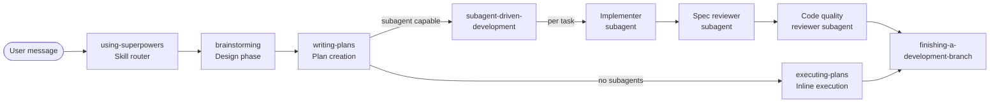

## Cross-Review: Superpowers v5.0.6 vs Claude Kit Workflow

> **Цель:** Сравнительный анализ двух конфигурационных фреймворков для Claude Code. Выявление сильных сторон каждого и рекомендации по адаптации лучших практик Superpowers в Claude Kit Workflow.

---

## Содержание

1. [Executive Summary](#executive-summary)
2. [Superpowers Architecture Overview](#superpowers-architecture-overview)
3. [Сравнительная таблица](#сравнительная-таблица)
4. [Сильные стороны Superpowers](#сильные-стороны-superpowers)
5. [Сильные стороны Claude Kit](#сильные-стороны-claude-kit)
6. [Quick Wins](#quick-wins)
7. [Strategic Adoptions](#strategic-adoptions)
8. [Не рекомендуется адаптировать](#не-рекомендуется-адаптировать)
9. [Приоритизированный Roadmap](#приоритизированный-roadmap)

---

## Executive Summary

**Superpowers** — open-source plugin-фреймворк (Jesse Vincent / @obra) для 5+ платформ (Claude Code, Cursor, Codex, OpenCode, Gemini CLI), построенный на философии "skills trigger automatically". Фокус — на creative workflow (brainstorming → design → plan → subagent execution) с сильным акцентом на TDD, systematic debugging и skill authoring methodology.

**Claude Kit Workflow** — специализированный pipeline-фреймворк для Go-проектов с typed handoff contracts, model routing (opus/sonnet/haiku), review isolation (worktree), 19 hooks, bidirectional agent memory и checkpoint-based state management.

**Ключевой вывод:** Проекты дополняют друг друга. Superpowers сильнее в pre-implementation фазах (brainstorming, design, debugging methodology) и cross-platform support. Claude Kit сильнее в pipeline orchestration, state management, typed contracts и review quality (двухуровневая изоляция). Рекомендуется адаптировать 5 quick wins и 4 strategic features из Superpowers.

---

## Superpowers Architecture Overview

### Структура проекта

| Категория      | Кол-во                 | Ключевые элементы                                                                                                                                                                                                                                                                                                             |
| -------------- | ---------------------- | ----------------------------------------------------------------------------------------------------------------------------------------------------------------------------------------------------------------------------------------------------------------------------------------------------------------------------- |
| Skills         | 14 пакетов, ~40 файлов | using-superpowers, brainstorming, writing-plans, executing-plans, subagent-driven-development, dispatching-parallel-agents, test-driven-development, systematic-debugging, verification-before-completion, requesting-code-review, receiving-code-review, using-git-worktrees, finishing-a-development-branch, writing-skills |
| Commands       | 3 файла (deprecated)   | /brainstorm, /write-plan, /execute-plan                                                                                                                                                                                                                                                                                       |
| Agents         | 1 файл                 | code-reviewer.md                                                                                                                                                                                                                                                                                                              |
| Hooks          | 1 event (SessionStart) | session-start script, hooks.json, hooks-cursor.json                                                                                                                                                                                                                                                                           |
| Multi-platform | 5 platforms, 6 configs | .claude-plugin, .cursor-plugin, .codex, .opencode, GEMINI.md, gemini-extension.json                                                                                                                                                                                                                                           |
| Tests          | 6 директорий           | claude-code, explicit-skill-requests, skill-triggering, subagent-driven-dev, brainstorm-server, opencode                                                                                                                                                                                                                      |

### Pipeline Superpowers (skill-driven)



### Ключевые концепции

**1. Skill Auto-Triggering:** `using-superpowers` SKILL.md инжектируется через SessionStart hook в additionalContext. Модель обязана проверять релевантность навыков перед ЛЮБЫМ ответом (даже 1% chance → invoke skill). Навыки не загружаются заранее — модель вызывает `Skill` tool on-demand.

**2. Subagent-Driven Development (SDD):** Orchestrator (main context) читает план, извлекает все задачи, диспатчит fresh subagent per task. Двухстадийный review: spec compliance → code quality. Implementer может спрашивать вопросы (NEEDS_CONTEXT) или блокировать (BLOCKED). Model selection: cheap model для механических задач, capable для архитектурных.

**3. Visual Brainstorming:** WebSocket-сервер (`server.cjs`, zero-dependency, Node.js builtin `http`+`fs`+`crypto`), показывает mockups/diagrams в браузере. Owner-PID tracking, 30-min idle auto-exit, cross-platform (Windows/WSL/macOS/Linux).

**4. Inline Self-Review (v5.0.6):** Subagent review loops заменены inline checklist-based self-review. Экономия ~25 мин per run при comparable defect rate. Spec self-review: placeholder scan, internal consistency, scope check, ambiguity check.

**5. Persuasion Principles (writing-skills):** Навыки проектируются как "убедительные документы" — используются принципы Cialdini (authority, commitment, scarcity, social proof). Rationalization tables, red flags, iron laws. TDD-подход к документации: RED (baseline без skill) → GREEN (write skill) → REFACTOR (close loopholes).

---

## Сравнительная таблица

| Аспект                 | Claude Kit Workflow                                                                              | Superpowers                                                                                                     | Преимущество                                                                                       |
| ---------------------- | ------------------------------------------------------------------------------------------------ | --------------------------------------------------------------------------------------------------------------- | -------------------------------------------------------------------------------------------------- |
| **Pipeline structure** | 6-phase sequential orchestrator (task-analysis→planner→plan-review→coder→code-review→completion) | Skill-chain (brainstorming→writing-plans→SDD/executing-plans→finishing-branch)                                  | Claude Kit: жёстче, предсказуемее; Superpowers: гибче                                              |
| **Planning phase**     | /planner (opus) с 6 internal фазами, research budget, background code-researcher                 | brainstorming (design) + writing-plans (plan), bite-sized tasks (2-5 мин), No Placeholders rule                 | **Superpowers**: brainstorming перед планированием, более детальная гранулярность задач            |
| **Code review**        | code-reviewer agent (sonnet, worktree isolation, 4 фазы, auto-escalation, typed handoff)         | Two-stage: spec compliance reviewer + code quality reviewer (per task) + final whole-project review             | **Claude Kit**: worktree isolation, memory, auto-escalation; **Superpowers**: двухстадийный review |
| **Debugging**          | Нет выделенного навыка                                                                           | systematic-debugging (4 фазы: Root Cause → Pattern → Hypothesis → Implementation, Iron Law, supporting files) | **Superpowers**: полноценная методология дебага                                                    |
| **Testing approach**   | tdd-go skill (условная загрузка, RED-GREEN-REFACTOR)                                             | test-driven-development (universal, Iron Law "no production code without failing test", rationalization tables) | **Superpowers**: более persuasive, rationalization-proof                                           |
| **Parallel execution** | code-researcher background mode (L/XL)                                                           | dispatching-parallel-agents (multi-agent per independent problem) + SDD (sequential per task)                   | **Superpowers**: шире — параллельные агенты для debugging                                          |
| **State management**   | 7 state files (checkpoint YAML, JSONL logs), CronCreate auto-save, checkpoint recovery           | Нет persistent state; TodoWrite per session                                                                     | **Claude Kit**: значительно сильнее                                                                |
| **Multi-platform**     | Claude Code only                                                                                 | 5+ platforms (Claude, Cursor, Codex, OpenCode, Gemini CLI)                                                      | **Superpowers**: кросс-платформенность                                                             |
| **Skill loading**      | Event-driven (on-demand per event trigger), YAML-first format                                    | Auto-triggering via using-superpowers router + Skill tool                                                       | Паритет: оба on-demand, разные механизмы                                                           |
| **Hooks system**       | 13 events, 19 scripts, conditional `if` fields, blocking/non-blocking                            | 1 event (SessionStart), context injection only                                                                  | **Claude Kit**: на порядок мощнее                                                                  |
| **Agent isolation**    | Worktree (git sparse-checkout) + clean context + bidirectional memory                            | Fresh subagent per task (context isolation by construction)                                                     | **Claude Kit**: worktree + memory; **Superpowers**: simpler by design                              |
| **Verification**       | VERIFY phase (go vet + fmt + lint + test), pre-commit build hook                                 | verification-before-completion (Iron Law: "evidence before claims", gate function)                              | **Superpowers**: более строгая философия верификации                                               |
| **Design phase**       | Нет (planner включает некоторые элементы)                                                        | brainstorming skill (9-step checklist, visual companion, spec self-review, user review gate)                    | **Superpowers**: полноценная фаза дизайна                                                          |
| **Skill authoring**    | meta-agent (Constitutional AI, P1-P5)                                                            | writing-skills (TDD for docs, pressure testing, CSO, persuasion principles)                                     | Оба сильные, разные подходы                                                                        |
| **Branch workflow**    | Нет (commit в текущей ветке)                                                                     | using-git-worktrees + finishing-a-development-branch (4 options: merge/PR/keep/discard)                         | **Superpowers**: полный git branch lifecycle                                                       |

---

## Сильные стороны Superpowers

### SP-1: Brainstorming — фаза дизайна перед планированием

**Что:** 9-шаговый процесс: explore context → visual companion → clarifying questions (one at a time) → propose 2-3 approaches → present design → write spec → spec self-review → user review gate → transition to writing-plans.

**Как работает:** Skill `brainstorming` с HARD-GATE: "Do NOT invoke any implementation skill until design is presented and approved." Anti-pattern section: "This Is Too Simple To Need A Design." Visual companion через WebSocket-сервер.

**Почему сильно:** Предотвращает premature implementation. Superpowers делает дизайн обязательным даже для "простых" задач. Claude Kit начинает с /planner, который сразу пишет план, пропуская фазу дизайна.

**Аналог у нас:** Частично — /planner Phase 2 (Understand) включает уточняющие вопросы. Но нет отдельной spec-документации и user review gate.

### SP-2: Systematic Debugging — методология отладки

**Что:** 4-фазный процесс: Root Cause Investigation → Pattern Analysis → Hypothesis & Testing → Implementation. Iron Law: "NO FIXES WITHOUT ROOT CAUSE INVESTIGATION FIRST." 7 supporting файлов (root-cause-tracing, defense-in-depth, condition-based-waiting, test-pressure scenarios, find-polluter.sh).

**Как работает:** Auto-trigger "Use when encountering any bug, test failure, or unexpected behavior." Red flags list, rationalization table, 3-fix architectural escalation rule.

**Почему сильно:** Структурированный дебаг-процесс предотвращает "guess and check" thrashing. Claim: "95% vs 40% first-time fix rate." Claude Kit не имеет debugging methodology.

**Аналог у нас:** Нет.

### SP-3: TDD с Persuasion Engineering

**Что:** TDD skill с Iron Law, rationalization tables (11 rationalizations), red flags, dot-graph cycle, code examples (Good/Bad).

**Как работает:** Description "Use when implementing any feature or bugfix, before writing implementation code" — auto-trigger. Skill designed as "persuasive document" — each rationalization explicitly countered.

**Почему сильно:** Наш tdd-go skill — технический справочник (patterns, examples). Superpowers TDD — behavioral guide, designed to resist model rationalization. Tested via pressure scenarios with subagents (writing-skills methodology).

**Аналог у нас:** tdd-go (technical patterns), но без persuasion layer.

### SP-4: Verification Before Completion

**Что:** Iron Law: "NO COMPLETION CLAIMS WITHOUT FRESH VERIFICATION EVIDENCE." Gate function: IDENTIFY → RUN → READ → VERIFY → CLAIM. Rationalization prevention table.

**Как работает:** Auto-trigger "Use when about to claim work is complete." Covers: tests, build, regression, requirements, agent delegation. "Using 'should', 'probably', 'seems to' = RED FLAG."

**Почему сильно:** Предотвращает "Great! Done!" без реальной верификации. 24 failure memories цитируются как мотивация. Claude Kit has VERIFY phase in /coder, но нет enforcement на уровне language patterns.

**Аналог у нас:** VERIFY phase в /coder + pre-commit build hook. Но нет anti-pattern detection для language patterns ("should work", "seems fine").

### SP-5: Two-Stage Review (Spec + Quality)

**Что:** Per-task двухстадийный review: spec compliance reviewer (matches plan?) → code quality reviewer (well-built?). Плюс final whole-project review.

**Как работает:** В SDD workflow: implementer завершает → dispatch spec-reviewer subagent → если issues, implementer фиксит → dispatch code-quality-reviewer subagent → если issues, фиксит → mark complete. Review loops until approved.

**Почему сильно:** Разделение "правильно ли построено?" и "хорошо ли построено?" ловит разные категории багов. Claude Kit делает один code-review (architecture + security + completeness + style — всё в одном).

**Аналог у нас:** code-reviewer (single-pass, 4 categories: architecture, error handling, security, completeness).

### SP-6: Skill Authoring Methodology (writing-skills)

**Что:** Meta-skill для создания навыков. TDD for documentation: RED (baseline without skill) → GREEN (write skill) → REFACTOR (close loopholes). Pressure testing with subagents. CSO (Claude Search Optimization). Persuasion principles (Cialdini).

**Как работает:** Testing Skills with Subagents methodology: create pressure scenarios, dispatch subagent WITHOUT skill (baseline), document rationalizations, write skill countering them, re-test.

**Почему сильно:** Методичный подход к quality assurance навыков. Claude Kit uses meta-agent with Constitutional AI (P1-P5), но без pressure testing.

**Аналог у нас:** meta-agent (Constitutional AI approach), но другая парадигма — quality scoring vs behavioral testing.

### SP-7: Receiving Code Review

**Что:** Skill для обработки feedback от ревьюера. Forbidden responses: "You're absolutely right!", "Great point!" Technical verification before implementation. YAGNI check. Push-back protocol.

**Как работает:** Auto-trigger на получение review feedback. Source-specific handling (human partner vs external). Implementation order: clarify → blocking → simple → complex.

**Почему сильно:** Предотвращает performative agreement ("sycophancy"). Claude Kit не имеет аналога — наш code-reviewer генерирует feedback, но нет guidance для /coder по обработке.

**Аналог у нас:** Нет. /coder получает CHANGES_REQUESTED, но нет skill для structured response.

---

## Сильные стороны Claude Kit

### CK-1: Typed Handoff Contracts (MetaGPT pattern)

**Что:** 4 формальных контракта (planner→plan-reviewer, plan-reviewer→coder, coder→code-reviewer, code-reviewer→completion) + 1 tool-contract (code-researcher).

**Почему сильнее:** Superpowers передаёт контекст через prompt templates (prose). Claude Kit — через структурированные YAML-контракты с обязательными полями. Это делает pipeline детерминированным.

### CK-2: State Management & Recovery

**Что:** 7 state files (checkpoint YAML 12 полей, review-completions.jsonl, task-events.jsonl, session-analytics.jsonl, worktree-events.jsonl), CronCreate auto-save каждые 10 мин (L/XL), heuristic recovery при потере checkpoint.

**Почему сильнее:** Superpowers не имеет persistent state — при crash всё теряется. Claude Kit может восстановить pipeline с точки прерывания.

### CK-3: Hooks System (19 scripts, 13 events)

**Что:** InstructionsLoaded, PreToolUse, PostToolUse, PreCompact, PostCompact, SubagentStart, SubagentStop, WorktreeCreate, UserPromptSubmit, Stop, SessionEnd, StopFailure, Notification. Conditional `if` fields (v2.1.85). 5 blocking hooks.

**Почему сильнее:** Superpowers — 1 hook (SessionStart для context injection). Claude Kit — полноценная event-driven система: protect files, block dangerous commands, auto-format, yaml-lint, check references, plan drift detection, uncommitted changes guard.

### CK-4: Model Routing

**Что:** opus (orchestration/planning) → sonnet (implementation/review) → haiku (exploration). Routing по complexity: S→skip plan-review, L→+ST, XL→+ST required.

**Почему сильнее:** Superpowers рекомендует model selection в SDD ("least powerful model that can handle"), но не формализует. Claude Kit — explicit routing table.

### CK-5: Worktree Isolation + Bidirectional Memory

**Что:** code-reviewer в worktree (sparse-checkout), agent-memory pre-seed → execute → sync back.

**Почему сильнее:** Superpowers изолирует через "fresh subagent per task" — effective, но без persistent memory. Claude Kit сохраняет и переносит знания между сессиями.

### CK-6: Loop Limits with Guard Checks

**Что:** Max 3 iterations per review cycle. Counter recovery heuristics. Guard check BEFORE phase launch. Iteration summary on stop.

**Почему сильнее:** Superpowers в v5.0.4 снизил с 5 до 3, но не формализует counter tracking и recovery. Claude Kit — explicit protocol с checkpoint persistence.

---

## Quick Wins

### QW-1: Systematic Debugging Skill

**Что адаптируем:** 4-фазный debugging process + Iron Law + rationalization table

**Откуда:** `superpowers-main/skills/systematic-debugging/SKILL.md` + supporting files (root-cause-tracing.md, defense-in-depth.md, condition-based-waiting.md)

**Куда:** `.claude/skills/systematic-debugging/` (новый skill package)

**Изменения при адаптации:**

- Адаптировать примеры под Go (shell commands → `go test`, `dlv`)
- Добавить integration с /coder VERIFY phase (trigger debugging при 3x test fail)
- Формат: YAML-first (наш стандарт)
- Добавить в CLAUDE.md Error Handling table: "Test failure loop → systematic-debugging skill"

**Complexity:** M | **Impact:** High — заполняет gap в debugging methodology

### QW-2: Verification Before Completion Reinforcement

**Что адаптируем:** Gate function (IDENTIFY→RUN→READ→VERIFY→CLAIM) + anti-pattern language detection

**Откуда:** `superpowers-main/skills/verification-before-completion/SKILL.md`

**Куда:** `.claude/skills/coder-rules/verification-discipline.md` (supporting file)

**Изменения при адаптации:**

- Интегрировать с существующим VERIFY phase в /coder
- Добавить red flags list в coder-rules SKILL.md
- НЕ создавать отдельный skill — встроить в coder-rules как verification discipline
- Добавить "No completion claims without evidence" в code-reviewer checks

**Complexity:** S | **Impact:** Medium — усиливает существующий VERIFY

### QW-3: Rationalization Tables для TDD

**Что адаптируем:** 11 rationalizations + red flags + "Violating the letter is violating the spirit"

**Откуда:** `superpowers-main/skills/test-driven-development/SKILL.md`

**Куда:** `.claude/skills/tdd-go/SKILL.md` (enhance existing)

**Изменения при адаптации:**

- Добавить rationalization table и red flags section в tdd-go SKILL.md
- Адаптировать примеры (TypeScript → Go)
- Сохранить существующие Go-специфичные patterns и examples
- Добавить "Iron Law" формулировку

**Complexity:** S | **Impact:** Medium — делает TDD skill более persuasive

### QW-4: Receiving Code Review Skill

**Что адаптируем:** Structured response to review feedback, YAGNI check, push-back protocol

**Откуда:** `superpowers-main/skills/receiving-code-review/SKILL.md`

**Куда:** `.claude/skills/coder-rules/review-response.md` (supporting file)

**Изменения при адаптации:**

- Адаптировать для контекста /coder получающего CHANGES_REQUESTED
- Forbidden responses → adapt для YAML-first format
- Source-specific handling: plan-reviewer feedback vs code-reviewer feedback
- Интегрировать с handoff protocol (structured response → handoff payload)

**Complexity:** S | **Impact:** Medium — формализует обработку review feedback

### QW-5: Parallel Agent Dispatch Patterns

**Что адаптируем:** Паттерн dispatch одного агента per independent problem domain

**Откуда:** `superpowers-main/skills/dispatching-parallel-agents/SKILL.md`

**Куда:** `.claude/skills/workflow-protocols/parallel-dispatch.md` (supporting file)

**Изменения при адаптации:**

- Формализовать паттерн для code-researcher multi-dispatch
- Добавить decision flowchart: independent failures → parallel agents
- Интегрировать с существующим background mode code-researcher
- Добавить conflict detection post-merge step

**Complexity:** M | **Impact:** Medium — расширяет использование параллельных агентов

---

## Strategic Adoptions

### SA-1: Design Phase (Brainstorming) — P1

**Описание:** Добавить фазу дизайна перед планированием для задач типа `new_feature` и `integration`.

**Мотивация:** Superpowers' brainstorming предотвращает premature planning. Для L/XL задач, clarifying questions + 2-3 approaches + user-approved spec значительно снижает количество plan-review iterations.

**Архитектурный импакт:**

- Новая Phase 0.7 (Design) между Task Analysis и Planning
- Новый skill package `.claude/skills/design-rules/`
- Новый command `.claude/commands/designer.md` или расширение /planner
- Checkpoint: `phase_completed: 0.7, phase_name: "design"`
- Handoff contract: designer → planner (spec file + key decisions + alternatives considered)

**Зависимости:**

- Обновить orchestration-core.md (новая фаза)
- Обновить workflow.md command (новый step в startup)
- Добавить spec file template в templates/

**Риски:**

- Увеличение длительности pipeline для M-задач (mitigation: skip для S/M, обязательно для L/XL)
- Новый handoff contract требует обновления plan-reviewer (проверять spec coverage)

**Complexity:** XL | **Priority:** P1

### SA-2: Two-Stage Review (Spec + Quality) — P2

**Описание:** Разделить code-reviewer на два прохода: (1) plan compliance check, (2) code quality review.

**Мотивация:** Superpowers показывает, что разделение "правильно ли построено?" и "хорошо ли построено?" ловит разные баги. В v5.0.6 subagent review заменён inline self-review для spec, но quality review остался.

**Архитектурный импакт:**

- Добавить spec compliance check в /coder (Phase 2.6, после SIMPLIFY, перед code-review)
- Или: split code-reviewer на 2 последовательных агента (spec-reviewer → quality-reviewer)
- Обновить code-review-rules skill (add spec-compliance section)

**Зависимости:**

- Обновить handoff protocol (coder→spec-reviewer→quality-reviewer→completion)
- Обновить loop limits (один shared counter или раздельные?)

**Риски:**

- Superpowers в v5.0.6 УБРАЛ subagent spec review в пользу inline self-review (overhead ~25 мин). Рекомендация: inline self-review в /coder, а не отдельный агент
- Увеличение контекста при двух review-агентах

**Complexity:** L | **Priority:** P2

### SA-3: Multi-Platform Plugin Architecture — P2

**Описание:** Обернуть Claude Kit в plugin format для распространения через Claude marketplace и другие платформы.

**Мотивация:** Superpowers доступен через `plugin install`, с поддержкой Cursor, Codex, OpenCode. Claude Kit требует ручного копирования `.claude/` директории.

**Архитектурный импакт:**

- Создать `.claude-plugin/plugin.json` и `marketplace.json`
- SessionStart hook для context injection (по аналогии с Superpowers)
- Адаптировать hooks.json для plugin format
- Тестирование: claude-code plugin system compatibility

**Зависимости:**

- Plugin API compatibility (Claude Code 2.1+)
- Hooks format (plugin vs native .claude/settings.json)

**Риски:**

- Claude Kit сильно завязан на .claude/ directory structure — plugin isolation может конфликтовать
- Go-specific rules/hooks не нужны всем пользователям (mitigation: modular plugin with optional Go layer)

**Complexity:** XL | **Priority:** P2

### SA-4: Skill TDD Testing Infrastructure — P3

**Описание:** Адаптировать Superpowers' подход к тестированию навыков (pressure scenarios, baseline testing, subagent verification).

**Мотивация:** writing-skills methodology — unique approach: test skills like code. Claude Kit meta-agent uses Constitutional AI scoring, но не тестирует behavioral compliance.

**Архитектурный импакт:**

- Новая директория `tests/skill-testing/`
- Pressure scenario templates per skill type
- Integration с meta-agent (complement Constitutional AI with behavioral testing)
- CI pipeline для automated skill verification

**Зависимости:**

- meta-agent needs to support test mode
- Subagent dispatch для pressure scenarios

**Риски:**

- High token cost per skill test cycle
- Diminishing returns для reference-type skills

**Complexity:** L | **Priority:** P3

---

## Не рекомендуется адаптировать

### NR-1: Slash Command Deprecation

**Что:** Superpowers deprecated /brainstorm, /write-plan, /execute-plan в пользу skill auto-triggering.

**Почему НЕ адаптировать:** Claude Kit commands (/workflow, /planner, /coder) — core orchestration mechanism. Commands дают explicit control, deterministic pipeline. Skill auto-triggering хорош для flexible workflow, но не для pipeline с typed handoffs и checkpoint state.

### NR-2: SessionStart Context Injection

**Что:** Superpowers инжектирует using-superpowers SKILL.md через SessionStart hook в additionalContext.

**Почему НЕ адаптировать:** Claude Kit использует CLAUDE.md + rules (frontmatter glob) + skills (loaded by commands/agents). Инжекция через SessionStart — workaround для plugin architecture. Наша система загрузки — более granular (event-driven skill loading vs upfront injection).

### NR-3: Visual Brainstorming Server

**Что:** WebSocket-сервер для показа mockups в браузере во время brainstorming.

**Почему НЕ адаптировать:** Claude Kit — backend-фреймворк для Go-проектов. Visual brainstorming релевантен для frontend/design tasks. Superpowers' own data: "token-intensive", optional feature. Не оправдано для pipeline-ориентированного workflow.

---

## Приоритизированный Roadmap

### Top-5 рекомендаций

| #   | Рекомендация                       | Тип       | Complexity | Priority | Обоснование                                                                                               |
| --- | ---------------------------------- | --------- | ---------- | -------- | --------------------------------------------------------------------------------------------------------- |
| 1   | **Systematic Debugging Skill**     | Quick Win | M          | P1       | Заполняет критический gap — нет debugging methodology. Высокий ROI: снижает 3x test-fail stops.           |
| 2   | **Design Phase (Brainstorming)**   | Strategic | XL         | P1       | Предотвращает plan-review loops за счёт раннего уточнения. Снижает iteration count для L/XL задач.        |
| 3   | **Verification Discipline**        | Quick Win | S          | P1       | Усиливает VERIFY с минимальными затратами. Gate function + anti-patterns — low effort, high impact.       |
| 4   | **Rationalization Tables для TDD** | Quick Win | S          | P2       | Делает tdd-go persuasion-proof. Прямая адаптация — 30 мин работы.                                         |
| 5   | **Two-Stage Review (inline)**      | Strategic | L          | P2       | Spec compliance check в /coder (inline, не subagent) перед code-review. Ловит "built wrong thing" раньше. |

### Порядок внедрения

```text
Phase 1 (immediate):  QW-1 (debugging) + QW-2 (verification) + QW-3 (TDD rationalization)
Phase 2 (next sprint): QW-4 (review response) + QW-5 (parallel dispatch)
Phase 3 (planned):     SA-1 (design phase) + SA-2 (two-stage review)
Phase 4 (backlog):     SA-3 (multi-platform) + SA-4 (skill testing)
```

---

*Отчёт сгенерирован 2026-03-29 на основе анализа Superpowers v5.0.6 (14 skills, 138 файлов) и Claude Kit Workflow (50+ артефактов, workflow-architecture.md).*
