# Workflow Hook System — Comprehensive Analysis

> **Generated:** 2026-03-31 | **Methodology:** 22 scripts read, CHANGELOG checked, git log analyzed, Sequential Thinking (8 thoughts)
> **Scope:** All hook scripts in `.claude/scripts/` and `.claude/agents/meta-agent/scripts/`

---

## 1. Executive Summary

This document analyzes the complete hook system powering the claude-kit Workflow. The system comprises **22 scripts** (17 in `.claude/scripts/` + 5 in `.claude/agents/meta-agent/scripts/`) bound to **13 event types** configured in `.claude/settings.json`.

**Key findings:**
- **9 issues already fixed** (IMP-01 through IMP-09) since 2026-03-30
- **20 current problems** identified across 6 categories
- **9 improvements** proposed (IMP-10 through IMP-18)
- **3 HIGH severity** problems requiring immediate attention (P1, P4, P11)
- Most problems stem from **stdout contract mismatches** and **code duplication** between worktree-related scripts

---

## 2. Artifact Inventory

### 2.1 Core Workflow Scripts (`.claude/scripts/`)

| # | Script | Event | Blocking | Purpose |
|---|--------|-------|----------|---------|
| 1 | `validate-instructions.sh` | InstructionsLoaded | No | Verify required rules exist |
| 2 | `enrich-context.sh` | UserPromptSubmit | No | Inject workflow state into prompt |
| 3 | `protect-files.sh` | PreToolUse (Write\|Edit) | Yes (deny) | Block edits to protected files |
| 4 | `block-dangerous-commands.sh` | PreToolUse (Bash) | Yes (deny) | Block rm -rf, git reset --hard, etc. |
| 5 | `pre-commit-build.sh` | PreToolUse (Bash) | Yes (deny) | Run `go build ./...` before git commit |
| 6 | `auto-fmt-go.sh` | PostToolUse (Write\|Edit) | No | Run gofmt on written .go files |
| 7 | `prepare-worktree.sh` | WorktreeCreate | No | Prepare worktree env (deps, memory pre-seed) |
| 8 | `track-task-lifecycle.sh` | SubagentStart | No | Log code-researcher invocations |
| 9 | `save-review-checkpoint.sh` | SubagentStop | Yes (exit 2) | Extract review verdict + sync memory |
| 10 | `sync-agent-memory.sh` | — (utility) | — | Sync agent memory from worktree to main |
| 11 | `save-progress-before-compact.sh` | PreCompact | No | Save checkpoint to additionalContext |
| 12 | `verify-state-after-compact.sh` | PostCompact | No | Verify checkpoint integrity post-compaction |
| 13 | `check-uncommitted.sh` | Stop | Yes (block) | Block stop if uncommitted workflow changes |
| 14 | `session-analytics.sh` | SessionEnd | No | Collect session duration/tool metrics |
| 15 | `log-stop-failure.sh` | StopFailure | No | Log API errors to analytics |
| 16 | `notify-user.sh` | Notification | No | Desktop notification (osascript/notify-send) |

### 2.2 Meta-Agent Scripts (`.claude/agents/meta-agent/scripts/`)

| # | Script | Event | Blocking | Purpose |
|---|--------|-------|----------|---------|
| 17 | `check-artifact-size.sh` | PreToolUse (Write) | Yes (block) | SIZE_GATE: block oversized artifacts |
| 18 | `verify-phase-completion.sh` | Stop | No | Check meta-agent phase completion |
| 19 | `yaml-lint.sh` | PostToolUse (Edit) | No | YAML syntax validation |
| 20 | `check-references.sh` | PostToolUse (Write) | No | Validate ref: and arrow references |
| 21 | `check-plan-drift.sh` | PostToolUse (Write\|Edit) | No | Detect file-level drift from plan |

### 2.3 Standalone Utility

| # | Script | Called By | Purpose |
|---|--------|-----------|---------|
| 22 | `sync-agent-memory.sh` | `save-review-checkpoint.sh` | Agent memory worktree-to-main sync |

---

## 3. Interaction Graph

```mermaid
flowchart TB
    subgraph Events["Hook Events (13 types)"]
        IL[InstructionsLoaded]
        UPS[UserPromptSubmit]
        PTU[PreToolUse]
        POTU[PostToolUse]
        PC[PreCompact]
        POSTC[PostCompact]
        SS[SubagentStart]
        SSTOP[SubagentStop]
        WC[WorktreeCreate]
        STOP[Stop]
        SE[SessionEnd]
        SF[StopFailure]
        NOTIF[Notification]
    end

    subgraph Scripts["Hook Scripts (22)"]
        VI[validate-instructions.sh]
        EC[enrich-context.sh]
        PF[protect-files.sh]
        BD[block-dangerous-commands.sh]
        PCB[pre-commit-build.sh]
        AFG[auto-fmt-go.sh]
        PW[prepare-worktree.sh]
        TTL[track-task-lifecycle.sh]
        SRC[save-review-checkpoint.sh]
        SAM[sync-agent-memory.sh]
        SPB[save-progress-before-compact.sh]
        VSA[verify-state-after-compact.sh]
        CU[check-uncommitted.sh]
        SAN[session-analytics.sh]
        LSF[log-stop-failure.sh]
        NU[notify-user.sh]
        CAS[check-artifact-size.sh]
        VPC[verify-phase-completion.sh]
        YL[yaml-lint.sh]
        CR[check-references.sh]
        CPD[check-plan-drift.sh]
    end

    subgraph State["State Files"]
        CP[*-checkpoint.yaml]
        RC[review-completions.jsonl]
        WE[worktree-events.jsonl]
        WED[worktree-events-debug.jsonl]
        TE[task-events.jsonl]
        SA[session-analytics.jsonl]
        AM[agent-memory/*/]
    end

    subgraph Consumers["Consumers"]
        ORCH[/workflow orchestrator/]
        PROMPT[User prompt context]
        REVIEW[Review verdict extraction]
        METRICS[Pipeline metrics]
    end

    %% Event → Script bindings
    IL --> VI
    UPS --> EC
    PTU --> PF & BD & PCB & CAS
    POTU --> AFG & YL & CR & CPD
    PC --> SPB
    POSTC --> VSA
    SS --> TTL
    SSTOP --> SRC
    WC --> PW
    STOP --> VPC & CU
    SE --> SAN
    SF --> LSF
    NOTIF --> NU

    %% Script → State writes
    EC -.->|reads| CP & RC
    SRC -->|appends| RC
    SRC -->|appends| WED
    SRC -->|calls| SAM
    SAM -->|syncs| AM
    PW -->|appends| WE & WED
    PW -->|pre-seeds| AM
    TTL -->|appends| TE
    SPB -.->|reads| CP & RC
    VSA -.->|reads| CP & RC
    SAN -->|appends| SA
    LSF -->|appends| SA
    CU -.->|reads| CP

    %% State → Consumer flows
    CP -->|checkpoint state| ORCH
    RC -->|verdict fallback| REVIEW
    EC -->|additionalContext| PROMPT
    SA -->|session data| METRICS
    TE -->|task lifecycle| METRICS
```



---

## 4. Hook Event Matrix

| Event | Script | Matcher | `if` Condition | Stdout Contract | Blocking |
|-------|--------|---------|----------------|-----------------|----------|
| InstructionsLoaded | `validate-instructions.sh` | `""` | — | stderr warnings | No |
| UserPromptSubmit | `enrich-context.sh` | `""` | — | `{"additionalContext":"..."}` | No |
| PreToolUse | `protect-files.sh` | `Write\|Edit` | — | `{"hookSpecificOutput":{"permissionDecision":"deny",...}}` | Yes (deny) |
| PreToolUse | `check-artifact-size.sh` | `Write` | `Write(.claude/**)` | `{"decision":"block"}` **[P1: WRONG]** | Yes (block) |
| PreToolUse | `block-dangerous-commands.sh` | `Bash` | — | `{"hookSpecificOutput":{"permissionDecision":"deny",...}}` | Yes (deny) |
| PreToolUse | `pre-commit-build.sh` | `Bash` | `Bash(git commit*)` | `{"hookSpecificOutput":{"permissionDecision":"deny",...}}` | Yes (deny) |
| PostToolUse | `auto-fmt-go.sh` | `Write\|Edit` | `Write(**/*.go)` / `Edit(**/*.go)` | stderr info | No |
| PostToolUse | `yaml-lint.sh` | `Edit` | `Edit(.claude/**)` | stderr warnings | No |
| PostToolUse | `check-references.sh` | `Write` | `Write(.claude/**)` | stderr warnings | No |
| PostToolUse | `check-plan-drift.sh` | `Write\|Edit` | `Write(.claude/**)` / `Edit(.claude/**)` | stderr warnings | No |
| PreCompact | `save-progress-before-compact.sh` | `""` | — | `{"additionalContext":"..."}` | No |
| PostCompact | `verify-state-after-compact.sh` | `""` | — | `{"additionalContext":"..."}` | No |
| SubagentStart | `track-task-lifecycle.sh` | `code-researcher` | — | nothing (silent) | No |
| SubagentStop | `save-review-checkpoint.sh` | `plan-reviewer\|code-reviewer` | — | nothing (silent) | Yes (exit 2 fallback) |
| WorktreeCreate | `prepare-worktree.sh` | `""` | — | **nothing** (silent exit 0) | No |
| Stop | `verify-phase-completion.sh` | `""` | — | plain text **[P2]** | No |
| Stop | `check-uncommitted.sh` | `""` | — | `{"decision":"block","reason":"..."}` | Yes (block) |
| SessionEnd | `session-analytics.sh` | `""` | — | nothing (silent) | No |
| StopFailure | `log-stop-failure.sh` | `""` | — | nothing (silent) | No |
| Notification | `notify-user.sh` | `""` | — | nothing (silent) | No |

**Conditional `if` usage** (v2.1.85): 6 hook entries use `if` to reduce process spawning. Security hooks (`protect-files.sh`, `block-dangerous-commands.sh`) remain unconditional — they fire on ALL Write/Edit/Bash calls regardless of path.

---

## 5. Fixed Issues Catalog

### IMP-01: Verdict extraction from SubagentStop (2026-03-30)
- **Root cause:** SubagentStop payload does NOT include `last_assistant_message`. Verdict was always UNKNOWN.
- **Fix:** Read `transcript_path` JSONL, find last assistant message, regex for `VERDICT:`.
- **Lesson:** Hook payload fields are undocumented — always log received keys for discovery.

### IMP-02: Worktree path resolution in prepare-worktree.sh (2026-03-30)
- **Root cause:** WorktreeCreate payload does NOT contain `worktree_path`. Field names were guessed from CHANGELOG.
- **Fix:** 3-strategy fallback: payload fields → `.git/worktrees/` scan → `git worktree list --porcelain`.
- **Lesson:** Never assume payload field names — implement fallback chains.

### IMP-03: Debug logging for SubagentStop payload (2026-03-30)
- **Root cause:** No visibility into what fields SubagentStop actually sends.
- **Fix:** Always log `received_keys` + `payload_sample` to `worktree-events-debug.jsonl`.
- **Lesson:** Contract discovery needs persistent debug logging, not ad-hoc prints.

### IMP-04: Worktree path resolution in save-review-checkpoint.sh (2026-03-30)
- **Root cause:** Same as IMP-02 — SubagentStop also lacks `worktree_path`.
- **Fix:** Same 3-strategy fallback chain duplicated from prepare-worktree.sh.
- **Lesson:** Code was duplicated rather than extracted → led to P4 (inconsistent guards).

### IMP-05: Extract sync-agent-memory.sh as standalone utility (2026-03-30)
- **Root cause:** Memory sync logic was inline in save-review-checkpoint.sh — hard to test and debug.
- **Fix:** Extract to `sync-agent-memory.sh` with structured JSON output.
- **Lesson:** Standalone utilities are easier to test than inline Python in shell scripts.

### IMP-06: Defensive /tmp fallback for review marker write (2026-03-30)
- **Root cause:** Primary write to `review-completions.jsonl` could fail in constrained environments.
- **Fix:** Try primary → fallback to `/tmp/claude-review-completions-fallback.jsonl` → exit 2 only if both fail.
- **Lesson:** Logging should never block agent completion.

### IMP-07: agent_type fallback chain in SubagentStop (2026-03-30)
- **Root cause:** `agent_type` field is empty string (`""`) in SubagentStop payload.
- **Fix:** Fallback chain: `agent_type` → `agent_name` → `name` → `"unknown"`.
- **Lesson:** Matcher fires based on agent name, but payload `agent_type` is empty — field naming is inconsistent.

### IMP-08: Prevent agent memory overwrite with unmodified data (2026-03-30)
- **Root cause:** `sync-agent-memory.sh` was copying ALL files from worktree back to main, including seeded-but-unmodified files. This overwrote main-repo files with older timestamps.
- **Fix:** `cmp -s` to skip identical files; mtime check to skip older files; path validation.
- **Lesson:** Bidirectional sync (pre-seed → sync-back) needs identity and freshness checks.

### IMP-09: Silence WorktreeCreate hook stdout (2026-03-30)
- **Root cause:** `prepare-worktree.sh` output `echo 'worktree prepared'` on stdout. Claude Code parses ALL WorktreeCreate hook stdout as worktree metadata. The text was captured as a path, causing `worktree prepared/` directories at project root.
- **Fix:** Removed `echo` → silent `exit 0`. Enhanced path guard (reject spaces/braces). Final validation (defense-in-depth).
- **Lesson:** WorktreeCreate hooks must output **nothing** to stdout. This is the single most important contract.

---

## 6. Current Problems

### Category 1: Stdout Contract Problems

#### P1 — check-artifact-size.sh uses wrong stdout format (HIGH)

**Evidence:** `check-artifact-size.sh:70` outputs:
```json
{"decision":"block","reason":"SIZE_GATE: ..."}
```
This is the **Stop hook** format. For PreToolUse hooks, the correct format is:
```json
{"hookSpecificOutput":{"hookEventName":"PreToolUse","permissionDecision":"deny","permissionDecisionReason":"..."}}
```
**Comparison:**
- `protect-files.sh:93-109` — uses correct `hookSpecificOutput` envelope
- `block-dangerous-commands.sh:122-131` — uses correct `hookSpecificOutput` envelope
- `pre-commit-build.sh` — uses correct `hookSpecificOutput` envelope

**Impact:** Claude Code may ignore the block decision or process it incorrectly. The script also outputs `{"decision":"approve"}` (lines 25, 37, 65, 80) — PreToolUse allow should be no output (empty stdout).

**Related fix:** IMP-10

---

#### P2 — verify-phase-completion.sh outputs plain text in Stop hook (MEDIUM)

**Evidence:** `verify-phase-completion.sh:80-88` outputs emoji-decorated text:
```
🔍 META-AGENT PHASE COMPLETION CHECK:
  ❌ CRITICAL: Phase VERIFY was NOT completed...
```
The Stop hook expects `{"decision":"block","reason":"..."}` for blocking, or nothing for non-blocking. This script is non-blocking (`exit 0`), so the text goes to stdout and is silently ignored by Claude Code.

**Impact:** Informational only — the warnings are not displayed to the user or the model. The script is effectively a no-op.

---

#### P3 — PostToolUse scripts output text (LOW)

PostToolUse scripts (`auto-fmt-go.sh`, `yaml-lint.sh`, `check-references.sh`, `check-plan-drift.sh`) output informational text to stderr. This is correct behavior — PostToolUse informational output is expected on stderr, not stdout.

**Impact:** None — this is by design.

---

### Category 2: Code Duplication / DRY Violations

#### P4 — Worktree resolution duplicated with inconsistent guards (HIGH)

**Evidence:** The 3-strategy worktree path resolution is duplicated:
- `prepare-worktree.sh:57-136` — guard rejects `{`, `}`, non-absolute paths
- `save-review-checkpoint.sh:136-202` — guard rejects `{}`, `{`, `}`, non-absolute paths but **missing space check** from IMP-09

The guards diverged after IMP-09 enhanced `prepare-worktree.sh` with space rejection. `save-review-checkpoint.sh` was not updated.

**Impact:** A contaminated worktree path with spaces could bypass the guard in `save-review-checkpoint.sh` and cause invalid memory sync.

**Related fix:** IMP-11 (extract to shared utility), IMP-12 (sync guard)

---

#### P5 — Python3 check duplicated in 14 scripts (LOW)

**Evidence:** The pattern `command -v python3 >/dev/null 2>&1 || { ... }` appears in nearly every script. Each handles the fallback slightly differently:
- `prepare-worktree.sh:22` → `exit 0` (graceful)
- `save-review-checkpoint.sh:23-26` → `exit 2` with error message (blocking)
- `enrich-context.sh:15` → `exit 0` (graceful)

**Impact:** Minor inconsistency but not a functional issue. A shared `require_python3()` function would reduce noise.

---

#### P6 — Log directory creation duplicated in 8+ scripts (LOW)

**Evidence:** `mkdir -p "$STATE_DIR"` or `os.makedirs(STATE_DIR, exist_ok=True)` appears in `save-review-checkpoint.sh:29`, `prepare-worktree.sh:36`, `enrich-context.sh` (implicit via glob), `session-analytics.sh`, etc.

**Impact:** Harmless redundancy — `mkdir -p` is idempotent.

---

### Category 3: Payload / Contract Documentation Gaps

#### P7 — SubagentStop matcher works despite agent_type="" (MEDIUM)

**Evidence:** `save-review-checkpoint.sh` debug logs confirm `agent_type: ""` in SubagentStop payload. Yet the matcher `"plan-reviewer|code-reviewer"` in `settings.json:215` fires correctly.

**Hypothesis:** Claude Code matches against the agent **name** (from the agent definition filename), not the `agent_type` payload field. The matcher operates at the hook routing layer before the payload is passed to the script.

**Impact:** Functional but undocumented. If the matching mechanism changes, all SubagentStop hooks would silently stop firing.

---

#### P8 — SubagentStart matcher "code-researcher" may never fire (MEDIUM)

**Evidence:** `settings.json:204` has `"matcher": "code-researcher"` for SubagentStart. But code-researcher is invoked via `Agent` tool (subagent_type), not as a native agent. SubagentStart may only fire for native agents (plan-reviewer, code-reviewer).

**Status:** Cannot confirm without testing — if the matcher never fires, `track-task-lifecycle.sh` is dead code and `task-events.jsonl` is never populated.

**Impact:** Pipeline metrics for code-researcher invocations may be missing.

---

#### P9 — Stale comment in save-review-checkpoint.sh (LOW)

**Evidence:** Line 18 states:
```
#   SubagentStop payload does NOT contain last_assistant_message.
```
This was the initial observation during IMP-01. However, debug logs from subsequent runs show `last_assistant_message` IS present in the payload (the field exists but the code correctly falls back to transcript if it's empty).

**Impact:** Misleading for future maintainers. The code works correctly regardless.

**Related fix:** IMP-15

---

#### P10 — WorktreeCreate payload officially undocumented (MEDIUM)

**Evidence:** CHANGELOG does not document WorktreeCreate payload fields. Confirmed fields from debug logging:
- `session_id`, `transcript_path`, `cwd`, `hook_event_name`, `name`
- Notably ABSENT: `worktree_path`, `worktree_name`, `worktree_branch`, `original_repo_dir`

The `prepare-worktree.sh` comment (line 7-9) lists expected fields based on "best-guess from worktree field in v2.1.69 status-line hooks" — none of which are actually present.

**Impact:** All worktree-related scripts depend on fallback resolution strategies. This is fragile — a future Claude Code version could change the payload, but there's no official contract to validate against.

---

### Category 4: Robustness / Edge Cases

#### P11 — check-uncommitted.sh 4h staleness window too short for XL (MEDIUM)

**Evidence:** `check-uncommitted.sh:41` uses a 4-hour (14400 seconds) staleness window:
```bash
if [[ "$AGE" -lt 14400 ]]; then  # 4 hours
```
XL workflow tasks can run for 6-8+ hours. After 4 hours, the checkpoint is considered stale, and the Stop hook switches from blocking to warning-only — allowing the user to stop without committing during an active XL workflow.

**Impact:** Data loss risk for long-running XL sessions.

**Related fix:** IMP-13

---

#### P12 — enrich-context.sh section 4 reads non-existent file (LOW)

**Evidence:** `enrich-context.sh:123-124` reads `session-transcript.jsonl`:
```python
transcript = os.path.join(STATE_DIR, "session-transcript.jsonl")
if os.path.isfile(transcript):
```
This file is never created by any hook script. The `if os.path.isfile()` guard prevents errors, but the entire section 4 (lines 98-138) is dead code.

Note: Section 4b (lines 140-174) uses checkpoint-based budget visualization and works correctly. Section 4 was likely an earlier approach superseded by 4b.

**Impact:** Dead code occupying 40 lines. The `os.path.isfile()` check makes it harmless.

**Related fix:** IMP-14

---

#### P13 — No automated stale worktree cleanup (MEDIUM)

**Evidence:** Worktrees are created by code-reviewer (via `isolation: worktree` in agent definition) but never cleaned up. Over time, stale worktrees accumulate in `.git/worktrees/` and on disk.

The `session-analytics.sh` SessionEnd hook collects metrics but does not prune worktrees. There is no cleanup hook.

**Impact:** Disk space accumulation. The `git worktree list` output becomes noisy, potentially confusing the fallback resolution in `save-review-checkpoint.sh` and `prepare-worktree.sh` (which pick the "most recent" worktree).

**Related fix:** IMP-16

---

#### P14 — sync-agent-memory.sh only syncs top-level files (LOW)

**Evidence:** `sync-agent-memory.sh:54-56` iterates non-recursively:
```bash
for f in "$SRC_DIR"/*; do
  [[ -f "$f" ]] && REGULAR_FILES+=("$f")
done
```
Subdirectories within `agent-memory/<agent>/` are ignored.

**Impact:** If an agent creates memory files in subdirectories, they won't sync back. Currently all memory files are top-level, but this is a latent issue.

---

#### P15 — save-review-checkpoint.sh transcript read is O(n) (LOW)

**Evidence:** `save-review-checkpoint.sh:69-93` reads the entire transcript JSONL and iterates in reverse:
```python
with open(transcript_path) as f:
    lines = f.readlines()
for line in reversed(lines):
```
For long sessions with large transcripts, this reads the entire file into memory.

**Impact:** Performance concern for XL sessions. Typically not a problem — transcripts are <10MB even for long sessions.

---

### Category 5: Hook Configuration Issues

#### P16 — Duplicate `if` entries in settings.json (LOW)

**Evidence:** `settings.json:130-143` has two separate entries for `auto-fmt-go.sh`:
```json
{"type": "command", "command": ".claude/scripts/auto-fmt-go.sh", "if": "Write(**/*.go)"},
{"type": "command", "command": ".claude/scripts/auto-fmt-go.sh", "if": "Edit(**/*.go)"}
```
Similarly, `check-plan-drift.sh` has two entries (lines 167-176):
```json
{"if": "Write(.claude/**)"},
{"if": "Edit(.claude/**)"}
```

**Status:** This may be required by Claude Code's hook `if` syntax (one condition per entry). If the `if` field supports `Write|Edit` style, these could be consolidated.

**Impact:** Configuration noise — 4 extra lines in settings.json.

**Related fix:** IMP-17

---

#### P17 — protect-files.sh blocks self-healing (INFO)

**Evidence:** `protect-files.sh` blocks Write/Edit to `.claude/scripts/`. This means any hook that needs to be updated must be copied from `/tmp` — a workaround used during IMP-09.

**Impact:** By design — protection against accidental script modification is more valuable than self-healing convenience. Noted as INFO, not a problem.

---

#### P18 — SubagentStop fires unnecessarily for plan-reviewer worktree logic (LOW)

**Evidence:** `save-review-checkpoint.sh:133` limits worktree resolution to `WORKTREE_AGENTS = {"code-reviewer"}`. Plan-reviewer doesn't use worktree isolation, but the SubagentStop hook still fires for it (matcher: `plan-reviewer|code-reviewer`).

The script correctly skips worktree logic for plan-reviewer (via the `WORKTREE_AGENTS` check), but still executes verdict extraction and marker writing — which is useful.

**Impact:** Minor — plan-reviewer SubagentStop is not wasteful since it extracts the verdict. The worktree resolution code is simply skipped.

---

### Category 6: Missing Coverage

#### P19 — No PostToolUse hook for Bash tool (LOW)

**Evidence:** PostToolUse hooks are bound to `Write|Edit` (auto-fmt, yaml-lint, check-references, check-plan-drift). There is no PostToolUse hook for `Bash`.

**Use case:** Could log Bash command outcomes for analytics, detect failed builds, or track test execution patterns.

**Impact:** Missing observability. Not critical — Bash commands are partially tracked by `pre-commit-build.sh` (PreToolUse) and `session-analytics.sh` (SessionEnd summary).

---

#### P20 — No unified error aggregation across hooks (LOW)

**Evidence:** Each hook logs errors independently to stderr. There is no unified error log or error counter. Errors from `prepare-worktree.sh`, `save-review-checkpoint.sh`, `sync-agent-memory.sh` etc. are scattered across different stderr streams.

**Impact:** Debugging hook failures requires checking multiple log files (`worktree-events-debug.jsonl`, `review-completions.jsonl`, `session-analytics.jsonl`) and stderr output. No single place to see "what went wrong across all hooks this session."

---

## 7. Improvement List

### IMP-10: Fix check-artifact-size.sh stdout format (HIGH, S)

| Attribute | Detail |
|-----------|--------|
| **Problem** | P1 — uses `{"decision":"block"}` (Stop format) for PreToolUse hook |
| **Root cause** | Script was written for meta-agent Stop hook, later rebound to PreToolUse without updating stdout format |
| **Proposed fix** | Replace `{"decision":"block","reason":"..."}` with `{"hookSpecificOutput":{"hookEventName":"PreToolUse","permissionDecision":"deny","permissionDecisionReason":"..."}}`. Remove all `{"decision":"approve"}` outputs — PreToolUse allow = no stdout. |
| **Impact** | Ensures SIZE_GATE blocks actually work. Currently the block may be silently ignored by Claude Code. |
| **Evidence** | `check-artifact-size.sh:70` vs `protect-files.sh:93-109` |
| **Effort** | S — 5 line changes |
| **Priority** | HIGH — blocking behavior may be broken |

### IMP-11: Extract worktree resolution to shared utility (HIGH, M)

| Attribute | Detail |
|-----------|--------|
| **Problem** | P4 — 3-strategy resolution duplicated in `prepare-worktree.sh:57-136` and `save-review-checkpoint.sh:136-202` with inconsistent guards |
| **Root cause** | IMP-02 and IMP-04 were implemented independently as emergency fixes |
| **Proposed fix** | Extract to `resolve-worktree-path.sh` or inline Python module. Single source of truth for: payload extraction, `.git/worktrees/` scan, `git worktree list` fallback, path validation guard. |
| **Impact** | Eliminates guard divergence (IMP-09 guard only in prepare-worktree.sh). Future payload changes need updating in one place. |
| **Effort** | M — new utility + refactor 2 scripts |
| **Priority** | HIGH — inconsistent guards create real vulnerability |

### IMP-12: Sync save-review-checkpoint.sh guard with IMP-09 (HIGH, S)

| Attribute | Detail |
|-----------|--------|
| **Problem** | P4 — `save-review-checkpoint.sh:144-148` guard is missing the space check added in IMP-09 |
| **Root cause** | IMP-09 only updated `prepare-worktree.sh` — forgot to update the duplicate code |
| **Proposed fix** | Add space rejection to the guard: `or " " in str(worktree_path)` |
| **Impact** | Prevents memory sync with invalid paths. Quick fix while IMP-11 is planned. |
| **Effort** | S — 1 line change |
| **Priority** | HIGH — immediate vulnerability |

### IMP-13: Fix check-uncommitted.sh staleness window (MEDIUM, S)

| Attribute | Detail |
|-----------|--------|
| **Problem** | P11 — 4-hour window too short for XL tasks (6-8+ hours) |
| **Root cause** | Original value was reasonable for S/M tasks but not XL |
| **Proposed fix** | Read complexity from checkpoint YAML. S/M: 4h, L: 8h, XL: 12h. Fallback: 4h if no checkpoint. |
| **Impact** | Prevents accidental data loss in long-running XL workflows. |
| **Evidence** | `check-uncommitted.sh:41` — hardcoded `14400` |
| **Effort** | S — 10 lines to read checkpoint + lookup table |
| **Priority** | MEDIUM — real but infrequent risk |

### IMP-14: Remove dead code in enrich-context.sh section 4 (MEDIUM, S)

| Attribute | Detail |
|-----------|--------|
| **Problem** | P12 — section 4 reads non-existent `session-transcript.jsonl` |
| **Root cause** | Earlier approach superseded by section 4b (checkpoint-based budget) |
| **Proposed fix** | Remove lines 98-138 (section 4 transcript-based detection). Keep section 4b (checkpoint-based budget visualization). |
| **Impact** | Eliminates dead code, reduces script size, removes confusion about two exploration detection approaches. |
| **Evidence** | No script creates `session-transcript.jsonl` — grep across all `.claude/scripts/` returns no matches |
| **Effort** | S — delete 40 lines |
| **Priority** | MEDIUM — dead code that adds confusion |

### IMP-15: Fix stale comment in save-review-checkpoint.sh (MEDIUM, S)

| Attribute | Detail |
|-----------|--------|
| **Problem** | P9 — line 18 says payload does NOT contain `last_assistant_message`, but it does |
| **Root cause** | Comment written during IMP-01 debugging, not updated after discovering the field exists |
| **Proposed fix** | Update comment: "SubagentStop payload MAY contain last_assistant_message (observed in some versions). Transcript fallback provides more reliable extraction." |
| **Impact** | Prevents maintainer confusion. |
| **Evidence** | `save-review-checkpoint.sh:18` |
| **Effort** | S — 1 comment change |
| **Priority** | MEDIUM — documentation accuracy |

### IMP-16: Add worktree prune to SessionEnd hook (LOW, S)

| Attribute | Detail |
|-----------|--------|
| **Problem** | P13 — stale worktrees accumulate without cleanup |
| **Root cause** | No cleanup mechanism exists |
| **Proposed fix** | Add `git worktree prune` call to `session-analytics.sh` (SessionEnd hook). Runs at session end — no performance impact on active work. |
| **Impact** | Prevents disk space accumulation. Cleans up entries for deleted worktree directories. |
| **Effort** | S — 3 lines in session-analytics.sh |
| **Priority** | LOW — gradual accumulation, not urgent |

### IMP-17: Consolidate duplicate `if` entries in settings.json (LOW, S)

| Attribute | Detail |
|-----------|--------|
| **Problem** | P16 — `auto-fmt-go.sh` and `check-plan-drift.sh` each have 2 entries instead of 1 |
| **Root cause** | Unclear if Claude Code `if` field supports `Write\|Edit(**/*.go)` syntax |
| **Proposed fix** | Test if combined `if` syntax works. If so, consolidate. If not, document why duplicates are necessary. |
| **Impact** | Cleaner settings.json (save 8 lines). |
| **Effort** | S — test + edit |
| **Priority** | LOW — cosmetic |

### IMP-18: Add debug logging to track-task-lifecycle.sh (LOW, S)

| Attribute | Detail |
|-----------|--------|
| **Problem** | P8 — SubagentStart "code-researcher" matcher may never fire. No way to confirm without logging. |
| **Root cause** | No debug logging in the script, and no `task-events.jsonl` data observed |
| **Proposed fix** | Add unconditional debug entry to `worktree-events-debug.jsonl` (like IMP-03 did for SubagentStop). If the script never fires, the absence of entries confirms P8. |
| **Impact** | Validates or refutes P8 hypothesis. |
| **Effort** | S — 5 lines |
| **Priority** | LOW — diagnostic |

---

## 8. Claude Code CHANGELOG Reference — Hook Features

| Version | Feature / Fix |
|---------|---------------|
| **2.0.46** | Initial hook system: `PreToolUse`, `PostToolUse` events |
| **2.1.59** | Hook filtering based on command patterns |
| **2.1.61** | Fix: `SessionEnd` hooks not firing on `/resume` session switch |
| **2.1.62** | `if` field with bash glob pattern matching |
| **2.1.75** | `SubagentStart`, `SubagentStop`, `PreCompact`, `PostCompact` events |
| **2.1.76** | `InstructionsLoaded`, `UserPromptSubmit` events; stdout contract improvements |
| **2.1.77** | Fix: PreToolUse `"allow"` bypassing `deny` permission rules |
| **2.1.78** | `StopFailure` event; fix infinite loop on API errors triggering stop hooks |
| **2.1.81** | Fix: plugin hooks blocking prompt after plugin directory deleted |
| **2.1.83** | `CwdChanged`, `FileChanged` events; fix: uninstalled plugin hooks still firing |
| **2.1.84** | `TaskCreated` event; `WorktreeCreate` `type: "http"` support |
| **2.1.85** | Conditional `if` field (permission rule syntax); `WorktreeCreate` `hookSpecificOutput.worktreePath` |
| **2.1.88** | `PermissionDenied` event; fix: `if` not matching compound commands; fix: absolute paths for Write/Edit/Read |

**Events used by claude-kit:** InstructionsLoaded, UserPromptSubmit, PreToolUse, PostToolUse, PreCompact, PostCompact, SubagentStart, SubagentStop, WorktreeCreate, Stop, SessionEnd, StopFailure, Notification (13 of 17 available).

**Events NOT used:** CwdChanged, FileChanged, TaskCreated, PermissionDenied — potential future integration points.

---

## 9. Appendix: Payload Schemas

### WorktreeCreate Payload (confirmed via debug logging)

```json
{
  "session_id": "uuid",
  "transcript_path": "/path/to/transcript.jsonl",
  "cwd": "/path/to/main/repo",
  "hook_event_name": "WorktreeCreate",
  "name": "agent-name"
}
```

**Absent fields:** `worktree_path`, `worktree_name`, `worktree_branch`, `original_repo_dir`

**Note (v2.1.85):** HTTP-type hooks can return `hookSpecificOutput.worktreePath` — but command-type hooks cannot pass data back via this mechanism.

### SubagentStop Payload (confirmed via debug logging)

```json
{
  "session_id": "uuid",
  "transcript_path": "/path/to/transcript.jsonl",
  "cwd": "/path/to/repo",
  "hook_event_name": "SubagentStop",
  "agent_type": "",
  "agent_id": "uuid",
  "last_assistant_message": "...(may be present or empty)..."
}
```

**Key observations:**
- `agent_type` is always empty string (`""`) — matcher operates on agent name at routing layer, not payload
- `last_assistant_message` may or may not be present (version-dependent)
- `transcript_path` is the reliable source for verdict extraction
- No `worktree_path` field — requires fallback resolution

### SubagentStart Payload (partial — unconfirmed due to P8)

```json
{
  "session_id": "uuid",
  "agent_type": "...(or agent_name?)",
  "hook_event_name": "SubagentStart"
}
```

**Status:** Cannot fully confirm — `track-task-lifecycle.sh` may never fire (P8). Debug logging needed (IMP-18).

### PreToolUse Payload (confirmed)

```json
{
  "tool_name": "Write|Edit|Bash|Read|...",
  "tool_input": {
    "file_path": "/absolute/path",
    "content": "...",
    "command": "..."
  }
}
```

### Stop Payload (confirmed)

```json
{
  "session_id": "uuid",
  "transcript_path": "/path/to/transcript.jsonl"
}
```

**Stdout contract:**
- Block: `{"decision":"block","reason":"..."}`
- Allow: no output (or `exit 0` without stdout)
- Exit 2 = hook error (JSON stdout ignored)

---

## 10. Priority Summary

| Priority | IDs | Count |
|----------|-----|-------|
| **HIGH** | IMP-10, IMP-11, IMP-12 | 3 |
| **MEDIUM** | IMP-13, IMP-14, IMP-15 | 3 |
| **LOW** | IMP-16, IMP-17, IMP-18 | 3 |

**Recommended execution order:**
1. IMP-12 (1 line — sync guard immediately)
2. IMP-10 (fix broken blocking — 5 lines)
3. IMP-15 (fix comment — 1 line)
4. IMP-14 (remove dead code — delete 40 lines)
5. IMP-13 (complexity-aware staleness — 10 lines)
6. IMP-11 (shared worktree utility — subsumes IMP-12)
7. IMP-16, IMP-17, IMP-18 (low priority, any order)
