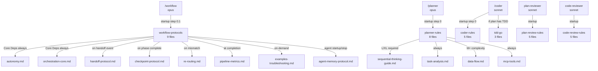

# Workflow Architecture

> **Цель документа:** Детальный разбор всех артефактов, участвующих в `/workflow`-пайплайне Claude Kit. Включает граф взаимодействий, назначение каждого артефакта и ключевые архитектурные решения.

---

## Содержание

1. [Инвентарь артефактов](#инвентарь-артефактов)
2. [Исключённые артефакты](#исключённые-артефакты)
3. [Core Pipeline — основной пайплайн](#core-pipeline)
4. [Команды (Commands)](#команды-commands)
5. [Агенты (Agents)](#агенты-agents)
6. [Навыки (Skills)](#навыки-skills)
7. [Хуки и скрипты (Hooks & Scripts)](#хуки-и-скрипты)
8. [Правила (Rules)](#правила-rules)
9. [Состояние и конфигурация (State & Config)](#состояние-и-конфигурация)
10. [Граф взаимодействий](#граф-взаимодействий)
11. [Принципы дизайна](#принципы-дизайна)

---

## Инвентарь артефактов

Ниже — все артефакты, участвующие в `/workflow`-пайплайне (task-analysis → /planner → plan-reviewer → /coder → code-reviewer → completion).

### Команды

| Артефакт         | Путь                                   | Назначение                                 | Модель |
| ---------------- | -------------------------------------- | ------------------------------------------ | ------ |
| workflow         | `.claude/commands/workflow.md`         | Оркестратор полного цикла                  | opus   |
| planner          | `.claude/commands/planner.md`          | Исследование кодовой базы + создание плана | opus   |
| designer         | `.claude/commands/designer.md`         | Design exploration + spec creation         | opus   |
| coder            | `.claude/commands/coder.md`            | Реализация по утверждённому плану          | sonnet |
| review-checklist | `.claude/commands/review-checklist.md` | Справочник чек-листов для code-reviewer    | sonnet |

### Агенты

| Артефакт        | Путь                                | Назначение                          | Модель | Изоляция |
| --------------- | ----------------------------------- | ----------------------------------- | ------ | -------- |
| plan-reviewer   | `.claude/agents/plan-reviewer.md`   | Валидация плана перед реализацией   | sonnet | none     |
| code-reviewer   | `.claude/agents/code-reviewer.md`   | Код-ревью после реализации          | sonnet | worktree |
| code-researcher | `.claude/agents/code-researcher.md` | Read-only исследование кодовой базы | haiku  | none     |

### Навыки (Skills)

| Пакет              | Путь                                 | Кол-во файлов | Загружает           |
| ------------------ | ------------------------------------ | ------------- | ------------------- |
| design-rules       | `.claude/skills/design-rules/`       | 3             | /designer (startup) |
| workflow-protocols | `.claude/skills/workflow-protocols/` | 9             | /workflow (startup) |
| planner-rules      | `.claude/skills/planner-rules/`      | 8             | /planner (startup)  |
| plan-review-rules  | `.claude/skills/plan-review-rules/`  | 5             | plan-reviewer agent |
| coder-rules        | `.claude/skills/coder-rules/`        | 5             | /coder (startup)    |
| code-review-rules  | `.claude/skills/code-review-rules/`  | 5             | code-reviewer agent |
| tdd-go             | `.claude/skills/tdd-go/`             | 3             | /coder (условно)    |

### Хуки и скрипты

| Скрипт                          | Путь               | Событие хука       | Блокирует? |
| ------------------------------- | ------------------ | ------------------ | ---------- |
| validate-instructions.sh        | `.claude/scripts/` | InstructionsLoaded | Нет        |
| protect-files.sh                | `.claude/scripts/` | PreToolUse         | **Да**     |
| block-dangerous-commands.sh     | `.claude/scripts/` | PreToolUse         | **Да**     |
| pre-commit-build.sh             | `.claude/scripts/` | PreToolUse         | **Да**     |
| auto-fmt-go.sh                  | `.claude/scripts/` | PostToolUse        | Нет        |
| yaml-lint.sh                    | `.claude/scripts/` | PostToolUse        | Нет        |
| check-references.sh             | `.claude/scripts/` | PostToolUse        | Нет        |
| check-plan-drift.sh             | `.claude/scripts/` | PostToolUse        | Нет        |
| save-progress-before-compact.sh | `.claude/scripts/` | PreCompact         | Нет        |
| verify-state-after-compact.sh   | `.claude/scripts/` | PostCompact        | Нет        |
| track-task-lifecycle.sh         | `.claude/scripts/` | SubagentStart      | Нет        |
| save-review-checkpoint.sh       | `.claude/scripts/` | SubagentStop       | **Да**     |
| prepare-worktree.sh             | `.claude/scripts/` | WorktreeCreate     | Нет        |
| enrich-context.sh               | `.claude/scripts/` | UserPromptSubmit   | Нет        |
| check-uncommitted.sh            | `.claude/scripts/` | Stop               | **Да**     |
| session-analytics.sh            | `.claude/scripts/` | SessionEnd         | Нет        |
| log-stop-failure.sh             | `.claude/scripts/` | StopFailure        | Нет        |
| notify-user.sh                  | `.claude/scripts/` | Notification       | Нет        |
| sync-agent-memory.sh            | `.claude/scripts/` | (утилита, не хук)  | —          |

### Правила

| Файл                | Путь                                | Активация                |
| ------------------- | ----------------------------------- | ------------------------ |
| workflow.md         | `.claude/rules/workflow.md`         | Global (все сессии)      |
| architecture.md     | `.claude/rules/architecture.md`     | `internal/**/*.go`       |
| go-conventions.md   | `.claude/rules/go-conventions.md`   | `**/*.go`                |
| handler-rules.md    | `.claude/rules/handler-rules.md`    | `internal/handler/**`    |
| service-rules.md    | `.claude/rules/service-rules.md`    | `internal/service/**`    |
| repository-rules.md | `.claude/rules/repository-rules.md` | `internal/repository/**` |
| models-rules.md     | `.claude/rules/models-rules.md`     | `internal/models/**`     |
| testing.md          | `.claude/rules/testing.md`          | `**/*_test.go`           |

### Конфигурация и состояние

| Артефакт                    | Путь                           | Назначение                                                        |
| --------------------------- | ------------------------------ | ----------------------------------------------------------------- |
| CLAUDE.md                   | `./CLAUDE.md`                  | Root-конфигурация (Language Profile, Error Handling, Rules index) |
| settings.json               | `.claude/settings.json`        | Хуки + разрешения (authoritative source)                          |
| PROJECT-KNOWLEDGE.md        | `.claude/PROJECT-KNOWLEDGE.md` | Проектные переопределения (генерируется /project-researcher)      |
| *-checkpoint.yaml           | `.claude/workflow-state/`      | Состояние текущей фазы (12 полей YAML)                            |
| review-completions.jsonl    | `.claude/workflow-state/`      | Вердикты агентов-ревьюеров                                        |
| task-events.jsonl           | `.claude/workflow-state/`      | Журнал вызовов code-researcher                                    |
| session-analytics.jsonl     | `.claude/workflow-state/`      | Метрики сессии                                                    |
| worktree-events.jsonl       | `.claude/workflow-state/`      | События создания worktree                                         |
| agent-memory/plan-reviewer/ | `.claude/agent-memory/`        | Память plan-reviewer между сессиями                               |
| agent-memory/code-reviewer/ | `.claude/agent-memory/`        | Память code-reviewer между сессиями                               |

### Шаблоны

| Файл                 | Путь                                     | Назначение                               |
| -------------------- | ---------------------------------------- | ---------------------------------------- |
| spec-template.md     | `.claude/templates/spec-template.md`     | Template for design specs                |
| plan-template.md     | `.claude/templates/plan-template.md`     | Шаблон плана реализации                  |
| command.md           | `.claude/templates/command.md`           | Шаблон для создания команд               |
| skill.md             | `.claude/templates/skill.md`             | Шаблон для создания skill-пакетов        |
| agent.md             | `.claude/templates/agent.md`             | Шаблон для создания агентов              |
| rule.md              | `.claude/templates/rule.md`              | Шаблон для создания правил               |
| project-claude-md.md | `.claude/templates/project-claude-md.md` | Шаблон CLAUDE.md для downstream-проектов |

---

## Исключённые артефакты

Следующие артефакты **не входят** в `/workflow`-пайплайн и не рассматриваются в данном документе:

| Артефакт                 | Путь                                     | Причина исключения                                                 |
| ------------------------ | ---------------------------------------- | ------------------------------------------------------------------ |
| meta-agent               | `.claude/commands/meta-agent.md`         | Lifecycle-менеджер артефактов Claude Kit; не участвует в dev-цикле |
| project-researcher       | `.claude/commands/project-researcher.md` | Onboarding-инструмент; запускается до начала workflow              |
| db-explorer              | `.claude/commands/db-explorer.md`        | On-demand анализ БД; не является фазой пайплайна                   |
| db-explorer agent        | `.claude/agents/db-explorer/`            | On-demand исследование схемы БД через MCP                          |
| project-researcher agent | `.claude/agents/project-researcher/`     | Orchestrator для генерации PROJECT-KNOWLEDGE.md                    |
| meta-agent deps          | `.claude/agents/meta-agent/deps/`        | Вспомогательная библиотека для meta-agent                          |

---

## Core Pipeline

### Фазы пайплайна

| Фаза | Название       | Исполнитель           | Вход                | Выход                                                     |
| ---- | -------------- | --------------------- | ------------------- | --------------------------------------------------------- |
| 0.5  | Task Analysis  | /workflow             | Задача (текст)      | Сложность S/M/L/XL + маршрут                              |
| 0.7  | Design         | /designer             | Task + context      | `.claude/prompts/{feature}-spec.md`                       |
| 1    | Planning       | /planner              | Задача + маршрут    | `.claude/prompts/{feature}.md`                            |
| 2    | Plan Review    | plan-reviewer (agent) | Plan file + handoff | Вердикт APPROVED/NEEDS_CHANGES/REJECTED                   |
| 3    | Implementation | /coder                | Approved plan       | Рабочий код + VERIFY                                      |
| 4    | Code Review    | code-reviewer (agent) | Code diff + handoff | Вердикт APPROVED/APPROVED_WITH_COMMENTS/CHANGES_REQUESTED |
| 5    | Completion     | /workflow             | Approved code       | Git commit + метрики                                      |

### Маршрутизация по сложности

| Сложность | Частей | Слоёв | Маршрут                                                    | Sequential Thinking | Plan Review      |
| --------- | ------ | ----- | ---------------------------------------------------------- | ------------------- | ---------------- |
| S         | 1      | 1     | /planner --minimal → skip Phase 2 → /coder → code-reviewer | Не нужен            | **Пропускается** |
| M         | 2–3    | 2     | Стандартный (все фазы)                                     | По необходимости    | Стандартный      |
| L         | 4–6    | 3+    | /designer → стандартный                                    | **Рекомендуется**   | Стандартный      |
| XL        | 7+     | 4+    | /designer → полный                                         | **ОБЯЗАТЕЛЕН**      | Стандартный      |

### Лимиты циклов

- **Максимум 3 итерации** на каждый review-цикл (plan_review и code_review)
- Счётчики хранятся в **оркестраторе** (не в агентах-ревьюерах)
- При превышении: STOP → показать сводку итераций → запросить помощь пользователя
- Auto-escalation: `plan_review_counter += 1` при вердикте NEEDS_CHANGES; `code_review_counter += 1` при CHANGES_REQUESTED

### Диаграмма 1 — Core Pipeline Flow

```mermaid
flowchart LR
    INPUT([Задача]) --> TA[Phase 0.5\nTask Analysis]

    TA -->|S| PLN_MIN[/planner\n--minimal]
    TA -->|M| PLN[/planner]
    TA -->|L/XL| DES[/designer\nPhase 0.7]

    DES -->|approved spec| PLN

    PLN --> PR{plan-reviewer\nagent}
    PLN_MIN -->|S: skip| COD

    PR -->|APPROVED| COD[/coder]
    PR -->|NEEDS_CHANGES\nmax 3x| PLN
    PR -->|REJECTED| STOP_PR([STOP])

    COD --> EVAL{EVALUATE\nPROCEED/REVISE/RETURN}
    EVAL -->|RETURN| PLN
    EVAL -->|PROCEED/REVISE| IMPL[Implement Parts]

    IMPL --> SIMP{Simplify?\nL/XL + parts≥5}
    SIMP -->|Yes| SMP[/simplify]
    SIMP -->|No| VRF
    SMP --> VRF[VERIFY\nvet+fmt+lint+test]

    VRF -->|FAIL 3x| STOP_V([STOP])
    VRF -->|PASS| SC{SPEC CHECK\nPhase 3.5}
    SC -->|PASS/PARTIAL| CR{code-reviewer\nagent\nworktree}
    SC -->|FAIL\nmax 1 retry| IMP_FIX[Inline fix] --> VRF

    CR -->|APPROVED\nAPPROVED_WITH_COMMENTS| COMP[Phase 5\nCompletion]
    CR -->|CHANGES_REQUESTED\nmax 3x| COD

    COMP --> GIT([git commit\n+ metrics])

    CR_RES[code-researcher\nhaiku\nAgent/Task tool] -.->|tool-assist\nL/XL| PLN
    CR_RES -.->|tool-assist\nevaluate| COD
```

---

## Команды (Commands)

### workflow.md — Оркестратор

**Модель:** opus | **Путь:** `.claude/commands/workflow.md`

**Роль:** Координирует полный dev-цикл. Делегирует всё — не владеет ни планированием, ни реализацией, ни ревью.

**Входные аргументы:**

| Аргумент         | Обязателен | Описание                           |
| ---------------- | ---------- | ---------------------------------- |
| `task`           | Да         | Текстовое описание задачи          |
| `--auto`         | Нет        | Автономный режим без подтверждений |
| `--from-phase N` | Нет        | Возобновить с фазы 1–4             |

**Последовательность запуска (Startup):**

1. **Step 0** — Task Analysis (классификация S/M/L/XL, маршрутизация)
2. **Step 0.1** — Load `workflow-protocols` skill (autonomy.md + orchestration-core.md)
3. **Step 1** — TodoWrite (список фаз с учётом маршрута)
4. **Step 2** — Check session recovery (есть ли checkpoint или plan file?)
5. **Step 3** — CronCreate auto-save каждые 10 мин (только L/XL)

**Протокол делегирования plan-reviewer:**

```yaml
delegation_template:
  artifact: ".claude/prompts/{feature}.md"
  context:
    - "Planner completed: {task type and complexity}"
    - "Key decisions: {list from handoff.key_decisions}"
    - "Known risks: {list from handoff.known_risks}"
    - "Focus: {handoff.areas_needing_attention}"
  iteration: "N/3"
```

**Протокол делегирования code-reviewer:**

```yaml
delegation_template:
  branch: "current branch"
  context:
    - "Coder implemented: {N Parts per plan}"
    - "Evaluate adjustments: {list}"
    - "Deviations from plan: {list}"
    - "Verify: lint {PASS/FAIL}, test {PASS/FAIL}"
  isolation: "worktree"
  iteration: "N/3"
```

**Output Validation (CRITICAL):**
Первая строка возврата агента **должна** начинаться с `VERDICT:`. Если нет — `INCOMPLETE_OUTPUT`:

1. SendMessage к тому же агенту (по agentId) с запросом только вердикта
2. Если SendMessage недоступен — предупредить пользователя, запросить ручной вердикт

**Ключевые правила:**

- Последовательное выполнение фаз (без параллельности)
- Context isolation: агенты запускаются в чистом контексте (CLAUDE.md загружается автоматически, история разговора **не** передаётся)
- REJECTED → STOP немедленно
- NEEDS_CHANGES/CHANGES_REQUESTED → вернуться на предыдущую фазу

---

### planner.md — Architect-Researcher

**Модель:** opus | **Путь:** `.claude/commands/planner.md`

**Роль:** Исследует кодовую базу и создаёт детальный план реализации.

**Владеет:** Исследование кода, создание плана, формирование handoff для plan-review.
**Не владеет:** Написание production-кода, модификация проектных файлов.

**6 фаз работы:**

| Фаза | Название      | Действие                                                                  |
| ---- | ------------- | ------------------------------------------------------------------------- |
| 1    | Task Analysis | Классифицировать сложность S/M/L/XL, определить маршрут                   |
| 2    | Understand    | Задать уточняющие вопросы (scope IN/OUT, приоритеты) — **ОБЯЗАТЕЛЬНО**    |
| 3    | Data Flow     | Разметить слои (SKIP для S, LOAD для M+)                                  |
| 4    | Research      | Исследовать код через Grep/Glob/code-researcher                           |
| 5    | Design        | Создать Parts, зависимости, порядок слоёв; Sequential Thinking если нужен |
| 6    | Document      | Написать план с полными примерами кода, критериями приёмки                |

**Бюджет исследования:**

| Сложность | Чтений файлов | Вызовов инструментов | Делегировать после              |
| --------- | ------------- | -------------------- | ------------------------------- |
| S         | 5             | 12                   | —                               |
| M         | 10            | 20                   | —                               |
| L         | 20            | 35                   | 8 чтений                        |
| XL        | 30            | 50                   | **ОБЯЗАТЕЛЬНО code-researcher** |

**Background mode (L/XL):** code-researcher запускается с `run_in_background: true` → planner продолжает прямое исследование. Результаты интегрируются в начале фазы DESIGN.

**Правила RULE_1–4:**

- `RULE_1` — No Code: только исследование и планирование
- `RULE_2` — Questions First: всегда уточнять перед исследованием
- `RULE_3` — Full Examples: примеры кода должны быть **полными** (тело функции, error handling, context propagation)
- `RULE_4` — Import Matrix: проверить зависимости из PROJECT-KNOWLEDGE.md

**Выход:** `.claude/prompts/{feature}.md` + handoff payload (artifact path, metadata, key_decisions, known_risks, areas_needing_attention)

---

### coder.md — Senior Developer

**Модель:** sonnet | **Путь:** `.claude/commands/coder.md`

**Роль:** Реализует код строго по утверждённому плану.

**Владеет:** Реализация кода, EVALUATE-фаза, VERIFY-фаза, формирование handoff для code-review.
**Не владеет:** Архитектурное планирование, код-ревью, изменение scope задачи.

**6 фаз работы:**

| Фаза | Название        | Действие                                                                    |
| ---- | --------------- | --------------------------------------------------------------------------- |
| 1    | Read Plan       | Загрузить `.claude/prompts/{feature}.md`, убедиться в статусе APPROVED      |
| 1.5  | **Evaluate**    | Критически оценить реализуемость **до** начала реализации                   |
| 2    | Implement Parts | Реализовывать в порядке зависимостей (data → domain → API → tests → wiring) |
| 2.5  | Simplify        | Запустить `/simplify` на изменённых файлах (L/XL + parts≥5, опционально)    |
| 3    | Verify          | Запустить VET, FMT, LINT, TEST                                              |
| 3.5  | **Spec Check**  | Verify plan compliance: Parts coverage, scope, deviations, AC, interfaces   |

**EVALUATE — матрица решений:**

| Решение     | Условие                                        | Действие                                                      |
| ----------- | ---------------------------------------------- | ------------------------------------------------------------- |
| **PROCEED** | План реализуем как есть                        | Начать реализацию                                             |
| **REVISE**  | Незначительные пробелы, можно исправить inline | Задокументировать, продолжить                                 |
| **RETURN**  | Серьёзные проблемы или вопросы реализуемости   | Вернуть в /planner с фидбеком (инкремент plan_review counter) |

**VERIFY — цепочка разрешения команды:**

```
1. PROJECT-KNOWLEDGE.md (если содержит VERIFY/FMT/LINT/TEST) → использовать
2. Makefile с целями → go vet ./... && make fmt && make lint && make test
3. go.mod → go fmt ./... && go vet ./... && go test ./...
4. Ничего → WARN: нет VERIFY, пропустить
```

**5 КРИТИЧЕСКИХ правил (RULE_1–5):**

- `RULE_1` — Plan Only: реализовывать ТОЛЬКО то, что есть в плане
- `RULE_2` — Import Matrix: НИКОГДА не нарушать `handler → service → repository → models`
- `RULE_3` — Clean Domain: НИКОГДА не добавлять `encoding/json` теги к domain entities
- `RULE_4` — No Log+Return: НИКОГДА не логировать И возвращать одну и ту же ошибку
- `RULE_5` — Tests Pass: код **не готов** до прохождения тестов

**TDD-интеграция:** Если план содержит раздел `## TDD`, /coder загружает skill `tdd-go` и применяет RED-GREEN-REFACTOR на каждый Part.

**Simplify guard:** Если `/simplify` изменяет >30% строк → откатить, отметить в handoff.

**Выход:** Рабочий код (все Parts реализованы, VERIFY пройден) + `.claude/prompts/{feature}-evaluate.md` + handoff payload (branch, parts_implemented, evaluate_adjustments, risks_mitigated, deviations_from_plan, verify_status)

---

## Агенты (Agents)

### plan-reviewer — Валидатор плана

**Модель:** sonnet | **Путь:** `.claude/agents/plan-reviewer.md`
**Изоляция:** none | **Max turns:** 40
**Инструменты:** Read, Grep, Glob, TodoWrite, Write (**нет** Bash, **нет** Edit)

**Входной handoff-контракт (planner → plan-reviewer):**

```yaml
artifact: ".claude/prompts/{feature}.md"
metadata:
  task_type: "{new_feature|bug_fix|...}"
  complexity: "{S|M|L|XL}"
  sequential_thinking_used: true|false
key_decisions: [список решений с обоснованием]
known_risks: [список рисков]
areas_needing_attention: [области для проверки]
```

**4 фазы ревью:**

1. **READ PLAN** — структурная валидация (обязательные разделы: Context, Scope, Dependencies, Parts, Acceptance Criteria, Testing Plan)
2. **VALIDATE ARCHITECTURE** — import matrix, domain purity, error handling, security, concurrency
3. **VALIDATE COMPLETENESS** — все слои покрыты, примеры полные, тесты включены
4. **VERDICT** — матрица решений

**Классификация severity:**

| Уровень | Блокирует | Примеры                                                                        |
| ------- | --------- | ------------------------------------------------------------------------------ |
| BLOCKER | **Да**    | Нарушение import matrix, security-уязвимость, отсутствие обязательного раздела |
| MAJOR   | **Да**    | Неполные примеры кода, отсутствие тестов, неопределённые зависимости           |
| MINOR   | Нет       | Именование, структура Part, стиль                                              |
| NIT     | Нет       | Предпочтения по форматированию                                                 |

**Auto-escalation:** 5+ MINOR в одном Part → MAJOR; любая security-проблема → BLOCKER; нарушение import → BLOCKER.

**Матрица вердиктов:**

| Вердикт         | Условие                                           |
| --------------- | ------------------------------------------------- |
| `APPROVED`      | Нет BLOCKER, нет MAJOR                            |
| `NEEDS_CHANGES` | Есть BLOCKER или MAJOR → вернуть в /planner       |
| `REJECTED`      | Принципиально неверная архитектура / scope → STOP |

**КРИТИЧНО:** Первая строка ответа — `VERDICT: {значение}`. Если нет — workflow запускает recovery (SendMessage к тому же agentId).

**Исходящий handoff-контракт (plan-reviewer → coder):**

```yaml
artifact: ".claude/prompts/{feature}.md"
verdict: "APPROVED"
issues_summary: {blocker: 0, major: 0, minor: N}
approved_with_notes: [заметки для кодера]
iteration: "N/3"
```

**Память:** Читает `.claude/agent-memory/plan-reviewer/project-context.md` и `common-plan-issues.md`. Сохраняет повторяющиеся проблемы. Memory синхронизируется через SubagentStop hook.

---

### code-reviewer — Ревьюер кода

**Модель:** sonnet | **Путь:** `.claude/agents/code-reviewer.md`
**Изоляция:** **worktree** (git sparse-checkout) | **Max turns:** 45
**Инструменты:** Read, Grep, Glob, Bash, TodoWrite, Write (**нет** Edit)

**Входной handoff-контракт (coder → code-reviewer):**

```yaml
branch: "feature/{name}"
parts_implemented: ["Part 1: DB", "Part 2: Domain"]
evaluate_adjustments: [список корректировок из evaluate]
risks_mitigated: [риски + как устранены]
deviations_from_plan: [отклонения + обоснование]
verify_status:
  lint: "PASS"
  test: "PASS"
  command_used: "go vet ./... && make fmt && make lint && make test"
iteration: "N/3"
```

**4 фазы ревью:**

1. **QUICK CHECK** — LINT и TEST (если verify_status передан из coder — пропустить повторный запуск)
2. **GET CHANGES** — `git diff`, количество файлов/строк/слоёв, оценка сложности
3. **REVIEW** — Архитектура, Error Handling, Security, Test Coverage, Project-Specific
4. **VERDICT** — матрица решений

**Триггеры Sequential Thinking:** >100 строк OR >5 файлов OR 3+ слоя.

**Матрица вердиктов:**

| Вердикт                  | Условие                                               |
| ------------------------ | ----------------------------------------------------- |
| `APPROVED`               | Нет BLOCKER, нет MAJOR                                |
| `APPROVED_WITH_COMMENTS` | Нет BLOCKER/MAJOR, но есть MINOR/NIT с рекомендациями |
| `CHANGES_REQUESTED`      | Есть BLOCKER или MAJOR → вернуть в /coder             |

**Worktree isolation:** Агент запускается в изолированном git worktree. `git diff` выполняется внутри worktree — нет доступа к uncommitted-изменениям родительской сессии. Scope контролируется через `worktree.sparsePaths` в `settings.json`.

**Исходящий handoff-контракт (code-reviewer → completion):**

```yaml
verdict: "APPROVED_WITH_COMMENTS"
issues:
  - id: "CR-001"
    severity: "MINOR"
    category: "style"
    location: "internal/service/user.go:42"
    problem: "..."
    suggestion: "..."
iteration: "N/3"
```

**Память:** Читает и записывает `.claude/agent-memory/code-reviewer/`. Синхронизируется через SubagentStop hook → `sync-agent-memory.sh`.

---

### code-researcher — Read-only исследователь

**Модель:** haiku | **Путь:** `.claude/agents/code-researcher.md`
**Изоляция:** none | **Max turns:** 20
**Инструменты:** Read, Grep, Glob, Bash (только чтение)

**Статус:** Это **tool-assist**, а не фаза пайплайна. Вызывается /planner и /coder через Agent/Task tool — не оркестратором напрямую.

**Когда вызывается:**

- `/planner` (Phase 3 Research): мультипакетное исследование при сложности L/XL
- `/coder` (Phase 1.5 Evaluate): анализ пробелов плана

**Background mode:**

- При L/XL: запускается с `run_in_background: true` из /planner
- /planner продолжает прямое исследование параллельно
- Результаты интегрируются в начале фазы DESIGN
- Если поздние находки противоречат дизайну: inline-правка (≤1 Part) или re-evaluate (>1 Part)

**Входной контракт:**

```yaml
research_question: "Конкретный вопрос для исследования"
focus_areas: ["package/pattern 1", "package/pattern 2"]
context: "Тип задачи + сложность + что нужно вызывающей стороне"
```

**Выходной контракт (≤2000 токенов):**

```
### Research: {topic}
**Existing Patterns:** {list}
**Relevant Files:** {table}
**Import Graph:** {if applicable}
**Key Snippets:** {max 3, each ≤15 lines}
**Summary:** {1-3 sentences}
```

**4 правила (RULE_1–4):**

- `RULE_1` — Read-only: никаких модификаций
- `RULE_2` — Token budget ≤2000: приоритет релевантности
- `RULE_3` — Facts only: никаких рекомендаций
- `RULE_4` — Key snippets only: только критически важный код

---

## Навыки (Skills)

### Диаграмма 2 — Skill Loading Graph



### workflow-protocols — Протоколы оркестрации

**Загружает:** `/workflow` при запуске (step 0.1)

| Файл                        | Назначение                                                      | Загружается               |
| --------------------------- | --------------------------------------------------------------- | ------------------------- |
| SKILL.md                    | Обзор пакета, таблица протоколов, инструкции загрузки           | Всегда (step 0.1)         |
| autonomy.md                 | 3 режима (INTERACTIVE/AUTONOMOUS/RESUME), условия stop/continue | Всегда (Core Deps)        |
| orchestration-core.md       | Фазы пайплайна (0.5→5), лимиты циклов (max 3), session recovery | Всегда (Core Deps)        |
| handoff-protocol.md         | 4 контракта передачи данных + 1 tool-contract (code-researcher) | При формировании handoff  |
| checkpoint-protocol.md      | Формат checkpoint (12 YAML-полей), восстановление (5 шагов)     | При завершении фазы       |
| re-routing.md               | 3 триггера re-routing + tracking fields + learning              | При сигнале mismatch      |
| pipeline-metrics.md         | Формат метрик (12 полей), storage (JSONL), anomaly detection    | Только на фазе completion |
| agent-memory-protocol.md    | Shared memory behavior для всех `memory: project` агентов       | При startup/stop агента   |
| examples-troubleshooting.md | Примеры выполнения, типичные ошибки, troubleshooting            | On-demand при проблемах   |

**Ключевой принцип:** Event-driven loading — протоколы загружаются не все сразу, а по триггерам событий. Это экономит контекст.

---

### planner-rules — Правила планировщика

**Загружает:** `/planner` при запуске (step 0)

| Файл                         | Назначение                                                                | Загружается        |
| ---------------------------- | ------------------------------------------------------------------------- | ------------------ |
| SKILL.md                     | Классификация задач (7 типов), routing S/M/L/XL, правило полноты примеров | Всегда (step 0)    |
| task-analysis.md             | Полная матрица классификации, правила auto-escalation, re-routing         | Всегда (step 0)    |
| mcp-tools.md                 | Sequential Thinking, Context7 (resolve+query), PostgreSQL (read-only)     | Всегда (Core Deps) |
| sequential-thinking-guide.md | Когда/как использовать ST: 3+ альтернативы, 4+ взаимодействующих Parts    | L/XL только        |
| data-flow.md                 | Анализ происхождения данных, правила размещения по слоям                  | M+ complexity      |
| examples.md                  | Good vs bad примеры кода для планов                                       | On-demand          |
| checklist.md                 | Self-verification на каждой фазе planner                                  | On-demand          |
| troubleshooting.md           | Типичные проблемы planner и их решения                                    | On-demand          |

---

### plan-review-rules — Правила ревью плана

**Загружает:** агент `plan-reviewer` при запуске

| Файл                   | Назначение                                                                         |
| ---------------------- | ---------------------------------------------------------------------------------- |
| SKILL.md               | Матрица severity (BLOCKER/MAJOR/MINOR/NIT), матрица вердиктов, auto-escalation     |
| required-sections.md   | Обязательные разделы плана (Context, Scope IN/OUT, Dependencies, Parts, AC, Tests) |
| architecture-checks.md | Проверки import matrix, domain purity, error handling, security, concurrency       |
| checklist.md           | Чек-лист ревью с примерами good/bad                                                |
| troubleshooting.md     | Типичные проблемы ревью плана                                                      |

---

### coder-rules — Правила реализации

**Загружает:** `/coder` при запуске (step 0)

| Файл               | Назначение                                                                   |
| ------------------ | ---------------------------------------------------------------------------- |
| SKILL.md           | 5 КРИТИЧЕСКИХ правил (RULE_1–5), EVALUATE-протокол (PROCEED/REVISE/RETURN)   |
| mcp-tools.md       | Sequential Thinking (3+ условий/state machines), Context7 (новые библиотеки) |
| examples.md        | Good vs bad примеры реализации                                               |
| checklist.md       | Self-verification на каждой фазе coder                                       |
| troubleshooting.md | Типичные проблемы реализации                                                 |

---

### code-review-rules — Правила ревью кода

**Загружает:** агент `code-reviewer` при запуске

| Файл                  | Назначение                                                                    |
| --------------------- | ----------------------------------------------------------------------------- |
| SKILL.md              | Матрица вердиктов (APPROVED/WITH_COMMENTS/CHANGES_REQUESTED), auto-escalation |
| examples.md           | Bad/good паттерны, grep-шаблоны для автоматизированных проверок               |
| security-checklist.md | OWASP-проверки: SQL injection, секреты, CORS, rate limiting                   |
| checklist.md          | Полный чек-лист ревью по категориям                                           |
| troubleshooting.md    | Типичные проблемы ревью кода                                                  |

---

### tdd-go — Test-Driven Development для Go

**Загружает:** `/coder` условно (если план содержит раздел `## TDD`)

| Файл                   | Назначение                                                         |
| ---------------------- | ------------------------------------------------------------------ |
| SKILL.md               | RED-GREEN-REFACTOR цикл, интеграция с Parts coder, 4 правила       |
| references/patterns.md | Инкрементальные table-driven TDD-паттерны, test helpers, factories |
| references/examples.md | Примеры TDD-реализации на Go                                       |

**RED-GREEN-REFACTOR цикл:**

```go
// RED: Write failing test first
func TestCreate_ValidInput_Success(t *testing.T) {
    svc := NewService(mockRepo)
    result, err := svc.Create(ctx, input)
    require.NoError(t, err)
    assert.NotEmpty(t, result.ID)
}

// GREEN: Minimal implementation to pass
func (s *Service) Create(ctx context.Context, input Input) (Result, error) {
    return Result{ID: uuid.New()}, nil
}

// REFACTOR: Clean up (tests stay green)
```

---

## Хуки и скрипты

### Диаграмма 3 — Hooks & State Graph

```mermaid
graph TD
    subgraph EVENTS["Hook Events"]
        IL[InstructionsLoaded]
        PTU[PreToolUse]
        POTU[PostToolUse]
        PC[PreCompact]
        POC[PostCompact]
        SS[SubagentStart]
        SST[SubagentStop]
        WC[WorktreeCreate]
        UPS[UserPromptSubmit]
        STP[Stop]
        SE[SessionEnd]
        SF[StopFailure]
        NT[Notification]
    end

    subgraph SCRIPTS["Scripts"]
        VI[validate-instructions.sh]
        PF[protect-files.sh]
        BD[block-dangerous-commands.sh]
        PCB[pre-commit-build.sh]
        AF[auto-fmt-go.sh]
        YL[yaml-lint.sh]
        CR[check-references.sh]
        CPD[check-plan-drift.sh]
        SP[save-progress-before-compact.sh]
        VS[verify-state-after-compact.sh]
        TL[track-task-lifecycle.sh]
        SRC[save-review-checkpoint.sh]
        PW[prepare-worktree.sh]
        EC[enrich-context.sh]
        CU[check-uncommitted.sh]
        SA[session-analytics.sh]
        LSF[log-stop-failure.sh]
        NU[notify-user.sh]
    end

    subgraph STATE["State Files"]
        CHK_F[workflow-state/\n*-checkpoint.yaml]
        RC[workflow-state/\nreview-completions.jsonl]
        TE[workflow-state/\ntask-events.jsonl]
        SAF[workflow-state/\nsession-analytics.jsonl]
        WEF[workflow-state/\nworktree-events.jsonl]
        AM[agent-memory/\nplan-reviewer/ code-reviewer/]
    end

    IL --> VI
    PTU -->|unconditional| PF
    PTU -->|unconditional| BD
    PTU -->|if Bash git commit| PCB
    POTU -->|if Write/Edit .go| AF
    POTU -->|if Edit .claude| YL
    POTU -->|if Write .claude| CR
    POTU -->|if Write/Edit .claude| CPD
    PC --> SP
    POC --> VS
    SS -->|matcher: code-researcher| TL
    SST -->|matcher: plan-reviewer/code-reviewer| SRC
    WC --> PW
    UPS --> EC
    STP --> CU
    SE --> SA
    SF --> LSF
    NT --> NU

    SP --> CHK_F
    VS --> CHK_F
    EC --> CHK_F
    SRC --> RC
    SRC --> AM
    TL --> TE
    SA --> SAF
    PW --> WEF
    PW --> AM
    CU --> CHK_F
```



### Полная таблица хуков

| Событие            | Скрипт                          | Блокирует? | Matcher                      | Conditional `if`         | Назначение                                                              |
| ------------------ | ------------------------------- | ---------- | ---------------------------- | ------------------------ | ----------------------------------------------------------------------- |
| InstructionsLoaded | validate-instructions.sh        | Нет        | —                            | —                        | Валидация загрузки CLAUDE.md + rules                                    |
| PreToolUse         | protect-files.sh                | **Да**     | Write\|Edit                  | —                        | Блокировать изменения *_gen.go, mocks, .env, settings.json              |
| PreToolUse         | block-dangerous-commands.sh     | **Да**     | Bash                         | —                        | Блокировать `rm -rf`, `git reset --hard`, `sudo`, `chmod 777`           |
| PreToolUse         | pre-commit-build.sh             | **Да**     | Bash                         | `Bash(git commit*)`      | Валидировать `go build ./...` перед коммитом                            |
| PostToolUse        | auto-fmt-go.sh                  | Нет        | Write\|Edit                  | `**/*.go`                | Авто-форматирование gofmt (не goimports)                                |
| PostToolUse        | yaml-lint.sh                    | Нет        | Edit                         | `Edit(.claude/**)`       | YAML синтаксис-валидация                                                |
| PostToolUse        | check-references.sh             | Нет        | Write                        | `Write(.claude/**)`      | Кросс-референсная валидация                                             |
| PostToolUse        | check-plan-drift.sh             | Нет        | Write\|Edit                  | `Write/Edit(.claude/**)` | Обнаружение дрейфа план↔checkpoint                                      |
| PreCompact         | save-progress-before-compact.sh | Нет        | —                            | —                        | Сохранить checkpoint в additionalContext                                |
| PostCompact        | verify-state-after-compact.sh   | Нет        | —                            | —                        | Верифицировать целостность checkpoint, переинжектировать                |
| SubagentStart      | track-task-lifecycle.sh         | Нет        | code-researcher              | —                        | Логировать вызов в task-events.jsonl                                    |
| SubagentStop       | save-review-checkpoint.sh       | **Да**     | plan-reviewer\|code-reviewer | —                        | Записать маркер завершения, синхронизировать agent-memory               |
| WorktreeCreate     | prepare-worktree.sh             | Нет        | —                            | —                        | Скопировать .env.example, go mod download, pre-seed agent-memory        |
| UserPromptSubmit   | enrich-context.sh               | Нет        | —                            | —                        | Инжектировать состояние checkpoint + бюджет исследования                |
| Stop               | check-uncommitted.sh            | **Да**     | —                            | —                        | Предупредить/заблокировать при uncommitted-изменениях во время workflow |
| SessionEnd         | session-analytics.sh            | Нет        | —                            | —                        | Логировать метрики сессии (duration, tools, read/write ratio)           |
| StopFailure        | log-stop-failure.sh             | Нет        | —                            | —                        | Логировать API-ошибки (rate limit, auth, network)                       |
| Notification       | notify-user.sh                  | Нет        | —                            | —                        | Отправить desktop-уведомление (macOS/Linux)                             |

### Conditional `if` fields (v2.1.85)

Поле `if` в хуках PreToolUse/PostToolUse позволяет указать условие срабатывания:

```json
{
  "event": "PostToolUse",
  "script": ".claude/scripts/auto-fmt-go.sh",
  "if": "Write(**/*.go)|Edit(**/*.go)"
}
```

**Эффект:** Хук не запускается, если условие не выполнено. Это снижает количество порождаемых процессов. 6 из 18 хуков используют `if`; security-хуки (protect-files, block-dangerous) остаются безусловными.

### Agent Memory — жизненный цикл

```
WorktreeCreate → prepare-worktree.sh
  → Копировать .claude/agent-memory/{agent}/ в worktree
  ↓
Агент запускается в worktree
  → Читает pre-seeded memory (project-context.md, common-issues.md)
  → Пишет новые находки в worktree/.claude/agent-memory/
  ↓
SubagentStop → save-review-checkpoint.sh → sync-agent-memory.sh
  → Скопировать worktree/.claude/agent-memory/ → main repo .claude/agent-memory/
  → Двунаправленная синхронизация: seeded before ← → synced back after
```

Структура памяти агентов:

```
.claude/agent-memory/
├── plan-reviewer/
│   ├── MEMORY.md              # Индекс (≤200 строк)
│   ├── project-context.md     # Структура слоёв, приоритеты
│   └── common-plan-issues.md  # Повторяющиеся проблемы плана
└── code-reviewer/
    ├── MEMORY.md
    ├── project-context.md
    └── common-review-issues.md
```

---

## Правила (Rules)

### Механизм активации

Правила активируются через **frontmatter glob/path patterns** в каждом файле правил:

```yaml
---
globs:
  - "internal/**/*.go"
---
```

**Поток активации:**

1. Пользователь редактирует файл
2. PreToolUse hook проверяет путь файла против всех frontmatter-паттернов правил
3. Совпадающие правила загружаются в контекст агента
4. PostToolUse hook запускает enforcement (auto-fmt, yaml-lint, check-references)

### Правила — полная таблица

| Файл                    | Активация                     | Назначение                    | Ключевые ограничения                                  |
| ----------------------- | ----------------------------- | ----------------------------- | ----------------------------------------------------- |
| **workflow.md**         | Global (все сессии)           | Архитектура пайплайна         | Commands vs Agents split, model routing               |
| **architecture.md**     | `internal/**/*.go`            | Import matrix + domain purity | handler NEVER imports repository; models: stdlib only |
| **go-conventions.md**   | `**/*.go`                     | Error wrapping, concurrency   | `fmt.Errorf("ctx: %w", err)`; НИКОГДА не log+return   |
| **handler-rules.md**    | `internal/handler/**/*.go`    | HTTP-слой                     | DTO (не domain models); делегировать в service        |
| **service-rules.md**    | `internal/service/**/*.go`    | Business logic                | interface-зависимости; context как первый параметр    |
| **repository-rules.md** | `internal/repository/**/*.go` | Data access                   | Parameterized queries only; контекстные методы        |
| **models-rules.md**     | `internal/models/**/*.go`     | Domain entities               | stdlib-only imports; NO serialization tags            |
| **testing.md**          | `**/*_test.go`                | Тесты                         | Table-driven; race detection; сгенерированные mocks   |

### Import Matrix (Architecture Rule)

```
handler → service/controller → repository → models
```

- `handler` НИКОГДА не импортирует `repository` напрямую
- `models`: только stdlib-импорты
- `service`: может импортировать `repository`, НИКОГДА не `handler`

**Запрещено:** `encoding/json` теги в domain entities → используйте DTOs.

---

## Состояние и конфигурация

### Иерархия конфигурации

```
settings.json (authoritative: хуки + разрешения)
    ↓
CLAUDE.md (root-конфигурация: Language Profile, Error Handling, Rules index)
    ↓
PROJECT-KNOWLEDGE.md (проектные переопределения: VERIFY command, source patterns)
```

**VERIFY command resolution:**
`PROJECT-KNOWLEDGE.md` → `Makefile detection` → `Go-native fallback (go vet + go test)`

### Файлы состояния workflow

| Файл                          | Формат          | Содержимое                                                                                                                                                    | Заполняется                  |
| ----------------------------- | --------------- | ------------------------------------------------------------------------------------------------------------------------------------------------------------- | ---------------------------- |
| `{feature}-checkpoint.yaml`   | YAML (12 полей) | `feature, phase_completed, phase_name, complexity, route, timestamp, iteration {plan_review, code_review}, verdict, handoff_payload, issues_history, cron_id` | /workflow оркестратор        |
| `review-completions.jsonl`    | JSONL           | Маркеры завершения ревью + вердикты + timestamp                                                                                                               | SubagentStop hook            |
| `task-events.jsonl`           | JSONL           | Вызовы code-researcher: timestamp, тип, backgroundMode                                                                                                        | SubagentStart hook           |
| `session-analytics.jsonl`     | JSONL           | Метрики сессии: duration, tools, read/write ratio, errors                                                                                                     | SessionEnd hook              |
| `worktree-events.jsonl`       | JSONL           | Events создания worktree + действия setup                                                                                                                     | WorktreeCreate hook          |
| `worktree-events-debug.jsonl` | JSONL           | Contract discovery (попытки разрешения worktree path)                                                                                                         | SubagentStop, WorktreeCreate |
| `hook-log.txt`                | Plain text      | Хронологический лог выполнения хуков                                                                                                                          | Все хуки                     |

### Шаблоны

| Шаблон               | Путь                                     | Назначение                                                  |
| -------------------- | ---------------------------------------- | ----------------------------------------------------------- |
| spec-template.md     | `.claude/templates/spec-template.md`     | Template for design specs (используется /designer)          |
| plan-template.md     | `.claude/templates/plan-template.md`     | Структура плана реализации (используется /planner)          |
| command.md           | `.claude/templates/command.md`           | Шаблон создания новых команд (>80% YAML, YAML-first)        |
| skill.md             | `.claude/templates/skill.md`             | Шаблон структуры skill-пакета (SKILL.md + supporting files) |
| agent.md             | `.claude/templates/agent.md`             | Шаблон определения агента (YAML-first, без prose headers)   |
| rule.md              | `.claude/templates/rule.md`              | Шаблон правила (frontmatter glob + Markdown body)           |
| project-claude-md.md | `.claude/templates/project-claude-md.md` | CLAUDE.md для downstream-проектов                           |

---

## Граф взаимодействий

### Полная карта зависимостей (текстовое представление)

```
/workflow (opus) — оркестратор
├── ЗАГРУЖАЕТ: workflow-protocols skill
│   ├── Core Deps (всегда): autonomy.md, orchestration-core.md
│   └── On-demand: handoff-protocol.md, checkpoint-protocol.md, re-routing.md,
│                  pipeline-metrics.md, agent-memory-protocol.md,
│                  examples-troubleshooting.md
│
├── ДЕЛЕГИРУЕТ → /planner (opus)
│   ├── ЗАГРУЖАЕТ: planner-rules skill
│   │   ├── Core Deps: task-analysis.md, mcp-tools.md
│   │   └── Conditional: sequential-thinking-guide.md (L/XL), data-flow.md (M+)
│   ├── ВЫЗЫВАЕТ (опц.): code-researcher (Agent/Task tool, L/XL, background mode)
│   └── ЗАПИСЫВАЕТ: .claude/prompts/{feature}.md
│
├── ДЕЛЕГИРУЕТ → plan-reviewer (sonnet agent)
│   ├── ЗАГРУЖАЕТ: plan-review-rules skill
│   ├── ЧИТАЕТ: .claude/prompts/{feature}.md
│   ├── ЧИТАЕТ: .claude/agent-memory/plan-reviewer/
│   └── ВОЗВРАЩАЕТ: VERDICT + issues + handoff
│
├── ДЕЛЕГИРУЕТ → /coder (sonnet)
│   ├── ЗАГРУЖАЕТ: coder-rules skill
│   ├── ЗАГРУЖАЕТ (условно): tdd-go skill (если ## TDD в плане)
│   ├── ВЫЗЫВАЕТ (опц.): code-researcher (Task tool, evaluate phase)
│   ├── ЧИТАЕТ: .claude/prompts/{feature}.md
│   └── ЗАПИСЫВАЕТ: source files + .claude/prompts/{feature}-evaluate.md
│
├── ДЕЛЕГИРУЕТ → code-reviewer (sonnet agent, worktree)
│   ├── ЗАГРУЖАЕТ: code-review-rules skill
│   ├── ИЗОЛИРОВАН: git worktree + sparse-checkout
│   ├── ЧИТАЕТ: .claude/agent-memory/code-reviewer/ (pre-seeded by WorktreeCreate hook)
│   └── ВОЗВРАЩАЕТ: VERDICT + issues + handoff
│
└── ВЫПОЛНЯЕТ: Phase 5 Completion
    ├── git commit
    ├── pipeline metrics (→ session-analytics.jsonl)
    └── CronDelete (удалить auto-save cron)

ХУКИ (детерминированные, срабатывают автоматически):
├── InstructionsLoaded → validate-instructions.sh
├── PreToolUse → protect-files.sh (unconditional)
│              → block-dangerous-commands.sh (unconditional)
│              → pre-commit-build.sh (if: git commit)
├── PostToolUse → auto-fmt-go.sh (if: *.go)
│              → yaml-lint.sh (if: Edit .claude/)
│              → check-references.sh (if: Write .claude/)
│              → check-plan-drift.sh (if: Write/Edit .claude/)
├── PreCompact → save-progress-before-compact.sh → checkpoint.yaml
├── PostCompact → verify-state-after-compact.sh → checkpoint.yaml
├── SubagentStart (code-researcher) → track-task-lifecycle.sh → task-events.jsonl
├── SubagentStop (plan/code-reviewer) → save-review-checkpoint.sh
│                                     → review-completions.jsonl
│                                     → sync-agent-memory.sh → agent-memory/
├── WorktreeCreate → prepare-worktree.sh → agent-memory/ (seed) + worktree-events.jsonl
├── UserPromptSubmit → enrich-context.sh → инжектировать checkpoint + бюджет
├── Stop → check-uncommitted.sh → блокировать если workflow активен
├── SessionEnd → session-analytics.sh → session-analytics.jsonl
├── StopFailure → log-stop-failure.sh
└── Notification → notify-user.sh

ПРАВИЛА (активируются по glob-паттернам):
├── workflow.md: global → определяет Commands/Agents split
├── architecture.md: internal/**/*.go → import matrix
├── go-conventions.md: **/*.go → error wrapping, concurrency
├── handler-rules.md: internal/handler/** → HTTP layer
├── service-rules.md: internal/service/** → business logic
├── repository-rules.md: internal/repository/** → data access
├── models-rules.md: internal/models/** → domain purity
└── testing.md: **/*_test.go → table-driven tests, race detection
```

---

## Принципы дизайна

### 1. Commands vs Agents — разделение контекстов

**Правило:** Команды выполняются **внутри** контекста оркестратора (shared). Агенты выполняются в **чистом** контексте (isolated).

**Почему:** Ревью-агент, который видит историю создания артефакта, получает bias — он склонен одобрять то, что сам участвовал в создании. Чистый контекст обеспечивает непредвзятую оценку.

**Применение:** `/workflow`, `/planner`, `/coder` — команды. `plan-reviewer`, `code-reviewer` — агенты с изолированным контекстом.

---

### 2. Model Routing — маршрутизация по моделям

**Правило:** opus → sonnet → haiku в зависимости от фазы.

| Модель     | Фазы                                                      | Причина                                     |
| ---------- | --------------------------------------------------------- | ------------------------------------------- |
| **opus**   | Оркестрация (/workflow), планирование (/planner)          | Глубокое рассуждение, архитектурные решения |
| **sonnet** | Реализация (/coder), ревью (plan-reviewer, code-reviewer) | Выполнение по плану, pattern matching       |
| **haiku**  | Исследование (code-researcher)                            | Быстрый read-only поиск, экономия токенов   |

---

### 3. Event-Driven Skill Loading

**Правило:** Навыки загружаются по событиям, а не все сразу при старте.

**Пример:** `workflow-protocols` содержит 9 файлов. При старте загружаются только Core Deps (autonomy.md + orchestration-core.md). `handoff-protocol.md` загружается только при формировании handoff. `pipeline-metrics.md` — только на фазе completion.

**Почему:** Экономия контекстного окна. XL-задача может занимать весь доступный контекст — загружать неиспользуемые файлы расточительно.

---

### 4. Typed Handoffs — MetaGPT pattern

**Правило:** Каждая фаза **обязана** создать структурированный handoff payload для следующей фазы.

**Четыре контракта:**

1. `planner → plan-reviewer`: artifact path + metadata + key_decisions + known_risks
2. `plan-reviewer → coder`: verdict + issues_summary + approved_with_notes
3. `coder → code-reviewer`: branch + parts_implemented + verify_status + deviations
4. `code-reviewer → completion`: verdict + issues list

**Почему:** Типизированные контракты делают пайплайн детерминированным. Агент не гадает что именно нужно проверить — он получает явный контекст.

---

### 5. Loop Limits — ограничение итераций

**Правило:** Максимум 3 итерации на каждый review-цикл. Счётчики хранит **оркестратор** (не агенты-ревьюеры).

**Почему:** Без лимитов система может застрять в бесконечном цикле plan-review ↔ planner или code-review ↔ coder. Лимит 3 — эмпирически оптимален: достаточно для устранения реальных проблем, не допускает патологических петель.

**Guard check:** Проверка счётчика выполняется **до** запуска следующей фазы (не после получения вердикта).

---

### 6. Conditional `if` Hooks (v2.1.85)

**Правило:** PreToolUse/PostToolUse хуки используют поле `if` для снижения количества порождаемых процессов.

**Пример:**

```json
{
  "event": "PostToolUse",
  "script": "auto-fmt-go.sh",
  "if": "Write(**/*.go)|Edit(**/*.go)"
}
```

**Почему:** Без `if` — каждый вызов инструмента запускает хук независимо от типа файла. С `if` — auto-fmt-go.sh запускается только при редактировании `.go` файлов. Security-хуки (protect-files, block-dangerous) остаются **безусловными** — они не могут пропустить ни одного вызова.

---

### 7. Bidirectional Agent Memory

**Правило:** Память агентов синхронизируется в обоих направлениях: seeded before → synced back after.

**Почему:** Агент в worktree находится в изолированной копии репозитория. Без pre-seeding — он не знает о паттернах предыдущих ревью. Без sync-back — его новые находки теряются.

**Lifecycle:**

```
WorktreeCreate → prepare-worktree.sh → copy main/agent-memory → worktree
                                                                    ↓
                                                            Agent executes
                                                                    ↓
SubagentStop → save-review-checkpoint.sh → sync-agent-memory.sh → copy worktree → main
```

---

### 8. Worktree Isolation для Code Review

**Правило:** `code-reviewer` запускается в изолированном git worktree с sparse-checkout.

**Почему:** Агент в родительском контексте может видеть uncommitted-изменения или staged-файлы не связанные с задачей. Worktree гарантирует: агент видит **только** то, что было закоммичено в ветку.

**Оптимизация:** `worktree.sparsePaths` в `settings.json` (v2.1.76) — ограничивает scope checkout в монорепозиториях, сокращает время создания.

---

### 9. Background code-researcher (L/XL)

**Правило:** При сложности L/XL, /planner запускает code-researcher с `run_in_background: true` и продолжает прямое исследование параллельно.

**Почему:** Исследование L/XL кодовой базы может занимать десятки чтений. Параллельное выполнение сокращает время Phase 1 на 30–50% для крупных проектов.

**Точка интеграции:** Начало фазы DESIGN в /planner. Если фоновые результаты противоречат дизайну: правка ≤1 Part inline, re-evaluate >1 Part.

---

### 10. EVALUATE sub-phase (Phase 1.5)

**Правило:** /coder критически оценивает реализуемость плана **до** начала реализации.

**Почему:** Agentы-ревьюеры могут пропустить скрытую сложность. EVALUATE — последний шанс обнаружить проблемы до написания кода. Решение RETURN (возврат в /planner с фидбеком кодера) предотвращает реализацию нереализуемого плана.

**Стоимость:**

- RETURN инкрементирует `plan_review_counter` (учитывается в лимите 3x)
- Evaluate output сохраняется в `.claude/prompts/{feature}-evaluate.md` — обязателен для handoff

---

*Документ сгенерирован 2026-03-29 на основе комплексного исследования 50+ артефактов claude-kit.*
