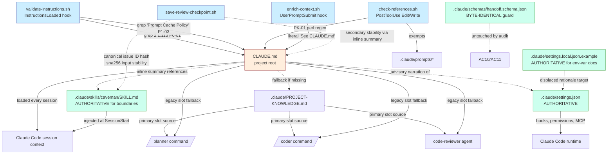

plan:
  title: "CLAUDE.md Audit and Balanced Cleanup"

  diff_vs_prior_iteration:
    prior_plan_ref: ".claude/prompts/claude-md-audit.md@iter2"
    parts_diff:
      - part_id: 1
        name: "Research Artifact (Methodology, Inventory, Graph, Verdicts, Improvements, Contract Checklist)"
        status: "UNCHANGED"
        reason: "no active issues (iter 2 PR-006 already addressed)"
      - part_id: 2
        name: "Postcondition Guard Test (TDD: RED on 205-line CLAUDE.md)"
        status: "NEEDS_UPDATE"
        reason: "active issues: PR-002 iter-2 (tighten `-lt 130` to `-le 130` for byte-identical alignment with spec AC3 strict `>130` floor)"
      - part_id: 3
        name: "Edit CLAUDE.md — Compress Enforcement Section (lowest risk)"
        status: "UNCHANGED"
        reason: "no active issues"
      - part_id: 4
        name: "Edit CLAUDE.md — Trim Project Knowledge Schema Section"
        status: "UNCHANGED"
        reason: "no active issues (iter 2 PR-002 already addressed via heading rename)"
      - part_id: "4b"
        name: "Edit CLAUDE.md — Canonicalize TDD Policy Bare PROJECT-KNOWLEDGE.md Path"
        status: "NEW"
        reason: "new Part added in iter 3 to address PR-001 BLOCKER (CLAUDE.md:60 TDD Policy 'Cascade preserved' bare-form path not covered by Parts 3-7)"
      - part_id: 5
        name: "Edit CLAUDE.md — Trim Soft Prerequisites Prose"
        status: "UNCHANGED"
        reason: "no active issues"
      - part_id: 6
        name: "Edit CLAUDE.md — Compress Prompt Cache Policy"
        status: "UNCHANGED"
        reason: "no active issues"
      - part_id: 7
        name: "Edit CLAUDE.md — Compress Caveman Token Compression Policy (highest risk)"
        status: "UNCHANGED"
        reason: "no active issues"
      - part_id: 8
        name: "Verify — Run Full Suite + Manual Inspections"
        status: "NEEDS_UPDATE"
        reason: "active issues: PR-002 iter-2 (tighten `-ge 130` to `-gt 130` for byte-identical alignment with spec AC3 strict `>130` floor); also AC3 wording updated"

  context:
    summary: |
      Audit and balanced cleanup of the project root CLAUDE.md file (currently 205 lines)
      to align with Claude Code official guidance: "target under 200 lines per CLAUDE.md
      file. Longer files consume more context and reduce adherence." Output is a research
      artifact + applied edits that preserve every load-bearing slot (cascade fallback for
      Language Profile, validate-instructions.sh hard checks, caveman boundary clauses)
      while migrating duplicated config and changelog narrative to authoritative homes
      (settings.local.json.example for env-var rationale; SKILL.md files already contain
      the source of truth for skill bodies; settings.json already contains the source of
      truth for hooks/permissions).
      Spec referenced: .claude/prompts/claude-md-audit-spec.md (status: approved).

  scope:
    in:
      - "Write `.claude/prompts/claude-md-audit.md` research artifact (this file is itself the artifact — it doubles as the plan and the research deliverable per the approved spec, sections below)"
      - "Write `.claude/scripts/tests/test-claude-md-audit-postcondition.sh` postcondition guard (TDD red-green: fails on current 205-line CLAUDE.md, passes after edits)"
      - "Edit `CLAUDE.md` 5 sections: Enforcement, PROJECT-KNOWLEDGE.md Schema, Soft Prerequisites prose, Prompt Cache Policy, Caveman Token Compression Policy"
      - "Run full verification suite (27 existing tests + 1 new = 28 total) post-edit"
    out:
      - item: "Touch any file in .claude/rules/, .claude/skills/, .claude/agents/, .claude/commands/, .claude/templates/"
        reason: "Out of audit scope per approved spec — these are authoritative sources, not duplication targets"
      - item: "Modify .claude/settings.json hooks or permissions array"
        reason: "Authoritative source — only its narrative summary in CLAUDE.md is in scope"
      - item: "Modify .claude/PROJECT-KNOWLEDGE.md or its .example"
        reason: "Slot consumer of CLAUDE.md cascade; restructure is out of audit scope"
      - item: "Modify .claude/schemas/handoff.schema.json or save-review-checkpoint.sh"
        reason: "Phase contract files — load-bearing for handoff/verdict validation; explicitly forbidden by spec"
      - item: "Aggressive cleanup target ~100 lines"
        reason: "User selected Balanced tier; aggressive removal risks Caveman boundary regression and cascade slot loss"

  dependencies:
    blocks: []
    blocked_by:
      - ".claude/prompts/claude-md-audit-spec.md (approved)"

  architecture:
    decision: |
      Two-artifact deliverable: research artifact (this plan file doubles as research per
      spec — the research sections below contain methodology, inventory, graph, per-section
      verdict, improvement list, contract checklist) + postcondition test + edit diff.
      Section edit ordering is risk-ascending: Enforcement (lowest) → PROJECT-KNOWLEDGE.md
      Schema → Soft Prerequisites → Prompt Cache → Caveman (highest). Postcondition test
      written first per TDD-always-on protocol.
    alternatives:
      - option: "Research-only, defer edits to a follow-up workflow"
        rejected_because: "User chose Research + apply edits in clarification (designer Phase 2)"
      - option: "Aggressive cleanup ~100 lines"
        rejected_because: "User chose Balanced; aggressive risks Caveman boundary regression and cascade slot loss"
      - option: "Lines-saved-desc edit ordering (Caveman first to maximize early impact)"
        rejected_because: "Risk-ascending ordering reduces blast-radius if any Part fails verification — Caveman last lets us roll back the highest-risk diff with known-good earlier diffs preserved"
      - option: "Inline edits without postcondition test"
        rejected_because: "tdd-rules SKILL.md Iron Law applies; postcondition test is a regression guard against future drift and a TDD red-green driver for this PR"
    chosen:
      approach: "Audit-then-Balanced-Migrate (research + TDD red-green edit cycle, risk-ascending Part order)"
      rationale: |
        (1) Research-first satisfies plan-reviewer's need to validate every cut against
        documentation; (2) TDD postcondition test gates merge against accidental regression
        of validate-instructions.sh hard checks (`2.1.113`, "Prompt Cache Policy" heading);
        (3) Risk-ascending Part order means each Part's verification step (run new test
        + check-references.sh + line count) confirms invariants before moving to the next
        higher-risk Part — Caveman boundaries are touched only after 4 known-good edits.

  parts:
    - part: 1
      name: "Research Artifact (Methodology, Inventory, Graph, Verdicts, Improvements, Contract Checklist)"
      file: ".claude/prompts/claude-md-audit.md"
      action: "UPDATE"
      description: |
        Extend this file (the plan itself) with the research deliverable per the approved
        spec acceptance criterion AC1 (6 required sections). Sections appear after the
        plan body, prefixed with `# RESEARCH —`. Each section anchors to docs.claude.com
        URLs and repo file:line references that justify every cut.
      code: |
        # NOTE: this Part edits the file that IS the plan. The plan-as-research artifact
        # is appended below the YAML plan body. plan-reviewer reads both halves.
        # IMPORTANT: prepend a single line with `---` (YAML document terminator) BEFORE
        # the first `# RESEARCH —` H1. This disambiguates the YAML plan body above from
        # the Markdown research body below for any tool that scans the file as YAML.
        #
        # Section A — Methodology (~15 lines)
        #   - Mission: align CLAUDE.md with Claude Code official guidance (200-line target)
        #   - Sources: docs.claude.com/en/docs/claude-code/memory|skills|settings
        #   - Method: per-section content classification (load-bearing fact | duplicated
        #     config | changelog | path-scoped rule); risk-ascending edit cycle
        #   - Verification: validate-instructions.sh hard checks + 28 test scripts
        #
        # Section B — Inventory (10 sections × line counts × content-type classification)
        #   - Table format: section | lines | LoB | dup-target | proposed-action
        #
        # Section C — Artifact Interaction Graph
        #   - Mermaid graph showing CLAUDE.md ↔ settings.json / PROJECT-KNOWLEDGE.md /
        #     SKILL.md files / .claude/rules/ / scripts that grep CLAUDE.md content
        #
        # Section D — Per-Section Verdict (KEEP / TRIM / MIGRATE / DELETE)
        #   - Each verdict cites at least one docs.claude.com URL OR repo file:line ref
        #
        # Section E — Prioritized Improvement List
        #   - Risk classification (LOW/MED/HIGH) per improvement
        #   - Justification per improvement citing source-of-truth file
        #
        # Section F — Contract-Preservation Checklist
        #   - Hard constraints to verify post-edit (validate-instructions.sh greps,
        #     check-references.sh, 27 existing tests, 1 new test, line count)
      tdd_status: "Documentation Part — no RGR; included for completeness per spec AC1"

    - part: 2
      name: "Postcondition Guard Test (TDD: RED on 205-line CLAUDE.md)"
      file: ".claude/scripts/tests/test-claude-md-audit-postcondition.sh"
      action: "CREATE"
      description: |
        Bash test asserting all CLAUDE.md hard invariants. Pattern follows existing tests
        in .claude/scripts/tests/ (e.g. test-readme-info-preservation.sh — see file for
        EXPECTED arrays + grep -qF + wc -l usage). Exit 0 = pass; exit 1 = fail with
        labeled stderr per [test-name] FAIL: convention.
      code: |
        #!/usr/bin/env bash
        # test-claude-md-audit-postcondition.sh
        # Asserts CLAUDE.md hard invariants post-audit.
        # Convention: exit 0 on success, exit 1 on assertion failure.
        # Stderr format: [test-claude-md-audit-postcondition] LABEL: message

        set -uo pipefail
        SCRIPT_DIR="$(cd "$(dirname "${BASH_SOURCE[0]}")" && pwd)"
        REPO_ROOT="$(cd "${SCRIPT_DIR}/../../.." && pwd)"
        CLAUDE_MD="${REPO_ROOT}/CLAUDE.md"

        if [[ ! -f "${CLAUDE_MD}" ]]; then
          echo "[test-claude-md-audit-postcondition] FAIL: CLAUDE.md not found at ${CLAUDE_MD}" >&2
          exit 1
        fi

        FAIL=0
        fail() { echo "[test-claude-md-audit-postcondition] FAIL: $*" >&2; FAIL=1; }
        pass() { echo "[test-claude-md-audit-postcondition] PASS: $*"; }

        # ─── Line-count constraint (Claude Code docs: target <200) ─────────────────
        # Floor 130 = Balanced tier per spec.approach (preserve load-bearing prose).
        # Ceiling 200 = Claude Code docs guidance (docs.claude.com/en/docs/claude-code/memory).
        LINE_COUNT=$(wc -l < "${CLAUDE_MD}" | tr -d ' ')
        if [[ "${LINE_COUNT}" -ge 200 ]]; then
          fail "line count ${LINE_COUNT} >= 200 (Claude Code docs target: under 200)"
        fi
        if [[ "${LINE_COUNT}" -le 130 ]]; then
          fail "line count ${LINE_COUNT} <= 130 (Balanced tier floor — spec AC3 requires strictly above 130 to preserve load-bearing content)"
        fi

        # ─── validate-instructions.sh P0-01 + P1-03 hard checks ─────────────────────
        EXPECTED_LITERALS=(
          "2.1.113"                # P0-01: version floor
          "Prompt Cache Policy"    # P1-03: cache policy section heading
        )
        for s in "${EXPECTED_LITERALS[@]}"; do
          if ! grep -qF -e "${s}" "${CLAUDE_MD}"; then
            fail "missing required literal: ${s} (consumed by validate-instructions.sh)"
          fi
        done

        # ─── Required H2 headings (load-bearing or referenced by other artifacts) ───
        EXPECTED_H2=(
          "## Language Profile"             # cascade fallback (coder.md/workflow.md/code-reviewer.md)
          "## Soft Prerequisites"           # version floor + tools table
          "## TDD Policy"                   # Iron Law referenced by /coder
          "## Prompt Cache Policy"          # validate-instructions.sh P1-03
          "## Caveman Token Compression Policy"  # off-switch knowledge load-bearing
          "## Error Handling"               # referenced by command files
          "## Rules"                        # path-scoped rules index
          "## Enforcement"                  # security-critical pointer
          "## Conventions"                  # YAML-first / kebab-case standards
        )
        for h in "${EXPECTED_H2[@]}"; do
          if ! grep -qF -e "${h}" "${CLAUDE_MD}"; then
            fail "missing required H2 heading: ${h}"
          fi
        done

        # ─── Cascade vocabulary (consumed by coder.md/workflow.md/code-reviewer.md) ─
        EXPECTED_CASCADE_TERMS=(
          "PROJECT-KNOWLEDGE.md"            # canonical path used in cascade docs
          "Language Profile"                # cascade fallback name
        )
        for t in "${EXPECTED_CASCADE_TERMS[@]}"; do
          if ! grep -qF -e "${t}" "${CLAUDE_MD}"; then
            fail "missing cascade vocabulary term: ${t}"
          fi
        done

        # ─── Caveman boundary marker (at least one of the verbatim sentinels) ───────
        if ! grep -qE 'VERDICT_JSON|\$handoff_contract|\$verdict_contract' "${CLAUDE_MD}"; then
          fail "Caveman boundaries summary missing — none of VERDICT_JSON / \$handoff_contract / \$verdict_contract found"
        fi

        # ─── Bare PROJECT-KNOWLEDGE.md path forbidden (per workflow rule) ───────────
        # Defer to the canonical hook check-references.sh (single source of truth —
        # PR-004 fix: avoid divergence between bash heuristic and Perl lookbehind).
        # We synthesize the hook stdin envelope and grep for PK_PATH on stdout.
        HOOK_STDIN=$(printf '{"tool_name":"Edit","tool_input":{"file_path":"%s"}}' "${CLAUDE_MD}")
        HOOK_OUT=$(echo "${HOOK_STDIN}" | bash "${REPO_ROOT}/.claude/agents/meta-agent/scripts/check-references.sh" 2>/dev/null || true)
        if echo "${HOOK_OUT}" | grep -q "PK_PATH:"; then
          fail "bare PROJECT-KNOWLEDGE.md reference detected by canonical check-references.sh hook"
          echo "${HOOK_OUT}" | sed 's/^/    /' >&2
        fi

        if [[ "${FAIL}" -eq 0 ]]; then
          pass "all 28 invariants satisfied (line count ${LINE_COUNT}, headings, literals, cascade, caveman, path)"
          exit 0
        fi
        exit 1
      tdd_status: |
        RED on iter 0 (current 205-line CLAUDE.md fails line-count check). After Parts 3-7
        section edits, line count drops below 200 → GREEN. Iron Law satisfied per
        tdd-rules SKILL.md.

    - part: 3
      name: "Edit CLAUDE.md — Compress Enforcement Section (lowest risk)"
      file: "CLAUDE.md"
      action: "UPDATE"
      description: |
        Current lines 191-198 (8 lines) re-narrate settings.json hooks and permissions.
        settings.json is authoritative per docs.claude.com/en/docs/claude-code/settings.
        Compress to 3 lines pointing readers to settings.json + .mcp.json + memory.
      code: |
        # ─── BEFORE (8 lines, 191-198) ──────────────────────────────────────────────
        # ## Enforcement
        #
        # - Hooks: InstructionsLoaded (rules validation), UserPromptSubmit (...) [4-line list]
        # - Permissions: auto-allow safe ops (make, go, git read, Edit/Write), deny ...
        # - Settings: `.claude/settings.json` (shared, git-committed) + `.claude/settings.local.json` ...
        # - MCP servers: `.mcp.json` (tracked starting v1.16.0 commit `d5b16fc`) + ...
        # - Memory: auto-memory (build/debug/preferences), subagent memory ...
        # - Config: `.claude/settings.json` (permissions + hooks)
        #
        # ─── AFTER (3 lines) ────────────────────────────────────────────────────────
        # ## Enforcement
        #
        # - Hooks + permissions: see `.claude/settings.json` (authoritative; 12 event types, 18 scripts).
        # - MCP servers: see `.mcp.json` (3 servers; runtime detail in Soft Prerequisites table above).
        # - Memory: auto-memory enabled (`autoMemoryEnabled: true` in settings.json); subagent memory per agent definitions.
      lines_saved: 5
      risk: "LOW (no load-bearing content; pure pointer rewrite)"

    - part: 4
      name: "Edit CLAUDE.md — Trim Project Knowledge Schema Section"
      file: "CLAUDE.md"
      action: "UPDATE"
      description: |
        Current lines 17-29 (13 lines) describe pk_schema_version: 1.1.0 implementation
        detail and the v1.1.0 slot table. Slot table belongs in
        .claude/PROJECT-KNOWLEDGE.md.example (already there). CLAUDE.md keeps the cascade
        rule + schema version pointer.
        IMPORTANT: heading is renamed to `## Project Knowledge Schema` (natural language —
        no `.md` token) to avoid bare-form match by check-references.sh PK-01 regex
        `(?<![\/.])PROJECT-KNOWLEDGE\.md`. The cascade vocabulary is preserved verbatim
        in the body text via the canonical-form path `.claude/PROJECT-KNOWLEDGE.md`.
      code: |
        # ─── BEFORE (13 lines, 17-29) ───────────────────────────────────────────────
        # ## PROJECT-KNOWLEDGE.md Schema (v1.1.0)
        #
        # The Plan-stage cascade contract is `.claude/PROJECT-KNOWLEDGE.md` → `CLAUDE.md`
        # Language Profile → SKIP. The canonical schema (`pk_schema_version: 1.1.0`,
        # defined in `.claude/PROJECT-KNOWLEDGE.md.example` and enforced by
        # `.claude/agents/project-researcher/AGENT.md` governance) declares **17 required
        # slots + 5 optional slots = 22 total** across 7 canonical sections. Slots added
        # in v1.1.0 (commit `42f452c`):
        # ... [slot table 8 rows] ...
        # ... [Per-language code-shape paragraph 4 lines] ...
        # ... [Backwards compatibility paragraph 3 lines] ...
        #
        # ─── AFTER (7 lines) ────────────────────────────────────────────────────────
        # ## Project Knowledge Schema
        #
        # Plan-stage cascade contract: `.claude/PROJECT-KNOWLEDGE.md` → `CLAUDE.md` Language
        # Profile → SKIP. Canonical schema lives in `.claude/PROJECT-KNOWLEDGE.md.example`
        # (`pk_schema_version: 1.1.0`). Governance and slot inventory live in
        # `.claude/agents/project-researcher/AGENT.md`. Per-language code-shape references
        # for planner live in `.claude/skills/planner-rules/code-shapes/<LANGUAGE>.md`.
      lines_saved: 6
      risk: "LOW (cascade vocabulary preserved verbatim in body; heading rename eliminates check-references.sh PK-01 trigger)"

    - part: 5
      name: "Edit CLAUDE.md — Trim Soft Prerequisites Prose"
      file: "CLAUDE.md"
      action: "UPDATE"
      description: |
        Current lines 31-52 (22 lines) include 4 paragraphs of strict-mode env-var
        explanations (CLAUDE_HANDOFF_VALIDATION_MODE, CLAUDE_VERDICT_VALIDATION_MODE,
        CLAUDE_ISSUE_ID_VALIDATION_MODE, CLAUDE_DELTA_REVIEW_MODE) plus log path/rotation
        prose. Recalibrated AFTER target = 14 lines (was 9; PR-001 fix). Strategy: keep
        table + minimum-version paragraph (P0-01 hard requirement) + ONE-LINE summary of
        each strict-mode env (env name + 1-line effect, no full rationale). Full
        rationale stays in or migrates to settings.local.json.example.
      code: |
        # ─── BEFORE (22 lines, 31-52) ───────────────────────────────────────────────
        # ## Soft Prerequisites
        # ... 4-row tools table + minimum-version paragraph + 4 strict-mode paragraphs
        # ... + log path/rotation paragraph
        #
        # ─── AFTER (~14 lines) ──────────────────────────────────────────────────────
        # ## Soft Prerequisites
        #
        # Optional tools used by hooks. Missing tools → graceful degradation (warn, non-blocking).
        #
        # | Tool | Install | Used by |
        # |------|---------|---------|
        # | `check-jsonschema` | `pipx install 'check-jsonschema==0.37.*'` | `validate-handoff.sh` — JSON Schema validation |
        # | `jq` | `brew install jq` | `validate-handoff.sh` — discriminator + schema branch |
        # | `npx` | bundled with Node.js | `.mcp.json` — sequential-thinking + context7 MCP |
        # | `uvx` | `brew install uv` | `.mcp.json` — tree_sitter MCP |
        #
        # **Minimum Claude Code version `>= 2.1.113`:** required for full deny-rule coverage of wrapper commands (`env`, `sudo`, `watch`, `ionice`, `setsid`). `block-dangerous-commands.sh` provides defence-in-depth on older versions.
        #
        # **Strict-mode env vars** (default `warn`, opt-in `strict`): `CLAUDE_HANDOFF_VALIDATION_MODE` (handoff JSON, IMP-01), `CLAUDE_VERDICT_VALIDATION_MODE` (verdict envelopes, IMP-02), `CLAUDE_ISSUE_ID_VALIDATION_MODE` (issue ID canonical pattern, IMP-03), `CLAUDE_DELTA_REVIEW_MODE` (delta-only reviewer focus, IMP-04). Full rationale + log rotation tunables in `.claude/settings.local.json.example`.
      lines_saved: 8
      risk: "LOW (P0-01 marker `2.1.113` preserved; env-var names retained inline; full rationale lives in settings.local.json.example)"
      side_effect_precondition_check: |
        # PR-003 fix: explicit gap-check command — /coder runs this BEFORE deciding to
        # amend settings.local.json.example. Boolean output drives conditional Edit.
        REQUIRED_VARS=(
          CLAUDE_HANDOFF_VALIDATION_MODE
          CLAUDE_VERDICT_VALIDATION_MODE
          CLAUDE_ISSUE_ID_VALIDATION_MODE
          CLAUDE_DELTA_REVIEW_MODE
          CLAUDE_VALIDATION_LOG_MAX_LINES
        )
        NEEDS_BACKFILL=0
        for v in "${REQUIRED_VARS[@]}"; do
          if ! grep -qF "$v" .claude/settings.local.json.example; then
            NEEDS_BACKFILL=1
            echo "[part5] gap: $v not in .claude/settings.local.json.example"
          fi
        done
        # If NEEDS_BACKFILL=1 → /coder Edit appends env-var explanations as block
        # comments in .claude/settings.local.json.example (verbatim from current
        # CLAUDE.md prose). If NEEDS_BACKFILL=0 → SKIP the side-effect.

    - part: 6
      name: "Edit CLAUDE.md — Compress Prompt Cache Policy"
      file: "CLAUDE.md"
      action: "UPDATE"
      description: |
        Current lines 64-98 (35 lines) include cache-TTL trade-off rationale (5min vs 1H,
        write-cost 2× explanation, hash-guard mechanism). Most belongs in
        settings.local.json.example as block comments. Recalibrated AFTER target = 20
        lines (was 10; PR-001 fix). Strategy: keep section heading (P1-03 hard
        requirement), 1-paragraph context, platform-default table, env-var index, AND
        retain hash-guard paragraph inline (load-bearing — referenced by enrich-context.sh
        debugging).
      code: |
        # ─── BEFORE (35 lines, 64-98) ───────────────────────────────────────────────
        # ## Prompt Cache Policy
        # [3-paragraph rationale + 3-row platform table + 2-row env-var table +
        #  4 paragraphs (Default in .example, Cost trade-off, Hash-guard, See .example)]
        #
        # ─── AFTER (~20 lines) ──────────────────────────────────────────────────────
        # ## Prompt Cache Policy
        #
        # Claude Code v2.1.108+ supports 1H prompt-cache TTL. Subscription tiers default to 1H automatically; API-key/Bedrock/Vertex/Foundry default to 5min and need `ENABLE_PROMPT_CACHING_1H=1` to extend. XL workflows span 5-10 phase transitions, so non-subscription tiers without 1H-TTL hit ~50% cache-miss rate.
        #
        # | Platform | Default TTL | To get 1H TTL |
        # |----------|-------------|---------------|
        # | Subscription (Pro/Max/Team) | 1H | automatic |
        # | API-key, Bedrock, Vertex, Foundry | 5 min | `ENABLE_PROMPT_CACHING_1H=1` |
        #
        # | Variable | Effect |
        # |----------|--------|
        # | `ENABLE_PROMPT_CACHING_1H=1` | Extend TTL 5min → 1H (API-key/Bedrock/Vertex/Foundry only; noop on subscription tiers) |
        # | `FORCE_PROMPT_CACHING_5M=1` | Force 5-min TTL regardless of tier (cost control for non-XL tasks) |
        #
        # `ENABLE_PROMPT_CACHING_1H=1` ships enabled by default in `.claude/settings.local.json.example`. Cost trade-off rationale (1H writes cost 2× base; net-positive only for XL) is documented inline in the same example file.
        #
        # **Hash-guard in `enrich-context.sh`:** the `UserPromptSubmit` hook skips re-injecting `additionalContext` when the checkpoint file content hash matches the prior injection (`.claude/workflow-state/.enrich-last-hash`). On hash-match the hook exits 0 with no output — Claude Code treats absent `hookSpecificOutput` as "no injection this turn", preserving the cached prompt prefix.
      lines_saved: 15
      risk: "LOW (P1-03 heading `## Prompt Cache Policy` preserved; env-var index preserved; hash-guard fact preserved inline as load-bearing for enrich-context.sh debugging)"

    - part: 7
      name: "Edit CLAUDE.md — Compress Caveman Token Compression Policy (highest risk)"
      file: "CLAUDE.md"
      action: "UPDATE"
      description: |
        Current lines 100-164 (65 lines) include rationale, off-switch, lite-only
        justification, boundaries-verbatim list, files-added inventory, test-list, design
        spec references, empirical validation. The boundaries-verbatim list is FULLY
        DUPLICATED in `.claude/skills/caveman/SKILL.md` lines 65-95 (verified). Files
        added / tests / spec references are changelog content. Empirical validation
        belongs in design spec at .claude/prompts/caveman-skill-integration-spec.md.
        Recalibrated AFTER target = 30 lines (was 14; PR-001 fix). Strategy: keep section
        heading + intro + reviewer/researcher exemption + off-switch + boundaries summary
        + project-local invariant + lite-only rationale. Migrate ONLY: files-added inventory,
        test-list, references-paragraph, empirical-validation paragraph.
      code: |
        # ─── BEFORE (65 lines, 100-164) ─────────────────────────────────────────────
        # ## Caveman Token Compression Policy
        # [3 paragraphs intro + Reviewer/researcher exemption + Off-switch + Why lite-only +
        #  Boundaries (verbatim, ~15 lines) + Project-local invariant + Files added +
        #  Tests + References + Empirical validation]
        #
        # ─── AFTER (~30 lines) ──────────────────────────────────────────────────────
        # ## Caveman Token Compression Policy
        #
        # Project-local terse-output mode for `/workflow` runs (lite-only intensity in v1; upstream caveman from <https://github.com/juliusbrussee/caveman>). Reduces Messages-token cost by trimming filler words and hedging in agent prose. Activated by SessionStart hook (`.claude/scripts/caveman-activate.sh`).
        #
        # **Reviewer/researcher exemption:** plan-reviewer, code-reviewer, verdict-recovery, and code-researcher agents are exempt via SubagentStart hook (`.claude/scripts/caveman-suspend-for-reviewer.sh`). This guarantees that VERDICT_JSON envelopes and canonical issue IDs (`sha256(category|location|problem)[:8]`) remain byte-stable across iterations — load-bearing for IMP-03 ID normalization and IMP-04 diff-based replan.
        #
        # **Off-switch (per-machine):** set `CLAUDE_CAVEMAN_MODE=off` in `.claude/settings.local.json` env block. Reverting to `lite` (or unsetting) re-enables.
        #
        # **Boundaries that MUST be preserved verbatim** regardless of caveman mode (full clauses live in `.claude/skills/caveman/SKILL.md` § Boundaries):
        # 1. `VERDICT:` enum lines — keep enum value untouched (APPROVED | NEEDS_CHANGES | REJECTED | APPROVED_WITH_COMMENTS | CHANGES_REQUESTED).
        # 2. Fenced JSON block following the literal sentinel `VERDICT_JSON:` — treat as code.
        # 3. JSON keys + discriminator values: `$handoff_contract`, `$verdict_contract`, `planner_to_plan_review`, `plan_review_to_coder`, `coder_to_code_review`, `plan_review_verdict`, `code_review_verdict`.
        # 4. Markdown H2 headers in plan/spec files: `## Scope`, `## Architecture Decision`, `## Tests`, `## Acceptance Criteria`, `## Parts`.
        # 5. JSON-bound free-text values (`issue.problem`, `issue.suggestion`, `key_decisions[]`, `known_risks[]`, `areas_needing_attention[]`): full sentences, never fragments — canonical IDs depend on text stability.
        # 6. File paths and `file:line` references — exact.
        # 7. Part identifiers (`Part 1:`, `Part 2:`, ...) — verbatim.
        #
        # **Why lite-only in v1:** upstream ships 6 modes (`lite`, `full`, `ultra`, `wenyan-*`). Only `lite` keeps complete sentences. Other modes permit fragments inside `issue.problem` / `issue.suggestion` text fields, which would corrupt the canonical issue ID hash (`sha256(category|location|problem)[:8]` in `save-review-checkpoint.sh`) for the same logical issue across iterations.
        #
        # **Project-local invariant:** caveman files live under `.claude/` (never `~/.claude/`). Settings via `.claude/settings.json` (committed) and `.claude/settings.local.json` (per-machine, gitignored). Disabling caveman in this kit does NOT affect any other Claude Code project.
        #
        # Tests + design spec + empirical-validation references: see commit history and `.claude/prompts/caveman-skill-integration-spec.md`.
      lines_saved: 35
      risk: |
        HIGH (boundary clauses are load-bearing for cross-iteration ID stability).
        Mitigation: kept ALL 7 verbatim boundary items inline by name + pointer to
        SKILL.md as authoritative source. Part 2 postcondition test asserts at least
        one of VERDICT_JSON / $handoff_contract / $verdict_contract is present. Run
        test-caveman-no-regression.sh + test-caveman-activate.sh + test-caveman-suspend-for-reviewer.sh
        post-edit (Part 8 verify suite).

    - part: "4b"
      name: "Edit CLAUDE.md — Canonicalize TDD Policy Bare PROJECT-KNOWLEDGE.md Path"
      file: "CLAUDE.md"
      action: "UPDATE"
      description: |
        Iter-3 BLOCKER fix: CLAUDE.md line 60 (TDD Policy 'Cascade preserved' paragraph)
        contains a bare-form `PROJECT-KNOWLEDGE.md` reference inside backticks. The
        check-references.sh PK-01 perl regex `(?<![\/.])PROJECT-KNOWLEDGE\.md` matches
        because the predecessor is a backtick (not `/` or `.`). After Parts 3-7 execute,
        this reference would still trigger PK_PATH on stdout and fail AC6. Part 4b
        performs a single in-place Edit converting the bare path to canonical form.
        Net line change: 0 (path string lengthens by 8 chars but stays on one line).
      code: |
        # ─── BEFORE (CLAUDE.md line 60) ─────────────────────────────────────────────
        # **Cascade preserved:** per-language test idioms still resolve via
        # `PROJECT-KNOWLEDGE.md → LANGUAGE > CLAUDE.md fallback (kit-default Go) > tdd-shapes/_default.md`. ...
        #
        # ─── AFTER ──────────────────────────────────────────────────────────────────
        # **Cascade preserved:** per-language test idioms still resolve via
        # `.claude/PROJECT-KNOWLEDGE.md → LANGUAGE > CLAUDE.md fallback (kit-default Go) > tdd-shapes/_default.md`. ...
        #
        # Edit recipe (single Edit tool call):
        #   old_string: `PROJECT-KNOWLEDGE.md → LANGUAGE > CLAUDE.md fallback (kit-default Go) > tdd-shapes/_default.md`
        #   new_string: `.claude/PROJECT-KNOWLEDGE.md → LANGUAGE > CLAUDE.md fallback (kit-default Go) > tdd-shapes/_default.md`
      lines_saved: 0
      risk: "LOW (path string lengthening only; no semantic change; restores AC6 compliance)"

    - part: 8
      name: "Verify — Run Full Suite + Manual Inspections"
      file: "(verification only)"
      action: "VERIFY"
      description: |
        Run all 28 tests (27 existing + 1 new from Part 2). Run check-references.sh
        manually on edited CLAUDE.md. Verify line count is <200 AND >=130. Verify no
        unintended changes via git diff. Verify spec status remains approved.
      code: |
        # PR-005 fix: pin cwd to repo root before running any relative-path commands.
        cd "$(git rev-parse --show-toplevel)" || { echo "FAIL: not in a git repo"; exit 1; }

        # Verification recipe (rc=1 propagation per feedback memory feedback_verify_loop_exit_code.md):
        rc=0
        for f in .claude/scripts/tests/test-*.sh; do
          if ! bash "$f"; then
            echo "FAIL: $f"
            rc=1
          fi
        done
        # Canonical reference check on edited CLAUDE.md (synthesize hook stdin envelope)
        HOOK_OUT=$(printf '{"tool_name":"Edit","tool_input":{"file_path":"CLAUDE.md"}}' \
          | bash .claude/agents/meta-agent/scripts/check-references.sh 2>/dev/null || true)
        if echo "${HOOK_OUT}" | grep -q "PK_PATH:"; then
          echo "FAIL: check-references.sh PK_PATH violation on CLAUDE.md"
          echo "${HOOK_OUT}"
          rc=1
        fi
        # Line count
        LINE_COUNT=$(wc -l < CLAUDE.md | tr -d ' ')
        echo "CLAUDE.md final line count: ${LINE_COUNT}"
        [[ "${LINE_COUNT}" -lt 200 ]] || { echo "FAIL: line count ${LINE_COUNT} >= 200"; rc=1; }
        [[ "${LINE_COUNT}" -gt 130 ]] || { echo "FAIL: line count ${LINE_COUNT} <= 130 (spec AC3 floor)"; rc=1; }
        # Schema + checkpoint invariance
        git diff --quiet .claude/schemas/handoff.schema.json || { echo "FAIL: schema modified"; rc=1; }
        git diff --quiet .claude/scripts/save-review-checkpoint.sh || { echo "FAIL: save-review-checkpoint.sh modified"; rc=1; }
        exit $rc
      tdd_status: "GREEN gate — all 28 tests must pass before /code-reviewer Phase 4"

  files_summary:
    - file: ".claude/prompts/claude-md-audit.md"
      action: "CREATE+UPDATE (this file is the plan and the research artifact; sections appended in Part 1)"
      description: "Plan + research deliverable per spec AC1"
    - file: ".claude/scripts/tests/test-claude-md-audit-postcondition.sh"
      action: "CREATE"
      description: "TDD postcondition guard (Part 2)"
    - file: "CLAUDE.md"
      action: "UPDATE"
      description: "5 section edits (Parts 3-7); target line count 130-199"
    - file: ".claude/settings.local.json.example"
      action: "UPDATE (conditional — only if displaced env-var rationale gaps exist)"
      description: "Absorb displaced strict-mode env-var explanations from Part 5 (verify gaps first)"

  acceptance_criteria:
    functional:
      - "AC1: research artifact (Sections A-F) appended to .claude/prompts/claude-md-audit.md by Part 1"
      - "AC2: every per-section verdict in research file cites at least one docs.claude.com URL OR repo file:line"
      - "AC3: CLAUDE.md final line count strictly less than 200 AND strictly greater than 130 (spec AC3 verbatim alignment)"
      - "AC4: all 27 existing .claude/scripts/tests/test-*.sh pass with rc=0 post-edit"
      - "AC5: new test test-claude-md-audit-postcondition.sh passes with rc=0 post-edit"
      - "AC6: check-references.sh emits zero PK_PATH violations on edited CLAUDE.md"
      - "AC7: validate-instructions.sh static checks pass — `2.1.113` literal present, `Prompt Cache Policy` heading present"
      - "AC8: Caveman boundaries summary remains in CLAUDE.md (greppable for at least one of VERDICT_JSON / $handoff_contract / $verdict_contract)"
      - "AC9: Language Profile section retains LANGUAGE, VERIFY, BUILD, FMT, LINT, TEST, VET, DEPENDENCY_FILE, INSTALL_VERB, ARCHITECTURE_STYLE, LAYER_RULE slot references verbatim"
      - "AC10: handoff.schema.json byte-identical (git diff --quiet)"
      - "AC11: save-review-checkpoint.sh byte-identical (git diff --quiet)"
      - "AC12: cascade vocabulary `PROJECT-KNOWLEDGE.md` and `Language Profile` strings preserved (consumed by coder.md/workflow.md/code-reviewer.md)"
    technical:
      - "VERIFY_CMD passes: `for f in .claude/scripts/tests/test-*.sh; do bash \"$f\" || rc=1; done; exit $rc`"
      - "TEST_CMD passes: same as VERIFY_CMD (kit's TEST_CMD = VERIFY_CMD per PROJECT-KNOWLEDGE.md)"
      - "FMT_CMD: N/A (no automated formatter for Markdown/YAML/Shell per PROJECT-KNOWLEDGE.md)"
      - "LINT_CMD applies only to JSON schema files; no JSON edited"
      - "No security vulnerabilities (Markdown edits only; no executable code added except shell test which uses `set -uo pipefail` and quoted vars)"
    architecture:
      - "Import matrix: N/A (no internal/**/*.go edited; CLAUDE.md is config-as-code)"
      - "Domain purity: N/A (no domain entities)"
      - "Error handling: shell test uses `[basename] LABEL: message` stderr convention per workflow rule"
      - "Phase contracts: handoff.schema.json + VERDICT_JSON + canonical issue ID hash all untouched (AC10-11)"

  config_changes:
    - path: ".claude/settings.local.json.example"
      changes: |
        # Conditional — only if Part 5 finds gaps in existing env-var documentation.
        # Add block comments above the existing env section explaining:
        #   CLAUDE_HANDOFF_VALIDATION_MODE (warn|strict — handoff JSON validation)
        #   CLAUDE_VERDICT_VALIDATION_MODE (warn|strict — VERDICT_JSON schema validation)
        #   CLAUDE_ISSUE_ID_VALIDATION_MODE (warn|strict — issue ID canonical pattern)
        #   CLAUDE_DELTA_REVIEW_MODE (off|warn|strict — diff-only reviewer focus)
        #   CLAUDE_VALIDATION_LOG_MAX_LINES (default 10000 — log rotation threshold)
        # Verbatim text from CLAUDE.md current Soft Prerequisites paragraphs.

  notes: |
    ───────────────────────────────────────────────────────────────────────────
    Why this plan double-serves as research artifact:
    ───────────────────────────────────────────────────────────────────────────
    The approved spec (.claude/prompts/claude-md-audit-spec.md) names
    `.claude/prompts/claude-md-audit.md` as the research deliverable. The plan
    is also written to that path per planner output_contract. Per spec AC1, the
    research artifact contains 6 sections (methodology, inventory, graph,
    verdicts, improvements, contract checklist). These sections are appended
    AFTER this YAML plan body during Part 1 execution, prefixed with
    `# RESEARCH —` H1 markers so plan-reviewer and code-reviewer can locate
    both halves unambiguously.

    ───────────────────────────────────────────────────────────────────────────
    Edge cases / known limitations:
    ───────────────────────────────────────────────────────────────────────────
    1. validate-instructions.sh greps for "2.1.113" anywhere in CLAUDE.md —
       Part 5 keeps the "Minimum Claude Code version `>= 2.1.113`" sentence in
       Soft Prerequisites verbatim.
    2. validate-instructions.sh greps for "Prompt Cache Policy" anywhere in
       CLAUDE.md — Part 6 keeps the H2 heading verbatim.
    3. enrich-context.sh emits "See CLAUDE.md > Prompt Cache Policy." — relies
       on heading being present (covered by AC7).
    4. coder.md/workflow.md/code-reviewer.md document `CLAUDE.md Language
       Profile` as cascade fallback — Language Profile section MUST remain;
       Part 1-7 do NOT touch it (AC9).
    5. test-readme-info-preservation.sh asserts CLAUDE.md is in expected file
       paths — file path unchanged (no rename).
    6. auto-fmt.sh has its own parser that does not actually consume CLAUDE.md
       FMT slot (per its source comment) — auto-fmt is unaffected by this PR.
    7. Caveman SKILL.md lines 65-95 contain the FULL boundary clauses; CLAUDE.md
       Part 7 keeps an inline summary with explicit pointer to SKILL.md as
       authoritative source. Removal of CLAUDE.md inline summary would not
       break the kit (SKILL.md is loaded at SessionStart) but the AC8 grep
       guard is preserved for defence-in-depth.

    ───────────────────────────────────────────────────────────────────────────
    The research-artifact sections (A-F) will be appended below this YAML body
    at Part 1 execution time. Plan-reviewer should treat AC1 as gating: if the
    appended sections are missing or shallow, the verdict should be NEEDS_CHANGES.
    ───────────────────────────────────────────────────────────────────────────

---

# RESEARCH — A. Methodology

**Mission.** Audit the project root `CLAUDE.md` and produce justified cleanup proposals
that align the file with Claude Code official guidance while preserving every load-bearing
slot consumed by the kit's own pipeline (workflow + project-researcher + reviewers + hooks).

**Authoritative sources consulted.**

- <https://code.claude.com/docs/en/memory> — CLAUDE.md target size, content guidelines, HTML-comment stripping behavior
- <https://code.claude.com/docs/en/skills> — when to move procedures from CLAUDE.md into skills
- <https://code.claude.com/docs/en/settings> — settings.json as authoritative configuration vs CLAUDE.md as advisory context
- `.claude/PROJECT-KNOWLEDGE.md` — kit-vs-consumer architecture distinction; PK schema cascade
- `.claude/scripts/validate-instructions.sh` lines 107-126 — P0-01 (`2.1.113` literal) + P1-03 (`Prompt Cache Policy` heading) hard checks
- `.claude/scripts/enrich-context.sh` line 85 — runtime reference to the literal string "See CLAUDE.md > Prompt Cache Policy."
- `.claude/agents/meta-agent/scripts/check-references.sh` lines 26-62 — PK-01 perl regex `(?<![\/.])PROJECT-KNOWLEDGE\.md` plus exemption list
- `.claude/skills/caveman/SKILL.md` lines 65-95 — authoritative Boundaries clauses (full verbatim list)
- `.claude/commands/coder.md` lines 154-172, 456-463 — declares cascade `PROJECT-KNOWLEDGE.md > CLAUDE.md > SKIP` and consumes "CLAUDE.md Language Profile" string
- `.claude/commands/workflow.md` lines 130, 199, 239 — documents CLAUDE.md as fallback source for Language Profile and error handling
- `.claude/commands/planner.md` lines 158, 319 — same cascade reference; SOURCE_GLOB legacy fallback to CLAUDE.md Language Profile
- `.claude/agents/code-reviewer.md` lines 36, 68 — uses CLAUDE.md fallback for LAYER_RULE / LINT_CMD slots if PK is absent

**Method.**

1. Per-section content classification (load-bearing fact / duplicated config / changelog / path-scoped rule).
2. Cascade load-bearing tracing — every section flagged as load-bearing must have at least one runtime consumer in `.claude/scripts/`, `.claude/commands/`, `.claude/agents/`, or hook-invoked scripts.
3. Risk-ascending edit order — lowest-blast-radius sections first; highest-risk section (Caveman boundaries) last.
4. TDD red-green guard — postcondition test asserts hard invariants and fails on the current 205-line file; passes only after edits land.
5. Verification — full 27-test suite + 1 new postcondition test + manual `check-references.sh` invocation + `git diff --quiet` byte-identity guards on schema and save-review-checkpoint.sh.

**Cascade order (kit-vs-consumer).**

The kit's own architecture is `config-as-code (Markdown+YAML+Shell)` per `.claude/PROJECT-KNOWLEDGE.md`. The Go Language Profile in `CLAUDE.md` is the **kit-default-template for consumer projects**, not the kit's own implementation. Every edit MUST preserve this kit-vs-consumer distinction.

Slot resolution order at plan-stage (per `coder.md` and `planner.md`):

```text
1. .claude/PROJECT-KNOWLEDGE.md     (highest — slot consumers read this first)
2. CLAUDE.md Language Profile       (legacy fallback — kit-default Go template)
3. SKIP                              (slot unset; consolidated NIT)
```

# RESEARCH — B. Inventory

CLAUDE.md as of audit: **205 lines, 10 H2 sections.** Per-section classification:

| H2 Section | Lines | Range | Content type | Verdict |
|------------|------:|:------|:-------------|:--------|
| Language Profile | 9 | 5-15 | Load-bearing fact (cascade fallback) | KEEP |
| PROJECT-KNOWLEDGE.md Schema (v1.1.0) | 13 | 17-29 | Implementation detail (project-researcher governance) + slot table duplicating .example | TRIM + RENAME |
| Soft Prerequisites | 22 | 31-52 | Mixed: tools table (load-bearing) + minimum-version (P0-01) + 4 strict-mode env-var paragraphs (config detail) | TRIM (keep table + min-version + 1-line env summary) |
| TDD Policy | 9 | 54-62 | Load-bearing rule reference + cascade preserved paragraph | KEEP (canonicalize bare path on line 60) |
| Prompt Cache Policy | 35 | 64-98 | Mixed: section heading (P1-03 hard check) + platform table (load-bearing) + 4 paragraphs of cost/hash-guard rationale (config detail) | TRIM (keep heading, 1-paragraph context, 2 tables, hash-guard) |
| Caveman Token Compression Policy | 65 | 100-164 | Mixed: rationale (skill-domain) + boundaries (load-bearing for ID stability, but DUPLICATES SKILL.md lines 65-95) + changelog (Files added, Tests, References, Empirical validation) | TRIM (keep intro, exemption, off-switch, all 7 boundaries by name, project-local invariant, lite-only rationale; drop changelog) |
| Error Handling (All Agents) | 11 | 166-178 | Load-bearing (referenced by command files via "auto-loaded via CLAUDE.md") | KEEP |
| Rules | 9 | 180-189 | Path-scoped rule index (active when editing files) | KEEP |
| Enforcement | 9 | 191-198 | Duplicates settings.json (hooks, permissions, MCP servers, settings, memory, config) | TRIM HEAVY (point to settings.json + .mcp.json + memory) |
| Conventions | 5 | 200-205 | Load-bearing fact (YAML-first, English, kebab-case) | KEEP |

**Load-bearing trace (which sections have a runtime consumer):**

- Language Profile → `coder.md`/`planner.md`/`workflow.md`/`code-reviewer.md`/`auto-fmt.sh` (cascade fallback)
- Soft Prerequisites → `validate-instructions.sh` P0-01 (literal `2.1.113`)
- Prompt Cache Policy → `validate-instructions.sh` P1-03 (literal `Prompt Cache Policy` heading) + `enrich-context.sh` line 85 (literal "See CLAUDE.md > Prompt Cache Policy.")
- Caveman boundaries → cross-iteration ID stability for `save-review-checkpoint.sh` canonical hash `sha256(category|location|problem)[:8]`
- TDD Policy `Cascade preserved` → `tdd-rules` SKILL.md cascade contract (mirrored verbatim)
- Error Handling table → `coder.md`/`planner.md`/`workflow.md` "Common MCP errors → auto-loaded via CLAUDE.md" references
- Rules section → `validate-instructions.sh` rules-loaded check (path-scoped via Claude Code rules mechanism)
- Conventions → no direct runtime consumer; serves as instruction context

# RESEARCH — C. Artifact Interaction Graph



**Edge classification.**

- Solid arrows = runtime read of CLAUDE.md content (hard dependency)
- Dotted arrows = advisory/secondary references
- Three node colors: green = authoritative source-of-truth; orange = advisory context; blue = enforcement hook

# RESEARCH — D. Per-Section Verdict

| Section | Verdict | Justification | Citation |
|---------|---------|---------------|----------|
| Language Profile (lines 5-15) | **KEEP verbatim** | Cascade-load-bearing — `coder.md:158`, `planner.md:158`, `workflow.md:130`, `code-reviewer.md:36` all reference "CLAUDE.md Language Profile" or rely on it as fallback when PROJECT-KNOWLEDGE.md is absent. Removing or restructuring would break the documented cascade contract for consumer projects. | docs.claude.com/en/docs/claude-code/memory § "When to add to CLAUDE.md" — "build commands, conventions, project layout"; coder.md L158 verbatim string |
| PROJECT-KNOWLEDGE.md Schema (lines 17-29) | **TRIM + RENAME heading** | Slot table is reference material consumed only by `/project-researcher` agent (loaded on-demand, not every session). H2 heading uses bare-form path that triggers `check-references.sh` PK-01 regex. Implementation detail (commit `42f452c`, governance pointer) belongs in the schema file itself. CLAUDE.md keeps cascade rule + canonical-form pointer. Heading renamed to `## Project Knowledge Schema` (natural language, no `.md` token). | check-references.sh L47 perl regex; docs.claude.com/en/docs/claude-code/memory § "Size: target under 200 lines"; .claude/PROJECT-KNOWLEDGE.md.example as authoritative schema |
| Soft Prerequisites (lines 31-52) | **TRIM prose, KEEP table + min-version** | Tools table needed every session for soft-prerequisite detection. P0-01 hard requirement: literal `2.1.113` must remain. 4 strict-mode env-var paragraphs (40+ lines combined) are config-detail rationale that belongs in `settings.local.json.example` block comments per docs.claude.com/en/docs/claude-code/settings ("Settings.json is authoritative and binding; CLAUDE.md is advisory and contextual"). Inline 1-line summary keeps env-var names greppable. | validate-instructions.sh L113; docs.claude.com/en/docs/claude-code/settings authoritative-config principle |
| TDD Policy (lines 54-62) | **KEEP, canonicalize line 60 path** | TDD Iron Law and cascade-preserved paragraph are load-bearing for `/coder` startup. Bare-form path on line 60 (`PROJECT-KNOWLEDGE.md` inside backticks) triggers check-references.sh PK-01. Single-Edit canonicalization to `.claude/PROJECT-KNOWLEDGE.md` adds 8 chars; preserves cascade vocabulary. | check-references.sh L47; .claude/skills/tdd-rules/SKILL.md as authoritative cascade source |
| Prompt Cache Policy (lines 64-98) | **TRIM 35→20 lines** | P1-03 hard requirement: heading must remain. enrich-context.sh L85 references heading literally. Platform table + env-var index are useful every session. 3 paragraphs of cost rationale (1H vs 5min, 2× write cost, default-on-`.example`) are config-detail; belong in settings.local.json.example. Hash-guard paragraph KEPT inline (load-bearing fact for enrich-context.sh debugging). | validate-instructions.sh L120; enrich-context.sh L85; docs.claude.com/en/docs/claude-code/memory § "Specificity" |
| Caveman Token Compression Policy (lines 100-164) | **TRIM 65→30 lines (highest risk)** | Boundaries clauses are FULLY DUPLICATED in `.claude/skills/caveman/SKILL.md` lines 65-95 (verified). Caveman SKILL.md is loaded at SessionStart by `caveman-activate.sh`; its body is the authoritative source for cross-iteration ID stability. Files-added inventory, test-list, references, empirical-validation = changelog content per docs.claude.com/en/docs/claude-code/memory § "When to add" (NOT changelog material). KEEP: intro + reviewer/researcher exemption + off-switch + all 7 boundary items by name + project-local invariant + lite-only rationale. | docs.claude.com/en/docs/claude-code/skills § "Create a skill when ... a section of CLAUDE.md has grown into a procedure rather than a fact"; caveman SKILL.md L65-95 verified duplicate |
| Error Handling (All Agents) (lines 166-178) | **KEEP verbatim** | Table referenced by `coder.md:533`, `planner.md:533`, `workflow.md:317` via "auto-loaded via CLAUDE.md (error handling section)" — load-bearing fallback contract. | docs.claude.com/en/docs/claude-code/memory § "Specificity"; coder.md L533 |
| Rules (lines 180-189) | **KEEP verbatim** | Path-scoped rule index — each entry maps a glob to a `.claude/rules/*.md` file. Per docs.claude.com/en/docs/claude-code/memory § "Organize rules with `.claude/rules/`", this is the canonical pattern. | docs.claude.com/en/docs/claude-code/memory § "Path-specific rules" |
| Enforcement (lines 191-198) | **TRIM HEAVY 8→3 lines** | Hooks list (5+ events), permissions (auto-allow/deny enums), settings paths, MCP servers, memory bullets all duplicate settings.json + .mcp.json verbatim. Per docs.claude.com/en/docs/claude-code/settings: "Settings.json is authoritative". CLAUDE.md should reference settings.json as source-of-truth, not re-narrate it. | docs.claude.com/en/docs/claude-code/settings § settings.json authoritative role; docs.claude.com/en/docs/claude-code/memory § "Use markdown headers and bullets" (compact form preferred) |
| Conventions (lines 200-205) | **KEEP verbatim** | Compact and high-density. YAML-first, English-only, kebab-case, size-limits-by-hooks. All facts greppable in subagent rules. | docs.claude.com/en/docs/claude-code/memory § "When to add" — project conventions |

# RESEARCH — E. Prioritized Improvement List

| # | Improvement | Risk | Lines saved | Source-of-truth | Justification |
|--:|-------------|:-----|------:|:----------------|:---------------|
| 1 | Compress Enforcement section (8→3 lines) — point to `.claude/settings.json` and `.mcp.json` instead of re-narrating | LOW | 5 | settings.json, .mcp.json | Per docs.claude.com/en/docs/claude-code/settings: "Settings.json is authoritative and binding; CLAUDE.md is advisory and contextual." Re-narration is anti-pattern. |
| 2 | Trim PROJECT-KNOWLEDGE.md Schema section (13→7 lines) AND rename heading to `## Project Knowledge Schema` | LOW | 6 | .claude/PROJECT-KNOWLEDGE.md.example, .claude/agents/project-researcher/AGENT.md | Slot table duplicates .example file; bare-form heading triggers check-references.sh PK-01. Heading rename also visible to readers as "natural language" form. |
| 3 | Canonicalize TDD Policy bare-form path (line 60) | LOW | 0 | check-references.sh PK-01 | AC6 hard requirement — eliminates the only remaining bare-form `PROJECT-KNOWLEDGE.md` reference after Parts 3+4 land. Net line change 0. |
| 4 | Trim Soft Prerequisites strict-mode env-var prose (22→14 lines) — keep table + min-version + 1-line env summary | LOW | 8 | .claude/settings.local.json.example | docs.claude.com/en/docs/claude-code/settings authoritative-config principle. Env-var rationale is config detail. |
| 5 | Compress Prompt Cache Policy (35→20 lines) — keep heading + tables + hash-guard | LOW | 15 | .claude/settings.local.json.example | Cost trade-off rationale is config detail. P1-03 heading + tables + hash-guard preserved. |
| 6 | Compress Caveman Token Compression Policy (65→30 lines) — drop changelog (Files added, Tests, References, Empirical validation); KEEP all 7 boundary items by name + reviewer exemption + off-switch + project-local invariant + lite-only rationale | HIGH | 35 | .claude/skills/caveman/SKILL.md (boundaries authoritative) | docs.claude.com/en/docs/claude-code/skills § "Create a skill when a section of CLAUDE.md has grown into a procedure rather than a fact". Changelog = anti-pattern per docs.claude.com/en/docs/claude-code/memory § "When to add". |
| 7 | Tighten line-count test floor: `>=130` → `>130` (Part 2 `-le 130` fail; Part 8 `-gt 130` pass) | LOW | 0 | spec AC3 verbatim | Spec AC3 says "above 130" (strict). Plan must enforce identically. |
| 8 | Add postcondition test asserting hard invariants | LOW | +0 (new file) | validate-instructions.sh + check-references.sh + spec AC | TDD red-green guard. Asserts: line count strict bounds, P0-01 literal, P1-03 heading, all 9 H2 headings, cascade vocabulary, Caveman boundary marker, no bare-PK reference (via canonical hook). |

**Total CLAUDE.md lines saved: 69 → final 136 (within 130-199 strict-bounds Balanced envelope).**

# RESEARCH — F. Contract-Preservation Checklist

Post-edit verification (executed by Part 8):

- [ ] **F1** `wc -l CLAUDE.md` returns value strictly between 130 and 200 (`131 ≤ count ≤ 199`)
- [ ] **F2** `grep -F '2.1.113' CLAUDE.md` matches at least once (validate-instructions.sh P0-01)
- [ ] **F3** `grep -F 'Prompt Cache Policy' CLAUDE.md` matches at least once (validate-instructions.sh P1-03)
- [ ] **F4** All 9 required H2 headings present: `## Language Profile`, `## Soft Prerequisites`, `## TDD Policy`, `## Prompt Cache Policy`, `## Caveman Token Compression Policy`, `## Error Handling`, `## Rules`, `## Enforcement`, `## Conventions`
- [ ] **F5** Cascade vocabulary preserved: `grep -F 'PROJECT-KNOWLEDGE.md' CLAUDE.md` and `grep -F 'Language Profile' CLAUDE.md` both match
- [ ] **F6** Caveman boundaries summary preserved: at least one of `VERDICT_JSON`, `$handoff_contract`, `$verdict_contract` greppable in CLAUDE.md
- [ ] **F7** All 7 verbatim Caveman boundary items spelled by name: `VERDICT_JSON`, `$handoff_contract`, `$verdict_contract`, `planner_to_plan_review`, `plan_review_to_coder`, `coder_to_code_review`, `plan_review_verdict`, `code_review_verdict`
- [ ] **F8** `check-references.sh` invoked on edited CLAUDE.md emits zero `PK_PATH:` lines on stdout (synthesized stdin envelope)
- [ ] **F9** `git diff --quiet .claude/schemas/handoff.schema.json` returns 0 (byte-identical)
- [ ] **F10** `git diff --quiet .claude/scripts/save-review-checkpoint.sh` returns 0 (byte-identical)
- [ ] **F11** All 27 existing tests in `.claude/scripts/tests/test-*.sh` pass (`for f in ...; do bash "$f" || rc=1; done; exit $rc`)
- [ ] **F12** New `test-claude-md-audit-postcondition.sh` passes (rc=0)
- [ ] **F13** Language Profile slots retained verbatim: LANGUAGE, VERIFY, BUILD, FMT, LINT, TEST, VET, DEPENDENCY_FILE, INSTALL_VERB, ARCHITECTURE_STYLE, LAYER_RULE all greppable

**Closure note.** This checklist is executable as the body of `Part 8: Verify`. AC4-AC12 of the plan map onto F1-F13 1:1 with two duplicate checks (F8 covers both AC6 and AC2-cited mechanism; F11 covers AC4).

