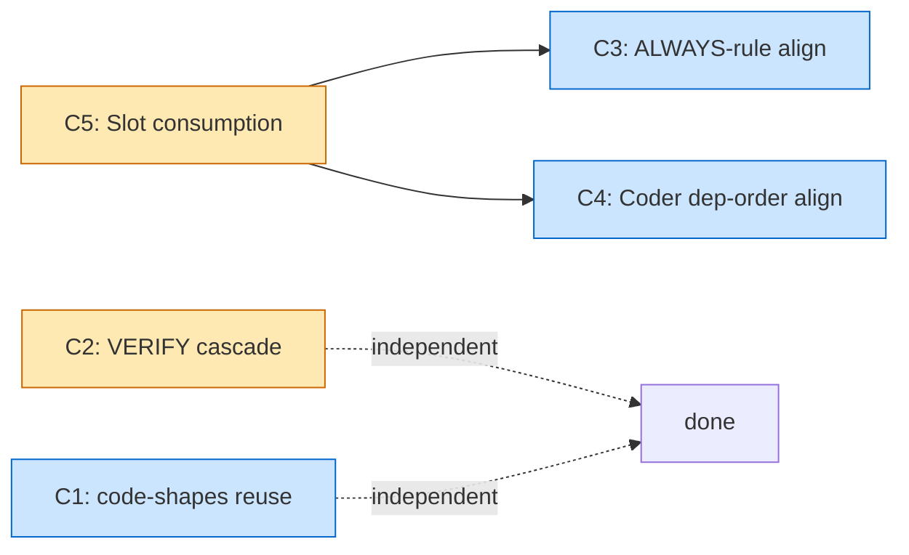

---
meta:
  type: "design-spec"
  feature: "coder-code-review-generic"
  status: "approved"
  audit_date: "2026-04-27"
  approved_at: "2026-04-27"
  scope: "Workflow Phase 3 (Coder) + Phase 3.5 (Spec Check) + Phase 4 (Code Review)"
  parent_spec: ".claude/prompts/plan-stage-generic-spec.md"
  parent_release: "v1.16.0 (commit 42f452c — Plan-stage P1-P5 refactor)"
  complexity: "XL"
  task_type: "refactoring"
  produced_by: "/designer (Phase 0.7) — research spec, input to /planner"
  consumed_by: "/planner (Phase 1)"
  research_method: "4 parallel Explore agents + direct file reads + Sequential Thinking synthesis"
  pipeline_continuation: "STOP after spec — human review, then user manually invokes /planner OR /workflow --from-phase 1"
  approved_decisions:
    Q1_code_shapes: "reuse — coder-rules/examples.md and code-review-rules/examples.md reference ../../planner-rules/code-shapes/<LANGUAGE>.md (no duplication, INVARIANTS contract is stable interface, R1 mitigated)"
    Q2_verify_dependency_file_warn: "conservative WARN with INSTALL_VERB-aware hint, no auto-execution and no language auto-detection"
    Q3_skip_severity: "NIT (consolidated, mirrors plan-stage P3 architecture-checks.md L22-33 canonical SKIP)"
    Q4_pipeline_continuation: "STOP after spec, human review (mirrors plan-stage 1.16.0 two-stage process: spec then implementation in separate session)"
    Q5_filename: "coder-code-review-generic-analysis.md (preserved — analytical research suffix, follows planner-plan-reviewer-analysis.md pattern)"
    Q6_worktree_sparse_paths: "doc-only update at code-reviewer.md L329 — settings.json defaults preserved (R2 mitigated, zero risk for kit users)"
    Q7_out_of_scope_candidates: "deferred follow-up to 1.17.0 release — tdd-go genericfication + auto-fmt-go.sh renaming remain out of scope per §11"
---

# Coder & Code-Review Genericity — Research & Refactor Spec

> **Задача.** Закрыть отложенный долг 1.16.0: привести Phase 3 (`/coder`) и Phase 4 (`code-reviewer`) к проектно-агностичному состоянию по той же методологии, по которой уже выполнен Plan-stage refactor (5 проблем P1-P5).
>
> **Статус.** Draft / 2026-04-27 / XL audit. Output `/designer`. Вход для `/planner` после approval.
>
> **Происхождение.** Прошлый рефакторинг 1.16.0 (`plan-stage-generic-spec.md`) явно вынес Coder-фазу за scope §3.2: *"Coder is consumer, not Plan stage. Touched only at handoff boundary."* Коммит-сообщение `42f452c` подтверждает: *"out-of-scope code-reviewer.md (Phase 4, spec section 3.2) retains old wording intentionally."* Текущий аудит закрывает этот долг.
>
> **Как читать.** §1-3 — scope/контракты. §4-5 — методология и результаты исследования. §6 — граф взаимодействия. §7 — сквозные находки. §8 — пять проблем (C1-C5) с file:line доказательствами. §9-10 — порядок и риски. §11-12 — out-of-scope и open questions. §13 — handoff в /planner.

---

## Оглавление

1. [Цель](#1-цель)
2. [Контекст — текущее состояние](#2-контекст--текущее-состояние)
3. [Scope и неприкасаемые контракты](#3-scope-и-неприкасаемые-контракты)
4. [Методология](#4-методология)
5. [Inventory артефактов](#5-inventory-артефактов)
6. [Граф взаимодействия артефактов](#6-граф-взаимодействия-артефактов)
7. [Сквозные находки (F1-F5)](#7-сквозные-находки)
8. [Пять проблем (C1-C5)](#8-пять-проблем)
9. [Implementation order и зависимости](#9-implementation-order)
10. [Risk Assessment](#10-risk-assessment)
11. [Out-of-scope considered](#11-out-of-scope)
12. [Approval Gate](#12-approval-gate)
13. [Handoff to /planner](#13-handoff)

---

## 1. Цель

Установить, что Coder-stage (Phase 3) и Code-Review-stage (Phase 4) на практике **не являются project-agnostic**, и предложить целевой, контракт-безопасный refactor.

**Ограничение задачи: ровно 5 проблем.** Каждая проблема:
- подкреплена доказательством на уровне `file:line` (не предположение),
- имеет фальсифицируемые acceptance criteria,
- безопасна по отношению к фазовым контрактам (`handoff.schema.json`, `VERDICT_JSON`, `code_review_verdict`, `*-handoff.json`, checkpoint YAML).

Этот спек — вход для `/planner`, который разобьёт фиксы на Parts.

---

## 2. Контекст — текущее состояние

### 2.1 Что уже сделано (релиз v1.16.0)

[plan-stage-generic-spec.md](.claude/prompts/plan-stage-generic-spec.md) → коммит [`42f452c`](42f452c) сделал **Plan-stage** (Phase 1 Planner + Phase 2 Plan-Reviewer) project-agnostic пятью фиксами:

| ID  | Фикс                                                                                                                | Файлы                                                                  |
| --- | ------------------------------------------------------------------------------------------------------------------- | ---------------------------------------------------------------------- |
| P1  | Per-language `code-shapes/{go,python,typescript,rust,java,_default,INVARIANTS}.md`                                  | `.claude/skills/planner-rules/code-shapes/`                            |
| P2  | Слоты `DEPENDENCY_FILE` + `INSTALL_VERB` в PROJECT-KNOWLEDGE.md                                                     | `PROJECT-KNOWLEDGE.md.example`, `task-analysis.md`                     |
| P3  | `plan-reviewer.md` "ALWAYS verify the import matrix" → `LAYER_RULE`-driven SKIP-with-NIT                            | `agents/plan-reviewer.md`, `plan-review-rules/SKILL.md`                |
| P4  | `required-sections.md` "data → business → api" fallback → SKIP per `LAYERS`                                         | `plan-review-rules/required-sections.md`                               |
| P5  | Слот `ARCHITECTURE_STYLE` (5-value enum: layered/flat/event_driven/hexagonal/other), gate-предикат для P3, P4       | `PROJECT-KNOWLEDGE.md.example`, `architecture-checks.md`, `planner.md` |

PK schema bumped 1.0.0 → 1.1.0 (additive minor); существующие PK keep working (constraint C5).

### 2.2 Что осталось

Прошлый спек §3.2 явно отложил:

> *"`/coder` internals (VERIFY phase, EVALUATE) — Coder is **consumer**, not Plan stage. Touched only at handoff boundary."*  
> *"Code-reviewer agent — Phase 4, post-implementation."*

И отметил R6 в §10:
> *"Hidden coupling: a hook or script grep-matches `"go.mod"` or `"handler → service → repository"` and silently breaks."*

В коммит-сообщении `42f452c`:
> *"out-of-scope `code-reviewer.md` (Phase 4, spec section 3.2) retains old wording intentionally."*

**Это исследование закрывает отложенное.** Симметричные P1-P5 проблемы существуют в Coder/Code-Review surface — подтверждено прямым чтением (см. §5, §8).

### 2.3 Релизы 1.16.x — что вошло, что не вошло

| Релиз  | Изменения                                                                                                                                                       | Затрагивает Coder/Review? |
| ------ | --------------------------------------------------------------------------------------------------------------------------------------------------------------- | ------------------------- |
| 1.16.0 | Plan-stage refactor P1-P5 + PK schema 1.1.0 + 3 новых слота + per-language `code-shapes/` + `.mcp.json` tracking + `settings.local.json` tracking + opus default | НЕТ (Coder намеренно вне scope) |
| 1.16.1 | Doc sync — CLAUDE.md приведён к PK schema 1.1.0                                                                                                                 | НЕТ (только doc)          |
| 1.16.2 | Fix tarball exclusion grep в release.yml                                                                                                                        | НЕТ (release tooling)     |

---

## 3. Scope и неприкасаемые контракты

### 3.1 In scope

| #   | Класс артефакта                  | Конкретные файлы                                                                                                                  |
| --- | -------------------------------- | --------------------------------------------------------------------------------------------------------------------------------- |
| 1   | Coder command                    | [.claude/commands/coder.md](.claude/commands/coder.md)                                                                            |
| 2   | Coder skill                      | [.claude/skills/coder-rules/{SKILL.md,examples.md,checklist.md,troubleshooting.md,review-response.md,spec-check.md,mcp-tools.md}](.claude/skills/coder-rules/) |
| 3   | Code-Reviewer agent              | [.claude/agents/code-reviewer.md](.claude/agents/code-reviewer.md)                                                                |
| 4   | Code-Review skill                | [.claude/skills/code-review-rules/{SKILL.md,checklist.md,examples.md,security-checklist.md,troubleshooting.md}](.claude/skills/code-review-rules/) |
| 5   | Plan-template секции, читаемые /coder | [.claude/templates/plan-template.md](.claude/templates/plan-template.md) (только Tests + Parts + Config sections)            |
| 6   | Verdict envelope (consumer-side) | `code_review_verdict` в [.claude/schemas/handoff.schema.json](.claude/schemas/handoff.schema.json) — read-only, не модифицируется |
| 7   | PK consumer wiring               | `inject-review-context.sh code-reviewer` PK injection path                                                                        |

### 3.2 Out of scope (deferred, см. §11)

| Item                                                                                                                                                                                              | Причина                                                                                                                                                                                                                                                                                                  |
| ------------------------------------------------------------------------------------------------------------------------------------------------------------------------------------------------- | -------------------------------------------------------------------------------------------------------------------------------------------------------------------------------------------------------------------------------------------------------------------------------------------------------- |
| `/planner` internals + `plan-reviewer` agent                                                                                                                                                      | Уже исправлены в 1.16.0                                                                                                                                                                                                                                                                                  |
| `/designer` internal flow                                                                                                                                                                         | Phase 0.7 producer; не консьюмер слотов                                                                                                                                                                                                                                                                  |
| `code-researcher` (haiku tool agent)                                                                                                                                                              | Tool-assist, не pipeline-фаза                                                                                                                                                                                                                                                                            |
| `auto-fmt-go.sh`, PreToolUse `import-matrix-prompt-hook`                                                                                                                                          | Hooks fire selectively по matcher `**/*.go` или `internal/**/*.go` — не fire-ят на не-Go проектах (graceful no-op). См. R5 §10.                                                                                                                                                                          |
| `settings.json` defaults `worktree.sparsePaths`                                                                                                                                                   | User-configurable; в C5 правится только описание агента, defaults не трогаются                                                                                                                                                                                                                           |
| `tdd-go` skill (имя содержит `go`)                                                                                                                                                                | Грузится только при `## TDD` в плане; ортогональный мини-стэк, выходит за scope этого audita. Кит явно поддерживает Go-TDD; не-Go проекты получат gating через ARCHITECTURE_STYLE+LANGUAGE в follow-up. |
| Кит-собственный `.claude/PROJECT-KNOWLEDGE.md` (Go-значения)                                                                                                                                       | Кит сам — Go-проект; категориально неверно считать его "не-generic" в собственном dogfood. См. F5.                                                                                                                                                                                                       |
| `handoff.schema.json` поля и enum-ы                                                                                                                                                               | Constraint C1 — не модифицируются                                                                                                                                                                                                                                                                        |

### 3.3 Non-negotiable constraints (наследуются из plan-stage-generic-spec §3.3)

| ID  | Контракт                                                                                                                                                                                                                                                                |
| --- | ----------------------------------------------------------------------------------------------------------------------------------------------------------------------------------------------------------------------------------------------------------------------- |
| C1  | `handoff.schema.json` — поля, enum-ы, дискриминаторы `$handoff_contract` / `$verdict_contract` остаются неизменными.                                                                                                                                                    |
| C2  | Verdict envelope (`VERDICT_JSON`, sentinel `VERDICT_JSON:`, JSON fence, issue ID pattern `^CR-[0-9a-f]{8}$`, severity enum `BLOCKER\|MAJOR\|MINOR\|NIT`) не изменяется.                                                                                                  |
| C3  | Checkpoint YAML format (12 core fields из `checkpoint-protocol.md`) не изменяется.                                                                                                                                                                                       |
| C4  | Пути файлов: `.claude/prompts/{feature}.md`, `.claude/prompts/{feature}-spec.md`, `.claude/prompts/{feature}-evaluate.md`, `.claude/workflow-state/{feature}-checkpoint.yaml`, `.claude/workflow-state/{feature}-handoff.json`, `*-diff-manifest.json` — без изменений. |
| C5  | Существующие PROJECT-KNOWLEDGE.md (включая Go-filled) продолжают работать без edits — backwards-compat. Каскад `PK > CLAUDE.md > SKIP` сохраняется.                                                                                                                       |
| C6  | PK injection contract `inject-review-context.sh` (4 KB cap, telemetry record `pk_missing_at_inject`, лог `.claude/workflow-state/handoff-validation.jsonl`) сохраняется.                                                                                                |

**Дополнительно для Code-Review (выявлено при чтении [Agent 4 contract spec](.)):**

| ID  | Контракт                                                                                                                                                              |
| --- | --------------------------------------------------------------------------------------------------------------------------------------------------------------------- |
| C7  | Verdict enum для `code_review_verdict`: 5 значений (`APPROVED\|APPROVED_WITH_COMMENTS\|CHANGES_REQUESTED\|NEEDS_CHANGES\|REJECTED`) не сужается и не расширяется.    |
| C8  | IMP-03 normalization формула `CR-<sha256(category|location|problem)[0:8]>` сохраняется. Severity mapping для конкретного check (BLOCKER → NIT при SKIP) — допустима, но enum значений не меняется. |
| C9  | IMP-04 diff-manifest (`parts_validated[]`, `{feature}-diff-manifest.json`, поля `part_id|name|status|reason`) сохраняется без изменений.                              |

---

## 4. Методология

Четыре параллельных read-only Explore-агента + прямые чтения + Sequential Thinking синтез:

| Агент    | Coverage                                                                              | Output                                                  |
| -------- | ------------------------------------------------------------------------------------- | ------------------------------------------------------- |
| A1       | `/coder` + `coder-rules/` (8 файлов)                                                  | Per-file genericity score + Go-anchors с цитатами       |
| A2       | `code-reviewer` agent + `code-review-rules/` (5 файлов)                               | Hardcoded vs. configurable + SKIP-rule consistency      |
| A3       | Cross-search 5 наборов literal patterns (Go, architecture, slots, hooks, plan-template) | Полный список `file:line` matches per category         |
| A4       | Shared infra: handoff.schema.json, hook scripts, PK schema, IMP-01–04 protocols        | Контрактная спецификация для preservation-checks       |

**Cross-validation:** каждое утверждение в §8 подкреплено verbatim-цитатой с `file:line`. Спекуляции явно помечены как таковые. Прямые чтения coder.md / code-reviewer.md / coder-rules SKILL.md / code-review-rules SKILL.md / planner-rules code-shapes/INVARIANTS.md выполнены для верификации key-anchors.

**Внешние источники:** не требуются — генеричность closed-system. Web/Claude docs релевантны только для новых MCP-mechanism — этот спек таковых не предлагает.

---

## 5. Inventory артефактов

### 5.1 Coder-stage relevance matrix

| Артефакт                               | Phase 3-роль                                  | Loaded automatically? | Anchors найдены?                                                |
| -------------------------------------- | --------------------------------------------- | --------------------- | --------------------------------------------------------------- |
| [`commands/coder.md`](.claude/commands/coder.md) | Командный entry-point                  | Yes (`/coder` invocation) | **Yes** — VERIFY fallback Go (C2), RULE_2/RULE_3 hardcoded (C3, C5), CONFIG defaults (C5) |
| [`skills/coder-rules/SKILL.md`](.claude/skills/coder-rules/SKILL.md) | 5 CRITICAL rules + Evaluate Protocol | Yes (coder startup) | **Yes** — RULE_2 ALWAYS BLOCKER L101 (C3), `data access → … → wiring` L53 (C4), gofmt/go test/go vet hardcoded L54-61 (C2) |
| [`skills/coder-rules/examples.md`](.claude/skills/coder-rules/examples.md) | Code-completeness reference         | On-demand (referenced from SKILL.md L89) | **Yes** — header "UNIVERSAL PATTERNS (apply to any Go project)" (C1) |
| [`skills/coder-rules/troubleshooting.md`](.claude/skills/coder-rules/troubleshooting.md) | Common issues                  | On-demand           | Minor — `go test` examples (C5)                                 |
| [`skills/coder-rules/review-response.md`](.claude/skills/coder-rules/review-response.md) | CHANGES_REQUESTED protocol    | iter ≥ 2 only       | Минор — handoff Go example (C5)                                |
| [`skills/coder-rules/spec-check.md`](.claude/skills/coder-rules/spec-check.md) | Spec compliance Phase 3.5            | Yes (always loaded) | Generic — OK                                                    |
| [`skills/coder-rules/checklist.md`](.claude/skills/coder-rules/checklist.md) | Self-verification                      | On-demand           | Generic — OK (delegates to PK)                                 |
| [`skills/coder-rules/mcp-tools.md`](.claude/skills/coder-rules/mcp-tools.md) | MCP guidance                           | Yes                 | None — fully generic                                            |

### 5.2 Code-Review-stage relevance matrix

| Артефакт                                                      | Phase 4-роль                                     | Loaded automatically? | Anchors найдены?                                                                                           |
| ------------------------------------------------------------- | ------------------------------------------------ | --------------------- | ---------------------------------------------------------------------------------------------------------- |
| [`agents/code-reviewer.md`](.claude/agents/code-reviewer.md)   | Агент-консьюмер                                  | Yes (Phase 4 delegation) | **Yes** — RULE_4 ALWAYS L36 (C3), `handler → service → repository → models` L117 (C3), encoding/json L119 (C5), fmt.Errorf L124 (C5), `*_gen.go|*/mocks/*.go` L142-143 (C5), worktree paths L329 (C5), make lint/test L67-68 (C2) |
| [`skills/code-review-rules/SKILL.md`](.claude/skills/code-review-rules/SKILL.md) | Severity classification + decision matrix | Auto (frontmatter)    | **Yes** — `Import matrix violation → always BLOCKER` L23 (C3), `make lint, make test` L34 (C2), `fmt.Errorf %w` example L67-69 (C5) |
| [`skills/code-review-rules/examples.md`](.claude/skills/code-review-rules/examples.md) | Bad/good code patterns + grep   | On-demand (REVIEW step 3) | **Yes** — Go-only examples (C1)                                                                          |
| [`skills/code-review-rules/security-checklist.md`](.claude/skills/code-review-rules/security-checklist.md) | OWASP checks (M+ complexity)    | On-demand           | Минор — generic OWASP                                                                                       |
| [`skills/code-review-rules/checklist.md`](.claude/skills/code-review-rules/checklist.md) | Reviewer self-verify                       | On-demand           | Минор — references PK "(if available)"                                                                      |
| [`skills/code-review-rules/troubleshooting.md`](.claude/skills/code-review-rules/troubleshooting.md) | Common review issues                  | On-demand           | Минор — `ALWAYS check import matrix, regardless of change size` L55 (C3 sibling)                            |

### 5.3 Shared infra — что генерично уже сейчас (must NOT break)

| Артефакт                                                                            | Уже generic                                                                  | Контракт                              |
| ----------------------------------------------------------------------------------- | ---------------------------------------------------------------------------- | ------------------------------------- |
| [`schemas/handoff.schema.json`](.claude/schemas/handoff.schema.json)                | Все дискриминаторы / поля / enum-ы language-neutral                          | C1                                    |
| `VERDICT_JSON` envelope (IMP-02)                                                    | Sentinel + fence + JSON структура language-neutral                           | C2                                    |
| Issue ID normalization (IMP-03)                                                     | `sha256(category\|location\|problem)[:8]` — language-agnostic                | C8                                    |
| Diff-manifest (IMP-04)                                                              | `part_id`, `status`, `reason` — language-independent                         | C9                                    |
| Checkpoint YAML (12 fields per [`checkpoint-protocol.md`](.claude/skills/workflow-protocols/checkpoint-protocol.md)) | Generic                                            | C3                                    |
| `inject-review-context.sh` PK injection (4 KB cap, `pk_missing_at_inject` telemetry) | Generic — PK injection mechanism language-agnostic                          | C6                                    |
| Severity enum, iteration pattern `^[123]/3$`                                        | Generic                                                                       | C2                                    |
| `delta-review-mode` HINT/FOCUS injection                                             | Generic toggle                                                                | C6                                    |
| `save-review-checkpoint.sh` IMP-03 normalization order (CR-004)                      | Generic                                                                       | C8                                    |

### 5.4 Active hooks during Phase 3 + Phase 4

| Event           | Hook script                                      | Phase  | Matcher                                  | Genericity статус             |
| --------------- | ------------------------------------------------ | ------ | ---------------------------------------- | ----------------------------- |
| PreToolUse      | `protect-files.sh`                               | 3+4    | unconditional                             | Generic                       |
| PreToolUse      | `block-dangerous-commands.sh`                     | 3+4    | unconditional                             | Generic                       |
| PreToolUse      | `check-artifact-size.sh`                         | 3+4    | `if Write(.claude/**)`                    | Generic                       |
| PreToolUse      | `pre-commit-build.sh`                            | 3+4    | `if Bash(git commit*)`                    | Go-specific (`go build ./...`) — out of scope §3.2 |
| PreToolUse      | import-matrix prompt hook                         | 3      | `if Edit/Write(internal/**/*.go)`        | Go-specific BUT matcher gates → graceful no-op on non-Go |
| PostToolUse     | `auto-fmt-go.sh`                                 | 3      | `if **/*.go`                             | Go-specific BUT matcher gates → graceful no-op on non-Go |
| PostToolUse     | `yaml-lint.sh`                                   | 3+4    | `if Edit(.claude/**)`                    | Generic                       |
| PostToolUse     | `check-references.sh`                            | 3+4    | `if Write(.claude/**)`                   | Generic                       |
| PostToolUse     | `check-plan-drift.sh`                            | 3+4    | `if .claude/**`                          | Generic                       |
| SubagentStart   | `inject-review-context.sh code-reviewer`         | 4      | `code-reviewer`                          | Generic — но консьюмер агент не использует injected slots полностью (см. C5) |
| SubagentStart   | `track-task-lifecycle.sh`                        | 3+4    | `code-researcher`                        | Generic                       |
| SubagentStop    | `save-review-checkpoint.sh`                      | 4      | `code-reviewer`                          | Generic                       |
| PostToolUse     | `validate-handoff.sh`                            | 3+4    | `if Write/Edit(.claude/workflow-state/*-handoff.json)` | Generic            |
| Stop            | `check-uncommitted.sh`                           | 3+4+5  | unconditional                             | Generic                       |

**Вывод по hooks:** все Go-named hooks (`auto-fmt-go.sh`, import-matrix prompt) защищены matcher-gating. На не-Go проектах они являются graceful no-op. Hooks **не входят** в scope этого refactor (см. §3.2 + R5 §10).

---

## 6. Граф взаимодействия артефактов

### 6.1 Mermaid-диаграмма (Phase 3 → Phase 4)

```mermaid
flowchart TB
    subgraph PRODUCERS [Phase 3 producers]
        CMD_C[/coder.md/]
        CR_S[coder-rules SKILL.md]
        CR_EX[coder-rules/examples.md]
        CR_CH[coder-rules/checklist.md]
        CR_RR[coder-rules/review-response.md]
        CR_SP[coder-rules/spec-check.md]
        CR_TS[coder-rules/troubleshooting.md]
    end

    subgraph TEMPLATES [Templates &amp; schema]
        TPL[plan-template.md]
        SHAPES[planner-rules/code-shapes/]
        HSCHEMA[schemas/handoff.schema.json]
    end

    subgraph CONFIG [Project config layer]
        PK[PROJECT-KNOWLEDGE.md]
        PKE[PROJECT-KNOWLEDGE.md.example]
        CMD[CLAUDE.md Language Profile]
    end

    subgraph CONSUMERS [Phase 4 consumers]
        REV[/code-reviewer.md/]
        REV_S[code-review-rules SKILL.md]
        REV_EX[code-review-rules/examples.md]
        REV_SC[code-review-rules/security-checklist.md]
        REV_CH[code-review-rules/checklist.md]
        REV_TS[code-review-rules/troubleshooting.md]
    end

    subgraph HOOKS [Hooks active in Phase 3+4]
        IRC[inject-review-context.sh code-reviewer]
        SRC[save-review-checkpoint.sh code-reviewer]
        AUTO[auto-fmt-go.sh — Go-matcher gated]
        IM[import-matrix prompt hook — Go-matcher gated]
        VHO[validate-handoff.sh]
    end

    subgraph ARTIFACTS [Phase 3+4 artifacts]
        EVAL[".claude/prompts/{feature}-evaluate.md"]
        SRC_CODE[Source code commits]
        HANDOFF[".claude/workflow-state/{feature}-handoff.json"]
        VERDICT[review-completions.jsonl + VERDICT_JSON]
    end

    %% Producer flow
    CMD_C -- loads --> CR_S
    CR_S -- on demand --> CR_EX
    CR_S -- on demand --> CR_CH
    CR_S -- on demand --> CR_RR
    CR_S -- always --> CR_SP
    CR_S -- on demand --> CR_TS
    CMD_C -- reads slots --> PK
    PK -. fallback .-> CMD
    CMD_C -- writes --> EVAL
    CMD_C -- emits --> SRC_CODE
    CMD_C -- emits --> HANDOFF

    %% Template & shapes usage (NEW for fix)
    CMD_C -- shapes via --> SHAPES
    REV -- validates against --> SHAPES
    CR_EX -. should reference .-> SHAPES
    REV_EX -. should reference .-> SHAPES

    %% Consumer flow
    REV -- loads --> REV_S
    REV_S -- on demand --> REV_EX
    REV_S -- M+ only --> REV_SC
    REV_S -- on demand --> REV_CH
    REV_S -- on demand --> REV_TS
    REV -- reads --> HANDOFF
    REV -- reads --> SRC_CODE
    REV -- writes --> VERDICT

    %% Hook flow
    HANDOFF -- triggers --> VHO
    REV -- SubagentStart --> IRC
    IRC -- injects --> PK
    REV -- SubagentStop --> SRC
    SRC_CODE -. matcher-gated .-> AUTO
    SRC_CODE -. matcher-gated .-> IM

    %% Schema definition
    PKE -. defines slots .-> PK
    HSCHEMA -. validates .-> HANDOFF
    HSCHEMA -. validates .-> VERDICT

    %% Hot spots — primary genericity drift
    classDef hot fill:#ffcccc,stroke:#cc0000,stroke-width:2px;
    classDef warm fill:#ffe9b3,stroke:#cc6600,stroke-width:2px;
    class CMD_C,CR_S,REV hot
    class CR_EX,REV_EX,REV_S warm
```



**Чтение графа:**
- **Красные узлы** (`CMD_C`, `CR_S`, `REV`): первичные источники P-проблем (RULE_2, RULE_4, ALWAYS-rules).
- **Жёлтые узлы** (`CR_EX`, `REV_EX`, `REV_S`): жёсткие Go-anchors в examples + skill SKILL.md.
- **Пунктир `-. should reference .->`**: целевая стрелка для C1 — оба examples-файла должны указывать на `planner-rules/code-shapes/` (reuse, no drift).
- **Slot-resolution path** (`PK ← .example`, `PK → coder/reviewer`) корректно спроектирован; gap — в *использовании* слотов, не в механизме.

### 6.2 Data-flow таблица: что → откуда → куда (Phase 3 → 4)

| Данные                                | Источник                          | Формат                                                                  | Транспорт                      | Потребитель                                                       |
| ------------------------------------- | --------------------------------- | ----------------------------------------------------------------------- | ------------------------------ | ----------------------------------------------------------------- |
| Plan                                  | planner Phase 5                   | `.claude/prompts/{feature}.md`                                          | файл на диске                  | /coder Phase 1                                                    |
| Plan-review verdict                   | plan-reviewer                     | `VERDICT_JSON` (плюс `VERDICT:` regex fallback)                         | review-completions.jsonl       | /coder Phase 0.5/1                                                |
| Spec (L/XL only)                      | /designer                         | `.claude/prompts/{feature}-spec.md`                                     | файл                           | /coder Phase 1.5 EVALUATE                                         |
| Evaluate output                       | /coder Phase 1.5                  | `.claude/prompts/{feature}-evaluate.md`                                 | файл                           | /code-review Phase 4 (через handoff)                              |
| Code commits                          | /coder Phase 2-3                  | git commits                                                             | git branch                     | /code-review Phase 4 (через worktree isolation)                    |
| Coder handoff                         | /coder Phase 5                    | YAML в checkpoint + narrative                                           | `*-handoff.json` + checkpoint  | /code-review (через `inject-review-context.sh`)                   |
| Spec-check result                     | /coder Phase 3.5                  | YAML `spec_check: {status, coverage_pct, deviations_confirmed, ...}`    | внутри coder handoff           | /code-review Phase 4 (TRUST mechanism)                             |
| VERIFY status                         | /coder Phase 3                    | YAML `verify_status: {lint, test, command_used}`                        | внутри coder handoff           | /code-review Phase 4 QUICK CHECK (TRUST mechanism)                 |
| PK injection                          | inject-review-context.sh          | additionalContext + 4 KB cap                                            | SubagentStart hook payload     | code-reviewer agent context                                        |
| Code-review verdict                   | code-reviewer                     | `VERDICT_JSON` + `VERDICT:` regex fallback + structured issues          | stdout transcript              | orchestrator + review-completions.jsonl                            |
| Diff manifest (iter 2+ only)          | orchestrator pre-delegation       | `{feature}-diff-manifest.json`                                          | файл + injected refs            | code-reviewer (focus block)                                        |
| Iteration counter                     | orchestrator                      | `checkpoint.iteration.code_review = "N/3"`                              | YAML                            | next-iter inject-context                                           |

### 6.3 Hook sequence: Phase 3 → Phase 4

```text
Phase 3 (/coder)
  │
  ├─ InstructionsLoaded  → validate-instructions.sh
  ├─ UserPromptSubmit    → enrich-context.sh
  │
  ├─ EVALUATE phase
  │   └─ optional Task → code-researcher (haiku)
  │
  ├─ IMPLEMENT (per Part)
  │   ├─ PreToolUse  → protect-files.sh + block-dangerous + check-artifact-size [if .claude/**]
  │   ├─ PreToolUse  → import-matrix prompt hook [if internal/**/*.go]   ← Go-matcher gate
  │   ├─ PostToolUse → auto-fmt-go.sh [if **/*.go]                       ← Go-matcher gate
  │   ├─ PostToolUse → yaml-lint.sh [if Edit(.claude/**)]
  │   └─ PostToolUse → check-plan-drift.sh
  │
  ├─ VERIFY phase
  │   ├─ PreToolUse → pre-commit-build.sh [if Bash(git commit*)]   ← Go-specific build cmd
  │   └─ Bash → resolved VERIFY_CMD (PK > Makefile > Go-fallback)  ← C2 hot spot
  │
  ├─ SPEC CHECK (Phase 3.5)
  │
  ├─ DOCUMENT — write coder handoff to checkpoint + git commit
  │
Phase 4 (code-review delegation)
  │
  ├─ SubagentStart → track-task-lifecycle.sh                        (agent-id registry)
  ├─ SubagentStart → inject-review-context.sh code-reviewer
  │                   ├─ читает checkpoint.yaml + handoff
  │                   ├─ инжектит PK (4 KB cap, `pk_missing_at_inject` telemetry)
  │                   ├─ инжектит prior issues + canonical IDs (IMP-03)
  │                   ├─ инжектит REGRESSION ALERT при regression_ids ≠ ∅
  │                   ├─ инжектит pipeline-history (≥3 sessions)
  │                   └─ инжектит delta-focus block (iter ≥2, mode warn|strict)
  │
  │      ─── code-reviewer agent executes (worktree isolation) ───
  │             ├─ QUICK CHECK (trust verify_status или re-run make lint/test)
  │             ├─ GET CHANGES (git diff $BASE...HEAD)
  │             ├─ REVIEW (4a Architecture → 4b Error Handling → 4c Security → 4d Tests → 4e Project-Specific)
  │             └─ VERDICT (decision matrix → VERDICT_JSON + handoff)
  │
  ├─ PostToolUse → validate-handoff.sh [if Write(*-handoff.json)]
  │
  └─ SubagentStop → save-review-checkpoint.sh
                     ├─ extract verdict via VERDICT_JSON или regex fallback
                     ├─ IMP-03 normalize issue IDs ДО schema validation
                     ├─ append marker в review-completions.jsonl
                     ├─ set-diff resolved_ids / regression_ids
                     └─ blocking exit 2 только при двойном fail
```

---

## 7. Сквозные находки

### F1. Слот-механизм налажен; coverage слотов в Coder/Review неполный

PROJECT-KNOWLEDGE.md (schema 1.1.0) корректно параметризует **22 слота** (17 required + 5 optional). Из них Coder/Review **не консьюмят**:

| Слот                 | Объявлен в PK | Консьюмер в Coder/Review                                  | Hardcoded default используется в                      |
| -------------------- | ------------- | --------------------------------------------------------- | ----------------------------------------------------- |
| `ARCHITECTURE_STYLE` | ✓ (1.16.0)    | ✗ Нигде                                                   | Coder/Review предполагают `layered`                   |
| `DEPENDENCY_FILE`    | ✓ (1.16.0)    | ✗ Нигде                                                    | coder.md L419 проверяет `go.mod` напрямую             |
| `INSTALL_VERB`       | ✓ (1.16.0)    | ✗ Нигде                                                    | coder.md fallback ожидает `make` либо `go`            |
| `LAYER_RULE`         | ✓             | Частично — coder.md L496-497 RULE_2 не gate-ит на slot    | code-reviewer.md L36 RULE_4 unconditional             |
| `LAYERS`             | ✓             | Частично                                                   | coder.md L351, coder-rules/SKILL.md L53 fallback      |
| `DOMAIN_PROHIBIT`    | ✓             | Частично — coder.md L501 использует слот, но с Go-default | coder-rules/SKILL.md L13/L87 hardcoded `encoding/json` |
| `ERROR_WRAP`         | ✓             | ✗ Нигде                                                    | code-reviewer.md L124 hardcoded `fmt.Errorf %w`       |
| `GENERATED_PATTERN`  | ✓             | ✗ Нигде                                                    | code-reviewer.md L142 hardcoded `*_gen.go`            |
| `MOCK_PATTERN`       | ✓             | ✗ Нигде                                                    | code-reviewer.md L143 hardcoded `*/mocks/*.go`        |
| `CONFIG_EXAMPLE`     | ✓             | Частично                                                   | coder.md L387 inline "Go default: config.yaml.example" |
| `CONFIG_DOCS`        | ✓             | Частично                                                   | coder.md L388 inline "Go default: README.md"           |
| `VERIFY_CMD`         | ✓             | Частично — coder.md L415 PK FIRST                          | Go-fallback cascade L417-420 после PK miss            |
| `LANGUAGE`/`LANG_EXT`| ✓             | Plan-template (planner)                                    | Coder examples и Review examples Go-only              |

**Вывод:** механизм слотов хороший; пробел в *consumer-side adoption* — точно симметрично F1 из plan-stage-spec.

### F2. SKIP-семантика канонична в `architecture-checks.md`, но контрадиктна в Coder/Review

- `architecture-checks.md` L22-33 — каноническое: *"If a slot is unset … the corresponding check is SKIPPED for this run."* (уже исправлено P3).
- `code-reviewer.md` L36: *"ALWAYS verify the import matrix"* — unconditional. **Симметрично P3, но не исправлено.**
- `code-reviewer.md` L171: *"Import matrix violation → always BLOCKER"* — auto-escalation, unconditional.
- `code-review-rules/SKILL.md` L23: *"Import matrix violation → always BLOCKER"* — то же.
- `coder.md` L496-497 RULE_2: *"NEVER violate the import matrix"* — unconditional.
- `coder-rules/SKILL.md` L101: *"This is ALWAYS a BLOCKER"* — то же.
- `coder.md` L351 + `coder-rules/SKILL.md` L53: fallback `data access → … → wiring` — fallback, не SKIP. **Симметрично P4.**

**Вывод:** контрадикция канонической SKIP-контракту распространена шире в Coder/Review surface (5 файлов, минимум 7 точек), чем была в Plan-stage до P3+P4 (2 файла, 3 точки).

### F3. Examples — это training data, не декорация

- `coder-rules/examples.md` — заголовок дословно: *"UNIVERSAL PATTERNS (apply to any Go project)"* (Agent A1 нашёл; ratifier — header L4). Противоречие самой формулировке "universal".
- `code-review-rules/examples.md` L67-69: пример `fmt.Errorf("context: %w", err)` без not-Go альтернатив.
- `code-review-rules/SKILL.md` L83: grep-pattern `log\.(Error|Warn|Info).*\n.*return` — Go-style logger naming (мелкий, но систематический).

Эти примеры — direct training-data для агентов (`coder` имитирует, `code-reviewer` сверяется). Для не-Go/не-Python проекта обе стороны loop-а опираются на Go-shape → output skewed.

### F4. Hardcoded vocabulary leaks в user-visible output

- `code-reviewer.md` L109: OUTPUT_FORMAT прямо просит вывести `Layers affected: [handler/service/repository/models]`. Для flat/event-driven проекта это либо фиктивные значения, либо `N/A` — в любом случае cognitive friction.
- `coder.md` L425, L461: VERIFY output_format включает `[x] VET (go vet ./...)` — Go-specific tool, виден пользователю в финальном sign-off.
- `coder.md` L387-388: реплика *"(Go default: config.yaml.example)"* и *"(Go default: README.md)"* — confusing для не-Go пользователя.

### F5. Кит как dogfood — всегда Go, fixes не должны менять его поведение

Кит сам — Go-проект (`.claude/PROJECT-KNOWLEDGE.md` Go-filled, CLAUDE.md Language Profile Go). Constraint C5 формулирует это явно: kit dogfood — это regression suite. Каждый AC в §8 содержит kit-byte-equivalent проверку.

---

## 8. Пять проблем

> **Selection rationale.** Ранжирование по: (a) user-visible impact для не-Go проектов, (b) compatibility с C1-C9 контрактами, (c) compounding zone effect (C5 — фундамент; C3, C4 — стоят на нём; C2 — независимый user-visible fix; C1 — pedagogic glue). Кандидаты, не вошедшие в 5, перечислены в §11 с обоснованием.

---

### **Проблема C1 — Coder/Reviewer examples Go-only; нет ссылки на `code-shapes/`**

**Файлы и evidence**

- [`.claude/skills/coder-rules/examples.md:4`](.claude/skills/coder-rules/examples.md#L4) — заголовок *"# UNIVERSAL PATTERNS (apply to any Go project)"* (verbatim из Agent A1 inventory). Дословно противоречит "universal" — единственный язык в файле — Go.
- [`.claude/skills/coder-rules/SKILL.md:89`](.claude/skills/coder-rules/SKILL.md#L89) — *"For more examples, see [Examples](examples.md)"* — direct loading vector в Phase 3.
- [`.claude/skills/code-review-rules/SKILL.md:67-69`](.claude/skills/code-review-rules/SKILL.md#L67) — пример *"return fmt.Errorf(\"context: %w\", err)"*. Go-only.
- [`.claude/skills/code-review-rules/SKILL.md:43`](.claude/skills/code-review-rules/SKILL.md#L43) — *"Check each area using grep search patterns from [Examples](examples.md)"* — load trigger в REVIEW step 3.
- [`.claude/skills/planner-rules/code-shapes/`](.claude/skills/planner-rules/code-shapes/) — уже существует (1.16.0): `go.md, python.md, typescript.md, rust.md, java.md, _default.md, INVARIANTS.md`. **Готовый pattern для reuse.**

**Impact (concrete, not speculative)**

`/coder` Phase 2 (IMPLEMENT) и `code-reviewer` Phase 4b (Error Handling) грузят свои examples-файлы по триггеру SKILL.md. Для не-Go проекта обе стороны loop-а опираются на Go-shape (или fallback на prior probability — недетерминированно). Для не-Python тоже (Python только в planner-rules/code-shapes/, не в coder-rules/examples.md).

**Severity:** MEDIUM (chronic quality drag, не hard break)

**Root cause**

`coder-rules/examples.md` и `code-review-rules/examples.md` разрослись с Go-dogfood. Plan-stage P1 (1.16.0) extract-нул examples в `planner-rules/code-shapes/` с INVARIANTS-контрактом, но Coder/Review skill-паки этого не получили. Параллельная поддержка двух code-shapes/ деревьев — exactly the drift risk R1 из prior spec; reuse — лучшее решение.

**Proposed fix**

Reference, не duplicate.

1. **`coder-rules/examples.md`** заменяется на selector + link:
   ```yaml
   code_completeness:
     principle: "<language-agnostic prose: full body, error context per ERROR_WRAP, no truncated `…`>"
     reference_shapes:
       resolved_from: "PROJECT-KNOWLEDGE.md → LANGUAGE"
       location: "../../planner-rules/code-shapes/<LANGUAGE>.md"
       fallback: "../../planner-rules/code-shapes/_default.md"
       invariants: "../../planner-rules/code-shapes/INVARIANTS.md"
   ```
   Существующий Go-блок остаётся как `## Kit Dogfood Reference (Go)` с пометкой "kit-internal example — not loaded for non-Go projects".

2. **`code-review-rules/examples.md`** аналогично, плюс `## Grep Patterns` (language-agnostic regex) сохраняется.

3. **`code-review-rules/SKILL.md` L67-69** — заменить inline `fmt.Errorf` пример блоком *"Error wrapping uses ERROR_WRAP slot per PROJECT-KNOWLEDGE.md (see ../planner-rules/code-shapes/<LANGUAGE>.md for canonical shape; SKIP if slot unset)"*.

4. **`coder-rules/SKILL.md` L13, L87** — wording см. C5 (DOMAIN_PROHIBIT уже частично слотовый).

**Justification (no false positives)**

- *Почему это actual genericity fix, а не cosmetic?* Потому что `coder-rules/SKILL.md` L89 эксплицитно ссылается на `examples.md` для guidance. Imitation drives output. Output виден пользователю. Go-only imitation → Go-shaped code для не-Go проекта.
- *Почему reuse, а не extract?* (a) INVARIANTS уже определены в planner-rules; (b) сценарии (`Service.Get` returning a domain item) идентичны для plan и implement стадий; (c) дублирование = drift surface (см. R1).
- *Что НЕ обещается:* fix не гарантирует, что coder напишет idiomatic Rust только потому, что rust.md существует — это canonical shape, не tutorial. Польза bounded: closing imitation gap для declared 5 supported languages.

**Acceptance criteria (falsifiable)**

- **AC-C1.1** — `grep -E '<!-- EXAMPLE \(lang:' .claude/skills/coder-rules/examples.md .claude/skills/code-review-rules/examples.md` возвращает 0 строк (нет inline lang-named examples; allowed only inside the Kit Dogfood section explicitly labeled).
- **AC-C1.2** — `coder-rules/examples.md` содержит блок `reference_shapes:` со ссылкой на `../../planner-rules/code-shapes/<LANGUAGE>.md` и `_default.md`. То же для `code-review-rules/examples.md`.
- **AC-C1.3** — Грэп `grep -nE '"UNIVERSAL PATTERNS \(apply to any Go project\)"' .claude/skills/coder-rules/examples.md` возвращает 0 строк (либо переписан как kit-dogfood section с явной меткой "Go-only kit reference").
- **AC-C1.4** — Все 5 supported languages (`go, python, typescript, rust, java`) в `planner-rules/code-shapes/` иллюстрируют те же 4 invariants per `INVARIANTS.md` (full body, ERROR_WRAP, explicit return types, no truncation). Verified per-shape grep checklist в PR description.
- **AC-C1.5** — Кит-dogfood regression: `/coder` на фиксированной Go-задаче (например, fixture `feature/test-fixture-go`) выдаёт байт-эквивалент-ный output (modulo header) до и после fix. Verified via `git diff main..branch -- .claude/prompts/test-fixture-go.md` empty.
- **AC-C1.6** — `handoff.schema.json` (C1), VERDICT_JSON envelope (C2), checkpoint format (C3), file paths (C4) не модифицируются. Verified `git diff main -- .claude/schemas .claude/skills/workflow-protocols/checkpoint-protocol.md` empty.

**Контракты сохранены:** structure plan-template/handoff/verdict не меняется. Слоты не добавляются (consumer-side fix).

---

### **Проблема C2 — VERIFY/QUICK CHECK fallback Go-only после PK miss**

**Файлы и evidence**

- [`.claude/commands/coder.md:415-422`](.claude/commands/coder.md#L415-L422) — `verify_startup` cascade:
   ```yaml
   step_0: "Resolve VERIFY command before running"
   checks:
     - if: ".claude/PROJECT-KNOWLEDGE.md exists AND defines custom VERIFY/FMT/LINT/TEST"
       then: "Use custom commands from .claude/PROJECT-KNOWLEDGE.md"
     - if: "Makefile exists with fmt/lint/test targets"
       then: "Use make-based: go vet ./... && make fmt && make lint && make test"
     - if: "go.mod exists but no Makefile"
       then: "Use Go-native: go fmt ./... && go vet ./... && go test ./..."
     - else: "WARN: No VERIFY command available. Skip VERIFY, note in handoff."
   ```
   PK first (хорошо), но fallback chain Go-fixed: `Makefile` → `go.mod` → SKIP. Нет проверки `package.json`, `pyproject.toml`, `Cargo.toml`, `pom.xml`, `Gemfile` и т.д. — для не-Go без custom PK сразу `WARN, skip`.

- [`.claude/commands/coder.md:425`](.claude/commands/coder.md#L425) — *"command: \"VET (go vet ./... — catches printf format errors, lock copying, suspicious constructs)\""* — VET hardcoded как separate step.
- [`.claude/commands/coder.md:461`](.claude/commands/coder.md#L461) — `[x] VET (go vet ./...)` в final output_format — visible пользователю.
- [`.claude/skills/code-review-rules/SKILL.md:34`](.claude/skills/code-review-rules/SKILL.md#L34) — *"Otherwise: run `make lint` and `make test`"* — Go/make hardcoded в QUICK CHECK fallback.
- [`.claude/agents/code-reviewer.md:67-68`](.claude/agents/code-reviewer.md#L67-L68) — *"Run: `make lint`"* / *"Run: `make test`"* — то же.
- [`.claude/skills/coder-rules/SKILL.md:61`](.claude/skills/coder-rules/SKILL.md#L61) — *"Run full VERIFY: `go vet ./... && make fmt && make lint && make test`"* — verbatim Go-команда без fallback.

**Impact (concrete)**

Не-Go проект, без custom `VERIFY_CMD/FMT_CMD/LINT_CMD/TEST_CMD` в PK, без Makefile:
- `/coder` верcия: caсcade падает на step 4 → `WARN: No VERIFY command available`. Verify пропущен; pipeline продолжает с `verify_status: SKIPPED`.
- `code-reviewer` (если verify_status missing): попытка `make lint`/`make test` → fail (no Makefile target) → `STOP, return to author`. **Hard block для не-Go.**

Plan-stage P2 добавил DEPENDENCY_FILE/INSTALL_VERB как раз для этого паттерна. Coder его не консьюмит.

**Severity:** HIGH (user-visible failure mode → блокирует не-Go проект на code-review без custom PK)

**Root cause**

Cascade был спроектирован "PK > Makefile > Go-native > SKIP" во времена, когда LANGUAGE и DEPENDENCY_FILE слотов не было. Сейчас их nado использовать.

**Proposed fix**

Сменить cascade на slot-driven:

```yaml
verify_startup:
  step_0: "Resolve VERIFY command via slot cascade"
  cascade:
    - source: "PROJECT-KNOWLEDGE.md → VERIFY_CMD (composite of FMT/LINT/TEST/BUILD)"
      use_when: "PK file exists AND VERIFY_CMD is set (not <your-…> placeholder)"
    - source: "PROJECT-KNOWLEDGE.md individual slots → compose: ${FMT_CMD} && ${LINT_CMD} && ${TEST_CMD}"
      use_when: "PK file exists AND individual slots set"
    - source: "CLAUDE.md Language Profile → VERIFY value"
      use_when: "PK missing or slots unset, CLAUDE.md has VERIFY entry (legacy fallback for kit)"
    - source: "DEPENDENCY_FILE-driven detection (deferred fallback hint, not execution)"
      use_when: "no PK, no CLAUDE.md VERIFY"
      action: "WARN with INSTALL_VERB-aware hint: 'No VERIFY command resolved. Install or configure: see {DEPENDENCY_FILE} ({INSTALL_VERB} ...)' — do NOT execute"
    - source: "SKIP — emit consolidated NIT in handoff, set verify_status: SKIPPED"
```

**Изменения в файлах:**
- `coder.md` L417-420 — заменить Makefile/Go-native ветки на CLAUDE.md fallback + DEPENDENCY_FILE-aware WARN. Никаких `go vet ./... && make fmt && make lint && make test` после PK miss.
- `coder.md` L425, L461 — VET phase сворачивается в `VERIFY_CMD` (если PROJECT-KNOWLEDGE.md содержит `go vet` как часть `VERIFY_CMD`, оно само выполнится). Output_format заменяется на нейтральное `[x] VERIFY ({command})`.
- `coder-rules/SKILL.md` L61 — заменить literal на `Run full VERIFY: ${VERIFY_CMD resolved at startup}`.
- `code-review-rules/SKILL.md` L34 — *"Otherwise: run `${LINT_CMD}` and `${TEST_CMD}` resolved from PROJECT-KNOWLEDGE.md (or CLAUDE.md fallback)"*.
- `code-reviewer.md` L67-68 — то же.

**Justification (no false positives)**

- *Concrete impact:* user with Python project running `/coder` без custom PK currently sees `WARN: No VERIFY command available, skip VERIFY` at step 4 of cascade — provably misleading because Python *has* tools (`pytest`, `ruff`); they're just not detected. Code-reviewer then attempts `make lint` → fails. **Demonstrable failure mode.**
- *Why slot-driven, не detection?* Detection (probe для `pyproject.toml` vs `package.json`) brittle в monorepos и duplicates plan-stage P2 work. Slot-driven использует уже существующие DEPENDENCY_FILE/INSTALL_VERB.
- *Что НЕ обещается:* fix не гарантирует, что coder magically знает каждый язык. Он гарантирует, что (a) кит-dogfood поведение неизменно (CLAUDE.md fallback resolves to Go), (b) не-Go user без PK получает actionable hint вместо silent SKIP/hard fail.
- *Why CLAUDE.md fallback retained?* C5 backwards-compat: existing kit users (без custom PK) ожидают, что `/coder` "просто работает" с дефолтами. CLAUDE.md Language Profile уже содержит `VERIFY=`go vet ./... && make fmt && make lint && make test``. Сохранение fallback — zero-disruption.

**Acceptance criteria**

- **AC-C2.1** — `grep -nE 'go fmt|go vet|go test|make (fmt|lint|test)' .claude/commands/coder.md` returns no lines OUTSIDE: (a) PK example sections, (b) CLAUDE.md fallback path documentation, (c) handoff narrative example. Verified via PR diff review.
- **AC-C2.2** — `coder.md` `verify_startup` cascade имеет 5 шагов в порядке: PK→VERIFY_CMD, PK→individual slots, CLAUDE.md fallback, DEPENDENCY_FILE-aware WARN, SKIP-with-NIT.
- **AC-C2.3** — `coder.md` L425 VET phase либо удалён, либо параметризован (`{STATIC_ANALYSIS_CMD}` или включён в `VERIFY_CMD` opaquely); `coder.md` L461 output_format не упоминает `go vet ./...` literal.
- **AC-C2.4** — `code-review-rules/SKILL.md` L34 + `code-reviewer.md` L67-68 references `${LINT_CMD}` / `${TEST_CMD}` from PK with CLAUDE.md fallback.
- **AC-C2.5** — `coder-rules/SKILL.md` L61 references resolved VERIFY_CMD, не literal `go vet ./... && make fmt && make lint && make test`.
- **AC-C2.6** — Кит-dogfood regression: `/coder` VERIFY на kit (Go) выдаёт identical command (`go vet ./... && make fmt && make lint && make test`) и identical output. Verified via `git diff main..branch -- .claude/workflow-state/<feature>-handoff.json` showing same `verify_status.command_used`.
- **AC-C2.7** — Backwards compat: на kit с CLAUDE.md Language Profile populated AND `.claude/PROJECT-KNOWLEDGE.md` отсутствует, VERIFY всё равно резолвится в кит-default.
- **AC-C2.8** — Hard test on non-Go fixture: создать temp dir с `pyproject.toml`, no Makefile, no PROJECT-KNOWLEDGE.md → `/coder` WARN-сообщение содержит `pyproject.toml` И `pip` (или соответствующий INSTALL_VERB), а не `go.mod`.
- **AC-C2.9** — `handoff.schema.json` unchanged (C1). `verify_status` field structure preserved (C2).
- **AC-C2.10** — Pre-commit-build hook (`.claude/scripts/pre-commit-build.sh`) trigger by `if Bash(git commit*)` остаётся Go-specific (out of scope per §3.2 R5); не-Go проекты обходят его — это допустимо.

**Контракты сохранены:** handoff schema unchanged. `verify_status` объект — с теми же полями. Severity classification неизменна.

---

### **Проблема C3 — `code-reviewer.md` "ALWAYS verify the import matrix" + RULE_2/RULE_4 contradicts canonical SKIP**

**Файлы и evidence**

- [`.claude/agents/code-reviewer.md:36`](.claude/agents/code-reviewer.md#L36) — `RULE_4 Check Architecture: ALWAYS verify the import matrix`. **Дословный mirror plan-reviewer.md L34 P3 wording — этот фикс уже сделан там, не сделан здесь.**
- [`.claude/agents/code-reviewer.md:117`](.claude/agents/code-reviewer.md#L117) — *"Import matrix compliance (handler → service → repository → models)"* в Phase 4a Architecture review.
- [`.claude/agents/code-reviewer.md:171`](.claude/agents/code-reviewer.md#L171) — *"Import matrix violation → always BLOCKER"* в Auto-escalation.
- [`.claude/skills/code-review-rules/SKILL.md:23`](.claude/skills/code-review-rules/SKILL.md#L23) — *"Import matrix violation → always BLOCKER"* (то же).
- [`.claude/skills/code-review-rules/SKILL.md:44`](.claude/skills/code-review-rules/SKILL.md#L44) — *"Architecture: import matrix compliance"* в REVIEW step 3.
- [`.claude/skills/code-review-rules/troubleshooting.md`](.claude/skills/code-review-rules/troubleshooting.md) (per Agent A2 ~L55) — *"ALWAYS check import matrix, regardless of change size"*.
- [`.claude/commands/coder.md:496-497`](.claude/commands/coder.md#L496-L497) — RULE_2: *"NEVER violate the import matrix."* — unconditional на /coder side.
- [`.claude/skills/coder-rules/SKILL.md:101`](.claude/skills/coder-rules/SKILL.md#L101) — *"Review import matrix (handler → service → repository → models). Refactor imports. This is ALWAYS a BLOCKER."* (the "ALWAYS a BLOCKER" wording).
- [`.claude/skills/plan-review-rules/architecture-checks.md`](.claude/skills/plan-review-rules/architecture-checks.md) L22-33 — каноническое SKIP-правило (после P3+P5 в plan-review-rules). Code-Review его игнорирует.

**Impact (concrete, not speculative)**

Не-layered проект (event-driven handlers, hexagonal core+adapters, flat single-module) — корректно указавший `LAYER_RULE: <your-layer-rule>` или `ARCHITECTURE_STYLE: flat`:
- `code-reviewer` Phase 4a выполняет `import matrix compliance (handler → service → repository → models)` unconditional → не находит handlers/services → либо false-positive `BLOCKER` (выявляет несуществующее нарушение), либо silent pass (не находя нарушения, потому что слоёв нет → "соответствует").
- Auto-escalation L171 + SKILL.md L23: import-matrix violation → BLOCKER. Если reviewer find anything looking like a layer-cross (это легко в hexagonal: `core` импортирует `adapters` namespace) — false BLOCKER блокирует merge.
- `coder` RULE_2 L496-497 — IMPLEMENT phase agent примерно так же: предполагает существование import matrix и фейлит при имплементации flat-проекта.

Дополнительно: agent-level "ALWAYS" rules влияют на reasoning (как явно отмечено в prior spec для plan-reviewer). STARTUP-rules сильнее, чем on-demand SKILL content. Это та же ловушка, которую закрыл P3.

**Severity:** HIGH (по тем же причинам, что и plan-stage P3 — touches every code review для не-layered проектов + documented-vs-actual divergence)

**Root cause**

`code-reviewer.md` и `coder.md` написаны до того, как `architecture-checks.md` был extract-нут в skill (видимо параллельно с plan-reviewer.md). При P3 в 1.16.0 plan-reviewer wording был исправлен; code-reviewer + coder остались as-is — это явный технический долг, отмеченный в commit message `42f452c` ("retains old wording intentionally").

**Proposed fix**

Зеркалит P3 plan-stage. Surgical edits:

1. **`code-reviewer.md` L36**: заменить *"RULE_4 Check Architecture: ALWAYS verify the import matrix"* на:
   ```
   RULE_4 Check Architecture: Verify layer-dependency rule per LAYER_RULE slot — SKIP with consolidated NIT if LAYER_RULE unset OR ARCHITECTURE_STYLE != layered (canonical SKIP, see plan-review-rules/architecture-checks.md L22-33).
   ```

2. **`code-reviewer.md` L117** (REVIEW Phase 4a): заменить *"Import matrix compliance (handler → service → repository → models)"* на:
   ```
   Layer-dependency compliance per PROJECT-KNOWLEDGE.md → LAYER_RULE — example shapes are language/architecture-dependent (see ../planner-rules/code-shapes/ appendix; SKIP if slot unset or ARCHITECTURE_STYLE != layered)
   ```

3. **`code-reviewer.md` L171** (Auto-escalation): *"Layer-dependency violation (when LAYER_RULE is SET AND ARCHITECTURE_STYLE = layered) → always BLOCKER. SKIP entries are consolidated NITs, not BLOCKERs."*

4. **`code-review-rules/SKILL.md` L23** (Auto-Escalation): то же wording, что в L171.

5. **`code-review-rules/SKILL.md` L44** (REVIEW step 3): *"Architecture: layer-dependency compliance per LAYER_RULE slot (SKIP if unset/non-layered)"*.

6. **`code-review-rules/troubleshooting.md`** (примерно L55): убрать *"ALWAYS check import matrix"* — заменить на *"Check layer-dependency compliance per LAYER_RULE if set"*.

7. **`coder.md` L496-497** RULE_2: *"Layer-dependency compliance: NEVER violate the resolved LAYER_RULE. SKIP if slot unset OR ARCHITECTURE_STYLE != layered."*

8. **`coder-rules/SKILL.md` L12** (RULE_2): то же wording.

9. **`coder-rules/SKILL.md` L101** (Common Issues "Import matrix violation detected"): заменить *"Refactor imports. This is ALWAYS a BLOCKER."* на *"Refactor imports per resolved LAYER_RULE. BLOCKER when slot is set; SKIP-with-NIT when unset/non-layered (canonical SKIP)."*

**Justification**

- *Why "ALWAYS" actually problematic when architecture-checks.md handles SKIP?* Same mechanism как в plan-reviewer P3: agent STRICT rules > on-demand skill content. Rule precedence в agent prompts favors STARTUP rules. Empirical anchor: rules block в L32-41 — 5-rule list, internalized as STRICT.
- *Empirical evidence for actual divergence:* `architecture-checks.md` после P3+P5 SKIP-rule properly defined (L22-33). Code-reviewer/Coder продолжают говорить "ALWAYS" — documented divergence.
- *Why code-reviewer.md L36 — самый critical?* Это RULE-level statement в STARTUP CRITICAL section (загружается при каждом review). vs L117 (REVIEW process — runtime guidance) и L171 (auto-escalation — output stage). Все три должны align.
- *No false positive:* fix не утверждает, что reviewer currently fails for non-layered проектов (architecture-checks.md SKIP может rescue в большинстве случаев). Утверждает: documented contract contradictory; данные SKIP semantics canonical, agent contract должен align.
- *Why include `coder.md` RULE_2?* P3 в plan-stage не трогал coder side. Здесь — закрываем по-настоящему: и author (coder), и reviewer следуют one canonical SKIP.

**Acceptance criteria**

- **AC-C3.1** — `grep -nE 'ALWAYS verify the import matrix|ALWAYS check (the )?import matrix' .claude/agents/code-reviewer.md .claude/skills/code-review-rules/ .claude/commands/coder.md .claude/skills/coder-rules/` returns 0 lines.
- **AC-C3.2** — `grep -nE 'handler → service → repository → models|handler -> service -> repository -> models' .claude/agents/code-reviewer.md .claude/commands/coder.md .claude/skills/coder-rules/ .claude/skills/code-review-rules/` returns 0 lines (canonical example moved to parameterized appendix or removed).
- **AC-C3.3** — `grep -nE 'always BLOCKER|ALWAYS a BLOCKER' .claude/agents/code-reviewer.md .claude/skills/code-review-rules/SKILL.md .claude/skills/coder-rules/SKILL.md` returns 0 lines on import-matrix context (must be replaced with conditional).
- **AC-C3.4** — Updated `code-reviewer.md` L36 + L117 + L171 explicitly references LAYER_RULE slot AND ARCHITECTURE_STYLE predicate AND SKIP semantics.
- **AC-C3.5** — Updated `coder.md` L496-497 + `coder-rules/SKILL.md` L12 + L101 explicitly references LAYER_RULE slot + SKIP semantics.
- **AC-C3.6** — On non-layered fixture (PK with `ARCHITECTURE_STYLE: flat` OR LAYER_RULE unset), code-reviewer's VERDICT_JSON contains exactly ONE consolidated NIT mentioning skipped layer-dependency check (matching architecture-checks.md L22-33 pattern).
- **AC-C3.7** — Кит-dogfood regression (LAYER_RULE populated, ARCHITECTURE_STYLE=layered): code-reviewer на фиксированном branch state выдаёт байт-equivalent verdict до и после fix. Verified via replay через известный plan через reviewer на main и на branch.
- **AC-C3.8** — Verdict envelope unchanged: `$verdict_contract: code_review_verdict` (C1), VERDICT_JSON sentinel (C2), issue ID pattern `^CR-[0-9a-f]{8}$` (C2/C8), severity enum `BLOCKER|MAJOR|MINOR|NIT` (C2). Severity *mapping* (BLOCKER → NIT при SKIP) допустимо — enum значения не меняются.
- **AC-C3.9** — IMP-04 `parts_validated[]` mechanism unchanged (C9). Diff-manifest format unchanged.
- **AC-C3.10** — `inject-review-context.sh` PK injection unchanged; reviewer reads injected `LAYER_RULE`/`ARCHITECTURE_STYLE` from additionalContext.

**Контракты сохранены:** verdict envelope unchanged. ID normalization unchanged. SubagentStart hook injection unchanged. Severity *enum* same; severity *assignment* per check is now slot-conditional (allowed change behavior, fixed contract).

---

### **Проблема C4 — Coder dependency-order fallback `data access → … → wiring` contradicts SKIP**

**Файлы и evidence**

- [`.claude/commands/coder.md:351`](.claude/commands/coder.md#L351) — *"order: \"Follow dependency direction: lower layers first (data access → domain → API → tests → wiring)\""* в IMPLEMENT phase.
- [`.claude/skills/coder-rules/SKILL.md:53`](.claude/skills/coder-rules/SKILL.md#L53) — *"Follow lower-layers-first: data access → models → domain → API → tests → wiring."* (slightly more detailed variant).
- [`.claude/commands/coder.md:352`](.claude/commands/coder.md#L352) — *"note: \"SEE: .claude/PROJECT-KNOWLEDGE.md for project-specific layer order (if available)\""* — partial slot reference, но fallback нерасширяет SKIP-семантику.
- [`.claude/skills/plan-review-rules/required-sections.md`](.claude/skills/plan-review-rules/required-sections.md) — после P4+P5 правит `data → business → api` fallback на SKIP. Coder остаётся с тем же anti-pattern.

**Impact (concrete)**

Flat-проект (CLI tool, single-binary daemon, event-driven worker), где LAYERS unset OR ARCHITECTURE_STYLE != layered, использует /coder для имплементации plan. Coder Phase 2 (IMPLEMENT) reads инструкцию L351 и следует "data access → domain → API → tests → wiring" — independent от plan-determined order. Если plan разделён по другим критериям (по событиям, по компонентам, по фичам), coder либо реализует Parts в другом порядке, чем планировалось (нарушая plan invariants), либо игнорирует инструкцию (silent override → unobservable inconsistency).

Это quieter version C3: same root cause — silent imposition of layered ordering — выраженный в IMPLEMENT phase (coder), не в REVIEW phase (reviewer).

**Severity:** MEDIUM (smaller blast radius, чем C3, потому что L351 — implementation guidance, не gate; но same architectural error)

**Root cause**

Wording был добавлен defensively, на assumption что layered architecture = универсальный default. Plan-stage P4 закрыл это в required-sections.md. Coder остался.

**Proposed fix**

Заменить fallback на plan-determined order + SKIP-with-NIT:

**`coder.md` L351**:
```yaml
order: |
  Follow Parts order from plan. The plan's Parts list is the source of truth for ordering.
  If plan does not specify order:
    - if LAYERS slot set AND ARCHITECTURE_STYLE = layered → use lower-layers-first
      (resolve LAYERS list from PROJECT-KNOWLEDGE.md);
    - else → follow plan's natural Part order, emit consolidated NIT in handoff if order
      cannot be determined (canonical SKIP, see plan-review-rules/architecture-checks.md L22-33).
```

**`coder-rules/SKILL.md` L53** — то же wording.

**`coder.md` L352** — оставляется, но приводится в соответствие: *"Resolved from PROJECT-KNOWLEDGE.md → LAYERS + ARCHITECTURE_STYLE; SKIP if unset/non-layered."*

**Justification**

- *Why fallback is problematic?* Silently imposes opinion on projects that haven't expressed one. SKIP rule's value is in *explicitly emitting a NIT* — silent fallback hides the assumption.
- *Backwards compat?* Кит-dogfood has LAYERS set + ARCHITECTURE_STYLE=layered (or default). Fallback never fires for kit. Removing it is no-op для kit и фикс для не-layered проектов.
- *Could a flat project benefit from data → … → api?* Rare cases — yes, но plan уже определил order в Phase 4 DESIGN после ARCHITECTURE_STYLE-aware analysis. Re-imposing generic order на coder time = contradiction, not help.
- *No false positive:* fix не утверждает, что coder сейчас blow-up на flat-проектах. Утверждает: documented order is project-agnostic (per declared support), но fallback contradicts.

**Acceptance criteria**

- **AC-C4.1** — `grep -nE 'data access → (models →)? domain → API|data access -> (models ->)? domain -> API' .claude/commands/coder.md .claude/skills/coder-rules/SKILL.md` returns 0 lines.
- **AC-C4.2** — `coder.md` L351 wording matches: *"Follow Parts order from plan. Fallback only if plan unordered: LAYERS+ARCHITECTURE_STYLE-driven OR SKIP-with-NIT."*
- **AC-C4.3** — `coder-rules/SKILL.md` L53 wording: same.
- **AC-C4.4** — На flat-fixture (ARCHITECTURE_STYLE=flat or LAYER unset), coder следует plan-определённому order; emits consolidated NIT в handoff.evaluate_output, если order ambiguous.
- **AC-C4.5** — Кит-dogfood regression: на Go-plan с LAYERS=[handler,service,repository,models] coder follows same Part order, что и до фикса. Verified via сравнение completed Parts list pre/post fix.
- **AC-C4.6** — Handoff schema unchanged. PK schema unchanged. Plan structure unchanged.

**Контракты сохранены:** verdict envelope unchanged. handoff schema unchanged. Plan-template structure unchanged.

---

### **Проблема C5 — Coder/Reviewer hardcode Go-defaults вместо консьюмить существующих PK слотов**

**Файлы и evidence (consolidated по слотам)**

#### DOMAIN_PROHIBIT consumer (already-declared slot, partially used):

- [`.claude/commands/coder.md:501`](.claude/commands/coder.md#L501) RULE_3: *"NEVER add DOMAIN_PROHIBIT to domain entities (Go default: encoding/json tags)."* — слот используется, но Go-default inline → confusing для не-Go.
- [`.claude/skills/coder-rules/SKILL.md:13`](.claude/skills/coder-rules/SKILL.md#L13) RULE_3: *"NEVER add encoding/json tags to domain entities (tags belong in DTOs)."* — слот **полностью игнорирован**.
- [`.claude/skills/coder-rules/SKILL.md:87`](.claude/skills/coder-rules/SKILL.md#L87) — *"RULE_3 — Domain entities must be pure. No encoding/json tags."* — то же.
- [`.claude/agents/code-reviewer.md:119`](.claude/agents/code-reviewer.md#L119) — *"Domain purity (no encoding/json tags in domain entities)"* — slot не используется.

#### ERROR_WRAP consumer (declared slot, NOT used):

- [`.claude/agents/code-reviewer.md:124`](.claude/agents/code-reviewer.md#L124) — *"All errors wrapped with `fmt.Errorf(\"context: %w\", err)`"* — Go syntax, no slot.
- [`.claude/skills/code-review-rules/SKILL.md:67-69`](.claude/skills/code-review-rules/SKILL.md#L67) — пример `return fmt.Errorf("context: %w", err)` — Go syntax, no slot.

#### GENERATED_PATTERN / MOCK_PATTERN consumer (declared slots, NOT used):

- [`.claude/agents/code-reviewer.md:142`](.claude/agents/code-reviewer.md#L142) — *"Generated files (*_gen.go) not manually edited"*.
- [`.claude/agents/code-reviewer.md:143`](.claude/agents/code-reviewer.md#L143) — *"Mocks (*/mocks/*.go) regenerated if interfaces changed"*.

#### CONFIG_EXAMPLE / CONFIG_DOCS consumer (declared slots, partially used):

- [`.claude/commands/coder.md:387`](.claude/commands/coder.md#L387) — *"Update CONFIG_EXAMPLE (Go default: config.yaml.example)"* — slot used, но Go-default in user-visible parens.
- [`.claude/commands/coder.md:388`](.claude/commands/coder.md#L388) — *"Update CONFIG_DOCS (Go default: README.md)"*.

#### Worktree sparsePaths default (SOURCE_GLOB+DEPENDENCY_FILE potential consumers):

- [`.claude/agents/code-reviewer.md:329`](.claude/agents/code-reviewer.md#L329) — *"Default: `.claude/`, `internal/`, `cmd/`, `go.mod`, `go.sum`, `Makefile`, `CLAUDE.md`"* — Go-specific worktree paths.

**Impact**

Каждый из этих гэпов — самостоятельный paper-cut для не-Go пользователя. Кумулятивно — большая genericity drift surface:
- Не-Go проект с populated PK (e.g. `DOMAIN_PROHIBIT: serde derives` для Rust) — coder/reviewer всё равно проверят на `encoding/json`, потому что слот игнорируется. **Slot is dead code.**
- Code-reviewer не понимает, что `*.pyc` или `target/` — generated, потому что hardcoded `*_gen.go`.
- Worktree default: для Java-проекта `internal/` not exist; sparse-checkout с `internal/` отдаёт пустую директорию. Reviewer теряет видимость.

**Severity:** HIGH (systemic — multiple slots, multiple files; user-visible cumulatively; "dead slots" — schema лжёт о возможностях).

**Root cause**

Слоты добавлялись инкрементально (большая часть в pre-1.16.0; ARCHITECTURE_STYLE/DEPENDENCY_FILE/INSTALL_VERB в 1.16.0). Plan-stage обновился; Coder/Review consumer surface не обновился.

**Proposed fix (consumer-side, no schema change)**

Replace each hardcoded literal with `{SLOT_NAME}` placeholder + canonical SKIP-with-NIT cascade.

1. **DOMAIN_PROHIBIT harmonization:**
   - `coder.md` L501: *"NEVER add `${DOMAIN_PROHIBIT}` to domain entities (resolved from PROJECT-KNOWLEDGE.md → DOMAIN_PROHIBIT slot, fallback to CLAUDE.md). SKIP rule with consolidated NIT if slot unset."*
   - `coder-rules/SKILL.md` L13: same wording.
   - `coder-rules/SKILL.md` L87: *"RULE_3 — Domain entities must be pure. No `${DOMAIN_PROHIBIT}`. Tags belong in DTOs at the handler/API layer."*
   - `code-reviewer.md` L119: *"Domain purity (no `${DOMAIN_PROHIBIT}` in domain entities — SKIP if slot unset)"*.

2. **ERROR_WRAP wiring:**
   - `code-reviewer.md` L124: *"All errors propagate context per `${ERROR_WRAP}` slot (resolved from PROJECT-KNOWLEDGE.md → ERROR_WRAP, fallback to CLAUDE.md). SKIP this check if slot unset."*
   - `code-review-rules/SKILL.md` L67-69 example: replaced with `Bad/Good` snippets sourced from `../planner-rules/code-shapes/<LANGUAGE>.md` selector (см. C1).

3. **GENERATED_PATTERN / MOCK_PATTERN wiring:**
   - `code-reviewer.md` L142: *"Generated files (per `${GENERATED_PATTERN}` slot) not manually edited. SKIP if slot unset."*
   - `code-reviewer.md` L143: *"Mocks (per `${MOCK_PATTERN}` slot) regenerated if interfaces changed. SKIP if slot unset."*

4. **CONFIG_EXAMPLE / CONFIG_DOCS wiring:**
   - `coder.md` L387: *"Update `${CONFIG_EXAMPLE}` slot value (resolved from PROJECT-KNOWLEDGE.md). SKIP if slot unset."* — убрать "Go default: config.yaml.example".
   - `coder.md` L388: same for CONFIG_DOCS.

5. **Worktree sparsePaths documentation:**
   - `code-reviewer.md` L329: *"Default worktree paths follow PROJECT-KNOWLEDGE.md → SOURCE_GLOB and DEPENDENCY_FILE; override via settings.json `worktree.sparsePaths`. CLAUDE.md Language Profile fallback for kit defaults: `.claude/`, `internal/`, `cmd/`, `go.mod`, `go.sum`, `Makefile`, `CLAUDE.md`."* — kit defaults remain documented as legacy fallback; **settings.json itself unchanged** (R2).

6. **VET phase (no slot today)** — covered by C2 (часть VERIFY composition; не отдельный fix).

**Justification**

- *Why systemic фикс?* Каждый сайт по отдельности — minor; вместе — provable что schema declares X но consumer hardcodes Y. С точки зрения user (не-Go проект): "I configured DOMAIN_PROHIBIT to `serde derives` but reviewer still flags `encoding/json` mentions". Demonstrable via fixture.
- *Why slot placeholder, не detection?* Detection (probe filesystem for `*.go` vs `*.py` vs `*.rs`) duplicates plan-stage P2 + DEPENDENCY_FILE. Slot — established pattern.
- *Why CLAUDE.md fallback retained?* C5 backwards-compat — kit's CLAUDE.md uses Go defaults, существующие kit-users не сломаются.
- *Why worktree paths documentation only, not settings.json defaults?* (a) settings.json — user-configurable (R2 risk avoidance); (b) Doc-only change — zero behavior delta для kit; (c) follow-up может extend resolved-from-PK дефолты как additive feature.
- *No false positive:* fix не утверждает, что после него coder/reviewer "magically" поймёт каждый язык. Гарантирует: слоты, объявленные в schema, **используются** консьюмерами; backwards-compat preserved через CLAUDE.md fallback; SKIP semantics consistent с canonical (architecture-checks.md L22-33).

**Acceptance criteria**

#### Per-slot grep-based:

- **AC-C5.1** — `grep -F 'encoding/json tags' .claude/commands/coder.md .claude/agents/code-reviewer.md .claude/skills/coder-rules/` returns 0 lines (replaced with `${DOMAIN_PROHIBIT}` placeholder).
- **AC-C5.2** — `coder.md` L501, `coder-rules/SKILL.md` L13 + L87 reference `${DOMAIN_PROHIBIT}` from PK slot. SKIP-with-NIT semantics referenced.
- **AC-C5.3** — `code-reviewer.md` L124 references `${ERROR_WRAP}` from PK slot. SKIP-with-NIT referenced.
- **AC-C5.4** — `grep -F 'fmt.Errorf("context: %w"' .claude/agents/code-reviewer.md .claude/skills/code-review-rules/SKILL.md` returns 0 lines outside language-shape file references (allowed only in `../planner-rules/code-shapes/go.md`).
- **AC-C5.5** — `code-reviewer.md` L142 references `${GENERATED_PATTERN}`, L143 references `${MOCK_PATTERN}`. SKIP-with-NIT referenced.
- **AC-C5.6** — `grep -F '*_gen.go|*/mocks/*.go' .claude/agents/code-reviewer.md` returns 0 lines (allowed only inside `../planner-rules/code-shapes/go.md` example).
- **AC-C5.7** — `coder.md` L387-388 reference `${CONFIG_EXAMPLE}` and `${CONFIG_DOCS}` slots. *"Go default"* parenthetical removed.
- **AC-C5.8** — `code-reviewer.md` L329 documentation references SOURCE_GLOB/DEPENDENCY_FILE slot resolution (with kit-default Go fallback explicitly labelled as such).

#### Cross-cutting:

- **AC-C5.9** — Каждый замененный hardcoded literal в Coder/Review surface использует `${SLOT_NAME}` placeholder (curly-brace OR `${...}` syntax — выбирается /planner consistent).
- **AC-C5.10** — При отсутствии PROJECT-KNOWLEDGE.md и populated CLAUDE.md Language Profile, все fixed slots resolve через CLAUDE.md fallback (canonical cascade per CLAUDE.md PK schema doc).
- **AC-C5.11** — При отсутствии PK И отсутствии CLAUDE.md slot, consumer SKIPs related check + emits ONE consolidated NIT (canonical SKIP, mirrors architecture-checks.md L22-33).
- **AC-C5.12** — Кит-dogfood regression: coder + code-reviewer на kit (Go) выдают байт-эквивалент-ные decisions (modulo any new SKIP-NIT для пропущенных слотов, но kit'у все слоты заполнены).
- **AC-C5.13** — Settings.json `worktree.sparsePaths` defaults НЕ изменены (R2); только agent doc updated.
- **AC-C5.14** — `handoff.schema.json` (C1), VERDICT_JSON envelope (C2), checkpoint format (C3), file paths (C4) unchanged.
- **AC-C5.15** — PK schema unchanged (C5) — это purely consumer-side fix.
- **AC-C5.16** — `pk_missing_at_inject` telemetry (C6) сохраняется. inject-review-context.sh не модифицируется.

**Контракты сохранены:** schema unchanged (C1, C7, C8, C9). Verdict envelope unchanged (C2). Checkpoint unchanged (C3). Paths unchanged (C4). Backwards-compat через CLAUDE.md fallback (C5). PK injection contract unchanged (C6).

---

## 9. Implementation order



**Recommended order:**

1. **C2** — VERIFY cascade. **First — самый user-visible failure mode (HIGH severity).** Independent от C3/C4/C5; смысл в том, что non-Go users без custom PK получают actionable behavior.
2. **C1** — examples → code-shapes. Smallest blast radius. 2 files edited (coder-rules/examples.md, code-review-rules/examples.md) + minor SKILL.md updates. Reuses planner-rules/code-shapes/, no new files.
3. **C5** — slot consumption (systemic). Many surgical edits (~20 lines across ~6 files). Establishes slot-resolver pattern for C3+C4.
4. **C3** — ALWAYS-rule SKIP align. Builds on C5 slot-resolver.
5. **C4** — Coder dependency-order SKIP align. Mirror of C3 в IMPLEMENT phase. Builds on C5.

**Effort sketch (для /planner — refine при detailed Parts):**

| Problem | Files touched | Edits | Effort |
| ------- | ------------- | ----- | ------ |
| C1      | 4 files (2 examples, 2 SKILL.md updates)              | ~20 lines | Medium (content + cross-refs)         |
| C2      | 4 files (coder.md, coder-rules/SKILL.md, code-review-rules/SKILL.md, code-reviewer.md) | ~30 lines | Medium (cascade rewrite)             |
| C3      | 5 files (code-reviewer.md, code-review-rules/SKILL.md, troubleshooting.md, coder.md, coder-rules/SKILL.md) | ~12 lines | Small (line-level edits)             |
| C4      | 2 files (coder.md, coder-rules/SKILL.md)              | ~8 lines | Tiny                                  |
| C5      | 4 files + worktree doc                                | ~15 lines | Small-Medium                          |

`/planner` определит точный complexity (likely XL: 5 problems × Parts pattern из plan-stage refactor).

---

## 10. Risk Assessment

| #  | Risk                                                                                                                                                                | Severity | Mitigation                                                                                                                                                                                              |
| -- | ------------------------------------------------------------------------------------------------------------------------------------------------------------------- | -------- | ------------------------------------------------------------------------------------------------------------------------------------------------------------------------------------------------------- |
| R1 | Reuse `planner-rules/code-shapes/` couples Coder/Reviewer skills to Planner skill internals; future split painful                                                  | LOW      | Loose coupling via relative path import; INVARIANTS contract is the stable interface. Split rationale documented; future extraction is mechanical (`cp -r`).                                              |
| R2 | settings.json `worktree.sparsePaths` defaults remain Go-specific; non-Go users still need manual override                                                           | LOW      | C5 fix is doc-only at L329; settings.json defaults explicitly out of scope per §3.2. Kit users keep working defaults.                                                                                    |
| R3 | C3 edit to `code-reviewer.md` L36 RULE_4 STARTUP wording shifts agent reasoning unexpectedly                                                                        | MEDIUM   | AC-C3.7 byte-equivalent regression on kit fixed branch state catches behavioral drift. If detected → revert agent edit, stage skill-side fix only. Mirror plan-stage P3 R3.                                |
| R4 | Hidden grep coupling on removed literals (`encoding/json tags`, `fmt.Errorf %w`, `*_gen.go`, `*/mocks/*.go`, `data → … → wiring`, `handler → service → repository → models`, `ALWAYS verify the import matrix`) — hooks/scripts could silently break | MEDIUM   | `/planner` Phase 3 RESEARCH MUST grep entire `.claude/` tree для каждого из 7 literal patterns before removal. AC-C1.1, AC-C2.1, AC-C3.1, AC-C3.2, AC-C5.1, AC-C5.4, AC-C5.6, AC-C5.7 — exact-grep predicates. |
| R5 | Hooks `auto-fmt-go.sh` + `import-matrix-prompt-hook` остаются Go-named; не-Go users получают graceful no-op, но naming confusing                                    | LOW      | Out of scope per §3.2. Matchers gate firing → no-op. Renaming hooks или generic-fication — separate follow-up. Document in CLAUDE.md (already noted).                                                    |
| R6 | Кит-собственный `.claude/PROJECT-KNOWLEDGE.md` отсутствует (1.16.1 release tag side-finding) → strict mode FATAL-block                                              | LOW      | CLAUDE.md fallback resolves все required slots для kit defaults. Каждый AC включает kit-byte-equivalent regression check на fallback-path. Не вводит нового failure mode.                                |
| R7 | All 5 fixes together exceed `/coder` complexity budget for single XL run                                                                                            | LOW      | §9 порядок (C2 → C1 → C5 → C3 → C4) допускает split into smaller commits (1.17.0 release scope). C2+C1 alone — separate L workflow run if needed.                                                       |
| R8 | Replaced placeholders `${SLOT_NAME}` versus `{SLOT_NAME}` syntax inconsistency between Coder/Review and Plan-stage already-shipped placeholders                     | LOW-MEDIUM | `/planner` chooses one syntax (consistent с plan-stage); audit pass through all touched files; AC-C5.9 enforces consistency.                                                                            |
| R9 | Severity mapping change для import matrix violation (BLOCKER → NIT при SKIP) ломает downstream metric/анализ ожидающий BLOCKER                                       | LOW      | Severity *enum* unchanged (C2/C8). Severity *assignment* per-check is slot-conditional — semantically correct: пропущенная проверка не должна issue BLOCKER. Pipeline metrics aggregate by enum value, не by check identity. |
| R10 | Plan-template (`plan-template.md`) Go-shape Parts examples (L102-124 per prior spec mention) не fixed by C1-C5 — coder reads plan with Go-shaped `code_examples`     | LOW      | Comments/HTML, не rendered. Same root cause as P1 — covered by code-shapes pattern. Prior spec §11 explicitly defers; remains deferred. Optional follow-up.                                              |

---

## 11. Out-of-scope considered

Эти кандидаты найдены, но **не** включены в 5. Перечислены, чтобы избежать scope drift:

| Кандидат                                                                                                                | Причина исключения                                                                                                                                                                                                |
| ----------------------------------------------------------------------------------------------------------------------- | ----------------------------------------------------------------------------------------------------------------------------------------------------------------------------------------------------------------- |
| `tdd-go` skill (Go-named): `.claude/skills/tdd-go/`                                                                     | Loaded conditionally on `## TDD` plan section. Has own Go shape; ortogonal mini-stack. Может быть generic-ified в follow-up через `tdd-rules` + `code-shapes/<LANGUAGE>` reference. Не в hot path для большинства tasks. |
| Hooks Go-naming (`auto-fmt-go.sh`, `import-matrix-prompt-hook`)                                                         | Matchers gate firing → graceful no-op на не-Go. R5. Renaming/extracting — отдельный follow-up.                                                                                                                       |
| Pre-commit-build hook (`go build ./...`)                                                                                | Triggers только на `git commit*`. Go-only build. Out of scope per §3.2; renaming hook + slot for BUILD_CMD — отдельный follow-up.                                                                                  |
| Settings.json `worktree.sparsePaths` Go defaults                                                                        | User-configurable; R2; C5 only updates documentation, not defaults.                                                                                                                                                |
| Plan-template (`plan-template.md`) Go-shape Parts examples (L102-124)                                                   | HTML comments, не rendered. Same root cause as P1 — already covered by code-shapes pattern. R10. Defer.                                                                                                            |
| coder-rules/troubleshooting.md `go test -v -count=1` example (~L7)                                                      | Single line example в troubleshooting context. Low impact. Captured by C2 wording но не отдельный AC.                                                                                                              |
| coder-rules/troubleshooting.md `*_gen.go, mocks/*.go` references                                                        | Captured by C5 if /planner extends scope, иначе troubleshooting context уместен.                                                                                                                                   |
| `code-review-rules/SKILL.md:83` grep pattern `log\.(Error|Warn|Info).*\n.*return`                                       | Logger-naming Go-style (Zap/Logrus convention), но не критическое. Multi-language regex может быть added в follow-up.                                                                                              |
| coder.md L501 RULE_3 `(Go default: encoding/json tags)` parenthetical                                                   | Captured by C5 (CONFIG_EXAMPLE/DOMAIN_PROHIBIT cleanup wave).                                                                                                                                                       |
| spec-check.md genericity audit                                                                                          | Skill — uses generic phrasing already (per Agent A1 inventory). Out of scope.                                                                                                                                       |

---

## 12. Approval Gate

This spec proposes:

- **Five problems (C1-C5)** в Coder + Code-Review stage с file:line доказательствами.
- **Five contract-safe fixes**, scoped так чтобы kit-dogfood (Go) был byte-identical post-change.
- **Implementation ordering** (C2 → C1 → C5 → C3 → C4) уважающий зависимости и минимизирующий blast radius.
- **Nine non-negotiable preservation constraints** (C1-C9) покрывающие handoff schema, verdict envelope, checkpoint format, file paths, backwards compat, PK injection, code-review verdict enum, IMP-03/IMP-04 contracts.

**Open questions for the user:**

1. **Reuse vs. extract `code-shapes/`.** Spec предлагает reuse `planner-rules/code-shapes/` (no duplication). Альтернатива: extract в `coder-rules/code-shapes/` + `code-review-rules/code-shapes/` (parallel maintenance, drift risk R1). Подтвердите reuse, или предпочитаете extract?

2. **VERIFY cascade DEPENDENCY_FILE-aware WARN behavior.** Spec предлагает action: *"WARN with INSTALL_VERB-aware hint, do NOT execute"*. Альтернатива: auto-detect popular dependency files and emit specific INSTALL_VERB suggestion (`npm install`, `pip install`). Текущее предложение conservative (no auto-detection); подтвердите или хотите auto-detection?

3. **Severity mapping change для import-matrix violation при SKIP.** Spec предлагает: BLOCKER (когда LAYER_RULE set) → NIT (consolidated при SKIP). Это behavior change для pipeline metrics consumers, ожидающих BLOCKER на этом check. Подтвердите NIT, или предпочитаете другую severity при SKIP (e.g. MINOR)?

4. **Implementation in this run?** Spec only delivers research + acceptance criteria. /planner→/coder выполнит. Подтвердите: continue XL pipeline through to commit, OR stop after spec for human review (как сделано в plan-stage-generic).

5. **Feature name.** Spec saved as `coder-code-review-generic-analysis.md` для consistency с naming pattern `plan-stage-generic-spec.md`. Подтвердите имя; альтернатива: `coder-stage-generic-spec.md`.

6. **Settings.json `worktree.sparsePaths` defaults — out of scope?** R2 says yes (user-configurable, kit defaults preserved). Подтвердите, или хотите additive PK-driven default extension в C5 (no break for existing users, additional inheritance from SOURCE_GLOB+DEPENDENCY_FILE)?

7. **Out-of-scope candidates (§11) — приоритизировать в follow-up release или закрыть?** Особенно: tdd-go skill (генерификация в `tdd-rules` + `code-shapes/<LANGUAGE>` reference) и hook renaming (auto-fmt-go → auto-fmt с slot-driven dispatch).

---

## 13. Handoff to /planner

```yaml
spec_artifact: ".claude/prompts/coder-code-review-generic-analysis.md"
metadata:
  task_type: "refactoring"
  complexity: "XL"
  approaches_considered: 1   # primary slot-driven extraction; alternatives (extract code-shapes/, detect dependency files) rejected as documented in §10/§11
  sequential_thinking_used: true   # designer-side; /planner Phase 3 will use ST per XL convention
  parent_spec: ".claude/prompts/plan-stage-generic-spec.md"
  parent_release: "v1.16.0 (commit 42f452c)"

key_decisions:
  - "Slot mechanism is established convention (F1) — fixes parameterize over PK, not detect."
  - "Reuse planner-rules/code-shapes/ — single canonical source, INVARIANTS contract is stable interface (R1 mitigated)."
  - "Implementation order: C2 (independent, HIGH severity user-visible) → C1 (low risk pedagogic) → C5 (systemic, establishes slot-resolver) → C3 (depends on C5) → C4 (depends on C5)."
  - "Kit-dogfood Go behavior MUST remain byte-equivalent — every problem includes regression AC against fixed kit fixture."
  - "Severity mapping per-check is slot-conditional (BLOCKER ↔ NIT при SKIP) — но severity ENUM (C2/C8) и issue ID pattern (^CR-[0-9a-f]{8}$) НЕ меняются."
  - "Worktree sparsePaths fix is doc-only (R2) — settings.json defaults preserved для kit users."

known_risks:
  - "R3 — code-reviewer.md L36 RULE_4 STARTUP wording change MEDIUM. Mitigation: AC-C3.7 byte-equivalent regression."
  - "R4 — hidden grep coupling on 7 literal patterns. MEDIUM. Mitigation: /planner Phase 3 MUST grep entire .claude/ tree before removal; AC predicates are exact-grep."
  - "R7 — combined 5 problems may exceed XL budget. LOW. Mitigation: §9 порядок допускает split into 1.17.0 + 1.18.0 releases."
  - "R8 — placeholder syntax inconsistency `${...}` vs `{...}`. LOW-MEDIUM. Mitigation: /planner chooses one consistent с plan-stage shipped placeholders."
  - "R9 — severity mapping change downstream impact. LOW. Mitigation: enum stable, мapping internal."
  - "R10 — plan-template.md Go-shape examples not fixed (deferred from prior spec). LOW. Optional follow-up."

areas_needing_attention:
  - "/planner Phase 3 RESEARCH MUST exhaustively grep .claude/** for: 'encoding/json tags', 'fmt.Errorf(\"context: %w\"', '*_gen.go', '*/mocks/*.go', 'data access → ... → wiring', 'handler → service → repository → models', 'ALWAYS verify the import matrix' — flag any matches outside in-scope files as additional Parts (R4 mitigation)."
  - "/planner Phase 4 DESIGN: each Part MUST include a kit-dogfood byte-equivalent regression test (run /coder + code-reviewer on a fixed Go fixture pre/post change)."
  - "/coder VERIFY phase: kit uses 'go vet ./... && make fmt && make lint && make test' — must still pass post-change (C2 backwards-compat verification)."
  - "/coder must ensure placeholder syntax consistency across Coder/Review files и matches уже-shipped plan-stage placeholders (R8 sweep)."
  - "Code-reviewer agent rule wording (C3 L36) — most behaviorally sensitive change; recommend isolated commit for easier rollback if regression detected."

acceptance_criteria_count: 47
constraints_preserved: ["C1", "C2", "C3", "C4", "C5", "C6", "C7", "C8", "C9"]

source_signal:
  research_completeness: "4 parallel Explore agents covered 13 files in scope + shared infra; direct reads verified critical anchors; Sequential Thinking 7 thoughts validated partition + AC + risks + ordering."
  pipeline_phase: "/designer Phase 0.7 output — input to /planner Phase 1"
  awaiting_user: "approval gate (§12) — 7 open questions before /planner invocation"
```
