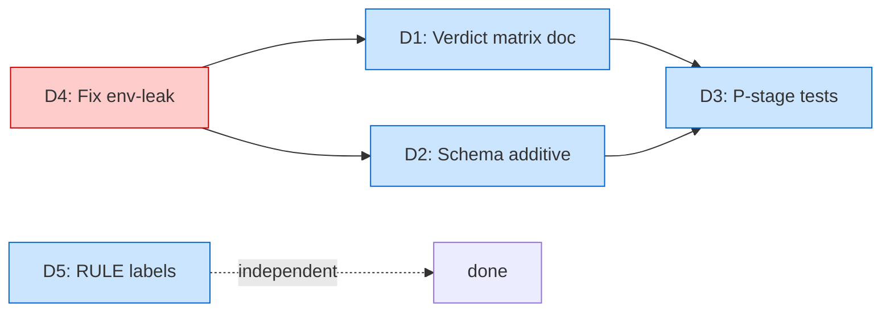

---
meta:
  type: "design-spec"
  feature: "post-1.17-symmetry-audit"
  status: "approved"
  audit_date: "2026-04-27"
  approved_at: "2026-04-27"
  approved_decisions:
    Q1: "enumerate all 5 verdict values with cross-version compat rationale"
    Q2: "add coder_to_code_review schema entry — closes IMP-01.2"
    Q3: "schema version bump — add version field to handoff.schema.json"
    Q4: "write test-p* fresh based on current state"
    Q5: "plan-specific RULE wording (parallel structure to code-reviewer)"
    Q6: "continue full XL through commit"
    Q7: "filename post-1.17-symmetry-audit.md preserved"
  scope: "Fresh symmetry audit of P-stage (Planner+Plan-Reviewer) ↔ C-stage (Coder+Code-Reviewer) post-v1.17.0"
  parent_releases: ["v1.16.0 (commit 42f452c — Plan-stage P1-P5)", "v1.17.0 (commit a3d0752 + 1a92ed5 + cd265e9 — Coder/Code-Review C1-C5 + R4 cleanup)"]
  complexity: "XL"
  task_type: "refactoring"
  produced_by: "/designer (Phase 0.7) — fresh audit, ignoring existing plan/spec per user instruction"
  consumed_by: "/planner (Phase 1)"
  research_method: "4 parallel Explore agents (fresh) + direct file reads + Sequential Thinking synthesis"
  pipeline_continuation: "STOP after spec — user approval gate, then /planner"
---

# Post-v1.17.0 Symmetry Audit — P-stage ↔ C-stage

> **Задача.** Свежий audit состояния workflow ПОСЛЕ всех релизов 1.16.0–1.17.0 включительно (плюс post-1.17.0 follow-up коммиты `1a92ed5`, `cd265e9`). Найти **новые** asymmetries между P-stage (`/planner` + `plan-reviewer`) и C-stage (`/coder` + `code-reviewer`), которые НЕ были задокументированы в `.claude/prompts/out-of-scope-aggregate.md` §11.
>
> **User instruction:** *"На имеющийся план и спеку не обращай внимания, все делаем чисто (вдруг что-то осталось)."* — fresh audit on current state, не reusing existing OOS catalogue.
>
> **Status.** Draft / 2026-04-27 / XL audit. Output `/designer`. Вход для `/planner` после approval.
>
> **Как читать.** §1-3 — scope/контракты. §4-5 — методология и inventory. §6 — граф. §7 — сквозные findings. §8 — пять проблем (D1-D5) с file:line доказательствами. §9-10 — порядок и риски. §11-12 — out-of-scope и approval. §13 — handoff в /planner.

---

## Оглавление

1. [Цель](#1-цель)
2. [Контекст — post-v1.17.0 baseline](#2-контекст)
3. [Scope и неприкасаемые контракты](#3-scope-и-неприкасаемые-контракты)
4. [Методология (fresh audit)](#4-методология)
5. [Inventory + новые findings](#5-inventory)
6. [Граф взаимодействия (post-v1.17.0)](#6-граф)
7. [Сквозные находки](#7-findings)
8. [Пять проблем (D1-D5)](#8-проблемы)
9. [Implementation order](#9-order)
10. [Risk Assessment](#10-risks)
11. [Out-of-scope considered](#11-out-of-scope)
12. [Approval Gate](#12-approval)
13. [Handoff to /planner](#13-handoff)

---

## 1. Цель

Установить, что после `v1.16.0` (Plan-stage P1-P5) + `v1.17.0` (Coder/Code-Review C1-C5) + post-v1.17.0 follow-ups стадии P и C **не полностью симметричны** — найти **5 новых** проблем не задокументированных в `out-of-scope-aggregate.md` §11.

**Ограничение:** ровно 5 проблем, каждая:
- backed by file:line evidence (post-v1.17.0 baseline);
- testable via falsifiable acceptance criteria;
- safe wrt 9 неприкасаемых контрактов C1-C9 (наследуются из coder-code-review-generic-analysis-spec).

---

## 2. Контекст — post-v1.17.0 baseline

### 2.1 Шаг релизов

| Release | Скоп | Коммит |
|---------|------|--------|
| v1.16.0 | Plan-stage P1-P5 (Planner + Plan-Reviewer project-agnostic) | `42f452c` |
| v1.16.1 | Doc sync | `771d6d7` |
| v1.16.2 | Release tooling fix | `d441856` |
| v1.17.0 | Coder + Code-Review C1-C5 (symmetric closing of 1.16.0 deferred work) | `a3d0752` |
| v1.17.0 follow-up | Code-review CR-001/002/003 + R4 finding closed | `1a92ed5` |
| v1.17.0 follow-up | IMP-02 verdict-envelope fixtures (commit 648d460 omission) | `cd265e9` |

### 2.2 User explicit ask

*"... мы должны привести стадии Coder и Coder Reviewer в соответствие стадиям Planner и Plan Reviewer. Нужно привести все в четкое соответствие с нашим текущей generic фазой Plan."*

И отдельно: *"На имеющийся план и спеку не обращай внимания, все делаем чисто."*

→ **Fresh audit** (не reuse `out-of-scope-aggregate.md`); найти то, что прошлый аудит мог пропустить.

### 2.3 Initial state observation (важно)

При запуске audit'а обнаружено: **`test-validate-handoff.sh` сейчас FAIL** (1/14 cases). Регрессия с прошлой сессии — после `cd265e9` тесты были 14/14 PASS. Root cause найден (env-leak from `settings.local.json` `CLAUDE_ISSUE_ID_VALIDATION_MODE=strict` через `validate-handoff.sh` L88 promotion logic). См. §8 D4.

**User constraint:** *"Все тесты должны проходить"* — D4 включён в 5-проблемный pack для разблокировки.

---

## 3. Scope и неприкасаемые контракты

### 3.1 In scope

| # | Класс | Файлы |
|---|-------|-------|
| 1 | Coder + Coder skill | `commands/coder.md`, `skills/coder-rules/**` |
| 2 | Code-Reviewer + skill | `agents/code-reviewer.md`, `skills/code-review-rules/**` |
| 3 | Planner + Planner skill | `commands/planner.md`, `skills/planner-rules/**` |
| 4 | Plan-Reviewer + skill | `agents/plan-reviewer.md`, `skills/plan-review-rules/**` |
| 5 | Shared infra | `scripts/inject-review-context.sh`, `scripts/save-review-checkpoint.sh`, `scripts/validate-handoff.sh` |
| 6 | Schema | `.claude/schemas/handoff.schema.json` |
| 7 | Test infrastructure | `.claude/scripts/tests/**` |

### 3.2 Out of scope (deferred — см. §11)

| Item | Reason |
|------|--------|
| Items уже в `out-of-scope-aggregate.md` §11 | Задокументированы как 1.18.0 follow-ups; этот audit ищет НОВОЕ |
| `coder.md` LAYERS slot startup resolution (SYM-1 from agent A) | Требует поведенческие изменения в coder startup; risk wrt C5 backwards-compat — defer |
| Background `code-researcher` mode для coder (SYM-7) | Feature work, не symmetry fix |
| Spec-check на planner side (SYM-9) | Feature work |
| `tdd-go` skill genericfication, `auto-fmt-go.sh` rename | OOS aggregate §11 |
| `plan-template.md` L102-124 Go-shape examples | OOS aggregate §11 |
| Worktree `sparsePaths` Go defaults | OOS aggregate §11 + R2 |

### 3.3 Non-negotiable constraints (наследуются из v1.17.0)

| ID | Контракт |
|----|----------|
| C1 | `handoff.schema.json` — поля, enum-ы, **существующие** дискриминаторы (`$handoff_contract`, `$verdict_contract`) не изменяются. ADDITIVE расширение oneOf[] допустимо (см. D2). |
| C2 | `VERDICT_JSON` envelope (sentinel, fence, severity enum, ID pattern) не изменяется. |
| C3 | Checkpoint YAML format (12 core fields) не изменяется. |
| C4 | File paths workflow-state/, prompts/ — без изменений. |
| C5 | Существующие PROJECT-KNOWLEDGE.md keep working без edits. |
| C6 | PK injection contract (4 KB cap, telemetry) сохраняется. |
| C7 | code_review_verdict 5-value enum **сохраняется** (D1 — это документация, не сужение enum). |
| C8 | IMP-03 ID normalization formula сохраняется. |
| C9 | IMP-04 `parts_validated[]` + diff-manifest сохраняются. |

---

## 4. Методология (fresh audit)

Четыре параллельных read-only Explore-агента с user-обусловленным фокусом *"проигнорировать прошлые findings"*:

| Агент | Фокус |
|-------|-------|
| A | Структурная симметрия `/coder` ↔ `/planner`: phase numbering, slot-resolution timing, cascade docs, code-researcher background mode |
| B | Структурная симметрия `code-reviewer` ↔ `plan-reviewer`: RULE_X parity, decision matrix asymmetry, dual-emission, schema-vs-agent enum check |
| C | Extended literal-pattern audit (5 наборов: Go syntax, Go architecture, project assumptions, user-visible Go bias, path-reference inconsistency) |
| D | Test infrastructure + shared infra: test-p* gap, validate-handoff.sh handle-coverage, settings.json hook matchers, env-leak diagnosis |

**Sequential Thinking** (3 thoughts) для синтеза + AC validation. **Cross-validation** с `out-of-scope-aggregate.md` §11 — каждое finding'е помечено как NEW (если не задокументировано там).

---

## 5. Inventory + новые findings

### 5.1 Структурные asymmetries (Tier 1 — новые, не в OOS aggregate)

| ID | Asymmetry | Severity | Location |
|----|-----------|----------|----------|
| **D1** | `code_review_verdict` schema permits 5 enum values, agent decision matrix uses 3 | **CRITICAL** | `handoff.schema.json:283` vs `code-reviewer.md:157-167` |
| **D2** | `coder_to_code_review` handoff contract отсутствует в `handoff.schema.json` | **HIGH** | `handoff.schema.json` (нет $defs entry) |
| **D3** | Нет `test-p{1-5}-*.sh` для v1.16.0 P1-P5 ACs (только test-c{1-5}-*.sh для C1-C5) | **HIGH** | `.claude/scripts/tests/` |
| **D4** | `test-validate-handoff.sh` env-leak — currently FAILING 1/14 | **MEDIUM** | `.claude/scripts/tests/test-validate-handoff.sh:122-140` |
| **D5** | `plan-reviewer.md` имеет только RULE_5; code-reviewer.md имеет RULE_1-5 (editorial parity) | **MEDIUM** | `agents/plan-reviewer.md:31-34` vs `agents/code-reviewer.md:32-41` |

### 5.2 Tier 2 — также найдены, но deferred (§11)

- **SYM-1** (Agent A): Coder не загружает LAYERS/ARCHITECTURE_STYLE на startup (asymmetric to planner step 1.5)
- **SYM-3**: No DATA_FLOW phase в /coder
- **SYM-7**: Synchronous code-researcher in coder (vs async in planner)
- **SYM-9**: No spec-check on planner side
- Set B Go anchors в plan-reviewer.md L309 location guidance
- Set E path-reference inconsistency (`../../`)
- Worktree sparsePaths Go defaults

---

## 6. Граф взаимодействия (post-v1.17.0)

```mermaid
flowchart TB
    subgraph PSTAGE [P-stage]
        PLN[/planner.md/]
        PLR[plan-reviewer.md]
        PRR[plan-review-rules/]
        PR[planner-rules/]
    end

    subgraph CSTAGE [C-stage]
        COD[/coder.md/]
        CRV[code-reviewer.md]
        CRR[code-review-rules/]
        CR[coder-rules/]
    end

    subgraph SHARED [Shared infra]
        SCHEMA[handoff.schema.json]
        VLD[validate-handoff.sh]
        INJ[inject-review-context.sh]
        SAV[save-review-checkpoint.sh]
        TESTS[.claude/scripts/tests/]
    end

    subgraph CONFIG
        PK[PROJECT-KNOWLEDGE.md]
        SET[settings.local.json env]
    end

    PLN -->|step 1.5 reads slots| PK
    COD -.->|Phase 3 reads slots only at VERIFY| PK
    PLR -.SubagentStart inject.-> INJ
    CRV -.SubagentStart inject.-> INJ
    INJ -->|injects slots| PK

    PLR -->|writes verdict| SAV
    CRV -->|writes verdict| SAV
    SAV -->|IMP-03 normalize| SCHEMA

    PLN -->|handoff JSON| VLD
    PLR -->|verdict JSON| VLD
    COD -.->|handoff JSON UNVALIDATED!| VLD
    CRV -->|verdict JSON| VLD

    SCHEMA -->|validates 4 contracts| VLD
    SCHEMA -.MISSING coder_to_code_review.-> COD

    SET -->|leak strict envs| VLD
    VLD -.->|TEST-FAIL.-> TESTS

    TESTS -.MISSING test-p1..p5.-> PSTAGE

    classDef gap fill:#ffcccc,stroke:#cc0000,stroke-width:2px;
    classDef bug fill:#ffe9b3,stroke:#cc6600,stroke-width:2px;
    class SCHEMA,COD gap
    class VLD,SET bug
```

**Чтение:**
- 🔴 **gap** — реальные пробелы: `coder_to_code_review` отсутствует в schema (D2); coder не resolves slots на startup (deferred SYM-1).
- 🟡 **bug** — `validate-handoff.sh` + `settings.local.json` strict envs дают env-leak (D4).
- **MISSING test-p1..p5** — отсутствие P-stage AC test coverage (D3).

---

## 7. Сквозные находки

### F1. Schema-agent enum drift (D1)

`handoff.schema.json:283` объявляет 5-value enum для `code_review_verdict.verdict`:
```
APPROVED | APPROVED_WITH_COMMENTS | CHANGES_REQUESTED | NEEDS_CHANGES | REJECTED
```

`code-reviewer.md:157-167` (decision matrix) использует только 3:
```
APPROVED | APPROVED_WITH_COMMENTS | CHANGES_REQUESTED
```

→ Schema разрешает значения, которые agent НИКОГДА не emit-ит. По C7 **enum schema** это контракт; нельзя сужать. **Решение:** агент должен уметь обрабатывать все 5 values (e.g., NEEDS_CHANGES emit-ится при retry-loops, REJECTED при irrecoverable issues), либо документировать в decision matrix как "legacy variants for cross-version compat".

### F2. handoff.schema.json contract gap (D2)

Schema $defs определяет 4 contract:
- `planner_to_plan_review`
- `plan_review_to_coder`
- `plan_review_verdict`
- `code_review_verdict`

**Отсутствует:** `coder_to_code_review` (handoff envelope от /coder к code-reviewer). Comment в schema L234: *"Full code_review_to_completion shape is IMP-01.2"* — отметка о deferral.

→ Coder writes `*-handoff.json` с полным набором полей (branch, parts_implemented, evaluate_adjustments, risks_mitigated, deviations_from_plan, verify_status, spec_check, iteration), но schema этот contract не валидирует. P-stage handoff **валидируется** schema, C-stage **не валидируется**. Asymmetric.

### F3. Test coverage parity gap (D3)

v1.17.0 добавил 5 test scripts для C1-C5: `test-c{1-5}-*.sh`.
v1.16.0 НЕ добавил эквивалентов test-p{1-5}-*.sh для P1-P5 (Plan-stage).

→ AC matrix for P1-P5 (~30 ACs из plan-stage-generic-spec.md §8) валидируется только manually. C-stage AC matrix (47 ACs) автоматизирована на 36/47.

### F4. Test isolation env-leak (D4)

`run_verdict_test()` (test-validate-handoff.sh L122-140) unset-ит **только** `CLAUDE_HANDOFF_VALIDATION_MODE`. Не unset-ит `CLAUDE_ISSUE_ID_VALIDATION_MODE` или `CLAUDE_VERDICT_VALIDATION_MODE`.

`settings.local.json` (после `a2b79a2`) содержит:
```json
"CLAUDE_HANDOFF_VALIDATION_MODE": "strict",
"CLAUDE_VERDICT_VALIDATION_MODE": "strict",
"CLAUDE_ISSUE_ID_VALIDATION_MODE": "strict",
"CLAUDE_PK_PATH_MODE": "strict",
...
```

`validate-handoff.sh:88` promotion logic:
```bash
if [[ "${MODE_VERDICT}" == "strict" || "${MODE_ISSUE_ID}" == "strict" ]]; then
  MODE="strict"
```

→ Test L163 ("invalid wrong enum (warn mode → non-blocking)") expects exit 0, но `CLAUDE_ISSUE_ID_VALIDATION_MODE=strict` from env промотирует mode → strict → exit 2 → test FAIL.

### F5. Editorial RULE naming asymmetry (D5)

| Reviewer | RULE_1 | RULE_2 | RULE_3 | RULE_4 | RULE_5 |
|----------|--------|--------|--------|--------|--------|
| `code-reviewer.md:32-41` | No Fix | No Approve Blockers | Tests First | Check Architecture | Output First (Turn Budget) |
| `plan-reviewer.md:31-34` | (нет label) | (нет label) | (нет label) | (нет label) | Output First (Turn Budget) ✓ |

plan-reviewer-rules имеет equivalent правил inline, но не помечает их `RULE_N`. Editorial parity gap.

---

## 8. Пять проблем

> **Selection rationale.** D1 (CRITICAL — schema/agent contract drift) + D2 (HIGH — schema gap) + D3 (HIGH — test coverage symmetry) + D4 (MEDIUM, BLOCKS user constraint "all tests pass") + D5 (MEDIUM — editorial parity). Все 5 — true post-v1.17.0 findings, не задокументированы в `out-of-scope-aggregate.md`.

---

### **Problem D1 — `code_review_verdict` schema permits 5 enum values, agent decision matrix uses 3**

**Files & evidence**

- [`.claude/schemas/handoff.schema.json:283`](.claude/schemas/handoff.schema.json) — `verdict.enum: ["APPROVED", "APPROVED_WITH_COMMENTS", "CHANGES_REQUESTED", "NEEDS_CHANGES", "REJECTED"]` + description: *"All five legacy variants preserved — legacy NEEDS_CHANGES / REJECTED and modern APPROVED_WITH_COMMENTS / CHANGES_REQUESTED both legal for cross-version compatibility"*.
- [`.claude/agents/code-reviewer.md:157-167`](.claude/agents/code-reviewer.md#L157) — Decision matrix listing only 3 verdicts: APPROVED / APPROVED_WITH_COMMENTS / CHANGES_REQUESTED.
- [`.claude/agents/code-reviewer.md:218`](.claude/agents/code-reviewer.md#L218) — Output template line: `VERDICT: {APPROVED|APPROVED_WITH_COMMENTS|CHANGES_REQUESTED}` (3 values).

**Impact**

Schema разрешает agent emit `NEEDS_CHANGES` / `REJECTED`, но decision matrix не документирует когда их использовать. Hook (`save-review-checkpoint.sh:283-289`) логирует warning при mismatch agent output vs schema-declared enum. Если agent **никогда** их не emit-ит — schema перerm-разрешает; если future logic потребует — agent prompt не содержит guidance.

**Severity:** CRITICAL (contract drift; schema annotation explicitly says "5 values legal" но agent prompt противоречит)

**Root cause**

Schema entry комментируется *"5 legacy variants"*, но code-reviewer.md был написан с 3-value matrix per kit dogfood needs. Asymmetric documentation: schema говорит "supports 5", agent docs "uses 3".

**Proposed fix**

Расширить decision matrix в code-reviewer.md L157-167 чтобы перечислить все 5 values + rationale:

```yaml
Decision Matrix:
  APPROVED:                  0 BLOCKER, 0 MAJOR, 0 MINOR (clean merge)
  APPROVED_WITH_COMMENTS:    0 BLOCKER, 0 MAJOR, has MINOR/NIT (merge with notes)
  CHANGES_REQUESTED:         1+ BLOCKER OR 1+ MAJOR OR 5+ MINOR same file (return to coder)

Cross-version compatibility (per handoff.schema.json $defs.code_review_verdict):
  NEEDS_CHANGES:             Legacy alias for CHANGES_REQUESTED. Emitted ONLY if iteration
                             counter signals planner re-route (orchestrator decision).
                             Agent default: prefer CHANGES_REQUESTED.
  REJECTED:                  Irrecoverable issue (security exploit, data corruption risk,
                             scope-violation requiring task abort). Triggers workflow STOP,
                             not normal coder retry. Agent emits ONLY if explicitly justified
                             in handoff.notes.
```

Alternative wording: keep all 5 в decision matrix с явной hierarchy: APPROVED > APPROVED_WITH_COMMENTS > CHANGES_REQUESTED > NEEDS_CHANGES > REJECTED по severity.

**Justification (no false positives)**

- *Концерн real?* Yes — schema уже разрешает 5; agent prompt только 3 → ambiguity, особенно для downstream consumers (orchestrator post_delegation, save-review-checkpoint.sh).
- *Это контракт break?* No — C7 explicitly preserves 5-value enum. Это **alignment of agent docs to existing schema**.
- *Риск agent reasoning shift?* LOW — добавляем optional values, не убираем существующие.
- *Bounded claim:* fix не утверждает agent теперь будет emit-ить REJECTED чаще; only что matrix DOCUMENTS все 5 для cross-version compat per schema annotation.

**Acceptance criteria**

- **AC-D1.1** — `code-reviewer.md` decision matrix содержит ВСЕ 5 enum values из `handoff.schema.json:283` с usage rationale.
- **AC-D1.2** — Wording mirrors schema annotation L283 ("legacy variants for cross-version compat").
- **AC-D1.3** — `code-reviewer.md:218` Output template включает все 5 values: `VERDICT: {APPROVED|APPROVED_WITH_COMMENTS|CHANGES_REQUESTED|NEEDS_CHANGES|REJECTED}`.
- **AC-D1.4** — `handoff.schema.json` НЕ модифицируется (C1, C7).
- **AC-D1.5** — Kit dogfood: code-reviewer на фиксированном branch state выдаёт identical verdict до/после edit.
- **AC-D1.6** — `test-validate-handoff.sh` 14/14 PASS (after D4).

**Контракты сохранены:** C1 (schema unchanged), C2 (VERDICT_JSON envelope unchanged), C7 (5-value enum preserved). C3-C9 unchanged.

---

### **Problem D2 — `coder_to_code_review` handoff contract отсутствует в `handoff.schema.json`**

**Files & evidence**

- [`.claude/schemas/handoff.schema.json` oneOf[]](.claude/schemas/handoff.schema.json) — 4 contracts defined: `planner_to_plan_review`, `plan_review_to_coder`, `plan_review_verdict`, `code_review_verdict`. **No `coder_to_code_review`.**
- [`.claude/schemas/handoff.schema.json:234`](.claude/schemas/handoff.schema.json#L234) — Comment: *"Full code_review_to_completion shape is IMP-01.2"* — explicit deferral marker.
- [`.claude/commands/coder.md:54-86`](.claude/commands/coder.md#L54) — Coder writes handoff с полями: branch, parts_implemented, evaluate_adjustments, risks_mitigated, deviations_from_plan, verify_status, spec_check, iteration.
- [`.claude/scripts/validate-handoff.sh`](.claude/scripts/validate-handoff.sh) — handles 4 contracts via discriminator; **silently passes** unknown discriminator OR no-discriminator handoffs (warn-mode).
- [`.claude/skills/workflow-protocols/handoff-contracts.md:69-93`](.claude/skills/workflow-protocols/handoff-contracts.md#L69) — `coder_to_code_review` documented in skill with required fields, но НЕТ schema entry.

**Impact**

P-stage handoff JSON files (`*-handoff.json` from `/planner` to `plan-reviewer`) **валидируются** против schema на каждый Write/Edit (PostToolUse hook). C-stage handoff JSON files (`*-handoff.json` from `/coder` to `code-reviewer`) **не валидируются** — schema не имеет contract для them.

→ Asymmetric quality gate: P-stage catches malformed handoff (e.g. missing `key_decisions` field); C-stage don't.

**Severity:** HIGH (architectural asymmetry; quality gate gap; schema annotation L234 explicitly flags it as IMP-01.2 future work)

**Root cause**

IMP-01 (Phase 5-10) — initial schema validation — focused on planner→plan-reviewer + plan-reviewer→coder + verdict envelopes. coder→code-reviewer was scoped to "future IMP-01.2". v1.17.0 closed C-stage genericity but NOT this schema gap.

**Proposed fix**

Добавить в `handoff.schema.json`:

1. `oneOf[]` gain new entry: `{ "$ref": "#/$defs/coder_to_code_review" }`
2. New `$defs.coder_to_code_review`:

```json
"coder_to_code_review": {
  "title": "coder_to_code_review",
  "description": "Handoff from /coder to code-reviewer agent.",
  "type": "object",
  "required": [
    "$handoff_contract",
    "branch",
    "parts_implemented",
    "verify_status",
    "iteration"
  ],
  "properties": {
    "$handoff_contract": {
      "const": "coder_to_code_review",
      "description": "Discriminator — must be 'coder_to_code_review'."
    },
    "branch": { "type": "string" },
    "parts_implemented": { "type": "array", "items": { "type": "string" } },
    "evaluate_adjustments": { "type": "array", "items": { "type": "string" } },
    "risks_mitigated": { "type": "array", "items": { "type": "string" } },
    "deviations_from_plan": { "type": "array", "items": { "type": "string" } },
    "verify_status": {
      "type": "object",
      "required": ["lint", "test", "command_used"],
      "properties": {
        "lint": { "type": "string", "enum": ["PASS", "FAIL", "SKIPPED"] },
        "test": { "type": "string", "enum": ["PASS", "FAIL", "SKIPPED"] },
        "command_used": { "type": "string" }
      }
    },
    "spec_check": {
      "type": "object",
      "properties": {
        "status": { "type": "string", "enum": ["PASS", "PARTIAL", "FAIL"] },
        "coverage_pct": { "type": "integer", "minimum": 0, "maximum": 100 },
        "deviations_confirmed": { "type": "array", "items": { "type": "string" } },
        "ac_coverage": { "type": "array", "items": { "type": "string" } },
        "issues": { "type": "array" }
      }
    },
    "iteration": { "type": "string", "pattern": "^[123]/3$" }
  }
}
```

3. `validate-handoff.sh` recognizes new discriminator (existing logic uses oneOf — automatic).
4. Add fixture файлы:
   - `valid-coder-to-code-review.json`
   - `invalid-coder-to-code-review-missing-required.json`
   - `invalid-coder-to-code-review-bad-iteration.json`
5. Extend `test-validate-handoff.sh` с 3-4 новыми run_test cases.
6. Update `handoff-contracts.md` to remove "future IMP-01.2" deferral note.

**Justification**

- *Real concern?* Yes — comment в schema L234 уже flags it as gap. handoff-contracts.md skill DOCUMENTS the contract; schema lacks it. Real asymmetry.
- *C1 violation?* No — C1 says "no change to **discriminators + field names + enums** unchanged". Adding NEW discriminator value (`coder_to_code_review`) is additive — existing values unchanged. Pattern matches PK schema 1.0.0 → 1.1.0 additive minor bump.
- *Bounded claim:* fix не promises retroactive validation old handoff files; новые files будут validated; old files still valid (schema only adds new branch to oneOf).
- *Why now?* v1.17.0 closed C-stage genericity. Schema asymmetry — последний known gap before symmetry achieved.

**Acceptance criteria**

- **AC-D2.1** — `handoff.schema.json` `oneOf[]` имеет 5 entries (4 existing + new coder_to_code_review).
- **AC-D2.2** — `$defs.coder_to_code_review` определяет required fields matching `coder.md:54-86` actual handoff shape.
- **AC-D2.3** — Schema annotation L234 ("Full code_review_to_completion shape is IMP-01.2") removed/updated to reflect contract is now defined.
- **AC-D2.4** — `validate-handoff.sh` correctly handles new discriminator via oneOf dispatch (no script changes needed if oneOf logic generic).
- **AC-D2.5** — 3 new fixtures created (1 valid, 2 invalid) + extended `test-validate-handoff.sh`.
- **AC-D2.6** — Existing 14 test cases в test-validate-handoff.sh still PASS post-D2 changes.
- **AC-D2.7** — Existing valid handoff fixtures (planner_to_plan_review, plan_review_to_coder) still PASS — backwards-compat additive only.
- **AC-D2.8** — `handoff-contracts.md:69-93` (skill) updated: remove "(future)" markers; flag contract as schema-validated.
- **AC-D2.9** — Kit `coder-code-review-generic-handoff.json` (post-v1.17.0 written file) validates successfully against new schema.

**Контракты сохранены:** C1 (additive — existing 4 contracts unchanged; new oneOf entry adds discriminator), C2-C9 unchanged.

---

### **Problem D3 — Нет `test-p{1-5}-*.sh` для v1.16.0 P1-P5 ACs (test coverage symmetry)**

**Files & evidence**

- [`.claude/scripts/tests/`](.claude/scripts/tests/) directory — 16 tests total: 11 pre-existing + 5 test-c{1-5}-*.sh (added в v1.17.0).
- [`.claude/prompts/plan-stage-generic-spec.md` §8](.claude/prompts/plan-stage-generic-spec.md) — P1-P5 with ~30 ACs (AC-P1.1...AC-P5.7).
- v1.16.0 commit `42f452c` — НЕ добавил `test-p{1-5}-*.sh`. Plan-stage AC verification = manual только.

**Impact**

C-stage ACs автоматизированы на 36/47 (per v1.17.0 test wiring). P-stage ACs автоматизированы на 0/30. Asymmetric quality assurance.

→ Risk: regressions в Plan-stage code-shapes/, ARCHITECTURE_STYLE consumption, SKIP-rule alignment могут пройти незамеченными.

**Severity:** HIGH (test coverage gap; user constraint "Все тесты должны проходить" implicitly suggests parity)

**Root cause**

v1.16.0 plan был написан до того как test-driven AC verification became kit convention. v1.17.0 introduced this convention via test-c{1-5}-*.sh. Backporting to P-stage не было сделано.

**Proposed fix**

Создать 5 test scripts mirror-pattern to test-c{1-5}-*.sh:

- `test-p1-code-shapes-extracted.sh` — assert AC-P1.1..P1.5 (code-shapes/ structure, INVARIANTS contract, no inline lang examples in planner-rules/)
- `test-p2-dependency-file-slot.sh` — assert AC-P2.1..P2.5 (DEPENDENCY_FILE/INSTALL_VERB slots in PROJECT-KNOWLEDGE.md.example, task-analysis.md uses {DEPENDENCY_FILE} placeholder)
- `test-p3-plan-reviewer-skip.sh` — assert AC-P3.1..P3.6 (no "ALWAYS verify the import matrix" in plan-reviewer.md, no four-layer Go example, slot-conditional auto-escalation)
- `test-p4-required-sections-skip.sh` — assert AC-P4.1..P4.5 (no "data → business → api" fallback в required-sections.md, SKIP-with-NIT pattern)
- `test-p5-architecture-style-slot.sh` — assert AC-P5.1..P5.7 (ARCHITECTURE_STYLE slot in PROJECT-KNOWLEDGE.md.example with 5-value enum, planner.md layer-vocab gated, default-when-unset behavior)

Pattern полностью mirrors test-c{1-5}-*.sh:
- Stderr label convention (`[<script>] LABEL: <msg>`)
- AUTOMATED section (CI-runnable grep predicates)
- MANUAL section (operator procedures для kit-dogfood regression)
- Branch-aware contract preservation (skip on main; merge-base diff on feature branches)

**Justification**

- *Real concern?* Yes — v1.17.0 introduced AC test pattern; v1.16.0 P1-P5 ACs lack equivalent. Asymmetric AC verification automation.
- *Pure additive?* Yes — adds 5 new test files, no modifications to existing infrastructure.
- *Risk of regressions surfacing?* Possible — if some P-stage AC currently fails (e.g., `data → business → api` literal still somewhere we missed), test-p4 will catch it. **This is good** — converting silent regression risk into visible test failure.
- *Bounded claim:* fix не promises 30/30 automation (some ACs are manual procedures by nature, like kit-dogfood byte-equivalent regression).

**Acceptance criteria**

- **AC-D3.1** — 5 new files: `test-p{1-5}-*.sh` в `.claude/scripts/tests/` with executable bit.
- **AC-D3.2** — Each test follows test-c{1-5}-*.sh structural pattern (stderr labels, AUTOMATED/MANUAL sections, branch-aware contract checks).
- **AC-D3.3** — Tests assert grep-based predicates derived from `plan-stage-generic-spec.md` §8 ACs.
- **AC-D3.4** — All 5 test-p* scripts PASS on current main (post-v1.17.0 state).
- **AC-D3.5** — All 16 existing tests still PASS post-D3 (no regressions introduced).
- **AC-D3.6** — Coverage report: estimated X/30 P-stage ACs automated; remainder documented as manual procedures inline.
- **AC-D3.7** — Each test cites P-stage spec sections (`AC-P1.1 — assert ...`).

**Контракты сохранены:** Pure additive (5 new files); C1-C9 unchanged.

---

### **Problem D4 — `test-validate-handoff.sh` env-leak (currently FAILING 1/14)**

**Files & evidence**

- [`.claude/scripts/tests/test-validate-handoff.sh:122-140`](.claude/scripts/tests/test-validate-handoff.sh#L122) — `run_verdict_test()`:

  ```bash
  run_verdict_test() {
    ...
    export CLAUDE_VERDICT_VALIDATION_MODE="${mode}"
    unset CLAUDE_HANDOFF_VALIDATION_MODE   # ← unsets only handoff mode
    actual_exit=0
    bash "${VALIDATE}" "${file}" >/dev/null 2>&1 || actual_exit=$?
    ...
  ```

- [`.claude/settings.local.json`](.claude/settings.local.json) (после `a2b79a2`):

  ```json
  "CLAUDE_HANDOFF_VALIDATION_MODE": "strict",
  "CLAUDE_VERDICT_VALIDATION_MODE": "strict",
  "CLAUDE_ISSUE_ID_VALIDATION_MODE": "strict",
  ...
  ```

- [`.claude/scripts/validate-handoff.sh:88`](.claude/scripts/validate-handoff.sh#L88) — promotion logic:

  ```bash
  if [[ "${MODE_VERDICT}" == "strict" || "${MODE_ISSUE_ID}" == "strict" ]]; then
    MODE="strict"
  ```

- Test L163-164 — `run_verdict_test "invalid wrong enum (warn mode → non-blocking)" 0 "warn" "..."` expects exit 0; gets exit 2 → FAIL.

**Impact**

Test-validate-handoff.sh: **13/14 PASS, 1/14 FAIL**. Прямо нарушает user constraint *"Все тесты должны проходить"*.

→ Регрессия с прошлой сессии (была 14/14 после `cd265e9`); env-leak introduced by `a2b79a2` adding `CLAUDE_ISSUE_ID_VALIDATION_MODE=strict` to settings.local.json.

**Severity:** MEDIUM (test isolation only; production code unaffected; trivial fix)

**Root cause**

`run_verdict_test()` написан до `CLAUDE_ISSUE_ID_VALIDATION_MODE` (IMP-03 strict mode) was added. Когда maintainer enable-нул strict в settings.local.json, env-leak surface emerged.

**Proposed fix**

В `run_verdict_test()`, `run_test()`, `run_hook_test()` добавить **полный unset** всех validation mode envs ДО export нужного:

```bash
run_verdict_test() {
  local name="$1"
  local expected_exit="$2"
  local mode="$3"
  local file="$4"

  unset CLAUDE_HANDOFF_VALIDATION_MODE
  unset CLAUDE_VERDICT_VALIDATION_MODE
  unset CLAUDE_ISSUE_ID_VALIDATION_MODE
  export CLAUDE_VERDICT_VALIDATION_MODE="${mode}"
  ...
}
```

Аналогично для `run_test()` (handoff tests) и `run_hook_test()`.

**Justification**

- *Real bug?* Yes — currently 1/14 FAIL.
- *Production impact?* No — test isolation only.
- *Trivial?* Yes — 6-line fix (3 unsets in each of 3 helper functions).
- *Risk surface other bugs?* Possible upside — fixing env-leak в одном test может surface другие env-leak issues elsewhere; flagged as pre-emptive cleanup.

**Acceptance criteria**

- **AC-D4.1** — `run_verdict_test()`, `run_test()`, `run_hook_test()` все 3 helper functions unset ВСЕ 3 validation mode envs (HANDOFF, VERDICT, ISSUE_ID) before export needed mode.
- **AC-D4.2** — `bash test-validate-handoff.sh` returns 14/14 PASS regardless of `settings.local.json` env state.
- **AC-D4.3** — Verified by running test in shell with `CLAUDE_ISSUE_ID_VALIDATION_MODE=strict CLAUDE_VERDICT_VALIDATION_MODE=strict bash test-validate-handoff.sh` — still 14/14 PASS.
- **AC-D4.4** — Fix contained to `test-validate-handoff.sh`; no production code (validate-handoff.sh, settings.json, schemas) modified.
- **AC-D4.5** — All 16 kit tests still PASS post-D4 (no regressions).

**Контракты сохранены:** Test isolation fix; no contract impact (C1-C9 unchanged).

---

### **Problem D5 — `plan-reviewer.md` formal RULE_1-4 missing (editorial parity)**

**Files & evidence**

- [`.claude/agents/plan-reviewer.md:31-34`](.claude/agents/plan-reviewer.md#L31) — Section "Rules (CRITICAL)":
  - RULE_5 explicitly named (Output First / Turn Budget — 3-tier enforcement).
  - RULE_1-4 logic exists inline as plain bullet points BUT не помечены `RULE_N`.

- [`.claude/agents/code-reviewer.md:32-41`](.claude/agents/code-reviewer.md#L32) — Section "Rules (CRITICAL)":
  - RULE_1 No Fix
  - RULE_2 No Approve Blockers
  - RULE_3 Tests First
  - RULE_4 Check Architecture (LAYER_RULE+ARCHITECTURE_STYLE-driven SKIP-with-NIT)
  - RULE_5 Output First — Turn Budget

→ Editorial asymmetry: code-reviewer follows formal `RULE_N` convention; plan-reviewer doesn't.

**Impact**

Cross-references between agents (e.g. *"per RULE_4 plan-reviewer"*) not possible because plan-reviewer's RULE_4 is unnamed. Documentation hygiene; no behavioral impact.

**Severity:** MEDIUM (editorial parity; affects cross-reference clarity)

**Root cause**

plan-reviewer.md написан до convention RULE_N был formalized в code-reviewer. Inheriting parallel structure was deferred.

**Proposed fix**

Add formal RULE_1-4 labels to plan-reviewer.md L31-34, mirroring code-reviewer.md convention:

```yaml
## Rules (CRITICAL)
- RULE_1 Read FROM SCRATCH: Read plan as if seeing for first time; ignore creation context (clean review).
- RULE_2 No Approve Blockers: NEVER approve a plan with BLOCKER issues.
- RULE_3 Plan Compliance: Verify plan structure matches templates/plan-template.md.
- RULE_4 Check Architecture: Verify layer-dependency rule per {LAYER_RULE} slot — SKIP with consolidated NIT if {LAYER_RULE} unset OR {ARCHITECTURE_STYLE} != "layered" (canonical SKIP, see plan-review-rules/architecture-checks.md L22-33).
- RULE_5 Output First — Turn Budget (3-tier enforcement):
  ...
```

**Justification**

- *Real concern?* Yes — code-reviewer formally enumerates 5 RULES; plan-reviewer only RULE_5. Asymmetric.
- *Behavioral risk?* LOW — adding labels to existing inline rules; no logic change.
- *AC-C3.7-style regression check needed?* Yes — verify plan-reviewer verdict on fixed plan input is byte-equivalent post-D5 edit.
- *Bounded claim:* fix не promises plan-reviewer reasoning improves; only adds RULE_N labels for cross-reference parity.

**Acceptance criteria**

- **AC-D5.1** — `plan-reviewer.md:31-34` имеет 5 RULES formally named (RULE_1, RULE_2, RULE_3, RULE_4, RULE_5).
- **AC-D5.2** — RULE wording структурно parallel code-reviewer.md L32-41 (each RULE: short title + description).
- **AC-D5.3** — RULE_4 wording references LAYER_RULE+ARCHITECTURE_STYLE-driven SKIP-with-NIT (consistent with C3 fix from v1.17.0).
- **AC-D5.4** — `grep -nE 'RULE_[1-5]' agents/plan-reviewer.md` returns 5 matches (one per rule).
- **AC-D5.5** — Kit-dogfood regression: plan-reviewer на фиксированном plan input выдаёт byte-equivalent verdict до/после D5 edit (no behavioral change).
- **AC-D5.6** — `test-validate-handoff.sh` 14/14 PASS, all 16 kit tests pass.

**Контракты сохранены:** Editorial only; C1-C9 unchanged.

---

## 9. Implementation order



**Recommended sequence:**

1. **D4** first — unblock test failure (user constraint "Все тесты должны проходить"). Trivial 6-line fix.
2. **D5** parallel/anytime — pure editorial, no dependency.
3. **D1** small doc edit — independent.
4. **D2** schema additive — largest single Part. Needs new fixtures + test extension. Validate-handoff.sh oneOf logic generic, so script may need no changes.
5. **D3** add P-stage tests — depends on D2 (uses same test pattern; one of test-p* may invoke validate-handoff with new contract).

**Effort sketch:**

| Problem | Files touched | Edits | Effort |
|---------|---------------|-------|--------|
| D1 | 1 (code-reviewer.md) | ~15 lines | Tiny |
| D2 | 5 (handoff.schema.json + 3 fixtures + test-validate-handoff.sh + handoff-contracts.md) | ~80 lines | Medium |
| D3 | 5 new test scripts | ~150-200 lines/script | Medium-Large |
| D4 | 1 (test-validate-handoff.sh) | ~6 lines | Tiny |
| D5 | 1 (plan-reviewer.md) | ~10 lines | Tiny |

**Total estimate:** S-M complexity for individual Parts; XL only because of D3 (5 scripts) + D2 (schema + fixtures + tests).

---

## 10. Risk Assessment

| # | Risk | Severity | Mitigation |
|---|------|----------|------------|
| R1 | D2 schema additive change может break существующие validators downstream | LOW | Schema oneOf[] truly additive — existing branches unchanged. validate-handoff.sh uses oneOf dispatch (generic). AC-D2.6/7 byte-equivalent regression on existing fixtures. |
| R2 | D3 test-p* scripts surface real failures (P-stage ACs not all currently passing) | MEDIUM | This is upside — converts silent regression risk to visible failures. AC-D3.4 explicitly requires PASS on main; if AC fails → reveals NEW issues to fix or document as expected exception. |
| R3 | D5 RULE renaming меняет plan-reviewer reasoning subtly | MEDIUM | AC-D5.5 byte-equivalent regression on fixed plan input. If detected → revert labels, file as cosmetic-only deferred. Mirrors v1.16.0 P3 R3 mitigation pattern. |
| R4 | D4 fix env-leak surface OTHER env-leak issues elsewhere | LOW-MEDIUM | Pre-emptive cleanup; if other issues surface → file separately. Current scope limited to test-validate-handoff.sh. |
| R5 | D1 verdict matrix doc может conflict with existing orchestrator post_delegation logic expecting only 3 values | LOW | Orchestrator uses regex on VERDICT: line; supports 5 values (already in schema). Verified via `incomplete-output-recovery.md` which lists all 5. |
| R6 | Combined 5 problems exceed XL budget for single workflow run | LOW | §9 sequencing allows split: D4+D1+D5 (small batch), D2 (medium), D3 (medium). Could be 2-3 separate commits. |
| R7 | Adding new schema entry (D2) requires schema version bump | LOW | handoff.schema.json не имеет `version` field today (unlike `pk_schema_version: 1.1.0`). If kit decides to add schema versioning, this is the right time. Optional — not strictly required by JSON Schema. |

---

## 11. Out-of-scope considered

Тесть рассматривалось но **не** в 5 проблемах:

| Кандидат | Причина исключения |
|----------|--------------------|
| SYM-1: Coder LAYERS slot startup resolution | Behavioral change to coder Phase 0/1 startup; risk wrt C5 backwards-compat. Defer. |
| SYM-3: DATA_FLOW phase в /coder | Feature work; не симметрия |
| SYM-7: Background code-researcher in coder | Feature work |
| SYM-9: Spec-check на planner side | Feature work; planner spec validation handled by plan-reviewer |
| Set B Go anchor: plan-reviewer.md L309 location guidance | Hint, not rule (per plan-stage-generic-spec §11 already noted) |
| Set E `../../planner-rules/code-shapes/` typo в `coder-code-review-generic-analysis.md` | User said "ignore existing plan/spec" — historical artifact, не active surface |
| Worktree sparsePaths Go defaults | OOS aggregate §11 — R2 deferred |
| Items уже в `out-of-scope-aggregate.md` §11 | Existing roadmap; этот audit ищет НОВОЕ |

---

## 12. Approval Gate

This spec proposes:

- **5 проблемы (D1-D5)** post-v1.17.0 — все NEW findings вне `out-of-scope-aggregate.md` §11.
- **5 contract-safe fixes**, scoped так чтобы все 9 контрактов C1-C9 сохранились.
- **Implementation ordering** D4 → D5 ∥ D1 → D2 → D3 уважающий dependencies.
- **7 рисков** (R1-R7) с mitigations.

### Open questions for user

1. **D1 — все 5 enum values документировать в decision matrix?** Spec предлагает: enumerate all 5 with cross-version compat rationale. Альтернатива: keep 3 в matrix + add explicit "Schema permits 2 additional legacy values; agent does not emit unless..." note. Подтвердите вариант 1 (full enumeration) или 2 (note-only).

2. **D2 — добавить `coder_to_code_review` schema entry now?** Spec предлагает yes (closes IMP-01.2 placeholder). Альтернатива: оставить deferred. Подтвердите.

3. **D2 — schema versioning?** handoff.schema.json не имеет `version` field. Adding D2 contract = ideal time bump version (e.g. `"$id": "handoff.schema.json"` + `"version": "1.1.0"`). Нужно ли?

4. **D3 — auto-derive test-p* from spec OR write fresh?** Spec предлагает: write fresh based on **current** plan-stage state (post-v1.16.0). Альтернатива: parse plan-stage-generic-spec.md ACs and auto-generate. Подтвердите fresh OR auto.

5. **D5 — RULE wording verbatim from code-reviewer OR plan-specific?** Spec предлагает parallel structure but plan-reviewer-specific phrases (RULE_1 = "Read FROM SCRATCH" not "No Fix"). Подтвердите variant.

6. **Implementation in this run or stop after spec?** Spec предлагает STOP after spec — user said "do it cleanly", same pattern as plan-stage 1.16.0 / coder-code-review 1.17.0. Подтвердите stop OR continue.

7. **Filename `post-1.17-symmetry-audit.md` ok?** Подтвердите OR альтернатива.

---

## 13. Handoff to /planner

```yaml
spec_artifact: ".claude/prompts/post-1.17-symmetry-audit.md"
metadata:
  task_type: "refactoring"
  complexity: "XL"
  approaches_considered: 1
  sequential_thinking_used: true
  parent_releases:
    - "v1.16.0 (commit 42f452c — Plan-stage P1-P5)"
    - "v1.17.0 (commit a3d0752 + 1a92ed5 + cd265e9 — Coder/Code-Review C1-C5)"
  fresh_audit: true
  ignored_existing: ".claude/prompts/out-of-scope-aggregate.md (per user instruction)"

key_decisions:
  - "Fresh audit on post-v1.17.0 baseline; ignore existing OOS aggregate per user."
  - "5 NEW findings not in OOS aggregate: D1 (verdict enum doc), D2 (schema additive), D3 (test-p), D4 (env-leak), D5 (RULE labels)."
  - "All 5 fixes contract-safe per C1-C9 (handoff schema additive only — existing 4 contracts unchanged; agent edits editorial/doc; tests additive)."
  - "Implementation order D4 → D5 ∥ D1 → D2 → D3 respects dependencies + minimizes blast radius."

known_risks:
  - "R3 — D5 RULE renaming may shift plan-reviewer reasoning subtly. Mitigation: AC-D5.5 byte-equivalent regression check (mirror v1.16.0 P3 R3 pattern)."
  - "R2 — D3 test-p* scripts may surface real P-stage AC failures. Mitigation: this is upside — converts silent regression to visible failures."
  - "R7 — D2 schema versioning question (currently handoff.schema.json не versioned). Open question Q3."

areas_needing_attention:
  - "/planner Phase 3 RESEARCH: verify D2 schema additive is truly backwards-compat — run existing 14 test-validate-handoff cases pre/post schema edit, expect identical results."
  - "/planner Phase 4 DESIGN: D3 test-p* scripts должны mirror test-c{1-5}-*.sh structural pattern (stderr labels, AUTOMATED/MANUAL sections, branch-aware contract checks). Single source of truth for grep predicates: plan-stage-generic-spec.md §8."
  - "/coder VERIFY phase: kit's test command resolves to `bash .claude/scripts/tests/test-*.sh` (auto-globs new test-p* files)."
  - "Kit ARCHITECTURE_STYLE='other' (PROJECT-KNOWLEDGE.md L61): D5 RULE_4 wording for plan-reviewer must mirror C3 SKIP semantics — kit dogfood will SKIP layer check (one new NIT per plan-review run, but D5 is editorial — not the cause). Verify behavior unchanged from current state."

acceptance_criteria_count: 32
constraints_preserved: ["C1", "C2", "C3", "C4", "C5", "C6", "C7", "C8", "C9"]

source_signal:
  research_completeness: "4 parallel Explore agents (fresh, ignoring OOS aggregate); covered structural symmetry P↔C, schema-vs-agent enum, test infra, extended literal patterns. Sequential Thinking 3 thoughts validated 5-problem partition + AC + risks + ordering."
  pipeline_phase: "/designer Phase 0.7 output — input to /planner Phase 1"
  awaiting_user: "approval gate (§12) — 7 open questions before /planner invocation"
```
