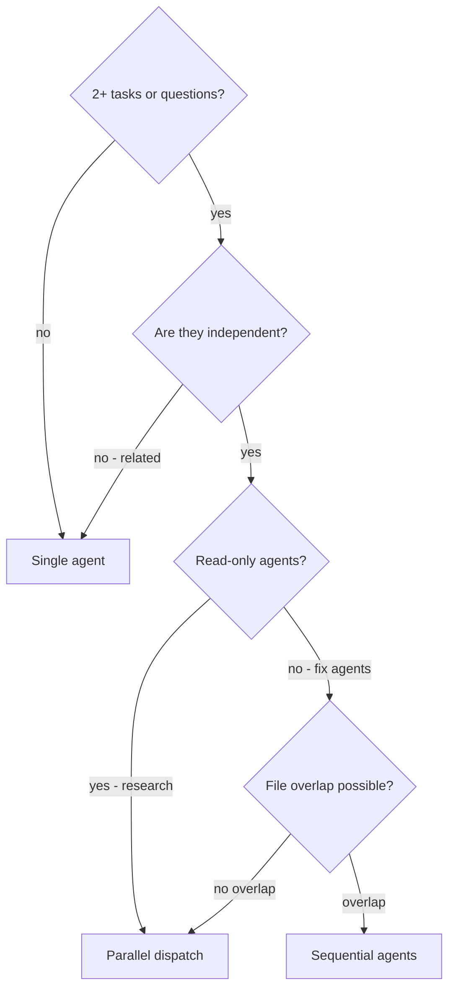

# Plan: Parallel Agent Dispatch — supporting file for workflow-protocols

## Context

From cross-review Superpowers (QW-5): adapt the pattern of dispatching one agent per independent problem domain. Superpowers encapsulates this in `skills/dispatching-parallel-agents/SKILL.md` — decision flowchart, prompt structure, conflict detection.

Claude Kit already has a partial implementation: code-researcher supports `run_in_background: true` in /planner Phase 3. But the pattern is not formalized — no decision criteria, no multi-dispatch template, no post-merge conflict check.

**Goal:** Add `parallel-dispatch.md` as a supporting file to `workflow-protocols` skill. Update SKILL.md — add event trigger. No architectural changes.

## Scope

### IN

- CREATE `.claude/skills/workflow-protocols/parallel-dispatch.md`
- MODIFY `.claude/skills/workflow-protocols/SKILL.md` — add protocol entry + event trigger
- Adapt decision flowchart for Claude Kit context (code-researcher multi-dispatch + future /coder debugging)
- Document existing background mode as part of the pattern

### OUT

- Changes to `/planner`, `/coder`, or other commands — documentation only
- New hooks or agents
- Changes to `workflow-architecture.md` (reference doc, not spec)

## Research (completed before writing plan)

### Superpowers — dispatching-parallel-agents

Key concepts from `superpowers-main/skills/dispatching-parallel-agents/SKILL.md`:

**Decision flowchart:**

```
Multiple tasks/failures?
  → Are they independent? (no shared state, fix-one doesn't fix-others)
    → Can they work in parallel? (no file conflicts)
      → Parallel dispatch (one agent per domain)
      → Sequential agents (shared state)
    → Single agent (related failures)
```

**4-step pattern:**

1. Identify independent domains (group by root cause area)
2. Create focused agent prompts (scope + goal + constraints + expected output)
3. Dispatch in parallel (all Task/Agent calls in one message)
4. Review and integrate (conflict check → full suite → spot check)

**Focused prompt structure (required fields):**

- Specific scope: one subsystem/file
- Clear goal: what to achieve
- Constraints: don't change other code
- Expected output: summary format

**Anti-patterns:** Too broad scope, no context, no constraints, vague output

### Claude Kit — existing background mode

From `workflow-architecture.md` and `commands/planner.md`:

- **Where used:** `/planner` Phase 3 (Research), complexity L/XL
- **Mechanism:** `Agent tool` with `run_in_background: true`
- **Async integration point:** /planner DESIGN phase — waits for background agent results
- **Limitation:** Read-only research only, not for fix/implementation

From `commands/workflow.md` (code_researcher_usage):

```yaml
invoked_by: "planner (Phase 3) and coder (Phase 1.5) — NOT by orchestrator"
mechanism: "Agent tool (run_in_background supported) or Task tool"
returns: "Structured summary ≤2000 tokens"
```

### Two usage contexts in Claude Kit

**Context 1: /planner Research Phase (EXISTING — background mode)**

- Multiple independent research questions (different parts of codebase)
- All agents read-only — no file conflicts by construction
- Parallel → always safe, no shared state

**Context 2: /coder — independent failing tests (FUTURE PATTERN — not yet implemented)**

- N test files with different root causes
- Agents may edit files — need file overlap check BEFORE dispatch
- Post-merge conflict detection mandatory
- NOTE: /coder does not currently dispatch multiple Task agents for debugging. This section documents the target pattern for future adoption.

### SKILL.md — current state

Workflow-protocols already has event triggers for:

- "Completing a phase → Checkpoint Protocol"
- "Forming handoff → Handoff Protocol"
- "Mismatch signal → Re-routing"
- "All phases done → Pipeline Metrics"

**Gap:** no trigger for "multiple independent research questions" or "independent failures".

## Architecture Decision

**Location:** `.claude/skills/workflow-protocols/parallel-dispatch.md`

- Rationale: Pattern belongs to orchestration (how /workflow and /planner coordinate agents), not to a specific phase (planner-rules) or implementation (coder-rules)
- Superpowers equivalent: separate skill; ours — supporting file inside workflow-protocols (less overhead, no need for separate SKILL.md)

**Load trigger:** "Multiple independent research questions OR independent failures identified"

- Loaded on-demand, not at startup (event-driven model of workflow-protocols)

**Integration with background mode:** parallel-dispatch.md describes the pattern; existing background mode code-researcher is a concrete implementation for Research Use Case. Document unifies both cases under one pattern.

## Parts

### Part 1: Create parallel-dispatch.md

**File:** `.claude/skills/workflow-protocols/parallel-dispatch.md`

**YAML frontmatter (exact):**

```yaml
---
name: parallel-dispatch
description: Multi-agent dispatch patterns for independent research questions and failure investigation. Load when /planner or /coder identifies 2+ independent tasks.
disable-model-invocation: true
---
```

**Sections:**

#### 1. Overview (2-3 sentences)

- When parallel dispatch is faster than sequential
- Key condition: independence (no shared state, no file conflicts)

#### 2. Decision Flowchart (Mermaid)



#### 3. Use Case 1: Research Multi-Dispatch — /planner Phase 3 (EXISTING)

When to use:

- L/XL complexity, 3+ independent research questions
- Different packages/layers (handler vs service vs repository)
- Each question is self-contained

Pattern:

```text
// Dispatch ALL background agents in one message
Agent("Explore handler layer patterns", run_in_background: true)
Agent("Explore service layer patterns", run_in_background: true)
Agent("Explore repository layer patterns", run_in_background: true)
// Continue DESIGN phase with direct findings
// Async integration point: check results before finalizing design
```

Focused prompt template for code-researcher:

```text
Research question: [specific question]
Scope: [package/directory]
Focus areas: [what to look for]
Return: structured summary ≤2000 tokens (patterns, files, imports, key snippets)
```

Async integration point:

- Check results at transition to DESIGN
- If late findings contradict design → inline revision (≤1 part) or re-evaluate

#### 4. Use Case 2: Independent Failure Investigation — /coder debugging (FUTURE PATTERN)

> **NOTE:** This is a planned pattern, not yet implemented. /coder does not currently dispatch multiple Task agents for debugging. Document describes the target architecture for future adoption.

When to use:

- 3+ test files failing with different root causes
- Independent subsystems (abort logic ≠ batch completion ≠ race conditions)
- NO shared state between investigations

Pre-dispatch checklist (MANDATORY):

```text
□ Failures confirmed independent (fix-one doesn't fix-others)?
□ File overlap check: agents edit different files?
□ No shared mocks or test fixtures?
```

Pattern:

```text
// After independence check
Task("Investigate and fix [failure domain A]")
Task("Investigate and fix [failure domain B]")
Task("Investigate and fix [failure domain C]")
// Wait for ALL to complete
// Post-merge conflict detection (section 5)
```

Focused prompt template:

```text
Fix failing tests in [specific file/subsystem]:
- [test name 1]: [expected behavior]
- [test name 2]: [expected behavior]

Root cause area: [timing/race condition/data structure/etc.]

Constraints:
- Do NOT change [other files]
- Fix tests only, don't refactor production code

Return: root cause identified + changes made (file:line)
```

#### 5. Post-Merge Conflict Detection

After all agents return results:

```text
1. Read each summary (what each agent changed)
2. Check file overlap: git diff --name-only per agent's changes
3. If overlap detected → manual review of conflicting sections
4. Run full test suite (not just targeted tests)
5. Spot check: agents can make systematic errors
```

Red flags after merge:

- Two agents edited the same file → review both changes
- One agent's fix broke another agent's test → related problems, not independent

#### 6. Common Mistakes

- Too broad scope → agent gets lost
- No constraints → agent refactors everything
- Related failures dispatched in parallel → conflicts and races
- Skip post-merge conflict check → hidden incompatibilities

#### 7. When NOT to Use

- Failures related (fix one might fix others) → single agent + systematic debugging
- Exploratory debugging (root cause unknown) → investigate first, dispatch after
- Shared state (same config, same db, same mock) → sequential

### Part 2: Update SKILL.md workflow-protocols

**File:** `.claude/skills/workflow-protocols/SKILL.md`

**Changes (3 additions):**

1. Add to Protocol Overview table:

```markdown
| Parallel Dispatch | Multiple independent research questions OR independent failures | Multi-agent dispatch patterns (research + future debugging) |
```

2. Add to Event Triggers section:

```markdown
- Multiple independent tasks identified (L/XL planner research, or independent failures) → read [Parallel Dispatch](parallel-dispatch.md)
```

3. Add to Protocol References section:

```markdown
- [Parallel Dispatch](parallel-dispatch.md) — decision flowchart, research multi-dispatch, failure isolation, conflict detection
```

## Files Summary

- CREATE `.claude/skills/workflow-protocols/parallel-dispatch.md`
- MODIFY `.claude/skills/workflow-protocols/SKILL.md` (add 3 lines)

## Acceptance Criteria

- [ ] `parallel-dispatch.md` created with valid Mermaid decision flowchart
- [ ] YAML frontmatter includes `disable-model-invocation: true`
- [ ] Use Case 1 (research multi-dispatch) documents existing background mode as part of pattern
- [ ] Use Case 2 (independent failures) labeled "FUTURE PATTERN" with explicit note
- [ ] Use Case 2 contains pre-dispatch checklist with file overlap check
- [ ] Post-merge conflict detection — concrete steps (not abstract)
- [ ] Focused prompt templates for both use cases
- [ ] Common Mistakes and When NOT to Use sections present
- [ ] SKILL.md updated: Protocol Overview table + Event Triggers + Protocol References
- [ ] File ≤250 lines (supporting file, not main SKILL.md)
- [ ] YAML-first format (minimal prose, bullet-driven)

## Testing Plan

Documentation task — no code tests.

Verification:

- Read parallel-dispatch.md, verify all 7 sections present
- Check Mermaid flowchart syntax validity
- Verify SKILL.md updated correctly (table + triggers + references)
- Verify Use Case 1 references existing background mode (not inventing new mechanism)
- Verify Use Case 2 has "FUTURE PATTERN" label

## Handoff Notes

All research completed in this plan. Implementer (coder) can work directly — no additional filesystem reads needed, except spot-checking existing files.

Key decisions:

- parallel-dispatch.md — supporting file (not separate skill package)
- Two use cases clearly separated: read-only research (always safe) vs fix-agents (needs pre-check, FUTURE)
- Post-merge conflict detection — concrete process, not abstract principle
- Flowchart in Mermaid (not dot — Claude Kit standard)
- File ≤250 lines — maintaining size limit for workflow-protocols supporting files
- `disable-model-invocation: true` — this is a protocol reference, not a skill to invoke
