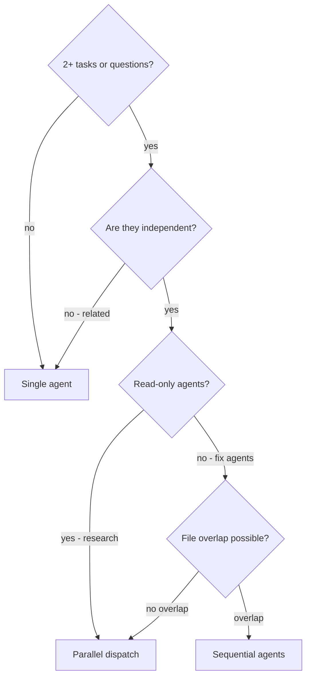

# Parallel Dispatch Protocol

Parallel dispatch is faster than sequential when 2+ tasks are independent — no shared state, no file conflicts. Key condition: each agent operates on its own scope with no overlap. Each agent gets constructed context (not inherited session history) — this keeps agents focused and preserves the caller's context for coordination.

## Decision Flowchart



## Use Case 1: Research Multi-Dispatch — /planner Phase 3 (EXISTING)

When to use:
- L/XL complexity, 3+ independent research questions
- Different packages/layers (handler vs service vs repository)
- Each question is self-contained

Pattern:
```text
// Dispatch ALL background agents in one message
Agent("Explore handler layer patterns", run_in_background: true)
Agent("Explore service layer patterns", run_in_background: true)
Agent("Explore repository layer patterns", run_in_background: true)
// Continue DESIGN phase with direct findings
// Async integration point: check results before finalizing design
```

Focused prompt template for code-researcher:
```text
Research question: [specific question]
Scope: [package/directory]
Focus areas: [what to look for]
Return: structured summary ≤2000 tokens (patterns, files, imports, key snippets)
```

Async integration point:
- Check results at transition to DESIGN
- If late findings contradict design → inline revision (≤1 part) or re-evaluate

## Use Case 2: Independent Failure Investigation — /coder debugging (FUTURE PATTERN)

> **NOTE:** This is a planned pattern, not yet implemented. /coder does not currently dispatch multiple Task agents for debugging. Document describes the target architecture for future adoption.

When to use:
- 3+ test files failing with different root causes
- Independent subsystems (abort logic ≠ batch completion ≠ race conditions)
- NO shared state between investigations

Pre-dispatch checklist (MANDATORY):
```text
□ Failures confirmed independent (fix-one doesn't fix-others)?
□ File overlap check: agents edit different files?
□ No shared mocks or test fixtures?
```

Pattern:
```text
// After independence check
Task("Investigate and fix [failure domain A]")
Task("Investigate and fix [failure domain B]")
Task("Investigate and fix [failure domain C]")
// Wait for ALL to complete
// Post-merge conflict detection (section below)
```

Focused prompt template:
```text
Fix failing tests in [specific file/subsystem]:
- [test name 1]: [expected behavior]
- [test name 2]: [expected behavior]

Root cause area: [timing/race condition/data structure/etc.]

Constraints:
- Do NOT change [other files]
- Fix tests only, don't refactor production code

Return: root cause identified + changes made (file:line)
```

## Post-Merge Conflict Detection

After all agents return results:

1. Read each summary (what each agent changed)
2. Check file overlap: `git diff --name-only` per agent's changes
3. If overlap detected → manual review of conflicting sections
4. Run full test suite (not just targeted tests)
5. Spot check: agents can make systematic errors

Red flags after merge:
- Two agents edited the same file → review both changes
- One agent's fix broke another agent's test → related problems, not independent

## Key Benefits

- **Parallelization** — multiple investigations happen simultaneously (3 problems in time of 1)
- **Focus** — each agent has narrow scope, less context to track
- **Independence** — agents don't interfere with each other
- **Context preservation** — caller's context stays clean for coordination

Example: /planner Phase 3, L-complexity — 3 code-researchers dispatched in parallel across handler/service/repository layers, each returning ≤2000 token summary. Planner integrates all findings at DESIGN phase async integration point.

## Common Mistakes

- Too broad scope → agent gets lost
- No constraints → agent refactors everything
- Related failures dispatched in parallel → conflicts and races
- Skip post-merge conflict check → hidden incompatibilities

## When NOT to Use

- Failures related (fix one might fix others) → single agent + systematic debugging
- Exploratory debugging (root cause unknown) → investigate first, dispatch after
- Shared state (same config, same db, same mock) → sequential
