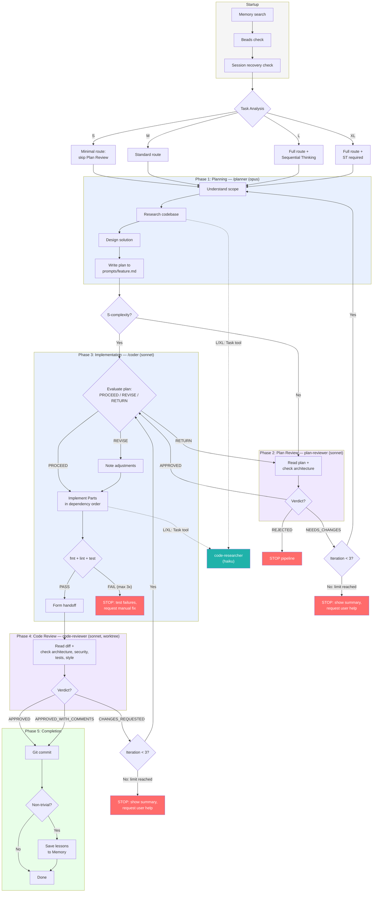
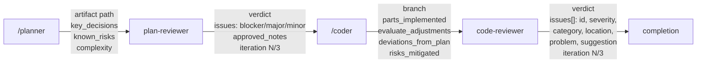
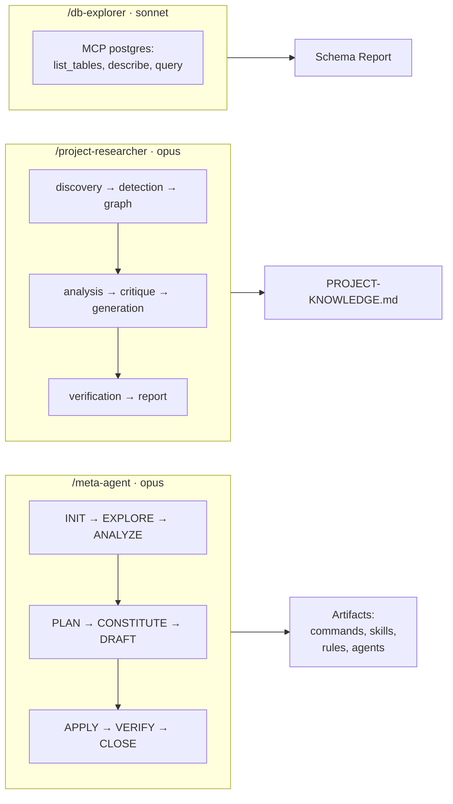
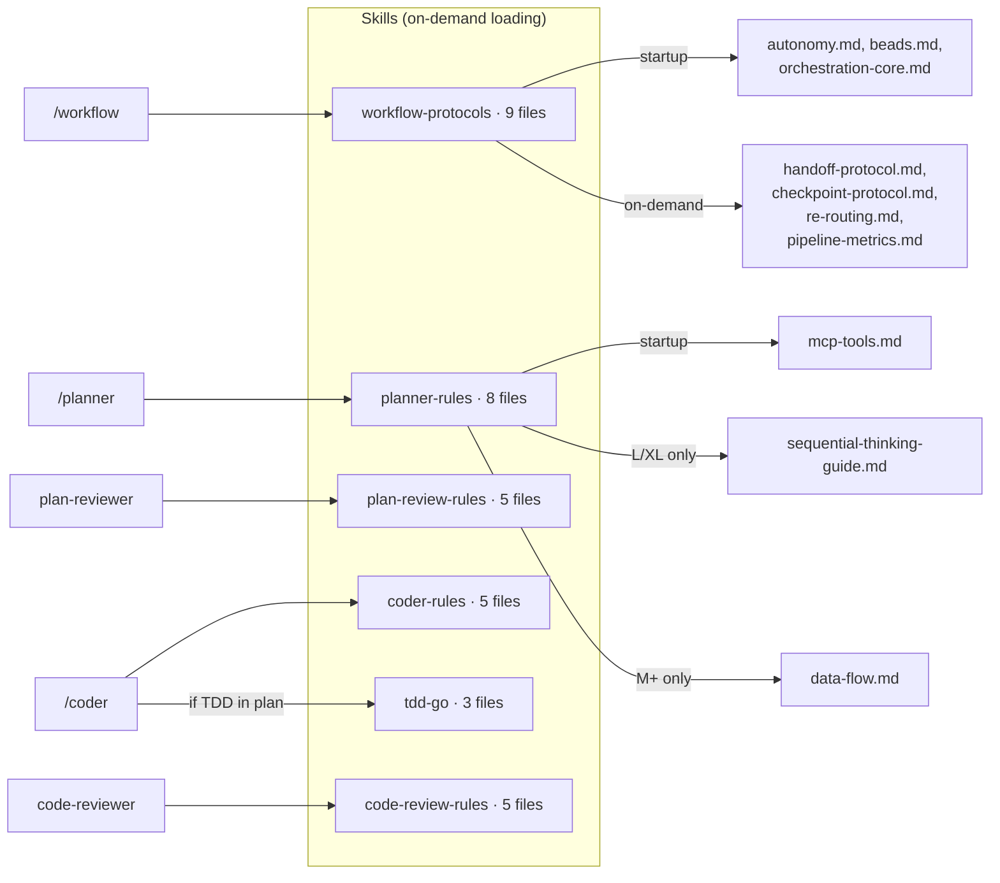
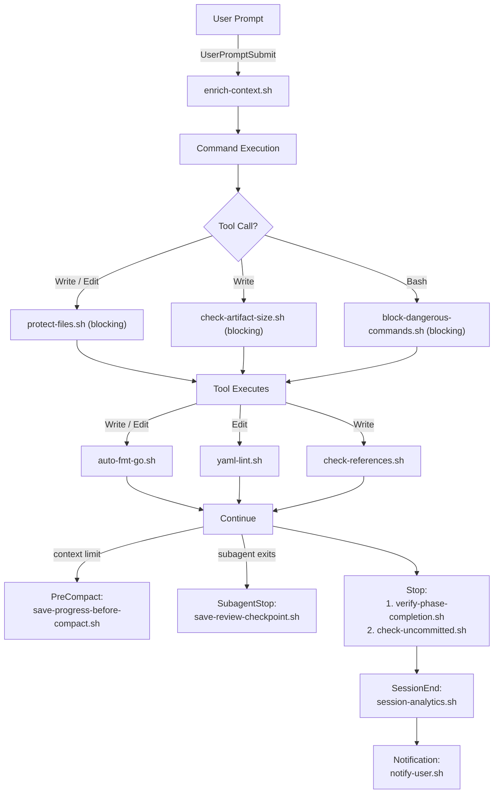

# Claude Kit

Reusable configuration kit for [Claude Code](https://docs.anthropic.com/en/docs/claude-code) that provides a structured multi-agent development workflow with built-in planning, implementation, and code review phases.

Supports any language and framework — Go, Python, TypeScript, Rust, Java, and 26 more via tree-sitter analysis.

## Quick Start

### Installation

Copy the kit into your project:

```bash
cp -r .claude/ /path/to/your/project/
cp CLAUDE.md /path/to/your/project/
cp .gitignore /path/to/your/project/   # or merge with existing

# Optional: create personal settings overrides
cp .claude/settings.local.json.example /path/to/your/project/.claude/settings.local.json
```

### First Steps

```bash
# Initialize .claude/ configuration for the project
/meta-agent onboard

# Analyze codebase and generate PROJECT-KNOWLEDGE.md
/project-researcher
```

## Commands

### `/workflow` — Full Development Cycle

The main command that orchestrates the entire development process. Executes all phases sequentially with user confirmation between steps.

**Pipeline:** task-analysis → planner → plan-review → coder → code-review

```bash
/workflow Add new REST endpoint for profiles
/workflow --auto Implement resource update         # autonomous mode, no confirmations
/workflow --from-phase 3                            # resume from specified phase
/workflow --minimal Add field to model              # minimal research, critical checks only
```

**Modes:**

- **INTERACTIVE** (default) — confirmation before each phase
- **AUTONOMOUS** (`--auto`) — all phases automatically, no confirmations
- **RESUME** (`--from-phase N`) — resume from specified phase
- **MINIMAL** (`--minimal`) — minimal research, critical checks only

**Phases:**

1. **Task Analysis** — task complexity classification (S/M/L/XL) and route selection
2. **Planning** — codebase research, implementation plan creation
3. **Plan Review** — plan validation against architecture (skipped for S-complexity)
4. **Implementation** — code writing strictly per approved plan, running tests
5. **Code Review** — change review: architecture, security, quality

**Result:** implemented, tested, and reviewed code with a git commit.

---

### `/planner` — Implementation Planning

Researches the codebase and creates a detailed implementation plan with code examples and acceptance criteria. Does not modify project files.

```bash
/planner Add pagination to list endpoint
/planner --minimal Add field to model               # minimal plan without deep research
```

**Result:** plan file at `.claude/prompts/{feature}.md`

---

### `/coder` — Code Implementation

Implements code strictly per approved plan. Runs formatting, linting, and tests after implementation.

```bash
/coder                          # auto-find plan in prompts/
/coder my-feature               # implement specific plan
```

**Result:** working code with passing tests + evaluate output with deviation documentation.

---

### `/review-checklist` — Review Checklist Reference

Displays the code review checklist: architecture, security (OWASP), code quality, performance. Used as a reference for manual or automated reviews.

```bash
/review-checklist
```

---

### `/meta-agent` — Artifact Lifecycle Manager

Creates, enhances, audits, and manages Claude Code artifacts (commands, skills, rules, agents). 9-phase workflow with quality gates.

```bash
/meta-agent onboard                    # initialize .claude/ for a new project
/meta-agent create command my-cmd      # create a new slash command
/meta-agent create skill my-skill      # create a new reusable skill
/meta-agent create agent my-agent      # create a new agent
/meta-agent enhance command my-cmd     # improve an existing artifact
/meta-agent audit                      # quality report for all artifacts
/meta-agent delete rule my-rule        # delete an artifact
/meta-agent rollback                   # rollback last change
/meta-agent list                       # list all artifacts
```

**Session management:**

```bash
/meta-agent --resume {run_id}          # resume from last checkpoint
/meta-agent abort {run_id}             # mark run as aborted
/meta-agent cleanup                    # remove runs older than 7 days
```

**Flags:**

- `--dry-run` — preview changes without applying
- `--track` — enable task tracking via beads
- `--explore` — force Tree of Thought in planning phase

**Artifact types:** `command`, `skill`, `rule`, `agent`

---

### `/project-researcher` — Project Analysis

Autonomous agent for deep codebase analysis: architecture, dependencies, and DB schema. Generates `PROJECT-KNOWLEDGE.md` used by other commands as context.

Architecture: orchestrator + 7 specialized subagents (detection, discovery, graph, analysis, generation, verification, report).

```bash
/project-researcher
```

---

### `/db-explorer` — Database Explorer

Explores PostgreSQL schema and data via MCP. Requires configured `postgres` MCP server.

```bash
/db-explorer                    # explore entire schema
/db-explorer users              # explore specific table
```

## Which Command to Use

| Scenario | Command |
|---|---|
| Full feature implementation from scratch | `/workflow` |
| Quick implementation of a simple task | `/workflow --minimal` |
| Autonomous implementation without confirmations | `/workflow --auto` |
| Need a plan before writing code | `/planner` |
| Plan approved, need implementation | `/coder` |
| Setting up kit in a new project | `/meta-agent onboard` |
| Creating new commands/skills/agents | `/meta-agent create` |
| Preview artifact changes | `/meta-agent enhance --dry-run` |
| Understand project structure | `/project-researcher` |
| Explore DB schema | `/db-explorer` |

## Architecture

The system is a **5-phase development pipeline** managed by the orchestrator (`/workflow`), which sequentially delegates work to specialized agents. Each agent has a strictly defined responsibility zone, model assignment, and skill set.

### Development Pipeline



**Color legend:** blue background = commands (opus/sonnet), purple background = review agents, green = completion, red = stop conditions, teal = haiku agent

### Handoff Data Flow



### Standalone Commands



### Skill Loading



### Hook Lifecycle



### Model Routing

| Model | Components | MaxTurns | Purpose |
| ------- | --------- | ------- | ------- |
| **opus** | /workflow, /planner, /project-researcher, /meta-agent | — | Deep reasoning, orchestration, planning |
| **sonnet** | /coder, plan-reviewer, code-reviewer, /db-explorer | 30 | Implementation, review, execution |
| **haiku** | code-researcher, PR subagents (discovery, report) | 20 | Fast read-only search |

### Complexity Routing

| Complexity | Parts | Layers | Plan Review | Sequential Thinking | code-researcher |
| ------- | ------- | ------- | ------- | ------- | ------- |
| **S** | 1 | 1 | skip | not needed | skip |
| **M** | 2–3 | 2 | standard | as needed | skip |
| **L** | 4–6 | 3+ | standard | recommended | yes |
| **XL** | 7+ | 4+ | standard | required | yes |

### Key Principles

- **Sequential execution** — phases don't run in parallel
- **Handoff Protocol** — 4 typed payload contracts between phases with narrative casting
- **Context Isolation** — review phases run as isolated subagents (clean context, no authorship bias)
- **Loop Limits** — max 3 iterations per review cycle, then STOP and ask user
- **Checkpoint Protocol** — state saved after each phase for session recovery (12 YAML fields)
- **Evaluate Protocol** — coder critically evaluates plan before implementation (PROCEED/REVISE/RETURN gate)
- **Conditional Deps Loading** — S-complexity skips heavy skill loading, saves ~6,300 tokens
- **Re-Routing** — pipeline adjusts route on complexity mismatch (downgrade/upgrade)

## MCP Servers

Configure in `~/.claude/mcp.json`:

**Required:**

- `memory` (@modelcontextprotocol/server-memory) — persistent agent memory across sessions
- `context7` (@upstash/context7-mcp) — library documentation lookup
- `sequential-thinking` — structured reasoning for complex tasks

**Optional:**

- `postgres` (@anthropic/mcp-postgres) — required for `/db-explorer`
- `tree_sitter` — code analysis (symbols, dependencies, repo-map)

## Project Structure

```
.claude/
├── agents/                # Autonomous agents
│   ├── meta-agent/        # Artifact lifecycle management (deps, scripts, templates)
│   ├── project-researcher/# Codebase analysis (7 subagents, AST analysis, scoring)
│   ├── db-explorer/       # PostgreSQL exploration
│   ├── plan-reviewer.md   # Plan validation agent (invoked by /workflow)
│   ├── code-reviewer.md   # Code review agent (invoked by /workflow)
│   └── code-researcher.md # Codebase exploration agent
├── commands/              # Slash commands (/workflow, /planner, /coder, etc.)
├── skills/                # Reusable domain knowledge
│   ├── workflow-protocols/# Orchestration, handoff, checkpoints, re-routing
│   ├── planner-rules/     # Planning methodology, task analysis, data flow
│   ├── coder-rules/       # Implementation rules, MCP tools
│   ├── plan-review-rules/ # Architecture checks, required sections
│   ├── code-review-rules/ # Security checklist (OWASP), review checklists
│   └── tdd-go/            # TDD workflow for Go projects
├── templates/             # Templates for creating new artifacts
├── prompts/               # Generated implementation plans
├── scripts/               # Lifecycle hook scripts (10 scripts)
├── rules/                 # Cross-cutting constraints (architecture rules)
├── workflow-state/        # Runtime state (gitignored, generated during workflow)
├── agent-memory/          # Agent-specific persistent memory
├── archive/               # Archived artifacts
├── worktrees/             # Git worktree management
├── settings.json          # Claude Code project settings + hooks (git-committed)
├── settings.local.json.example  # Template for personal overrides
└── PROJECT-KNOWLEDGE.md   # Auto-generated project knowledge base
```

## Hooks

The kit includes hooks (configured in `.claude/settings.json`) that enforce quality automatically:

| Hook | Trigger | Purpose |
| ------ | --------- | --------- |
| `scripts/protect-files.sh` | PreToolUse (Write/Edit) | Protect critical config files from agent modification |
| `agents/meta-agent/scripts/check-artifact-size.sh` | PreToolUse (Write) | Block writes exceeding size thresholds |
| `scripts/block-dangerous-commands.sh` | PreToolUse (Bash) | Block destructive shell commands |
| `scripts/auto-fmt-go.sh` | PostToolUse (Write/Edit) | Auto-format Go code |
| `agents/meta-agent/scripts/yaml-lint.sh` | PostToolUse (Edit) | Validate YAML structure |
| `agents/meta-agent/scripts/check-references.sh` | PostToolUse (Write) | Validate all file references |
| `scripts/enrich-context.sh` | UserPromptSubmit | Enrich prompt with project context |
| `scripts/save-progress-before-compact.sh` | PreCompact | Save checkpoint before context compaction |
| `scripts/save-review-checkpoint.sh` | SubagentStop | Persist review completion state |
| `agents/meta-agent/scripts/verify-phase-completion.sh` | Stop | Ensure all meta-agent phases completed |
| `scripts/check-uncommitted.sh` | Stop | Warn on uncommitted changes |
| `scripts/session-analytics.sh` | SessionEnd | Record session analytics |
| `scripts/notify-user.sh` | Notification | Desktop notifications for agent events |

## Conventions

- Artifacts use YAML-first format (>80% YAML, minimal prose)
- Language: English for code, YAML keys, and artifact specs
- Size limits enforced by hooks (`check-artifact-size.sh`)
- Examples use grep/glob patterns to find current code, not hardcoded snippets
