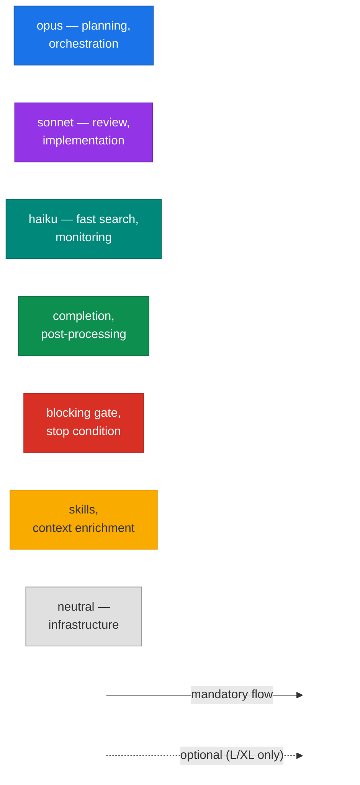
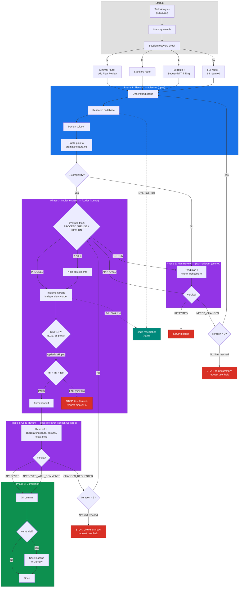
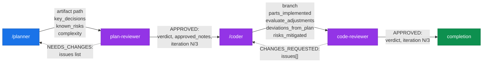
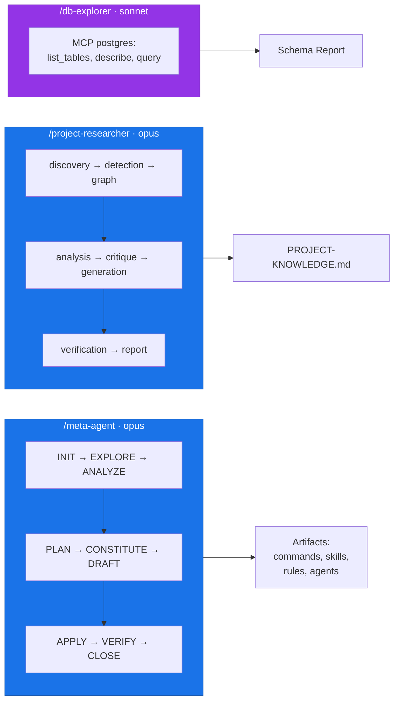
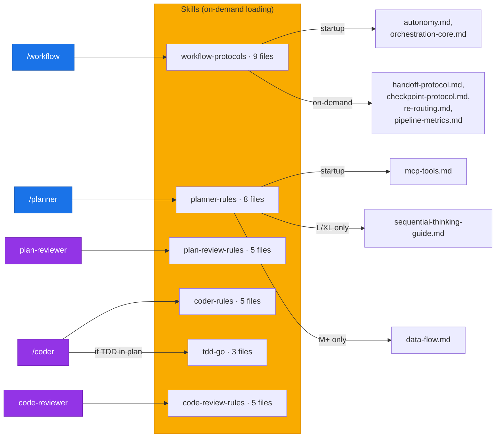
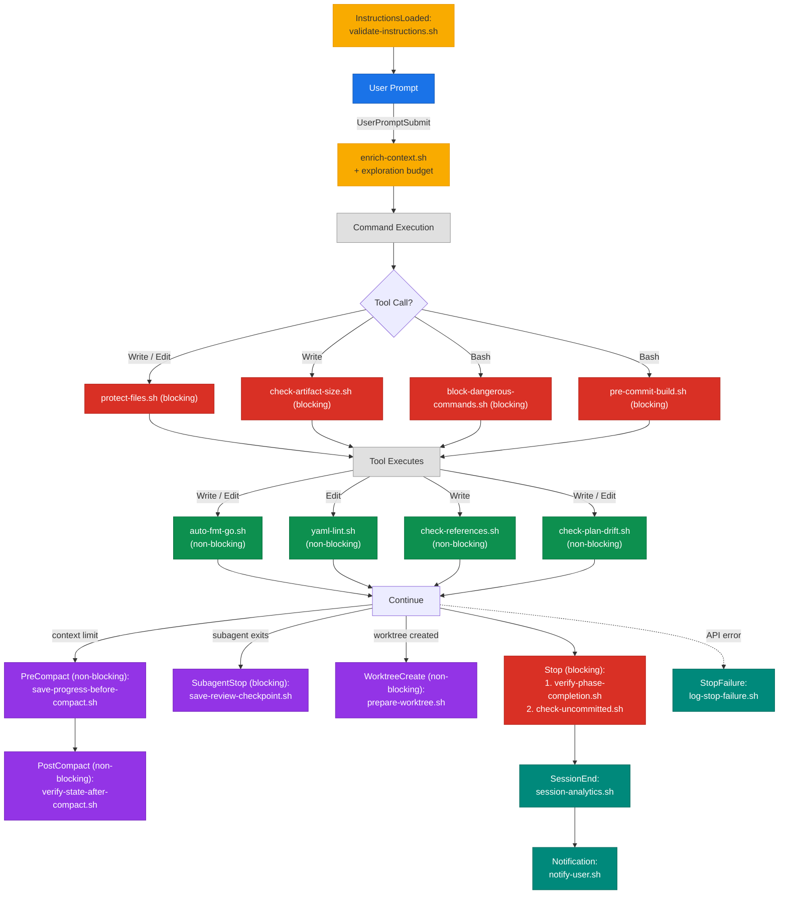

<p align="center">
  <strong>Claude Kit</strong><br/>
  Reusable configuration kit for <a href="https://docs.anthropic.com/en/docs/claude-code">Claude Code</a>
</p>

<p align="center">
  
  
  
  
  
</p>

---

Structured multi-agent development workflow with built-in planning, implementation, and code review phases. Supports any language and framework — Go, Python, TypeScript, Rust, Java, and 26 more via tree-sitter analysis.

---

## 📑 Table of Contents

- [⚡ Quick Start](#-quick-start)
- [🔧 Commands](#-commands)
- [🏗 Architecture](#-architecture)
- [🔌 MCP Servers](#-mcp-servers)
- [📂 Project Structure](#-project-structure)
- [🪝 Hooks](#-hooks)
- [📐 Conventions](#-conventions)

---

## ⚡ Quick Start

### Installation

```bash
curl -sL https://raw.githubusercontent.com/hex0xdeadbeef/claude-kit/main/install.sh | bash
```

### Update existing installation

```bash
bash install.sh --update
```

### First Steps

```bash
# 1. Edit CLAUDE.md — update Language Profile to match your project stack
# 2. Analyze codebase and generate PROJECT-KNOWLEDGE.md
/project-researcher

# 3. Validate configuration
/meta-agent onboard
```

### Options

```bash
KIT_VERSION=v1.0.0 bash install.sh    # install specific version
INSTALL_DIR=/path/to/project bash install.sh --update   # install to specific directory
```

<details>
<summary>Manual Installation (advanced)</summary>

```bash
git clone https://github.com/hex0xdeadbeef/claude-kit.git
cd claude-kit
bash install.sh                        # install to current directory
bash install.sh --update               # update existing installation

# Or copy manually:
cp -r .claude/ /path/to/your/project/
cp CLAUDE.md /path/to/your/project/
# Merge .gitignore manually

# Optional: personal settings overrides (gitignored, never overwritten by updates)
cp .claude/settings.local.json.example /path/to/your/project/.claude/settings.local.json
```

</details>

---

## 🔧 Commands

### `/workflow` — Full Development Cycle

The main command that orchestrates the entire development process. Executes all phases sequentially with user confirmation between steps.

**Pipeline:** `task-analysis` → `designer*` → `planner` → `plan-review` → `coder` → `code-review`

\* designer runs for L/XL tasks only. S/M skip to planner.

```bash
/workflow Add new REST endpoint for profiles
/workflow --auto Implement resource update         # autonomous mode, no confirmations
/workflow --from-phase 3                            # resume from specified phase
/workflow --from-phase 0.7                           # resume from design phase
```

<details>
<summary>⚙️ Modes & Phases</summary>

**Modes:**

| Mode | Flag | Description |
|------|------|-------------|
| Interactive | *(default)* | Confirmation before each phase |
| Autonomous | `--auto` | All phases automatically, no confirmations |
| Resume | `--from-phase N` | Resume from specified phase |

**Phases:**

| # | Phase | Description |
|---|-------|-------------|
| 1 | Task Analysis | Complexity classification (S/M/L/XL) and route selection |
| 1.5 | Design | Requirements exploration + approach selection *(L/XL only, optional for M new_feature/integration)* |
| 2 | Planning | Codebase research, implementation plan creation |
| 3 | Plan Review | Plan validation against architecture *(skipped for S-complexity)* |
| 4 | Implementation | Code writing strictly per approved plan, running tests |
| 5 | Code Review | Change review: architecture, security, quality |
| 6 | Completion | Git commit + lessons learned *(if non-trivial)* |

</details>

**Result:** implemented, tested, and reviewed code with a git commit.

---

### `/planner` — Implementation Planning

Researches the codebase and creates a detailed implementation plan with code examples and acceptance criteria. Does not modify project files.

```bash
/planner Add pagination to list endpoint
/planner --minimal Add field to model               # minimal plan without deep research
```

**Result:** plan file at `.claude/prompts/{feature}.md`

---

### `/coder` — Code Implementation

Implements code strictly per approved plan. Runs formatting, linting, and tests after implementation.

```bash
/coder                          # auto-find plan in prompts/
/coder my-feature               # implement specific plan
```

**Result:** working code with passing tests + evaluate output with deviation documentation.

---

### `/meta-agent` — Artifact Lifecycle Manager

Creates, enhances, audits, and manages Claude Code artifacts (commands, skills, rules, agents). 9-phase workflow with quality gates.

<details>
<summary>📋 Usage examples</summary>

```bash
/meta-agent onboard                    # initialize .claude/ for a new project
/meta-agent create command my-cmd      # create a new slash command
/meta-agent create skill my-skill      # create a new reusable skill
/meta-agent create agent my-agent      # create a new agent
/meta-agent enhance command my-cmd     # improve an existing artifact
/meta-agent audit                      # quality report for all artifacts
/meta-agent delete rule my-rule        # delete an artifact
/meta-agent rollback                   # rollback last change
/meta-agent list                       # list all artifacts
```

**Session management:**

```bash
/meta-agent --resume {run_id}          # resume from last checkpoint
/meta-agent abort {run_id}             # mark run as aborted
/meta-agent cleanup                    # remove runs older than 7 days
```

**Flags:** `--dry-run` (preview) · `--explore` (Tree of Thought)

**Artifact types:** `command` · `skill` · `rule` · `agent`

</details>

---

### `/project-researcher` — Project Analysis

Autonomous agent for deep codebase analysis: architecture, dependencies, and DB schema. Generates `PROJECT-KNOWLEDGE.md` used by other commands as context.

Architecture: orchestrator + 7 specialized subagents (detection, discovery, graph, analysis, generation, verification, report).

```bash
/project-researcher
```

---

### `/db-explorer` — Database Explorer

Explores PostgreSQL schema and data via MCP. Requires configured `postgres` MCP server.

```bash
/db-explorer                    # explore entire schema
/db-explorer users              # explore specific table
```

---

### `/review-checklist` — Review Checklist Reference

Displays the code review checklist: architecture, security (OWASP), code quality, performance.

```bash
/review-checklist
```

---

### 🗺 Command Selection Guide

| Scenario | Command |
|----------|---------|
| Full feature implementation from scratch | `/workflow` |
| Autonomous implementation without confirmations | `/workflow --auto` |
| Need a plan before writing code | `/planner` |
| Plan approved, need implementation | `/coder` |
| Setting up kit in a new project | `/meta-agent onboard` |
| Creating new commands/skills/agents | `/meta-agent create` |
| Preview artifact changes | `/meta-agent enhance --dry-run` |
| Understand project structure | `/project-researcher` |
| Explore DB schema | `/db-explorer` |

---

## 🏗 Architecture

The system is a **5-phase development pipeline** managed by the orchestrator (`/workflow`), which sequentially delegates work to specialized agents. Each agent has a strictly defined responsibility zone, model assignment, and skill set.

<details>
<summary>🎨 Color Legend</summary>



</details>

<details>
<summary>🔄 Development Pipeline</summary>



</details>

<details>
<summary>📨 Handoff Data Flow</summary>



</details>

<details>
<summary>🧩 Standalone Commands</summary>



</details>

<details>
<summary>📦 Skill Loading</summary>



</details>

<details>
<summary>🪝 Hook Lifecycle</summary>



</details>

### ⚙️ Model Routing

| Model | Effort | Components | MaxTurns | Purpose |
|-------|--------|------------|----------|---------|
| **opus** | high | `/workflow`, `/planner`, `/project-researcher`, `/meta-agent` | — | Deep reasoning, orchestration, planning |
| **sonnet** | high | `/coder`, `plan-reviewer`, `code-reviewer`, `/db-explorer` | 30 | Implementation, review, execution |
| **haiku** | medium | `code-researcher`, PR subagents (discovery, report) | 20 | Fast read-only search |

### 📊 Complexity Routing

| Complexity | Parts | Layers | Plan Review | Sequential Thinking | code-researcher |
|------------|-------|--------|-------------|--------------------|-----------------|
| **S** | 1 | 1 | skip | not needed | skip |
| **M** | 2–3 | 2 | standard | as needed | skip |
| **L** | 4–6 | 3+ | standard | recommended | yes |
| **XL** | 7+ | 4+ | standard | required | yes |

### 🔑 Key Principles

- **Sequential execution** — phases don't run in parallel
- **Handoff Protocol** — 4 typed payload contracts between phases with narrative casting
- **Context Isolation** — review phases run as isolated subagents (clean context, no authorship bias)
- **Loop Limits** — max 3 iterations per review cycle, then STOP and ask user
- **Checkpoint Protocol** — state saved after each phase for session recovery (12 YAML fields)
- **Evaluate Protocol** — coder critically evaluates plan before implementation (PROCEED/REVISE/RETURN gate)
- **Conditional Deps Loading** — S-complexity skips heavy skill loading, saves ~6,300 tokens
- **Re-Routing** — pipeline adjusts route on complexity mismatch (downgrade/upgrade)
- **Cron Auto-Save** — periodic checkpoint auto-save for L/XL tasks via CronCreate (every 10min)
- **Simplify Protocol** — optional code simplification before review (L/XL, ≥5 parts, 30% guard)
- **Worktree Optimization** — sparse checkout via `worktree.sparsePaths` reduces worktree size in monorepos

---

## 🔌 MCP Servers

Configure in `~/.claude/mcp.json`:

### Required

| Server | Package | Purpose |
|--------|---------|---------|
| `context7` | `@upstash/context7-mcp` | Library documentation lookup |
| `sequential-thinking` | — | Structured reasoning for complex tasks |

### Optional

| Server | Package | Purpose |
|--------|---------|---------|
| `postgres` | `@anthropic/mcp-postgres` | Required for `/db-explorer` |
| `tree_sitter` | `mcp-server-tree-sitter` | Code analysis (symbols, deps, repo-map) — used by `/project-researcher` |

<details>
<summary>🔧 Installing tree_sitter MCP Server</summary>

The original `mcp-server-tree-sitter` v0.5.1 is incompatible with `py-tree-sitter >= 0.24` (removed `Query.captures()` API). Use the patched fork:

```bash
pipx install git+ssh://git@github.com/hex0xdeadbeef/mcp-server-tree-sitter.git
```

Then add to `~/.claude/mcp.json`:

```json
{
  "mcpServers": {
    "tree_sitter": {
      "command": "mcp-server-tree-sitter",
      "args": ["--stdio"]
    }
  }
}
```

</details>

---

## 📂 Project Structure

```
.claude/
├── agents/                # Autonomous agents
│   ├── meta-agent/        # Artifact lifecycle management (deps, scripts, templates)
│   ├── project-researcher/# Codebase analysis (7 subagents, AST analysis, scoring)
│   ├── db-explorer/       # PostgreSQL exploration
│   ├── plan-reviewer.md   # Plan validation agent (invoked by /workflow)
│   ├── code-reviewer.md   # Code review agent (invoked by /workflow)
│   └── code-researcher.md # Codebase exploration agent
├── commands/              # Slash commands (/workflow, /planner, /coder, etc.)
├── skills/                # Reusable domain knowledge
│   ├── workflow-protocols/# Orchestration, handoff, checkpoints, re-routing
│   ├── planner-rules/     # Planning methodology, task analysis, data flow
│   ├── coder-rules/       # Implementation rules, MCP tools
│   ├── plan-review-rules/ # Architecture checks, required sections
│   ├── code-review-rules/ # Security checklist (OWASP), review checklists
│   └── tdd-go/            # TDD workflow for Go projects
├── templates/             # Templates for creating new artifacts
├── prompts/               # Generated implementation plans
├── scripts/               # Lifecycle hook scripts (15 scripts)
├── rules/                 # Cross-cutting constraints (architecture rules)
├── workflow-state/        # Runtime state (gitignored, generated during workflow)
├── agent-memory/          # Agent-specific persistent memory
├── archive/               # Archived artifacts
├── worktrees/             # Git worktree management
├── settings.json          # Claude Code project settings + hooks (git-committed)
├── settings.local.json.example  # Template for personal overrides
└── PROJECT-KNOWLEDGE.md   # Auto-generated project knowledge base
```

---

## 🪝 Hooks

Configured in `.claude/settings.json`. Enforce quality automatically:

| Hook | Trigger | Purpose |
|------|---------|---------|
| `validate-instructions.sh` | InstructionsLoaded | Validate critical rules loaded into context |
| `enrich-context.sh` | UserPromptSubmit | Enrich prompt with project context + exploration budget |
| `protect-files.sh` | PreToolUse (Write/Edit) | Protect critical config files from agent modification |
| `check-artifact-size.sh` | PreToolUse (Write) | Block writes exceeding size thresholds |
| `block-dangerous-commands.sh` | PreToolUse (Bash) | Block destructive shell commands |
| `pre-commit-build.sh` | PreToolUse (Bash) | Validate `go build` before git commit |
| `auto-fmt-go.sh` | PostToolUse (Write/Edit) | Auto-format Go code |
| `yaml-lint.sh` | PostToolUse (Edit) | Validate YAML structure |
| `check-references.sh` | PostToolUse (Write) | Validate all file references |
| `check-plan-drift.sh` | PostToolUse (Write/Edit) | Detect plan drift during implementation |
| `save-progress-before-compact.sh` | PreCompact | Save checkpoint before context compaction |
| `verify-state-after-compact.sh` | PostCompact | Verify workflow state integrity after compaction |
| `save-review-checkpoint.sh` | SubagentStop | Persist review completion state |
| `prepare-worktree.sh` | WorktreeCreate | Prepare worktree environment for code review |
| `verify-phase-completion.sh` | Stop | Ensure all meta-agent phases completed |
| `check-uncommitted.sh` | Stop | Warn on uncommitted changes |
| `session-analytics.sh` | SessionEnd | Record session analytics |
| `log-stop-failure.sh` | StopFailure | Log API errors to session analytics |
| `notify-user.sh` | Notification | Desktop notifications for agent events |

---

## 📐 Conventions

- Artifacts use YAML-first format (>80% YAML, minimal prose)
- Language: English for code, YAML keys, and artifact specs
- Size limits enforced by hooks (`check-artifact-size.sh`)
- Examples use grep/glob patterns to find current code, not hardcoded snippets
