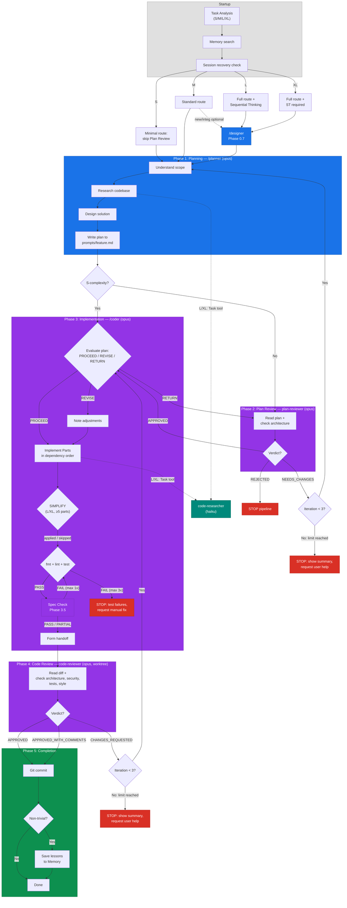
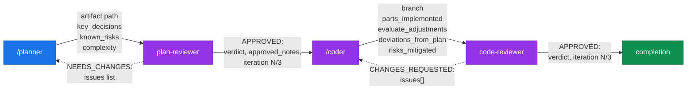
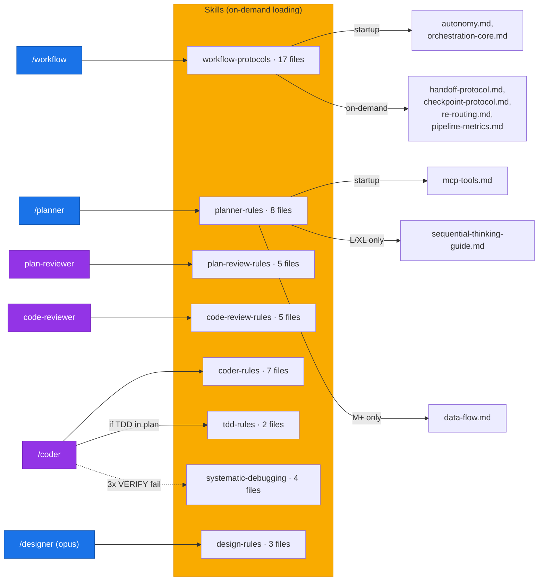
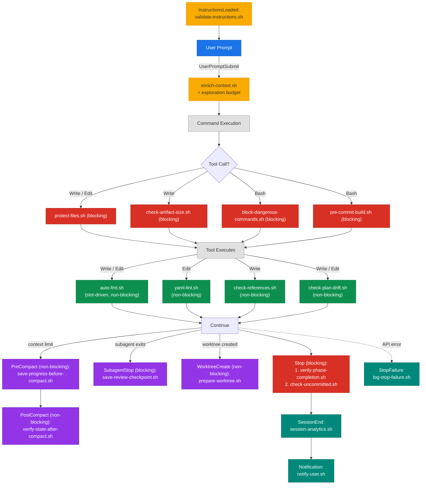

<p align="center">
  <strong>Claude Kit</strong><br/>
  Reusable configuration kit for <a href="https://docs.anthropic.com/en/docs/claude-code">Claude Code</a>
</p>

<p align="center">
  
</p>

---

Structured multi-agent development workflow with built-in planning, implementation, and code review phases. Supports any language and framework — Go, Python, TypeScript, Rust, Java, and 26 more via tree-sitter analysis.

> **Note:** Defaults are tuned for Go (sparse paths, `pre-commit-build.sh` runs `go build`, `CLAUDE.md` Language Profile pins Go ≥ 1.24). For other stacks: edit `CLAUDE.md` Language Profile, adjust `worktree.sparsePaths` in `.claude/settings.local.json`, and replace or disable the Go-specific build hook. See [⚙️ Configuration Files](#️-configuration-files).

---

## 📑 Table of Contents

- [⚡ Quick Start](#-quick-start)
- [⚙️ Configuration Files](#️-configuration-files)
  - [Configuration at a Glance](#configuration-at-a-glance)
  - [Files & Lifecycles](#files--lifecycles)
- [🔧 Commands](#-commands)
- [🏗 Architecture](#-architecture)
- [🪨 Token Optimization (Caveman)](#-token-optimization-caveman)
- [🔌 MCP Servers](#-mcp-servers)
- [📂 Project Structure](#-project-structure)
- [🪝 Hooks](#-hooks)
- [📐 Conventions](#-conventions)

---

## ⚡ Quick Start

Once installed, `/workflow` orchestrates planning → implementation → review → commit for any task. Three steps to a working kit:

1. **Install** the kit into your project root:

   ```bash
   curl -sL https://raw.githubusercontent.com/hex0xdeadbeef/claude-kit/main/install.sh | bash
   ```

2. **Generate project knowledge** so agents have context for your codebase:

   ```bash
   /project-researcher
   ```

   This writes `.claude/PROJECT-KNOWLEDGE.md` (architecture, modules, dependencies, language profile). Edit `CLAUDE.md` Language Profile first if your stack is not Go (the kit's default). Then run `/meta-agent onboard` for a one-time configuration sanity check.

3. **Start working** — let `/workflow` drive the full development cycle:

   ```bash
   /workflow Add new REST endpoint for profiles
   ```

Already using the kit? See **Updating an existing installation** below for the `--update` path.

<details>
<summary>Updating an existing installation</summary>

```bash
curl -sL https://raw.githubusercontent.com/hex0xdeadbeef/claude-kit/main/install.sh | bash -s -- --update
```

**Preserved across updates** (no manual restore needed):
- `.claude/settings.local.json` — personal overrides (existing behavior)
- `.claude/prompts/` — user feature plans (collisions become `<name>-old.md`)
- `.claude/skills/<custom>/` — custom skills not shipped in the kit
- `.claude/commands/<custom>.md`, `.claude/agents/<custom>.md` — user-added files
- Custom skills in `agents`/`commands` frontmatter `skills:` lists (deduplicated, idempotent)
- `.claude/PROJECT-KNOWLEDGE.md` — generated per-project by `/project-researcher`

**Backup:** A timestamped copy is created at `.claude.backup.YYYYMMDD_HHMMSS/` before the update.
**Soft dep:** `python3` is used to merge frontmatter skills. If absent, the update warns and proceeds without that step.

</details>

<details>
<summary>Install options (KIT_VERSION, INSTALL_DIR)</summary>

```bash
KIT_VERSION=v1.0.0 bash install.sh    # install specific version
INSTALL_DIR=/path/to/project bash install.sh --update   # install to specific directory
```

</details>

<details>
<summary>Manual installation (advanced)</summary>

```bash
git clone https://github.com/hex0xdeadbeef/claude-kit.git
cd claude-kit
bash install.sh                        # install to current directory
bash install.sh --update               # update existing installation

# Or copy manually:
cp -r .claude/ /path/to/your/project/
cp CLAUDE.md /path/to/your/project/
# Merge .gitignore manually

# Optional: personal settings overrides (gitignored, never overwritten by updates)
cp .claude/settings.local.json.example /path/to/your/project/.claude/settings.local.json
```

</details>

---

## ⚙️ Configuration Files

Five surfaces control kit behaviour: two settings files, one MCP file, one project-knowledge artifact, and the language profile inside `CLAUDE.md`. The **Configuration at a Glance** matrix below is the master index — every knob, where it lives, what it does, when to edit it, and where to find the deep-dive. **Files & Lifecycles** documents git status and ownership for each file. The four `### .claude/...` subsections below are the per-file deep-dives.

### Configuration at a Glance

Master index of every config knob exposed by the kit. The `Reference` column links to the deep-dive subsection in this section (or to `🪨 Token Optimization (Caveman)` for `CLAUDE_CAVEMAN_MODE`). Three install/global env vars (`KIT_VERSION`, `INSTALL_DIR`, `CLAUDE_CODE_DISABLE_ADAPTIVE_THINKING`) are not listed here — they activate during install or via the global Claude Code shell env, not via `.claude/settings.local.json`. They are documented in **Quick Start** > Install options and in [⚙️ Model Routing](#️-model-routing).

| Knob | Lives in | Controls | When to edit | Activation | Reference |
|------|----------|----------|--------------|------------|-----------|
| `CLAUDE_HANDOFF_VALIDATION_MODE` | `settings.local.json` env | strict-mode for IMP-01 schema validation of handoff JSON | tightening rollout | uncomment in env block | [Personal Overrides](#claudesettingslocaljsonexample--personal-overrides) |
| `CLAUDE_VERDICT_VALIDATION_MODE` | `settings.local.json` env | strict-mode for IMP-02 verdict envelope schema | tightening rollout | uncomment in env block | [Personal Overrides](#claudesettingslocaljsonexample--personal-overrides) |
| `CLAUDE_ISSUE_ID_VALIDATION_MODE` | `settings.local.json` env | strict-mode for IMP-03 canonical issue IDs | tightening rollout | uncomment in env block | [Personal Overrides](#claudesettingslocaljsonexample--personal-overrides) |
| `CLAUDE_PROJECT_KNOWLEDGE_MODE` | `settings.local.json` env | block `/workflow` startup if `PROJECT-KNOWLEDGE.md` missing/stub for M+ tasks | enforcing PK presence | uncomment in env block | [Personal Overrides](#claudesettingslocaljsonexample--personal-overrides) |
| `CLAUDE_PK_PATH_MODE` | `settings.local.json` env | block bare `PROJECT-KNOWLEDGE.md` references (without `.claude/` prefix) | strict reference checking | uncomment in env block | [Personal Overrides](#claudesettingslocaljsonexample--personal-overrides) |
| `CLAUDE_DELTA_REVIEW_MODE` | `settings.local.json` env | inject delta-only context into reviewers on iter ≥ 2 | speeding iter ≥ 2 reviews | `warn` or `strict` | [Personal Overrides](#claudesettingslocaljsonexample--personal-overrides) |
| `CLAUDE_CAVEMAN_MODE` | `settings.local.json` env | terse-output mode for `/workflow` runs | reducing Messages-token cost | `lite` (only mode in v1) | [🪨 Token Optimization (Caveman)](#-token-optimization-caveman) |
| `ENABLE_PROMPT_CACHING_1H` | `settings.local.json` env | extend cache TTL 5 min → 1H for non-subscription tier | API-key/Bedrock/Vertex/Foundry users | `1` (default ON in `.example`) | [Personal Overrides](#claudesettingslocaljsonexample--personal-overrides) |
| `FORCE_PROMPT_CACHING_5M` | `settings.local.json` env | force 5-min TTL regardless of tier | cost control for short S/M tasks | `1` (uncomment) | [Personal Overrides](#claudesettingslocaljsonexample--personal-overrides) |
| `GIT_STRIP_CO_AUTHOR` | `settings.local.json` env | strip `Co-Authored-By` from auto-generated commits | personal preference | `true` | [Personal Overrides](#claudesettingslocaljsonexample--personal-overrides) |
| `worktree.sparsePaths` | `settings.json` or `settings.local.json` | which subtrees `code-reviewer` worktree checks out | monorepos / large repos | edit JSON array | [Monorepo sparse paths](#claudesettingslocaljsonexample--personal-overrides) |
| `permissions.allow` / `permissions.deny` | `settings.local.json` | extra allow/deny rules merged with shared `settings.json` | per-machine overrides | edit JSON arrays | [Personal Overrides](#claudesettingslocaljsonexample--personal-overrides) |
| `.mcp.json` (3 servers) | gitignored after install | `sequential-thinking`, `context7`, `tree_sitter` MCP servers | personal/per-machine setup | `cp .mcp.json.example` | [`.mcp.json.example`](#mcpjsonexample--mcp-server-endpoints) |
| `.claude/PROJECT-KNOWLEDGE.md` | committed per-project | codebase analysis injected as agent context | once per project, refresh on architecture change | run `/project-researcher` | [Project Knowledge Base](#claudeproject-knowledgemd--project-knowledge-base) |
| `CLAUDE.md` > Language Profile | committed | language slots (`LANG_EXT`, `VERIFY_CMD`, etc.) cascade source | first-time install for non-Go stacks | edit `CLAUDE.md` directly | [Quick Start](#-quick-start) Step 2 |
| `.claude/.kit-version` | auto-managed | tracks installed kit version for `install.sh --update` | never (managed by `install.sh`) | n/a | auto-managed by `install.sh` |

### Files & Lifecycles

Each file has a different lifecycle and git status — copy the `.example` templates once after install, then customize per machine or per project.

| File | Git status (in your project) | Lifecycle | Purpose |
|------|------------------------------|-----------|---------|
| `.claude/settings.json` | committed | per-kit | Hooks, permissions, default model, MCP server registrations |
| `.claude/settings.local.json` | gitignored after `install.sh` (`.example` shipped) | personal / per-machine | Env overrides, extra permissions, monorepo sparse paths |
| `.mcp.json` | gitignored after `install.sh` (`.example` shipped) | personal / per-machine | MCP server endpoints (`sequential-thinking`, `context7`, `tree_sitter`) |
| `.claude/PROJECT-KNOWLEDGE.md` | committed (preserved on `--update`) | per-project | Auto-generated codebase analysis used as context by all agents |
| `.claude/.kit-version` | committed | per-installation | Tracks installed kit version for `install.sh --update` |

### `.claude/settings.local.json.example` — Personal Overrides

Copy once, then edit:

```bash
cp .claude/settings.local.json.example .claude/settings.local.json
```

Merge semantics vs `settings.json`: scalars override, arrays merge, `deny` wins over `allow`. The file is gitignored and **preserved across `install.sh --update`**.

<details>
<summary>📋 Env variables (activate by removing leading <code>_</code>)</summary>

| Variable | Default in `.example` | Effect |
|----------|----------------------|--------|
| `GIT_STRIP_CO_AUTHOR` | `false` | Strip `Co-Authored-By` lines from auto-generated commit messages |
| `CLAUDE_HANDOFF_VALIDATION_MODE` | `_strict` *(inactive)* | `strict` blocks writes of invalid handoff JSON; `warn` logs and continues (IMP-01) |
| `CLAUDE_VERDICT_VALIDATION_MODE` | `_strict` *(inactive)* | `strict` enforces VERDICT_JSON schema; otherwise falls back to regex extraction (IMP-02) |
| `CLAUDE_ISSUE_ID_VALIDATION_MODE` | `_strict` *(inactive)* | `strict` blocks verdict records whose `issues[].id` fails canonical pattern `^[PC]R-[0-9a-f]{8}$` (IMP-03); regex fallback still rescues verdict in `warn` |
| `CLAUDE_PROJECT_KNOWLEDGE_MODE` | `_strict` *(inactive)* | `strict` BLOCKS `/workflow` startup when `PROJECT-KNOWLEDGE.md` is missing or has placeholder values for M+ tasks |
| `CLAUDE_PK_PATH_MODE` | `_strict` *(inactive)* | `strict` blocks writes containing bare `PROJECT-KNOWLEDGE.md` references (without `.claude/` prefix) — caught by `meta-agent/check-references` |
| `ENABLE_PROMPT_CACHING_1H` | `1` | Extend prompt cache TTL 5 min → 1H for API-key/Bedrock/Vertex/Foundry users; noop on subscription tier (v2.1.108) |
| `FORCE_PROMPT_CACHING_5M` | `_1` *(inactive)* | Force 5-min TTL regardless of platform tier — cost control for short S/M tasks |
| `CLAUDE_DELTA_REVIEW_MODE` | `_warn` *(inactive)* | `warn` (HINT) / `strict` (FOCUS) injects delta-only context into reviewers on iter ≥2; `off` keeps full context |
| `CLAUDE_CAVEMAN_MODE` | `_lite` *(inactive)* | `lite` activates project-local caveman terse-output mode for `/workflow` parent session (orchestrator/designer/planner/coder); reviewer/researcher agents are exempt regardless via SubagentStart suspend hook. `off` disables entirely. See [🪨 Token Optimization (Caveman)](#-token-optimization-caveman) |

Top-level keys with leading `_` (e.g. `_comment`, `_env_comment`, `_worktree_comment`) are documentation, not env vars.

</details>

<details>
<summary>🌳 Monorepo sparse paths</summary>

Speed up `code-reviewer` worktree creation in 100k+ file repos by checking out only relevant subtrees:

```json
"worktree": {
  "sparsePaths": [".claude/", "src/", "tests/", "package.json"]
}
```

The shipped `.example` defaults to a Go layout (`internal/`, `cmd/`, `go.mod`, `go.sum`, `Makefile`). Override for your stack — JS, Python, Rust, monorepo packages, etc. Add `.claude/` if the reviewer needs to read project rules from inside the worktree.

</details>

### `.mcp.json.example` — MCP Server Endpoints

Per-machine config (gitignored after `install.sh`). Copy once if you don't have an existing `.mcp.json`:

```bash
cp .mcp.json.example .mcp.json   # fresh setup
# — or merge the relevant blocks into an existing .mcp.json
```

Ships with three servers:

| Server | Transport | Used by |
|--------|-----------|---------|
| `sequential-thinking` | `npx @modelcontextprotocol/server-sequential-thinking` | `/planner`, `/designer` on L/XL tasks (required) |
| `context7` | `npx @upstash/context7-mcp` (proxy-bypass env preset) | Library-docs lookup across coder/planner phases (required) |
| `tree_sitter` | `uvx --python python3.11 mcp-server-tree-sitter` | `/project-researcher` structural analysis (optional — agents fall back to grep) |

Install `uv` once for `uvx`: `curl -LsSf https://astral.sh/uv/install.sh | sh`. `npx` ships with Node.js. See [🔌 MCP Servers](#-mcp-servers) for required-vs-optional matrix.

### `.claude/PROJECT-KNOWLEDGE.md` — Project Knowledge Base

Auto-generated codebase analysis (architecture, modules, dependencies, language profile) consumed as context by `/planner`, `/coder`, `plan-reviewer`, and `code-reviewer`. Generate once after install:

```bash
/project-researcher
```

Committed per project — not part of the kit. **Preserved across `install.sh --update`** so kit upgrades never clobber your project knowledge. Re-run `/project-researcher` when architecture changes significantly (new module, framework swap, schema migration). Missing file is non-fatal — agents fall back to the `Language Profile` block in `CLAUDE.md`.

---

## 🔧 Commands

### `/workflow` — Full Development Cycle

The main command that orchestrates the entire development process. Executes all phases sequentially with user confirmation between steps.

**Pipeline:** `task-analysis` → `designer*` → `planner` → `plan-review` → `coder` → `code-review`

\* designer runs for L/XL tasks only. S/M skip to planner.

```bash
/workflow Add new REST endpoint for profiles
/workflow --auto Implement resource update         # autonomous mode, no confirmations
/workflow --from-phase 3                            # resume from specified phase
/workflow --from-phase 0.7                           # resume from design phase
```

<details>
<summary>⚙️ Modes & Phases</summary>

**Modes:**

| Mode | Flag | Description |
|------|------|-------------|
| Interactive | *(default)* | Confirmation before each phase |
| Autonomous | `--auto` | All phases automatically, no confirmations |
| Resume | `--from-phase N` | Resume from specified phase |

**Phases:**

| User # | Internal # | Phase | `--from-phase` | Description |
|--------|------------|-------|----------------|-------------|
| — | 0.5 | Task Analysis | — | Complexity classification (S/M/L/XL) and route selection |
| — | 0.7 | Design | `0.7` | Requirements exploration + approach selection *(L/XL only; optional for M new_feature/integration)* |
| 1 | 1 | Planning | `1` | Codebase research, implementation plan creation |
| 2 | 2 | Plan Review | `2` | Plan validation against architecture *(skipped for S-complexity)* |
| 3 | 3 | Implementation | `3` | Code writing strictly per approved plan, running tests |
| — | 3.5 | Spec Check | — | Inline compliance gate inside Implementation *(not resumable via --from-phase)* |
| 4 | 4 | Code Review | `4` | Change review: architecture, security, quality |
| 5 | 5 | Completion | — | Git commit + lessons learned *(if non-trivial)* |

> Use `Internal #` values with `--from-phase`. Phases with `—` are automatic or not independently resumable.

</details>

**Result:** implemented, tested, and reviewed code with a git commit.

---

### `/designer` — Solution Architecture *(L/XL, opt-in)*

Phase 0.7 between Task Analysis and Planning. Explores requirements, surfaces 2-3 alternative approaches, and produces an approved spec consumed by `/planner`. Skipped for S/M-complexity by default; M-complexity `new_feature` or `integration` tasks may opt in.

```bash
/designer Add multi-region failover         # explicit invocation
/workflow --design Add multi-region failover # via orchestrator
```

**Result:** approved spec at `.claude/prompts/{feature}-spec.md` (consumed by `/planner` startup)

---

### `/planner` — Implementation Planning

Researches the codebase and creates a detailed implementation plan with code examples and acceptance criteria. Does not modify project files.

```bash
/planner Add pagination to list endpoint
/planner --minimal Add field to model               # minimal plan without deep research
```

**Result:** plan file at `.claude/prompts/{feature}.md`

---

### `/coder` — Code Implementation

Implements code strictly per approved plan. Runs formatting, linting, and tests after implementation.

```bash
/coder                          # auto-find plan in prompts/
/coder my-feature               # implement specific plan
```

**Result:** working code with passing tests + evaluate output with deviation documentation.

---

### `/meta-agent` — Artifact Lifecycle Manager

Creates, enhances, audits, and manages Claude Code artifacts (commands, skills, rules, agents). 9-phase workflow with quality gates.

<details>
<summary>📋 Usage examples</summary>

```bash
/meta-agent onboard                    # initialize .claude/ for a new project
/meta-agent create command my-cmd      # create a new slash command
/meta-agent create skill my-skill      # create a new reusable skill
/meta-agent create agent my-agent      # create a new agent
/meta-agent enhance command my-cmd     # improve an existing artifact
/meta-agent audit                      # quality report for all artifacts
/meta-agent delete rule my-rule        # delete an artifact
/meta-agent rollback                   # rollback last change
/meta-agent list                       # list all artifacts
```

**Session management:** `--resume {run_id}`, `abort {run_id}`, `cleanup` (remove runs older than 7 days)

**Flags:** `--dry-run` (preview) · `--explore` (Tree of Thought)

**Artifact types:** `command` · `skill` · `rule` · `agent`

</details>

---

### `/project-researcher` — Project Analysis

Autonomous agent for deep codebase analysis: architecture, dependencies, and DB schema. Generates `.claude/PROJECT-KNOWLEDGE.md` used by other commands as context.

Architecture: orchestrator + 7 specialized subagents (detection, discovery, graph, analysis, generation, verification, report).

```bash
/project-researcher
```

---

### `/review-checklist` — Review Checklist Reference

Displays the code review checklist: architecture, security (OWASP), code quality, performance.

```bash
/review-checklist
```

---

### 🗺 Command Selection Guide

| Scenario | Command |
|----------|---------|
| Full feature implementation from scratch | `/workflow` |
| Autonomous implementation without confirmations | `/workflow --auto` |
| Need a plan before writing code | `/planner` |
| Plan approved, need implementation | `/coder` |
| Setting up kit in a new project | `/meta-agent onboard` |
| Creating new commands/skills/agents | `/meta-agent create` |
| Preview artifact changes | `/meta-agent enhance --dry-run` |
| Understand project structure | `/project-researcher` |

---

## 🏗 Architecture

The system is a **multi-phase development pipeline** managed by the orchestrator (`/workflow`), which sequentially delegates work to specialized agents. Active phases depend on complexity: **S=4** (skips Design and Plan Review) · **M=6** · **L/XL=8** (all phases including Design and Spec Check). Each agent has a strictly defined responsibility zone, model assignment, and skill set.

<details>
<summary>🔄 Development Pipeline</summary>


```mermaid
flowchart TB
    subgraph STARTUP ["Startup"]
        TA["Task Analysis<br/>(S/M/L/XL)"] --> S1["Memory search"]
        S1 --> S3["Session recovery check"]
    end

    S3 -->|S| ROUTE_S["Minimal route:<br/>skip Plan Review"]
    S3 -->|M| ROUTE_M["Standard route"]
    S3 -->|L| ROUTE_L["Full route +<br/>Sequential Thinking"]
    S3 -->|XL| ROUTE_XL["Full route +<br/>ST required"]

    ROUTE_S --> PLANNER
    ROUTE_M --> PLANNER
    ROUTE_M -.->|"new/integ optional"| DES
    ROUTE_L --> DES
    ROUTE_XL --> DES

    DES["/designer<br/>Phase 0.7"] --> PLANNER

    subgraph PHASE1 ["Phase 1: Planning — /planner (opus)"]
        PLANNER["Understand scope"] --> RESEARCH["Research codebase"]
        RESEARCH --> DESIGN["Design solution"]
        DESIGN --> DOCUMENT["Write plan to<br/>prompts/feature.md"]
    end

    RESEARCH -.->|"L/XL: Task tool"| CRES["code-researcher<br/>(haiku)"]

    DOCUMENT --> CHECK_S{"S-complexity?"}
    CHECK_S -->|Yes| EVALUATE
    CHECK_S -->|No| PLAN_REVIEW

    subgraph PHASE2 ["Phase 2: Plan Review — plan-reviewer (opus)"]
        PLAN_REVIEW["Read plan +<br/>check architecture"]
        PLAN_REVIEW --> VERDICT1{"Verdict?"}
    end

    VERDICT1 -->|APPROVED| EVALUATE
    VERDICT1 -->|NEEDS_CHANGES| LOOP1{"Iteration < 3?"}
    VERDICT1 -->|REJECTED| STOP1["STOP pipeline"]

    LOOP1 -->|Yes| PLANNER
    LOOP1 -->|"No: limit reached"| STOP2["STOP: show summary,<br/>request user help"]

    subgraph PHASE3 ["Phase 3: Implementation — /coder (opus)"]
        EVALUATE{"Evaluate plan:<br/>PROCEED / REVISE / RETURN"}
        EVALUATE -->|PROCEED| IMPLEMENT["Implement Parts<br/>in dependency order"]
        EVALUATE -->|REVISE| ADJUST["Note adjustments"] --> IMPLEMENT
        IMPLEMENT --> SIMPLIFY{"SIMPLIFY<br/>(L/XL, ≥5 parts)"}
        SIMPLIFY -->|"applied / skipped"| VERIFY{"fmt + lint + test"}
        VERIFY -->|PASS| SPECCHECK["Spec Check<br/>Phase 3.5"]
        SPECCHECK -->|"PASS / PARTIAL"| HANDOFF3["Form handoff"]
        SPECCHECK -->|"FAIL (max 1x)"| VERIFY
        VERIFY -->|"FAIL (max 3x)"| STOP3["STOP: test failures,<br/>request manual fix"]
    end

    EVALUATE -->|RETURN| PLAN_REVIEW

    IMPLEMENT -.->|"L/XL: Task tool"| CRES

    HANDOFF3 --> CODE_REVIEW

    subgraph PHASE4 ["Phase 4: Code Review — code-reviewer (opus, worktree)"]
        CODE_REVIEW["Read diff +<br/>check architecture, security,<br/>tests, style"]
        CODE_REVIEW --> VERDICT2{"Verdict?"}
    end

    VERDICT2 -->|APPROVED| COMPLETION
    VERDICT2 -->|APPROVED_WITH_COMMENTS| COMPLETION
    VERDICT2 -->|CHANGES_REQUESTED| LOOP2{"Iteration < 3?"}

    LOOP2 -->|Yes| EVALUATE
    LOOP2 -->|"No: limit reached"| STOP4["STOP: show summary,<br/>request user help"]

    subgraph PHASE5 ["Phase 5: Completion"]
        COMPLETION["Git commit"] --> LESSONS{"Non-trivial?"}
        LESSONS -->|Yes| SAVE["Save lessons<br/>to Memory"]
        LESSONS -->|No| FINAL["Done"]
        SAVE --> FINAL
    end

    style STARTUP fill:#e0e0e0,color:#333,stroke:#999
    style DES fill:#1a73e8,color:#fff,stroke:#1557b0
    style PHASE1 fill:#1a73e8,color:#fff,stroke:#1557b0
    style PHASE2 fill:#9334e6,color:#fff,stroke:#7627bb
    style PHASE3 fill:#9334e6,color:#fff,stroke:#7627bb
    style PHASE4 fill:#9334e6,color:#fff,stroke:#7627bb
    style PHASE5 fill:#0d904f,color:#fff,stroke:#0a7040
    style STOP1 fill:#d93025,color:#fff,stroke:#b3261e
    style STOP2 fill:#d93025,color:#fff,stroke:#b3261e
    style STOP3 fill:#d93025,color:#fff,stroke:#b3261e
    style STOP4 fill:#d93025,color:#fff,stroke:#b3261e
    style SPECCHECK fill:#9334e6,color:#fff,stroke:#7627bb
    style CRES fill:#00897b,color:#fff,stroke:#00695c
```

</details>

<details>
<summary>📨 Handoff Data Flow</summary>


```mermaid
flowchart LR
    PL2["/planner"] -->|"artifact path<br/>key_decisions<br/>known_risks<br/>complexity"| PR2["plan-reviewer"]

    PR2 -->|"APPROVED:<br/>verdict, approved_notes,<br/>iteration N/3"| CO2["/coder"]
    PR2 -.->|"NEEDS_CHANGES:<br/>issues list"| PL2

    CO2 -->|"branch<br/>parts_implemented<br/>evaluate_adjustments<br/>deviations_from_plan<br/>risks_mitigated"| CR2["code-reviewer"]

    CR2 -->|"APPROVED:<br/>verdict, iteration N/3"| DONE2["completion"]
    CR2 -.->|"CHANGES_REQUESTED:<br/>issues[]"| CO2

    style PL2 fill:#1a73e8,color:#fff,stroke:#1557b0
    style PR2 fill:#9334e6,color:#fff,stroke:#7627bb
    style CO2 fill:#9334e6,color:#fff,stroke:#7627bb
    style CR2 fill:#9334e6,color:#fff,stroke:#7627bb
    style DONE2 fill:#0d904f,color:#fff,stroke:#0a7040
```

</details>

<details>
<summary>📦 Skill Loading</summary>


```mermaid
flowchart LR
    subgraph SKILLS ["Skills (on-demand loading)"]
        WP["workflow-protocols · 17 files"]
        PLR["planner-rules · 8 files"]
        CDR["coder-rules · 7 files"]
        PRR["plan-review-rules · 5 files"]
        CRR["code-review-rules · 5 files"]
        TDD["tdd-rules · 2 files"]
        DR["design-rules · 3 files"]
        SDB["systematic-debugging · 4 files"]
    end

    WF2["/workflow"] --> WP
    PL2["/planner"] --> PLR
    CO2["/coder"] --> CDR
    CO2 -->|"if TDD in plan"| TDD
    CO2 -.->|"3x VERIFY fail"| SDB
    DES2["/designer (opus)"] --> DR
    PREV["plan-reviewer"] --> PRR
    CREV["code-reviewer"] --> CRR

    WP -->|startup| A1["autonomy.md,<br/>orchestration-core.md"]
    WP -->|on-demand| A2["handoff-protocol.md,<br/>checkpoint-protocol.md,<br/>re-routing.md,<br/>pipeline-metrics.md"]

    PLR -->|startup| B1["mcp-tools.md"]
    PLR -->|"L/XL only"| B2["sequential-thinking-guide.md"]
    PLR -->|"M+ only"| B3["data-flow.md"]

    style SKILLS fill:#f9ab00,color:#333,stroke:#e69500
    style WF2 fill:#1a73e8,color:#fff,stroke:#1557b0
    style PL2 fill:#1a73e8,color:#fff,stroke:#1557b0
    style DES2 fill:#1a73e8,color:#fff,stroke:#1557b0
    style CO2 fill:#9334e6,color:#fff,stroke:#7627bb
    style PREV fill:#9334e6,color:#fff,stroke:#7627bb
    style CREV fill:#9334e6,color:#fff,stroke:#7627bb
```

</details>

<details>
<summary>🪝 Hook Lifecycle</summary>


```mermaid
flowchart TB
    IL["InstructionsLoaded:<br/>validate-instructions.sh"] --> UP["User Prompt"]
    UP -->|UserPromptSubmit| ENR["enrich-context.sh<br/>+ exploration budget"]
    ENR --> CMD["Command Execution"]

    CMD --> TOOL{"Tool Call?"}
    TOOL -->|"Write / Edit"| PRE1["protect-files.sh (blocking)"]
    TOOL -->|Write| PRE2["check-artifact-size.sh (blocking)"]
    TOOL -->|Bash| PRE3["block-dangerous-commands.sh (blocking)"]
    TOOL -->|Bash| PRE4["pre-commit-build.sh (blocking)"]

    PRE1 --> EXEC["Tool Executes"]
    PRE2 --> EXEC
    PRE3 --> EXEC
    PRE4 --> EXEC

    EXEC -->|"Write / Edit"| POST1["auto-fmt.sh<br/>(slot-driven, non-blocking)"]
    EXEC -->|Edit| POST2["yaml-lint.sh<br/>(non-blocking)"]
    EXEC -->|Write| POST3["check-references.sh<br/>(non-blocking)"]
    EXEC -->|"Write / Edit"| POST4["check-plan-drift.sh<br/>(non-blocking)"]

    POST1 --> CONT["Continue"]
    POST2 --> CONT
    POST3 --> CONT
    POST4 --> CONT

    CONT -->|"context limit"| COMPACT["PreCompact (non-blocking):<br/>save-progress-before-compact.sh"]
    COMPACT --> PCOMPACT["PostCompact (non-blocking):<br/>verify-state-after-compact.sh"]
    CONT -->|"subagent exits"| SUBSTOP["SubagentStop (blocking):<br/>save-review-checkpoint.sh"]
    CONT -->|"worktree created"| WT["WorktreeCreate (non-blocking):<br/>prepare-worktree.sh"]
    CONT --> STOP["Stop (blocking):<br/>1. verify-phase-completion.sh<br/>2. check-uncommitted.sh"]
    CONT -.->|"API error"| SFAIL["StopFailure:<br/>log-stop-failure.sh"]

    STOP --> SESS["SessionEnd:<br/>session-analytics.sh"]
    SESS --> NOTIFY["Notification:<br/>notify-user.sh"]

    style IL fill:#f9ab00,color:#333,stroke:#e69500
    style UP fill:#1a73e8,color:#fff,stroke:#1557b0
    style ENR fill:#f9ab00,color:#333,stroke:#e69500
    style CMD fill:#e0e0e0,color:#333,stroke:#999
    style PRE1 fill:#d93025,color:#fff,stroke:#b3261e
    style PRE2 fill:#d93025,color:#fff,stroke:#b3261e
    style PRE3 fill:#d93025,color:#fff,stroke:#b3261e
    style PRE4 fill:#d93025,color:#fff,stroke:#b3261e
    style EXEC fill:#e0e0e0,color:#333,stroke:#999
    style POST1 fill:#0d904f,color:#fff,stroke:#0a7040
    style POST2 fill:#0d904f,color:#fff,stroke:#0a7040
    style POST3 fill:#0d904f,color:#fff,stroke:#0a7040
    style POST4 fill:#0d904f,color:#fff,stroke:#0a7040
    style COMPACT fill:#9334e6,color:#fff,stroke:#7627bb
    style PCOMPACT fill:#9334e6,color:#fff,stroke:#7627bb
    style SUBSTOP fill:#9334e6,color:#fff,stroke:#7627bb
    style WT fill:#9334e6,color:#fff,stroke:#7627bb
    style STOP fill:#d93025,color:#fff,stroke:#b3261e
    style SFAIL fill:#00897b,color:#fff,stroke:#00695c
    style SESS fill:#00897b,color:#fff,stroke:#00695c
    style NOTIFY fill:#00897b,color:#fff,stroke:#00695c
```

</details>

### ⚙️ Model Routing

| Model | Effort | Components | MaxTurns | Purpose |
|-------|--------|------------|----------|---------|
| **opus** | max | `/workflow`, `/planner`, `/designer`, `/coder`, `/meta-agent`, `/project-researcher`, `plan-reviewer`, `code-reviewer` | 50–60 (agents) | Deep reasoning, orchestration, planning, implementation, review |
| **haiku** | medium | `code-researcher`, PR subagents (discovery, report) | 20 | Fast read-only codebase exploration |
| **haiku** | low | `verdict-recovery` | 10 | Lightweight verdict fallback when reviewers omit `VERDICT:` |

> **Note:** All workflow pipeline agents set `effort: max` for maximum extended thinking budget (Opus 4.6+). Pair with `CLAUDE_CODE_DISABLE_ADAPTIVE_THINKING=1` (set globally) to prevent mid-task adaptive throttling.

### 📊 Complexity Routing

| Complexity | Parts | Layers | Plan Review | Sequential Thinking | code-researcher |
|------------|-------|--------|-------------|--------------------|-----------------|
| **S** | 1 | 1 | skip | not needed | skip |
| **M** | 2–3 | 2 | standard | as needed | skip |
| **L** | 4–6 | 3+ | standard | recommended | yes |
| **XL** | 7+ | 4+ | standard | required | yes |

### 🔑 Key Principles

- **Sequential execution** — phases don't run in parallel
- **Handoff Protocol** — 4 typed payload contracts between phases with narrative casting
- **Context Isolation** — review phases run as isolated subagents (clean context, no authorship bias)
- **Loop Limits** — max 3 iterations per review cycle, then STOP and ask user
- **Checkpoint Protocol** — state saved after each phase for session recovery (12 YAML fields)
- **Evaluate Protocol** — coder critically evaluates plan before implementation (PROCEED/REVISE/RETURN gate)
- **Conditional Deps Loading** — S-complexity skips heavy skill loading, saves ~6,300 tokens
- **Re-Routing** — pipeline adjusts route on complexity mismatch (downgrade/upgrade)
- **Cron Auto-Save** — periodic checkpoint auto-save for L/XL tasks via CronCreate (every 10min)
- **Simplify Protocol** — optional code simplification before review (L/XL, ≥5 parts, 30% guard)
- **Worktree Optimization** — sparse checkout via `worktree.sparsePaths` reduces worktree size in monorepos. Default paths are Go-specific: `.claude/`, `internal/`, `cmd/`, `go.mod`, `go.sum`, `Makefile`, `CLAUDE.md`. See [Configuration at a Glance](#configuration-at-a-glance) for the sparse-paths knob and the [Monorepo sparse paths](#claudesettingslocaljsonexample--personal-overrides) deep-dive.

<details>
<summary>⚙️ Infrastructure Improvements (IMP series)</summary>

Architectural improvements built into the pipeline. They operate transparently — no user action required.

| ID | Improvement | What it does | Key artifact |
|----|-------------|--------------|--------------|
| **IMP-01** | Handoff Validation | JSON Schema validation of typed handoff payloads on write via PostToolUse hook | `.claude/schemas/handoff.schema.json` |
| **IMP-02** | Structured Verdict | VERDICT_JSON fenced block enables structured extraction; regex fallback on parse failure | `workflow-state/review-completions.jsonl` |
| **IMP-03** | Issue ID Normalization | Canonical IDs `^[PC]R-[0-9a-f]{8}$` enable cross-iteration set-diff (resolved vs regressed) | `review-completions.jsonl` |
| **IMP-04** | Diff-based Re-plan | On iteration 2+, planner receives a diff-manifest — only NEEDS_UPDATE parts are rewritten | `workflow-state/{feature}-diff-manifest.json` |
| **IMP-05** | Effective Agent Type | Post-registry recovery resolves agent identity from transcript when SubagentStop fires without registration | `review-completions.jsonl` field `effective_agent_type` |
| **IMP-06** | UNKNOWN Verdict Resolution | Tiered recovery: checkpoint → direct transcript read → verdict-recovery agent → manual user verdict | `orchestration-core.md` phases 2/4 |

</details>

---

## 🪨 Token Optimization (Caveman)

Project-local fork of the [caveman skill](https://github.com/juliusbrussee/caveman) — always-on terse-output mode for `/workflow` runs. Trims filler / hedging / pleasantries from agent prose to reduce Messages-token cost while preserving all technical substance and contract-bearing structured output (JSON envelopes, plan headers, file paths, code blocks).

**Activation:** ships disabled by default. See [Configuration at a Glance](#configuration-at-a-glance) for the `CLAUDE_CAVEMAN_MODE` row; per-machine enable via `.claude/settings.local.json`:

```json
"env": {
  "CLAUDE_CAVEMAN_MODE": "lite"
}
```

Takes effect on the **next** Claude Code session start.

**Modes:**

| Value | Behavior |
|-------|----------|
| `lite` *(only intensity supported in v1)* | Drops filler ("just", "really", "basically"), pleasantries ("sure", "happy to"), hedging ("it might be worth"). Keeps complete sentences, articles, technical terms, code blocks. ~30-40% Messages-token reduction expected. |
| `off` | SessionStart hook exits silently — zero injection, byte-identical to pre-v1.21.0 behavior. |

> **Why `lite`-only:** upstream caveman ships 6 modes (`full`, `ultra`, `wenyan-*`); they permit sentence fragments which corrupt canonical issue ID hashing (`sha256(category|location|problem)[:8]` per IMP-03). Disabled in this fork to preserve VERDICT_JSON envelope and cross-iteration ID stability.

**Reviewer/researcher exemption (defence-in-depth):**

| Layer | Mechanism |
|-------|-----------|
| **1. Hook** | `SubagentStart` → `caveman-suspend-for-reviewer.sh` injects `[caveman OFF for this delegation]` clause for `plan-reviewer`, `code-reviewer`, `verdict-recovery`, `code-researcher`. |
| **2. Skill** | `.claude/skills/caveman/SKILL.md` contains 7 VERBATIM clauses guarding contract-bearing output: `VERDICT:` enum line, `VERDICT_JSON:` fenced blocks, `$handoff_contract` / `$verdict_contract` discriminator values, plan/spec H2 headers (`## Scope`, `## Architecture Decision`, `## Tests`, `## Acceptance Criteria`, `## Parts`), `issue.problem` / `issue.suggestion` text, file paths and `file:line` refs, Part identifiers (`Part N:`). |

Either layer alone protects the contract; both together = robust against single-point failure (matcher mistype OR prompt drift).

**Project-local invariant:** all caveman files live under `.claude/`. The kit never modifies `~/.claude/`. Disabling caveman in claude-kit does NOT affect any other Claude Code project.

**Off-switch (rollback):** set `CLAUDE_CAVEMAN_MODE=off` (or remove the var entirely and delete `.claude/workflow-state/.caveman-mode` flag file). Hook exits with no output → byte-identical to disabled state.

---

## 🔌 MCP Servers

See [`.mcp.json.example` — MCP Server Endpoints](#mcpjsonexample--mcp-server-endpoints) for setup. Servers can also be configured globally in `~/.claude/mcp.json`. The 3 servers ship by default:

### Required

| Server | Package | Purpose |
|--------|---------|---------|
| `context7` | `@upstash/context7-mcp` | Library documentation lookup |
| `sequential-thinking` | — | Structured reasoning for complex tasks |

### Optional

| Server | Package | Purpose |
|--------|---------|---------|
| `tree_sitter` | `mcp-server-tree-sitter` | Code analysis (symbols, deps, repo-map) — used by `/project-researcher` |

<details>
<summary>🔧 Installing tree_sitter MCP Server</summary>

Install `uv` once — the server then auto-installs on first tool call via the `uvx` transport configured in `.mcp.json`:

```bash
curl -LsSf https://astral.sh/uv/install.sh | sh
```

For `.mcp.json` setup (copy from `.mcp.json.example`, gitignored), see [⚙️ Configuration Files → `.mcp.json.example`](#mcpjsonexample--mcp-server-endpoints).

</details>

---

## 📂 Project Structure

```
.
├── .mcp.json.example                 # MCP server endpoints template (copy → .mcp.json)
└── .claude/
    ├── agents/                       # Autonomous agents
    │   ├── meta-agent/               # Artifact lifecycle management (deps, scripts, templates)
    │   ├── project-researcher/       # Codebase analysis (7 subagents, AST analysis, scoring)
    │   ├── plan-reviewer.md          # Plan validation (invoked by /workflow)
    │   ├── code-reviewer.md          # Code review (invoked by /workflow, isolated worktree)
    │   ├── code-researcher.md        # Codebase exploration (haiku)
    │   └── verdict-recovery.md       # Lightweight verdict fallback (haiku, on reviewer failure)
    ├── commands/                     # Slash commands (/workflow, /planner, /coder, etc.)
    ├── skills/                       # Reusable domain knowledge (8 packages)
    │   ├── workflow-protocols/       # Orchestration, handoff, checkpoints, re-routing
    │   ├── planner-rules/            # Planning methodology, task analysis, data flow
    │   ├── coder-rules/              # Implementation rules, MCP tools, review-response
    │   ├── plan-review-rules/        # Architecture checks, required sections
    │   ├── code-review-rules/        # Security checklist (OWASP), review checklists
    │   ├── design-rules/             # Design phase 0.7 checklist (L/XL only)
    │   ├── systematic-debugging/     # Root-cause investigation on 3x VERIFY fail
    │   └── tdd-rules/                # TDD workflow (per-language tdd-shapes/<LANGUAGE>.md)
    ├── templates/                    # Templates for creating new artifacts
    ├── prompts/                      # Generated implementation plans (preserved on --update)
    ├── scripts/                      # Lifecycle hook scripts
    │   ├── lib/                      # Shared helpers (state_render.py)
    │   └── tests/                    # Hook test suite + fixtures
    ├── schemas/                      # JSON Schemas (handoff.schema.json — IMP-01)
    ├── rules/                        # Cross-cutting constraints (architecture rules)
    ├── workflow-state/               # Runtime state (gitignored, generated during workflow)
    ├── settings.json                 # Claude Code project settings + hooks (git-committed)
    ├── settings.local.json.example   # Personal overrides template (copy → settings.local.json)
    ├── PROJECT-KNOWLEDGE.md          # Auto-generated project knowledge (per-project)
    └── .kit-version                  # Installed kit version metadata (managed by install.sh)
```

---

## 🪝 Hooks

Configured in `.claude/settings.json`. Enforce quality automatically:

| Hook | Trigger | Purpose |
|------|---------|---------|
| `validate-instructions.sh` | InstructionsLoaded | Validate critical rules loaded into context |
| `enrich-context.sh` | UserPromptSubmit | Enrich prompt with project context + exploration budget |
| `protect-files.sh` | PreToolUse (Write/Edit) | Protect critical config files from agent modification |
| `check-artifact-size.sh` | PreToolUse (Write) | Block writes exceeding size thresholds |
| `block-dangerous-commands.sh` | PreToolUse (Bash) | Block destructive shell commands |
| `pre-commit-build.sh` | PreToolUse (Bash) | Validate `go build` before git commit |
| `auto-fmt.sh` | PostToolUse (Write/Edit) | Auto-format source files (slot-driven via FMT_CMD; supports `{}` per-file placeholder) |
| `yaml-lint.sh` | PostToolUse (Edit) | Validate YAML structure |
| `check-references.sh` | PostToolUse (Write) | Validate all file references |
| `check-plan-drift.sh` | PostToolUse (Write/Edit) | Detect plan drift during implementation |
| `save-progress-before-compact.sh` | PreCompact | Save checkpoint before context compaction |
| `verify-state-after-compact.sh` | PostCompact | Verify workflow state integrity after compaction |
| `save-review-checkpoint.sh` | SubagentStop | Persist review completion state |
| `prepare-worktree.sh` | WorktreeCreate | Prepare worktree environment for code review |
| `verify-phase-completion.sh` | Stop | Ensure all meta-agent phases completed |
| `check-uncommitted.sh` | Stop | Warn on uncommitted changes |
| `session-analytics.sh` | SessionEnd | Record session analytics |
| `log-stop-failure.sh` | StopFailure | Log API errors to session analytics |
| `notify-user.sh` | Notification | Desktop notifications for agent events |
| `inject-review-context.sh` | SubagentStart (plan-reviewer / code-reviewer) | Inject accumulated review context into reviewer agent on start |
| `validate-handoff.sh` | PostToolUse (Write / Edit) | Validate handoff JSON against schema on write to `workflow-state/*-handoff.json` |
| `track-task-lifecycle.sh` | SubagentStart (code-researcher / plan-reviewer / code-reviewer) | Track subagent task lifecycle events for pipeline metrics |
| `audit-config-change.sh` | ConfigChange | Audit config changes; block writes during active workflow |
| `log-permission-denied.sh` | PermissionDenied | Log tool-call denials by auto-mode classifier (not explicit deny rules) |
| import matrix enforcer (type: prompt) | PreToolUse (Write / Edit `if: internal/**/*.go`) | Enforce Go architecture import matrix via LLM evaluation — fires only on internal Go files |
| `caveman-activate.sh` | SessionStart | Inject project-local caveman lite-mode terse-output ruleset as `additionalContext` (token optimization, since v1.21.0) |
| `caveman-suspend-for-reviewer.sh` | SubagentStart (`plan-reviewer` / `code-reviewer` / `verdict-recovery` / `code-researcher`) | Emit `[caveman OFF for this delegation]` exemption marker so reviewer/researcher VERDICT_JSON envelopes remain byte-stable across iterations (defence-in-depth for IMP-03 canonical_id stability) |

---

## 📐 Conventions

- Artifacts use YAML-first format (>80% YAML, minimal prose)
- Language: English for code, YAML keys, and artifact specs
- Size limits enforced by hooks (`check-artifact-size.sh`)
- Examples use grep/glob patterns to find current code, not hardcoded snippets
