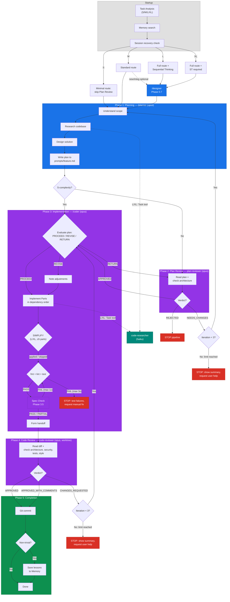
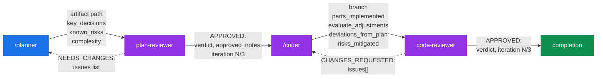
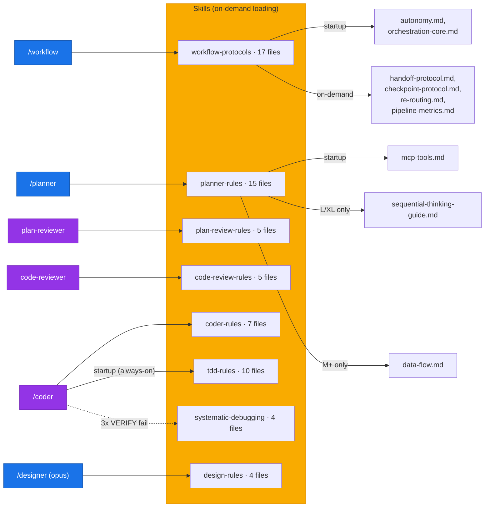
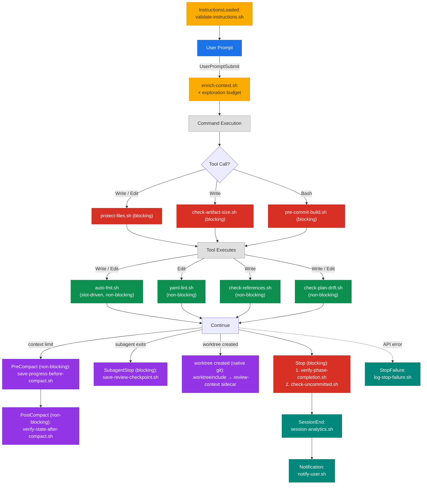

<p align="center">
  <strong>Claude Kit</strong><br/>
  Переиспользуемый конфигурационный набор для <a href="https://docs.anthropic.com/en/docs/claude-code">Claude Code</a>
</p>

<p align="center">
  
</p>

---

Структурированный мультиагентный процесс разработки со встроенными фазами планирования, реализации и код-ревью. Поддерживает любой язык и фреймворк — Go, Python, TypeScript, Rust, Java и ещё 26 языков через анализ tree-sitter.

> **Примечание:** значения по умолчанию настроены под Go (разреженные пути, `pre-commit-build.sh` запускает `go build`, Language Profile в `CLAUDE.md` фиксирует Go ≥ 1.24). Для других стеков: отредактируйте Language Profile в `CLAUDE.md`, настройте `worktree.sparsePaths` в `.claude/settings.local.json` и замените или отключите специфичный для Go хук сборки. См. [⚙️ Файлы конфигурации](#️-файлы-конфигурации).

---

<p align="center"><a href="README.md">English</a> | <strong>Русский</strong></p>

---

## 📑 Содержание

- [⚡ Быстрый старт](#-быстрый-старт)
- [🔧 Команды](#-команды)
- [🏗 Архитектура](#-архитектура)
- [🔌 MCP-серверы](#-mcp-серверы)
- [🪨 Оптимизация токенов (Caveman)](#-оптимизация-токенов-caveman)
- [⚙️ Файлы конфигурации](#️-файлы-конфигурации)
- [📂 Структура проекта](#-структура-проекта)
- [🪝 Хуки](#-хуки)
- [📐 Соглашения](#-соглашения)

---

## ⚡ Быстрый старт

> **Требования:** Claude Code `>= 2.1.141` (хуки кита опираются на инвариант exec-form `args:` из v2.1.139 и вывод JSON `terminalSequence` из v2.1.141). На более ранних версиях хуки молча превращаются в no-op / деградируют.

`/workflow` оркеструет планирование → реализацию → ревью → коммит для любой задачи. Онбординг в четыре шага.

### 1. Установка — плагин (рекомендуется)

Установите claude-kit как нативный **плагин** Claude Code: общий для всех ваших проектов, версионируемый, обновляемый через marketplace, без копирования файлов в ваш репозиторий. Этот репозиторий одновременно является собственным marketplace (`.claude-plugin/marketplace.json` + `.claude-plugin/plugin.json`).

```bash
/plugin marketplace add hex0xdeadbeef/claude-kit
/plugin install claude-kit@claude-kit
```

Команды плагина имеют namespace — вы запускаете `/claude-kit:workflow`, `/claude-kit:planner`, `/claude-kit:coder`, `/claude-kit:designer`. Внутренняя делегация пайплайна (planner → plan-reviewer → coder → code-reviewer) резолвится автоматически по описанию, поэтому работает независимо от префикса.

<details>
<summary>Альтернатива: <code>install.sh</code> (project-scoped — копирует кит в один репозиторий)</summary>

Project-scoped установка копирует `.claude/` + `CLAUDE.md` в репозиторий, чтобы вы могли настроить правила / Language Profile под проект и закоммитить их с командой. Одна команда разворачивает всё — пайплайн `.claude/`, 3 MCP-сервера (`.mcp.json`) и персональные настройки (`.claude/settings.local.json`):

```bash
curl -sL https://raw.githubusercontent.com/hex0xdeadbeef/claude-kit/main/install.sh | bash
```

Ручной `cp` не нужен — `settings.local.json` и `.mcp.json` создаются автоматически (а при `--update` новые дефолты подмёрживаются, ваши правки сохраняются). MCP-серверам нужны `npx` (Node.js) и/или `uvx` (uv); если чего-то не хватает, установщик выведет команду установки. После установки рантайма **перезапустите Claude Code** — серверы автоматически загрузятся при следующем запуске (проверьте через `claude mcp list`).

</details>

**Плагин vs `install.sh` — сосуществуют:**

- **Плагин** — переиспользование пайплайна во многих проектах, версионируемые обновления, ничего не копируется в репозиторий. Конфиг конкретного проекта (Language Profile в `CLAUDE.md`, архитектурные правила, `.claude/PROJECT-KNOWLEDGE.md`) вы по-прежнему задаёте сами.
- **`install.sh`** — project-scoped: кит живёт в вашем репозитории, настраивается под проект и коммитится с командой.

### 2. Первый запуск

```bash
/project-researcher                          # пишет .claude/PROJECT-KNOWLEDGE.md
/workflow Add new REST endpoint for profiles
```

`/project-researcher` даёт агентам контекст вашей кодовой базы (архитектура, модули, зависимости, языковой профиль). Сначала отредактируйте Language Profile в `CLAUDE.md`, если ваш стек — не Go (дефолт кита). Затем `/workflow` ведёт полный цикл: анализ задачи → [дизайн — только L/XL] → планирование → ревью плана → реализация → код-ревью → коммит. (В режиме плагина добавляйте префикс к командам: `/claude-kit:project-researcher`, `/claude-kit:workflow`.)

### 3. Настройка кита — переопределение переменных

Поведение кита настраивается переменными окружения (строгость валидации, TTL кэша промптов, режим краткого вывода и т.д.). **Где вы задаёте переменную — то и определяет её область действия**, а механизм одинаков для плагина и для установки через `install.sh`: Claude Code инъектит блок `env` в сессию, и каждый хук-скрипт (включая хуки плагина) наследует его как подпроцесс.

| Где | Файл / команда | Область |
| --- | -------------- | ------- |
| Для проекта | `<project>/.claude/settings.local.json` → `env` | этот репозиторий (gitignored) |
| Для всех ваших проектов | `~/.claude/settings.json` → `env` | каждый проект |
| Для одной сессии | `export VAR=value` перед запуском `claude` | этот shell |

В `<project>/.claude/settings.local.json`:

```json
{ "env": { "CLAUDE_CAVEMAN_MODE": "off", "CLAUDE_HANDOFF_VALIDATION_MODE": "strict" } }
```

> **Гоча:** в поставляемом `.example` ключ с ведущим `_` (например, `_CLAUDE_DELTA_REVIEW_MODE`) **неактивен** — мёрж настроек кита пропускает ключи с ведущим `_`, и они остаются инертной документацией (а буквальное имя `_CLAUDE_…` в env всё равно не читается ни одним скриптом). Уберите `_`, чтобы активировать. Файлы настроек — строгий JSON, комментарии `//` запрещены.

**Режим плагина — что нужно и не нужно задавать.** `settings.json` плагина может нести только `agent` + `subagentStatusLine`, поэтому плагин не может поставить env-дефолты. Кит закрывает этот разрыв, так что обычно вы не задаёте **ничего**:

- **Авто-strict (без действий):** пять контрактных режимов валидации — `CLAUDE_HANDOFF_VALIDATION_MODE`, `CLAUDE_VERDICT_VALIDATION_MODE`, `CLAUDE_ISSUE_ID_VALIDATION_MODE`, `CLAUDE_PK_PATH_MODE`, `CLAUDE_DELTA_REVIEW_MODE` — по умолчанию `strict`, когда кит работает как плагин (`.claude/scripts/lib/kit-env-defaults.sh` детектит `CLAUDE_PLUGIN_ROOT`). Задавайте их только чтобы *ослабить*.
- **Безопасные дефолты (без действий):** `CLAUDE_CAVEMAN_MODE` (lite) плюс knobs TTL / cooldown / log-cap — встроенные дефолты скриптов, одинаковы в обоих режимах.
- **Opt-in (в плагине выключены, пока не зададите):** `CLAUDE_PROJECT_KNOWLEDGE_MODE`, `CLAUDE_KIT_PHASE_COMPLETION_NOTIFY`, `CLAUDE_KIT_MCP_PRELOAD` — в режиме плагина падают в дефолты скриптов (warn / off) и **не** включаются автоматически; задайте их в своих настройках, чтобы включить. (Путь `install.sh` — и `provision_settings_local` ниже — засеивают их **активными** (`strict` / `on` / `on`) через `.default`.)
- **Нативные переменные Claude Code:** `ENABLE_PROMPT_CACHING_1H`, `FORCE_PROMPT_CACHING_5M`, `GIT_STRIP_CO_AUTHOR`, `CLAUDE_CODE_DISABLE_ADAPTIVE_THINKING` — задаются в ваших настройках в любом режиме (плагин их поставить не может).

**Один переключатель для полного паритета:** включите plugin-настройку `provision_settings_local` (по умолчанию выключена) — кит подмёржит свои полные env-дефолты в `.claude/settings.local.json` вашего проекта на следующей сессии (ваши значения всегда в приоритете). Путь `install.sh` засеивает те же дефолты автоматически.

Полный справочник по каждой переменной — в разделе [⚙️ Файлы конфигурации](#️-файлы-конфигурации).

### 4. Монорепо — ускорить код-ревью (`sparsePaths`)

`code-reviewer` работает в изолированном git worktree. На большом монорепо можно сузить этот worktree до путей, которые нужны ревьюеру, через `worktree.sparsePaths`.

В `<project>/.claude/settings.local.json`:

```json
{ "worktree": { "sparsePaths": ["src/", "tests/", "package.json", "tsconfig.json"] } }
```

- **Режим плагина:** плагин не может поставить worktree-конфиг, поэтому sparse-checkout **выключен**, пока вы сами не зададите `worktree.sparsePaths` (выше). Сама изоляция worktree работает независимо.
- **`install.sh` (project-scoped):** коммитимый `.claude/settings.json` поставляет Go-дефолты (`.claude/`, `internal/`, `cmd/`, `go.mod`, `go.sum`, `Makefile`, `CLAUDE.md`); переопределяйте их под проект в `settings.local.json`.

Шаблоны под конкретные языки (Python / TypeScript / Rust / Java) лежат в `.claude/settings.local.json.example` (ключи `_worktree_templates_*`).

<details>
<summary>Обновление существующей установки</summary>

```bash
curl -sL https://raw.githubusercontent.com/hex0xdeadbeef/claude-kit/main/install.sh | bash -s -- --update
```

**Сохраняется при обновлениях** (ручное восстановление не требуется):
- `.claude/settings.local.json` — персональные переопределения (сохраняются; новые дефолты кита подмёрживаются на уровне ключей при `--update`, ваши значения в приоритете)
- `.claude/prompts/` — пользовательские планы фич (при коллизиях становятся `<name>-old.md`)
- `.claude/skills/<custom>/` — кастомные скиллы, не поставляемые в ките
- `.claude/commands/<custom>.md`, `.claude/agents/<custom>.md` — файлы, добавленные пользователем
- Кастомные скиллы в списках `skills:` во frontmatter `agents`/`commands` (дедуплицируются, идемпотентно)
- `.claude/PROJECT-KNOWLEDGE.md` — генерируется для каждого проекта через `/project-researcher`
- `CLAUDE.md` — Language Profile вашего проекта (шаблон кита пропускается, если `CLAUDE.md` уже существует)

**Бэкап:** перед обновлением создаётся копия с меткой времени в `.claude.backup.YYYYMMDD_HHMMSS/`.
**Мягкая зависимость:** `python3` используется для всех слияний на уровне ключей при `--update` — списков `skills:` во frontmatter, `.claude/settings.local.json` и `.mcp.json`. Если его нет, эти слияния пропускаются с предупреждением, а существующие файлы остаются без изменений (новые дефолты кита не подмёрживаются).

</details>

<details>
<summary>Опции установки (KIT_VERSION, INSTALL_DIR)</summary>

```bash
KIT_VERSION=v1.0.0 bash install.sh    # install specific version
INSTALL_DIR=/path/to/project bash install.sh --update   # install to specific directory
```

</details>

<details>
<summary>Ручная установка (для продвинутых)</summary>

```bash
git clone https://github.com/hex0xdeadbeef/claude-kit.git
cd claude-kit
bash install.sh                        # install to current directory
bash install.sh --update               # update existing installation

# Or copy manually:
cp -r .claude/ /path/to/your/project/
cp CLAUDE.md /path/to/your/project/
# Merge .gitignore manually

# Personal settings (.claude/settings.local.json) + MCP config (.mcp.json) — both
# gitignored in your project (the kit's managed .gitignore block ignores them).
# `bash install.sh` auto-creates both on first install and key-level MERGES new kit
# defaults in on `--update` (new keys added; your existing values always win) — not
# replaced wholesale. Copy manually only on the copy-manually path above, or to reset:
cp .claude/settings.local.json.default /path/to/your/project/.claude/settings.local.json
cp .mcp.json.example /path/to/your/project/.mcp.json
```

</details>

---

## 🔧 Команды

### `/workflow` — полный цикл разработки

Основная команда, которая оркестрирует весь процесс разработки. Выполняет все фазы последовательно с подтверждением пользователя между шагами.

**Пайплайн:** `task-analysis` → `designer*` → `planner` → `plan-review` → `coder` → `code-review`

\* designer запускается только для задач L/XL. S/M переходят сразу к planner.

```bash
/workflow Add new REST endpoint for profiles
/workflow --auto Implement resource update         # autonomous mode, no confirmations
/workflow --from-phase 3                            # resume from specified phase
/workflow --from-phase 0.7                           # resume from design phase
```

<details>
<summary>⚙️ Режимы и фазы</summary>

**Режимы:**

| Режим | Флаг | Описание |
|------|------|-------------|
| Интерактивный | *(по умолчанию)* | Подтверждение перед каждой фазой |
| Автономный | `--auto` | Все фазы автоматически, без подтверждений |
| Возобновление | `--from-phase N` | Возобновление с указанной фазы |

**Фазы:**

| Польз. № | Внутр. № | Фаза | `--from-phase` | Описание |
|--------|------------|-------|----------------|-------------|
| — | 0.5 | Анализ задачи | — | Классификация сложности (S/M/L/XL) и выбор маршрута |
| — | 0.7 | Проектирование | `0.7` | Исследование требований + выбор подхода *(только L/XL; опционально для M new_feature/integration)* |
| 1 | 1 | Планирование | `1` | Исследование кодовой базы, создание плана реализации |
| 2 | 2 | Ревью плана | `2` | Валидация плана на соответствие архитектуре *(пропускается для сложности S)* |
| 3 | 3 | Реализация | `3` | Написание кода строго по утверждённому плану, запуск тестов |
| — | 3.5 | Проверка спецификации | — | Встроенный гейт соответствия внутри фазы реализации *(не возобновляется через --from-phase)* |
| 4 | 4 | Код-ревью | `4` | Ревью изменений: архитектура, безопасность, качество |
| 5 | 5 | Завершение | — | Git-коммит + извлечённые уроки *(если нетривиально)* |

> Используйте значения `Внутр. №` с `--from-phase`. Фазы с `—` выполняются автоматически или не могут быть возобновлены независимо.

</details>

**Результат:** реализованный, протестированный и прошедший ревью код с git-коммитом.

---

### `/designer` — архитектура решения *(L/XL, opt-in)*

Фаза 0.7 между анализом задачи и планированием. Исследует требования, выявляет 2-3 альтернативных подхода и создаёт утверждённую спецификацию, которую использует `/planner`. По умолчанию пропускается для сложности S/M; задачи сложности M типа `new_feature` или `integration` могут подключить её опционально.

```bash
/designer Add multi-region failover                   # explicit invocation
/designer --from-spec .claude/prompts/caching-spec.md  # resume from an existing spec
/workflow Add multi-region failover                    # orchestrator routes L/XL to designer (Phase 0.7)
/workflow --from-phase 0.7                             # resume at the design phase
```

**Результат:** утверждённая спецификация в `.claude/prompts/{feature}-spec.md` (используется при запуске `/planner`)

---

### `/planner` — планирование реализации

Исследует кодовую базу и создаёт детальный план реализации с примерами кода и критериями приёмки. Не изменяет файлы проекта.

```bash
/planner Add pagination to list endpoint
/planner --minimal Add field to model               # minimal plan without deep research
```

**Результат:** файл плана в `.claude/prompts/{feature}.md`

---

### `/coder` — реализация кода

Реализует код строго по утверждённому плану. После реализации запускает форматирование, линтинг и тесты.

```bash
/coder                          # auto-find plan in prompts/
/coder my-feature               # implement specific plan
```

**Результат:** работающий код с проходящими тестами + оценка результата с документированием отклонений.

---

### `/meta-agent` — менеджер жизненного цикла артефактов

Создаёт, улучшает, аудирует и управляет артефактами Claude Code (команды, навыки, правила, агенты). Workflow из 9 фаз с гейтами качества.

<details>
<summary>📋 Примеры использования</summary>

```bash
/meta-agent onboard                    # initialize .claude/ for a new project
/meta-agent create command my-cmd      # create a new slash command
/meta-agent create skill my-skill      # create a new reusable skill
/meta-agent create agent my-agent      # create a new agent
/meta-agent enhance command my-cmd     # improve an existing artifact
/meta-agent audit                      # quality report for all artifacts
/meta-agent delete rule my-rule        # delete an artifact
/meta-agent rollback                   # rollback last change
/meta-agent list                       # list all artifacts
```

**Управление сессиями:** `--resume {run_id}`, `abort {run_id}`, `cleanup` (удаление запусков старше 7 дней)

**Флаги:** `--dry-run` (предпросмотр) · `--explore` (Tree of Thought)

**Типы артефактов:** `command` · `skill` · `rule` · `agent`

</details>

---

### `/project-researcher` — анализ проекта

Автономный агент для глубокого анализа кодовой базы: архитектура, зависимости и схема БД. Генерирует `.claude/PROJECT-KNOWLEDGE.md`, который другие команды используют как контекст.

Архитектура: оркестратор + 7 специализированных субагентов (detection, discovery, graph, analysis, generation, verification, report).

```bash
/project-researcher
```

---

### `/review-checklist` — справочник чек-листа ревью

Отображает чек-лист код-ревью: архитектура, безопасность (OWASP), качество кода, производительность.

```bash
/review-checklist
```

---

### 🗺 Руководство по выбору команды

| Сценарий | Команда |
|----------|---------|
| Полная реализация фичи с нуля | `/workflow` |
| Автономная реализация без подтверждений | `/workflow --auto` |
| Нужен план до написания кода | `/planner` |
| План утверждён, нужна реализация | `/coder` |
| Настройка kit в новом проекте | `/meta-agent onboard` |
| Создание новых команд/навыков/агентов | `/meta-agent create` |
| Предпросмотр изменений артефактов | `/meta-agent enhance --dry-run` |
| Понять структуру проекта | `/project-researcher` |

---

## 🏗 Архитектура

Система представляет собой **многофазный пайплайн разработки**, управляемый оркестратором (`/workflow`), который последовательно делегирует работу специализированным агентам. Активные фазы зависят от сложности: **S=4** (пропускает Design и Plan Review) · **M=6** · **L/XL=8** (все фазы, включая Design и Spec Check). У каждого агента строго определены зона ответственности, назначенная модель и набор навыков.

Четыре диаграммы ниже (пайплайн, поток передач, загрузка навыков, жизненный цикл хуков) свёрнуты — разверните нужную.

<details>
<summary>🔄 Пайплайн разработки</summary>



</details>

<details>
<summary>📨 Поток данных передач (handoff)</summary>



</details>

<details>
<summary>📦 Загрузка навыков</summary>



</details>

<details>
<summary>🪝 Жизненный цикл хуков</summary>



</details>

### ⚙️ Маршрутизация моделей

| Модель | Effort | Компоненты | MaxTurns | Назначение |
|-------|--------|------------|----------|---------|
| **opus** | xhigh | `/workflow`, `/planner`, `/designer`, `/coder`, `/meta-agent`, `/project-researcher`, `plan-reviewer`, `code-reviewer` | 50–60 (агенты) | Глубокое рассуждение, оркестрация, планирование, реализация, ревью |
| **haiku** | medium | `code-researcher`, PR-субагенты (discovery, report) | 20 | Быстрое исследование кодовой базы в режиме только для чтения |
| **haiku** | low | `verdict-recovery` | 10 | Лёгкий запасной механизм для вердикта, когда ревьюеры пропускают `VERDICT:` |

> **Примечание:** Все агенты Workflow-пайплайна устанавливают `effort: xhigh` для максимального бюджета расширенного рассуждения (Opus 4.8). Используйте вместе с `CLAUDE_CODE_DISABLE_ADAPTIVE_THINKING=1` (задаётся глобально), чтобы предотвратить адаптивное ограничение в середине задачи.

### 📊 Маршрутизация по сложности

| Сложность | Parts | Слои | Plan Review | Sequential Thinking | code-researcher |
|------------|-------|--------|-------------|--------------------|-----------------|
| **S** | 1 | 1 | пропуск | не требуется | пропуск |
| **M** | 2–3 | 2 | стандартно | по необходимости | пропуск |
| **L** | 4–6 | 3+ | стандартно | рекомендуется | да |
| **XL** | 7+ | 4+ | стандартно | обязательно | да |

<details>
<summary>🔑 Ключевые принципы</summary>

- **Последовательное выполнение** — фазы не выполняются параллельно
- **Протокол передач (Handoff Protocol)** — 5 типизированных контрактов полезной нагрузки между фазами с нарративным оформлением
- **Изоляция контекста** — фазы ревью выполняются как изолированные субагенты (чистый контекст, отсутствие предвзятости авторства)
- **Лимиты циклов** — максимум 3 итерации на цикл ревью, затем STOP и запрос к пользователю
- **Протокол контрольных точек (Checkpoint Protocol)** — состояние сохраняется после каждой фазы для восстановления сессии (16 полей YAML)
- **Протокол Evaluate** — coder критически оценивает план перед реализацией (гейт PROCEED/REVISE/RETURN)
- **Условная загрузка зависимостей** — при сложности S тяжёлая загрузка навыков пропускается, экономя несколько тысяч токенов на жадной загрузке навыков
- **Перемаршрутизация (Re-Routing)** — пайплайн корректирует маршрут при несоответствии сложности (понижение/повышение)
- **Автосохранение по Cron** — периодическое автосохранение контрольной точки для задач L/XL через CronCreate (каждые 10 минут)
- **Протокол Simplify** — опциональное упрощение кода перед ревью (L/XL, ≥5 parts, 30%-ная защита)
- **Критика дизайна (Design Critique)** — `/designer` (L/XL) стресс-тестирует выбранный подход через фиксированный мультилинзовый red-team-набор в подфазе Phase 3.5 CRITIQUE перед написанием спецификации (поток designer: EXPLORE → CLARIFY → PROPOSE → CRITIQUE → SPEC → GATE); неразрешённые находки уровня HIGH переносятся в `/planner`
- **Оптимизация worktree** — разреженный checkout через `worktree.sparsePaths` уменьшает размер worktree в монорепозиториях. Пути по умолчанию специфичны для Go: `.claude/`, `internal/`, `cmd/`, `go.mod`, `go.sum`, `Makefile`, `CLAUDE.md`. См. [Конфигурация с первого взгляда](#конфигурация-с-первого-взгляда) для настройки sparse-paths и подробный разбор [Sparse-пути в монорепозитории](#claudesettingslocaljsonexample--personal-overrides).

</details>

<details>
<summary>⚙️ Инфраструктурные улучшения (серия IMP)</summary>

Архитектурные улучшения, встроенные в пайплайн. Они работают прозрачно — никаких действий от пользователя не требуется.

| ID | Улучшение | Что делает | Ключевой артефакт |
|----|-------------|--------------|--------------|
| **IMP-01** | Валидация передач | JSON Schema-валидация типизированных полезных нагрузок передач при записи через хук PostToolUse | `.claude/schemas/handoff.schema.json` |
| **IMP-02** | Структурированный вердикт | Огороженный блок VERDICT_JSON обеспечивает структурированное извлечение; запасной regex при сбое разбора | `workflow-state/review-completions.jsonl` |
| **IMP-03** | Нормализация ID задач | Канонические ID `^[PC]R-[0-9a-f]{8}$` обеспечивают межитерационный set-diff (решённые vs регрессировавшие) | `review-completions.jsonl` |
| **IMP-04** | Перепланирование на основе diff | На итерации 2+ planner получает diff-манифест — переписываются только части со статусом NEEDS_UPDATE | `workflow-state/{feature}-diff-manifest.json` |
| **IMP-05** | Эффективный тип агента | Восстановление после реестра определяет идентичность агента из транскрипта, когда SubagentStop срабатывает без регистрации | поле `effective_agent_type` в `review-completions.jsonl` |
| **IMP-06** | Разрешение вердикта UNKNOWN | Многоуровневое восстановление: контрольная точка → прямое чтение транскрипта → агент verdict-recovery → ручной вердикт пользователя | фазы 2/4 в `orchestration-core.md` |

</details>

---

## 🔌 MCP-серверы

См. [`.mcp.json.example` — MCP Server Endpoints](#mcpjsonexample--mcp-server-endpoints) для настройки. Серверы также можно настроить на пользовательском уровне (для всех ваших проектов) через `claude mcp add --scope user`, который Claude Code сохраняет в `~/.claude.json`. По умолчанию поставляются 3 сервера:

### Обязательные

| Сервер | Пакет | Назначение |
|--------|---------|---------|
| `context7` | `@upstash/context7-mcp` | Поиск документации по библиотекам |
| `sequential-thinking` | `@modelcontextprotocol/server-sequential-thinking` | Структурированные рассуждения для сложных задач (предзагружен по умолчанию — см. примечание ниже) |

> **Примечание:** `sequential-thinking` поставляется предзагруженным (`alwaysLoad: true` жёстко зашит в `.mcp.json` и `.mcp.json.example`) — он загружается при старте сессии, а не через отложенный ToolSearch. Это статический факт конфигурации; сама переменная `CLAUDE_KIT_MCP_PRELOAD` по умолчанию равна `off` и управляет только тем, флагирует ли `mcp-preload-warn.sh` дрейф, если конфигурация когда-либо потеряет предзагрузку. Удалите `alwaysLoad` у этого сервера, чтобы отложить загрузку до ToolSearch и сэкономить на холодном старте и контекстных токенах.

### Опциональные

| Сервер | Пакет | Назначение |
|--------|---------|---------|
| `tree_sitter` | `mcp-server-tree-sitter` | Анализ кода (символы, зависимости, карта репозитория) — используется `/project-researcher` |

<details>
<summary>🔧 Установка MCP-сервера tree_sitter</summary>

Установите `uv` один раз — затем сервер автоматически устанавливается при первом вызове инструмента через транспорт `uvx`, настроенный в `.mcp.json`:

```bash
curl -LsSf https://astral.sh/uv/install.sh | sh
```

Для настройки `.mcp.json` (отслеживается; авто-провижионится/объединяется `install.sh`, ваша конфигурация в приоритете — скопируйте из `.mcp.json.example` для сброса) см. [⚙️ Configuration Files → `.mcp.json.example`](#mcpjsonexample--mcp-server-endpoints).

</details>

---

## 🪨 Оптимизация токенов (Caveman)

Локальный для проекта форк [скилла caveman](https://github.com/juliusbrussee/caveman) — постоянно включённый режим лаконичного вывода для запусков `/workflow`. Убирает из прозы агентов слова-наполнители / хеджирование / любезности, чтобы снизить стоимость токенов Messages, сохраняя при этом всю техническую суть и несущий контракт структурированный вывод (JSON-конверты, заголовки плана, пути к файлам, блоки кода).

**Активен (`lite`) по умолчанию** после установки — шаг онбординга засеивает `CLAUDE_CAVEMAN_MODE: lite` в `.claude/settings.local.json` (из `.claude/settings.local.json.default`), а хук SessionStart также разрешается в `lite`, когда переменная не задана. Чтобы **отключить** на конкретной машине, установите `off` в `.claude/settings.local.json` (вступает в силу при **следующем** запуске сессии):

```json
"env": {
  "CLAUDE_CAVEMAN_MODE": "off"
}
```

**Режимы:**

| Значение | Поведение |
|-------|----------|
| `lite` *(единственная интенсивность, поддерживаемая в v1; поставляется по умолчанию)* | Убирает слова-наполнители ("just", "really", "basically"), любезности ("sure", "happy to"), хеджирование ("it might be worth"). Сохраняет полные предложения, артикли, технические термины, блоки кода. Экономия для `lite` не измерена — проверяйте A/B (см. CLAUDE.md § Caveman Token Compression Policy). |
| `off` *(opt-out)* | Хук SessionStart завершается без вывода — нулевая инъекция, побайтово идентично поведению до v1.21.0. (Для полного сброса также удалите переменную и удалите файл-флаг `.claude/workflow-state/.caveman-mode`.) |

<details>
<summary>Почему только lite + исключение для ревьюера/исследователя (безопасность контрактов)</summary>

**Почему только `lite`:** в исходном caveman поставляется 6 режимов (`lite`, `full`, `ultra`, `wenyan-*`); только `lite` сохраняет полные предложения — остальные допускают фрагменты предложений, которые повреждают канонический хеш идентификатора issue (`sha256(category|location|problem)[:8]` согласно IMP-03). Остальные режимы отключены в этом форке, чтобы сохранить конверт VERDICT_JSON и стабильность ID между итерациями.

**Исключение для ревьюера/исследователя (защита в глубину):**

| Слой | Механизм |
|-------|-----------|
| **1. Хук** | `SubagentStart` → `caveman-suspend-for-reviewer.sh` внедряет фразу `[caveman OFF for this delegation]` для `plan-reviewer`, `code-reviewer`, `verdict-recovery`, `code-researcher`. |
| **2. Скилл** | `.claude/skills/caveman/SKILL.md` содержит 7 ДОСЛОВНЫХ фраз, защищающих несущий контракт вывод: строка enum `VERDICT:`, огороженные блоки `VERDICT_JSON:`, значения дискриминаторов `$handoff_contract` / `$verdict_contract`, H2-заголовки плана/спецификации (`## Scope`, `## Architecture Decision`, `## Tests`, `## Acceptance Criteria`, `## Parts`), текст `issue.problem` / `issue.suggestion`, пути к файлам и ссылки `file:line`, идентификаторы Part (`Part N:`). |

Любой слой по отдельности защищает контракт; оба вместе = устойчивость к отказу в одной точке (опечатка в matcher ИЛИ дрейф промпта).

**Локальный для проекта инвариант:** все файлы caveman находятся внутри `.claude/`. Кит никогда не изменяет `~/.claude/`. Отключение caveman в claude-kit НЕ влияет ни на один другой проект Claude Code.

</details>

---

## ⚙️ Файлы конфигурации

Поведением кита управляют пять поверхностей: два файла настроек (`.claude/settings.json` коммитится, `.claude/settings.local.json` помашинный), один MCP-файл (`.mcp.json`), один артефакт project-knowledge (`.claude/PROJECT-KNOWLEDGE.md`) и Language Profile внутри `CLAUDE.md`. `install.sh` автоматически провижионит помашинные/попроектные файлы и на уровне ключей **подмёрживает** новые дефолты при `--update` — **ваши значения всегда в приоритете**. Матрицы ниже индексируют каждый параметр; подразделы `###` — это подробные разборы по каждому файлу.

### Конфигурация с первого взгляда

Главный индекс часто редактируемых параметров конфигурации. Здесь не перечислены: install/global env-переменные (`KIT_VERSION`, `INSTALL_DIR`, `CLAUDE_CODE_DISABLE_ADAPTIVE_THINKING` — задаются при установке или в глобальном shell-окружении) и продвинутые параметры тонкой настройки (`CLAUDE_ISSUE_ID_NORMALIZE_VERSION`, `CLAUDE_VERDICT_BLOCK_TTL_HOURS`, `CLAUDE_PRECOMPACT_COOLDOWN_S`, `CLAUDE_KIT_PHASE_COMPLETION_NOTIFY`, `CLAUDE_KIT_MCP_PRELOAD`, `CLAUDE_TOOL_FAILURES_MAX_LINES`) — и те, и другие документированы в `CLAUDE.md` и в комментариях env файла `.example`.

<details>
<summary>📋 Все параметры конфигурации</summary>

| Параметр | Где находится | Что контролирует | Когда редактировать | Активация | Reference |
|------|----------|----------|--------------|------------|-----------|
| `CLAUDE_HANDOFF_VALIDATION_MODE` | `settings.local.json` env | strict-режим для IMP-01 schema-валидации handoff JSON | ужесточение раскатки | раскомментировать в блоке env | [Personal Overrides](#claudesettingslocaljsonexample--personal-overrides) |
| `CLAUDE_VERDICT_VALIDATION_MODE` | `settings.local.json` env | strict-режим для IMP-02 схемы конверта вердикта | ужесточение раскатки | раскомментировать в блоке env | [Personal Overrides](#claudesettingslocaljsonexample--personal-overrides) |
| `CLAUDE_ISSUE_ID_VALIDATION_MODE` | `settings.local.json` env | strict-режим для IMP-03 канонических issue ID | ужесточение раскатки | раскомментировать в блоке env | [Personal Overrides](#claudesettingslocaljsonexample--personal-overrides) |
| `CLAUDE_PROJECT_KNOWLEDGE_MODE` | `settings.local.json` env | блокировать запуск `/workflow`, если `PROJECT-KNOWLEDGE.md` отсутствует/является заглушкой для задач M+ | принудительное наличие PK | раскомментировать в блоке env | [Personal Overrides](#claudesettingslocaljsonexample--personal-overrides) |
| `CLAUDE_PK_PATH_MODE` | `settings.local.json` env | блокировать «голые» ссылки `PROJECT-KNOWLEDGE.md` (без префикса `.claude/`) | строгая проверка ссылок | раскомментировать в блоке env | [Personal Overrides](#claudesettingslocaljsonexample--personal-overrides) |
| `CLAUDE_DELTA_REVIEW_MODE` | `settings.local.json` env | внедрять только дельта-контекст в ревьюеров на итерации ≥ 2 | ускорение ревью на итерации ≥ 2 | `warn` или `strict` | [Personal Overrides](#claudesettingslocaljsonexample--personal-overrides) |
| `CLAUDE_CAVEMAN_MODE` | `settings.local.json` env | режим краткого вывода для запусков `/workflow` | снижение стоимости Messages-токенов | `lite` (единственный режим в v1) | [🪨 Оптимизация токенов (Caveman)](#-оптимизация-токенов-caveman) |
| `ENABLE_PROMPT_CACHING_1H` | `settings.local.json` env | продлить TTL кэша 5 мин → 1H для тарифов без подписки | пользователи API-key/Bedrock/Vertex/Foundry | `1` (по умолчанию ON в `.example`) | [Personal Overrides](#claudesettingslocaljsonexample--personal-overrides) |
| `FORCE_PROMPT_CACHING_5M` | `settings.local.json` env | принудительный 5-минутный TTL независимо от тарифа | контроль стоимости для коротких задач S/M | `1` (раскомментировать) | [Personal Overrides](#claudesettingslocaljsonexample--personal-overrides) |
| `GIT_STRIP_CO_AUTHOR` | `settings.local.json` env | убирать `Co-Authored-By` из автоматически генерируемых коммитов | личное предпочтение | `true` | [Personal Overrides](#claudesettingslocaljsonexample--personal-overrides) |
| `worktree.sparsePaths` | `settings.json` или `settings.local.json` | какие поддеревья выгружает worktree агента `code-reviewer` | монорепозитории / большие репозитории | редактировать JSON-массив | [Monorepo sparse paths](#claudesettingslocaljsonexample--personal-overrides) |
| `permissions.allow` / `permissions.deny` | `settings.local.json` | дополнительные allow/deny правила, объединяемые с общим `settings.json` | оверрайды для конкретной машины | редактировать JSON-массивы | [Personal Overrides](#claudesettingslocaljsonexample--personal-overrides) |
| `.mcp.json` (3 сервера) | в gitignore после установки | MCP-серверы `sequential-thinking`, `context7`, `tree_sitter` | личная/помашинная настройка | автоматически создаётся `install.sh`, новые серверы объединяются при `--update` (ваша конфигурация в приоритете) | [`.mcp.json.example`](#mcpjsonexample--mcp-server-endpoints) |
| `.claude/PROJECT-KNOWLEDGE.md` | коммитится для каждого проекта | анализ кодовой базы, внедряемый как контекст агента | один раз на проект, обновлять при изменении архитектуры | запустить `/project-researcher` | [Project Knowledge Base](#claudeproject-knowledgemd--project-knowledge-base) |
| `CLAUDE.md` > Language Profile | коммитится | языковые слоты (`LANG_EXT`, `VERIFY_CMD` и т. д.), источник каскада | при первой установке для не-Go стеков | редактировать `CLAUDE.md` напрямую | [Быстрый старт](#-быстрый-старт) Step 2 |
| `.claude/.kit-version` | управляется автоматически | отслеживает установленную версию кита для `install.sh --update` | никогда (управляется `install.sh`) | n/a | управляется автоматически `install.sh` |

</details>

### Файлы и их жизненные циклы

<details>
<summary>📋 Git-статус и жизненный цикл по файлам</summary>

У каждого файла свой жизненный цикл и git-статус. `install.sh` автоматически провижионит помашинные/попроектные файлы (`settings.local.json`, `.mcp.json`) при установке и поддерживает их в актуальном состоянии при `--update` (ваши значения в приоритете); редактируйте их для кастомизации или используйте ручные команды `cp` из подразделов ниже для сброса.

| Файл | Git-статус (в вашем проекте) | Жизненный цикл | Назначение |
|------|------------------------------|-----------|---------|
| `.claude/settings.json` | коммитится | на кит | Хуки, разрешения, модель по умолчанию, регистрации MCP-серверов |
| `.claude/settings.local.json` | в gitignore после `install.sh` (провижионится из `.default`) | автоматически создаётся `install.sh` из `.claude/settings.local.json.default`; новые значения по умолчанию объединяются при `--update` (ваши значения в приоритете); личная / помашинная | Оверрайды env, дополнительные разрешения, sparse paths для монорепозитория |
| `.claude/settings.local.json.default` | коммитится | на кит | Принадлежащий киту источник установки с активными дефолтами по умолчанию — `install.sh` создаёт/объединяет `settings.local.json` из него (`.example` — это полный документированный справочник по переключателям, а не источник установки) |
| `.mcp.json` | в gitignore после `install.sh` (авто-провижионинг + слияние; ваша конфигурация в приоритете) | автоматически создаётся `install.sh` из `.mcp.json.example`, когда отсутствует, иначе слияние на уровне ключей при `--update` (ваша конфигурация в приоритете); личная / помашинная | Эндпоинты MCP-серверов (`sequential-thinking`, `context7`, `tree_sitter`) |
| `.claude/PROJECT-KNOWLEDGE.md` | коммитится (сохраняется при `--update`) | на проект | Автоматически генерируемый анализ кодовой базы, используемый как контекст всеми агентами |
| `.claude/.kit-version` | в gitignore (регенерируется `install.sh` при каждой установке/обновлении; export-ignore из релизных тарболлов) | на установку | Отслеживает установленную версию кита для `install.sh --update` |

</details>

### `.claude/settings.local.json.example` — Personal Overrides

`install.sh` создаёт `.claude/settings.local.json` из `.claude/settings.local.json.default` (опинионированная активная конфигурация кита) при первой установке, а при `--update` на уровне ключей **объединяет** новые дефолты в ваш файл — ваши существующие значения всегда в приоритете, а документационные ключи (переключатели с ведущим `_`) никогда не внедряются. Этот `.example` — полный документированный справочник по переключателям, а не источник установки. Семантика слияния в сравнении с `settings.json`: скаляры переопределяют, массивы объединяются, `deny` побеждает `allow`. Файл в gitignore и **сохраняется при `install.sh --update`**. Чтобы сбросить или настроить вручную:

```bash
# Documented reference (all toggles visible) — recommended for manual setup:
cp .claude/settings.local.json.example .claude/settings.local.json
# — or reset to the exact active defaults install.sh ships:
cp .claude/settings.local.json.default .claude/settings.local.json
```

<details>
<summary>📋 Env-переменные (активируются удалением ведущего <code>_</code>)</summary>

| Переменная | По умолчанию в `.example` | Эффект |
|----------|----------------------|--------|
| `GIT_STRIP_CO_AUTHOR` | `false` | Убирает строки `Co-Authored-By` из автоматически генерируемых сообщений коммитов |
| `CLAUDE_HANDOFF_VALIDATION_MODE` | `_strict` *(неактивно)* | `strict` блокирует запись невалидного handoff JSON; `warn` логирует и продолжает (IMP-01) |
| `CLAUDE_VERDICT_VALIDATION_MODE` | `_strict` *(неактивно)* | `strict` принудительно применяет схему VERDICT_JSON; иначе откатывается к regex-извлечению (IMP-02) |
| `CLAUDE_ISSUE_ID_VALIDATION_MODE` | `_strict` *(неактивно)* | `strict` блокирует записи вердиктов, у которых `issues[].id` не соответствует каноническому паттерну `^[PC]R-[0-9a-f]{8}$` (IMP-03); regex-фолбэк всё ещё спасает вердикт в `warn` |
| `CLAUDE_PROJECT_KNOWLEDGE_MODE` | `_strict` *(неактивно)* | `strict` БЛОКИРУЕТ запуск `/workflow`, когда `PROJECT-KNOWLEDGE.md` отсутствует или имеет значения-заглушки для задач M+ |
| `CLAUDE_PK_PATH_MODE` | `_strict` *(неактивно)* | `strict` блокирует записи, содержащие «голые» ссылки `PROJECT-KNOWLEDGE.md` (без префикса `.claude/`) — отлавливается `meta-agent/check-references` |
| `ENABLE_PROMPT_CACHING_1H` | `1` | Продлевает TTL кэша промптов 5 мин → 1H для пользователей API-key/Bedrock/Vertex/Foundry; noop на тарифе с подпиской (v2.1.108) |
| `FORCE_PROMPT_CACHING_5M` | `_1` *(неактивно)* | Принудительный 5-минутный TTL независимо от тарифа платформы — контроль стоимости для коротких задач S/M |
| `CLAUDE_DELTA_REVIEW_MODE` | `_warn` *(неактивно)* | `warn` (HINT) / `strict` (FOCUS) внедряет только дельта-контекст в ревьюеров на итерации ≥2; `off` сохраняет полный контекст |
| `CLAUDE_CAVEMAN_MODE` | `_lite` *(неактивно)* | `lite` активирует проектно-локальный caveman-режим краткого вывода для родительской сессии `/workflow` (orchestrator/designer/planner/coder); агенты reviewer/researcher исключаются в любом случае через SubagentStart suspend-хук. `off` полностью отключает. См. [🪨 Оптимизация токенов (Caveman)](#-оптимизация-токенов-caveman) |

Ключи верхнего уровня с ведущим `_` (например, `_comment`, `_env_comment`, `_worktree_comment`) — это документация, а не env-переменные.

</details>

<details>
<summary>🌳 Monorepo sparse paths</summary>

Ускорьте создание worktree агента `code-reviewer` в репозиториях с 100k+ файлов, выгружая только релевантные поддеревья:

```json
"worktree": {
  "sparsePaths": [".claude/", "src/", "tests/", "package.json"]
}
```

Поставляемый `.example` по умолчанию рассчитан на Go-раскладку (`internal/`, `cmd/`, `go.mod`, `go.sum`, `Makefile`). Переопределите под ваш стек — JS, Python, Rust, пакеты монорепозитория и т. д. Добавьте `.claude/`, если ревьюеру нужно читать правила проекта изнутри worktree.

</details>

### `.mcp.json.example` — MCP Server Endpoints

Помашинная конфигурация (в gitignore после `install.sh`). `install.sh` автоматически создаёт `.mcp.json` из этого шаблона при первой установке (авто-одобрение через `enableAllProjectMcpServers` в `settings.json`); при `--update` он **объединяет** новые серверы кита, сохраняя ваши существующие/кастомизированные серверы (ваша конфигурация в приоритете). `sequential-thinking` поставляется предзагруженным (`alwaysLoad: true` жёстко зашит здесь) — он загружается при старте сессии, а не через отложенный ToolSearch; удалите `alwaysLoad` у него, чтобы отложить загрузку и сэкономить на холодном старте и контекстных токенах. Чтобы сбросить, настроить вручную или влить в существующий `.mcp.json`:

```bash
cp .mcp.json.example .mcp.json   # fresh setup
# — or merge the relevant blocks into an existing .mcp.json
```

| Сервер | Транспорт | Используется |
|--------|-----------|---------|
| `sequential-thinking` | `npx @modelcontextprotocol/server-sequential-thinking` | `/planner`, `/designer` на задачах L/XL (обязательно) |
| `context7` | `npx @upstash/context7-mcp` (proxy-bypass env preset) | Поиск документации по библиотекам в фазах coder/planner (обязательно) |
| `tree_sitter` | `uvx --python ">=3.10" --python-preference only-system mcp-server-tree-sitter` | Структурный анализ `/project-researcher` (опционально — агенты откатываются к grep) |

Установите `uv` один раз для `uvx`: `curl -LsSf https://astral.sh/uv/install.sh | sh`. `npx` поставляется с Node.js. См. [🔌 MCP-серверы](#-mcp-серверы) для матрицы обязательное-vs-опциональное.

### `.claude/PROJECT-KNOWLEDGE.md` — Project Knowledge Base

Автоматически генерируемый анализ кодовой базы (архитектура, модули, зависимости, языковой профиль), потребляемый как контекст `/planner`, `/coder`, `plan-reviewer` и `code-reviewer`. Сгенерируйте один раз после установки командой `/project-researcher`. Коммитится для каждого проекта (не является частью кита) и **сохраняется при `install.sh --update`**, поэтому обновления кита никогда не затирают ваши знания о проекте. Перезапускайте `/project-researcher`, когда архитектура существенно меняется (новый модуль, смена фреймворка, миграция схемы). Отсутствующий файл не фатален — агенты откатываются к блоку `Language Profile` в `CLAUDE.md`.

---

## 📂 Структура проекта

<details>
<summary>📂 Полная раскладка <code>.claude/</code></summary>

```
.
├── .mcp.json                         # MCP servers; tracked + auto-provisioned/merged by install.sh (your config wins)
├── .mcp.json.example                 # MCP server endpoints reference (install.sh creates/merges .mcp.json from it)
└── .claude/
    ├── agents/                       # Autonomous agents
    │   ├── meta-agent/               # Artifact lifecycle management (deps, scripts, templates)
    │   ├── project-researcher/       # Codebase analysis (7 subagents, AST analysis, scoring)
    │   ├── plan-reviewer.md          # Plan validation (invoked by /workflow)
    │   ├── code-reviewer.md          # Code review (invoked by /workflow, isolated worktree)
    │   ├── code-researcher.md        # Codebase exploration (haiku)
    │   └── verdict-recovery.md       # Lightweight verdict fallback (haiku, on reviewer failure)
    ├── agent-memory/                 # Subagent project-scoped memory (code-reviewer / plan-reviewer / code-researcher MEMORY.md; VCS-shared)
    ├── commands/                     # Slash commands (/workflow, /planner, /coder, etc.)
    ├── docs/                         # Kit reference docs (platform-guarantees.md)
    ├── skills/                       # Reusable domain knowledge (9 packages)
    │   ├── caveman/                  # Token-compression (lite) for /workflow prose; reviewer-exempt
    │   ├── workflow-protocols/       # Orchestration, handoff, checkpoints, re-routing
    │   ├── planner-rules/            # Planning methodology, task analysis, data flow
    │   ├── coder-rules/              # Implementation rules, MCP tools, review-response
    │   ├── plan-review-rules/        # Architecture checks, required sections
    │   ├── code-review-rules/        # Security checklist (OWASP), review checklists
    │   ├── design-rules/             # Design phase 0.7 checklist (L/XL only)
    │   ├── systematic-debugging/     # Root-cause investigation on 3x VERIFY fail
    │   └── tdd-rules/                # TDD workflow (per-language tdd-shapes/<LANGUAGE>.md)
    ├── templates/                    # Templates for creating new artifacts
    ├── prompts/                      # Generated implementation plans (preserved on --update)
    ├── scripts/                      # Lifecycle hook scripts
    │   ├── lib/                      # Shared helpers (log.sh, otel-parse.sh, pk_slots.py, state_render.py)
    │   └── tests/                    # Hook test suite + fixtures
    ├── schemas/                      # JSON Schemas (handoff.schema.json — IMP-01)
    ├── rules/                        # Cross-cutting constraints (architecture rules)
    ├── workflow-state/               # Runtime state (gitignored, generated during workflow)
    ├── settings.json                 # Claude Code project settings + hooks (git-committed)
    ├── settings.local.json.default   # Opinionated local-settings seed (install.sh creates settings.local.json from this when absent)
    ├── settings.local.json.example   # Personal overrides reference (full toggle docs; auto-provisioning is from .default)
    ├── PROJECT-KNOWLEDGE.md          # Auto-generated project knowledge (per-project)
    └── .kit-version                  # (created in YOUR project by install.sh — not shipped in the kit tarball)
```

</details>

---

## 🪝 Хуки

Настраиваются в `.claude/settings.json` — они автоматически обеспечивают соблюдение качества. Security- и build-хуки блокируют (`protect-files.sh`, `check-artifact-size.sh`, `pre-commit-build.sh`); большинство остальных не блокируют. Блокировка опасных команд НЕ навязывается китом — безопасность операций полностью управляется вашими собственными permissions в `settings.json` / `settings.local.json` (deny-first, через `/permissions`).

<details>
<summary>🪝 Все хуки (по триггеру)</summary>

| Хук | Триггер | Назначение |
|------|---------|---------|
| `validate-instructions.sh` | InstructionsLoaded | Проверяет, что критические правила загружены в контекст |
| `enrich-context.sh` | UserPromptSubmit | Обогащает промпт контекстом проекта + бюджетом исследования |
| `protect-files.sh` | PreToolUse (Write/Edit) | Защищает критические конфигурационные файлы от изменения агентом |
| `check-artifact-size.sh` | PreToolUse (Write) | Блокирует запись, превышающую пороги размера |
| `pre-commit-build.sh` | PreToolUse (Bash) | Проверяет `go build` перед git-коммитом |
| `auto-fmt.sh` | PostToolUse (Write/Edit) | Автоформатирует исходные файлы (управляется слотом через FMT_CMD; поддерживает плейсхолдер `{}` для каждого файла) |
| `yaml-lint.sh` | PostToolUse (Edit) | Проверяет структуру YAML |
| `check-references.sh` | PostToolUse (Write/Edit) | Проверяет все ссылки на файлы (область: `.claude/**` + корневые `README.md` / `CLAUDE.md` / `install.sh`) |
| `check-plan-drift.sh` | PostToolUse (Write/Edit) | Обнаруживает отклонение от плана во время реализации |
| `save-progress-before-compact.sh` | PreCompact | Сохраняет контрольную точку (checkpoint) перед сжатием контекста |
| `verify-state-after-compact.sh` | PostCompact | Проверяет целостность состояния workflow после сжатия |
| `save-review-checkpoint.sh` | SubagentStop | Сохраняет состояние завершения ревью |
| `verify-phase-completion.sh` | Stop | Гарантирует завершение всех фаз meta-agent |
| `check-uncommitted.sh` | Stop | Предупреждает о незакоммиченных изменениях |
| `notify-workflow-complete.sh` | Stop | Выдаёт OSC 9 уведомление на рабочий стол (`terminalSequence`) при завершении фазы 5, когда `CLAUDE_KIT_PHASE_COMPLETION_NOTIFY=on` и вердикт — APPROVED / APPROVED_WITH_COMMENTS |
| `session-analytics.sh` | SessionEnd | Записывает аналитику сессии |
| `log-stop-failure.sh` | StopFailure | Логирует ошибки API в аналитику сессии |
| `log-tool-failure.sh` | PostToolUseFailure (Bash) | Логирует неудачные вызовы инструмента Bash в `.claude/workflow-state/tool-failures.jsonl` (обрезается с головы через `CLAUDE_TOOL_FAILURES_MAX_LINES`) |
| `notify-user.sh` | Notification | Уведомления на рабочий стол о событиях агентов |
| `inject-review-context.sh` | SubagentStart (plan-reviewer / code-reviewer) | Внедряет накопленный контекст ревью в агента-ревьюера при запуске |
| `validate-handoff.sh` | PostToolUse (Write / Edit) | Проверяет JSON передачи (handoff) по схеме при записи в `workflow-state/*-handoff.json` |
| `track-task-lifecycle.sh` | SubagentStart (code-researcher / plan-reviewer / code-reviewer) | Отслеживает события жизненного цикла задач субагентов для метрик пайплайна |
| `audit-config-change.sh` | ConfigChange | Аудитирует изменения конфигурации; блокирует запись во время активного workflow |
| `log-permission-denied.sh` | PermissionDenied | Логирует отказы в вызовах инструментов классификатором авто-режима (не явными правилами deny) |
| `caveman-activate.sh` | SessionStart | Внедряет проектно-локальный набор правил терсе-вывода caveman lite-mode как `additionalContext` (оптимизация токенов, начиная с v1.21.0) |
| `mcp-preload-warn.sh` | SessionStart | Предупреждает (не блокирующе) при старте сессии, когда `CLAUDE_KIT_MCP_PRELOAD=on`, но в `.mcp.json` отсутствует `alwaysLoad` у `sequential-thinking`, с областью действия по активным контрольным точкам workflow |
| `caveman-suspend-for-reviewer.sh` | SubagentStart (`plan-reviewer` / `code-reviewer` / `verdict-recovery` / `code-researcher`) | Выдаёт маркер исключения `[caveman OFF for this delegation]`, чтобы конверты VERDICT_JSON ревьюера/исследователя оставались байт-стабильными между итерациями (защита в глубину для стабильности canonical_id по IMP-03) |

</details>

---

## 📐 Соглашения

- Артефакты используют формат YAML-first (>80% YAML, минимум прозы)
- Язык: английский для кода, ключей YAML и спецификаций артефактов
- Ограничения на размер обеспечиваются хуками (`check-artifact-size.sh`)
- Примеры используют шаблоны grep/glob для поиска актуального кода, а не жёстко зашитые фрагменты
