# Workflow Documentation Analysis

> **Цель:** Комплексный аудит соответствия `README.md` реальному состоянию workflow-артефактов.
> **Дата:** 2026-04-22 | **Версия Claude Kit:** v1.12.0 (ветка `main`)

---

## 1. Методология

Исследование проведено в 5 этапов:

| Этап | Действие | Источники |
|------|----------|-----------|
| 1 | Инвентаризация всех workflow-артефактов | `find`, `ls -R`, Explore agent |
| 2 | Чтение README.md — извлечение всех задокументированных утверждений | README.md |
| 3 | Глубокое чтение ключевых артефактов | workflow.md, orchestration-core.md, settings.json, agents/*.md, skills/**/SKILL.md |
| 4 | Cross-reference: артефакты ↔ README | Структурированное сравнение |
| 5 | Web-исследование | [Claude Code Docs](https://code.claude.com/docs/en/hooks), [CHANGELOG](https://github.com/anthropics/claude-code/blob/main/CHANGELOG.md) |

---

## 2. Полный инвентарь Workflow-артефактов

### 2.1 Commands (`.claude/commands/`)

| Файл | Строк | Роль в pipeline |
|------|-------|----------------|
| `workflow.md` | 655 | Оркестратор всего цикла |
| `planner.md` | 487 | Фаза 1 — планирование |
| `designer.md` | 183 | Фаза 0.7 — дизайн (только L/XL) |
| `coder.md` | 527 | Фаза 3 — реализация |
| `meta-agent.md` | 610 | Автономный (вне основного pipeline) |
| `project-researcher.md` | 21 | Автономный |
| `db-explorer.md` | 20 | Автономный |
| `review-checklist.md` | 94 | Справочный |

### 2.2 Agents (`.claude/agents/`)

| Файл | Модель | Роль в pipeline |
|------|--------|----------------|
| `plan-reviewer.md` | opus / effort:max / maxTurns:50 | Фаза 2 — ревью плана |
| `code-reviewer.md` | opus / effort:max / maxTurns:60 / isolation:worktree | Фаза 4 — ревью кода |
| `code-researcher.md` | haiku / effort:medium / maxTurns:20 | Tool-assist (L/XL) |
| `verdict-recovery.md` | haiku / effort:low / maxTurns:10 | Recovery fallback |

### 2.3 Skills (`.claude/skills/`)

| Пакет | Файлов | Потребитель |
|-------|--------|-------------|
| `workflow-protocols/` | **11** | /workflow (оркестратор) |
| `planner-rules/` | **8** | /planner |
| `coder-rules/` | **7** | /coder |
| `plan-review-rules/` | **5** | plan-reviewer agent |
| `code-review-rules/` | **5** | code-reviewer agent |
| `design-rules/` | **3** | /designer |
| `systematic-debugging/` | **4** | /coder (при 3x fail) |
| `tdd-go/` | **2+refs** | /coder (если TDD в плане) |

**Итого:** 8 skill-пакетов.

### 2.4 Scripts (`.claude/scripts/`)

| Скрипт | Хук-событие | Блокирующий |
|--------|-------------|-------------|
| `validate-instructions.sh` | InstructionsLoaded | нет |
| `enrich-context.sh` | UserPromptSubmit | нет |
| `protect-files.sh` | PreToolUse (Write\|Edit) | **да** |
| `block-dangerous-commands.sh` | PreToolUse (Bash) | **да** |
| `pre-commit-build.sh` | PreToolUse (Bash git commit*) | **да** |
| `validate-handoff.sh` | PostToolUse (*-handoff.json) | нет |
| `auto-fmt-go.sh` | PostToolUse (*.go) | нет |
| `yaml-lint.sh` | PostToolUse (.claude/**) | нет |
| `check-references.sh` | PostToolUse (.claude/**) | нет |
| `check-plan-drift.sh` | PostToolUse (.claude/**) | нет |
| `save-progress-before-compact.sh` | PreCompact | нет |
| `verify-state-after-compact.sh` | PostCompact | нет |
| `track-task-lifecycle.sh` | SubagentStart (code-researcher\|plan-reviewer\|code-reviewer) | нет |
| `inject-review-context.sh` | SubagentStart (plan-reviewer\|code-reviewer) | нет |
| `save-review-checkpoint.sh` | SubagentStop (plan-reviewer\|code-reviewer\|verdict-recovery) | **да** |
| `prepare-worktree.sh` | WorktreeCreate | нет |
| `check-uncommitted.sh` | Stop | **да** |
| `verify-state-after-compact.sh` | Stop (via meta-agent) | **да** |
| `session-analytics.sh` | SessionEnd | нет |
| `log-stop-failure.sh` | StopFailure | нет |
| `notify-user.sh` | Notification | нет |
| `audit-config-change.sh` | ConfigChange | нет |
| `log-permission-denied.sh` | PermissionDenied | нет |
| `sync-agent-memory.sh` | (вызывается изнутри скриптов) | — |
| `sync-to-github.sh` | (вызывается вручную) | — |
| `resolve-worktree-path.py` | (helper для prepare-worktree.sh) | — |
| `test-aggregate-pipeline-metrics.sh` | (утилита тестирования) | — |
| `tests/` (3 sh-файла) | CI / ручные тесты | — |

**Итого в `.claude/scripts/`:** 24 файла + директория `tests/` с 3 файлами = **27 файлов**.

### 2.5 Schemas + Config

| Файл | Назначение |
|------|-----------|
| `.claude/settings.json` | Права, хуки, MCP, worktree |
| `.claude/schemas/handoff.schema.json` | JSON Schema для handoff-контрактов (IMP-01) |

---

## 3. Граф взаимодействия артефактов

```mermaid
flowchart TB
    subgraph ORCHESTRATOR ["Orchestrator Layer"]
        WF["/workflow\n(workflow.md)\nopus"]
    end

    subgraph PIPELINE ["Pipeline Commands (opus)"]
        DES["/designer\n(designer.md)\nФаза 0.7 — L/XL only"]
        PLN["/planner\n(planner.md)\nФаза 1"]
        COD["/coder\n(coder.md)\nФаза 3"]
    end

    subgraph AGENTS ["Review Agents (clean context)"]
        PR["plan-reviewer\n(agents/plan-reviewer.md)\nopus / worktree: no"]
        CR["code-reviewer\n(agents/code-reviewer.md)\nopus / worktree: YES"]
        VR["verdict-recovery\n(agents/verdict-recovery.md)\nhaiku / worktree: YES"]
        CRE["code-researcher\n(agents/code-researcher.md)\nhaiku / tool-assist"]
    end

    subgraph SKILLS ["Skills (on-demand loading)"]
        WP["workflow-protocols/\n11 files"]
        DR["design-rules/\n3 files"]
        PLR["planner-rules/\n8 files"]
        CDR["coder-rules/\n7 files"]
        PRR["plan-review-rules/\n5 files"]
        CRR["code-review-rules/\n5 files"]
        SDB["systematic-debugging/\n4 files"]
        TDD["tdd-go/\n2 files"]
    end

    subgraph HOOKS ["Hook Infrastructure"]
        direction TB
        H_IL["InstructionsLoaded\nvalidate-instructions.sh"]
        H_UPS["UserPromptSubmit\nenrich-context.sh"]
        H_PRE["PreToolUse\nprotect-files.sh\nblock-dangerous-commands.sh\npre-commit-build.sh\n+ 2x prompt-hook (import matrix)"]
        H_POST["PostToolUse\nauto-fmt-go.sh · yaml-lint.sh\ncheck-references.sh · check-plan-drift.sh\nvalidate-handoff.sh"]
        H_SAG_S["SubagentStart\ntrack-task-lifecycle.sh\ninject-review-context.sh"]
        H_SAG_E["SubagentStop\nsave-review-checkpoint.sh (blocking)"]
        H_WTC["WorktreeCreate\nprepare-worktree.sh"]
        H_STP["Stop\nverify-phase-completion.sh\ncheck-uncommitted.sh (blocking)"]
        H_SESS["SessionEnd\nsession-analytics.sh"]
        H_CFG["ConfigChange\naudit-config-change.sh"]
        H_PD["PermissionDenied\nlog-permission-denied.sh"]
        H_COMPACT["PreCompact / PostCompact\nsave-progress / verify-state"]
    end

    subgraph STATE ["Runtime State (.claude/workflow-state/)"]
        CHK["{feature}-checkpoint.yaml"]
        HF["{feature}-handoff.json"]
        RV["review-completions.jsonl"]
        PM["pipeline-metrics.jsonl"]
        TE["task-events.jsonl"]
        DM["{feature}-diff-manifest.json\n(IMP-04, iter 2+)"]
    end

    subgraph SCHEMA ["Contracts"]
        SC[".claude/schemas/\nhandoff.schema.json"]
        CFG[".claude/settings.json"]
    end

    %% Orchestrator loads skills
    WF -->|"step 0.1 startup"| WP
    WF -->|"step 0"| PLR
    WF -->|"delegates Phase 0.7"| DES
    WF -->|"delegates Phase 1"| PLN
    WF -->|"delegates Phase 3"| COD
    WF -->|"delegates Phase 2 (native agent)"| PR
    WF -->|"delegates Phase 4 (native agent)"| CR
    WF -->|"recovery only"| VR

    DES -->|"loads"| DR
    PLN -->|"loads"| PLR
    PLN -->|"L/XL tool-assist"| CRE
    COD -->|"loads"| CDR
    COD -->|"3x fail → loads"| SDB
    COD -->|"TDD in plan"| TDD
    COD -->|"L/XL tool-assist"| CRE
    PR -->|"loads"| PRR
    CR -->|"loads"| CRR

    %% Handoff flow
    WF -->|"writes handoff JSON"| HF
    HF -->|"validated by hook"| SC
    WF -->|"writes checkpoint"| CHK
    PR -->|"writes VERDICT_JSON"| RV
    CR -->|"writes VERDICT_JSON"| RV
    VR -->|"writes verdict"| RV

    %% Hook firing
    H_SAG_S -->|"inject context from"| CHK
    H_SAG_S -->|"inject context from"| RV
    H_SAG_E -->|"appends to"| RV
    H_COMPACT -->|"reads/writes"| CHK
    H_SESS -->|"reads"| CHK
    H_CFG -->|"gates on existence of"| CHK
    H_POST -->|"validates on write"| HF

    %% IMP-04
    WF -->|"iter 2+ writes"| DM

    style ORCHESTRATOR fill:#1a73e8,color:#fff,stroke:#1557b0
    style PIPELINE fill:#1a73e8,color:#fff,stroke:#1557b0
    style AGENTS fill:#9334e6,color:#fff,stroke:#7627bb
    style SKILLS fill:#f9ab00,color:#333,stroke:#e69500
    style HOOKS fill:#e8f5e9,color:#333,stroke:#4caf50
    style STATE fill:#e0e0e0,color:#333,stroke:#999
    style SCHEMA fill:#fff3e0,color:#333,stroke:#ff9800
```



### 3.1 Граф потока данных (handoff + state)

```
/designer ──spec.md──▶ /planner ──plan.md──▶
  ├─ writes planner_to_plan_review handoff JSON ──▶ hook validates via schema
  │
  └─▶ plan-reviewer (clean context, context injected by SubagentStart hook)
       ├─ reads plan.md
       ├─ writes VERDICT_JSON → save-review-checkpoint.sh → review-completions.jsonl
       └─▶ APPROVED ──▶ /coder
                         ├─ EVALUATE (PROCEED/REVISE/RETURN)
                         ├─ IMPLEMENT Parts
                         ├─ SIMPLIFY (L/XL, ≥5 parts)
                         ├─ VERIFY (fmt+lint+test)
                         ├─ SPEC CHECK (Phase 3.5)
                         ├─ writes coder_to_code_review handoff JSON
                         └─▶ code-reviewer (worktree, context injected)
                              ├─ reads git diff
                              ├─ writes VERDICT_JSON → review-completions.jsonl
                              └─▶ APPROVED ──▶ git commit + pipeline metrics
```

---

## 4. Детальный анализ несоответствий README ↔ артефакты

### D1 — Hook-таблица README неполная (4 хука отсутствуют)

**Статус:** ❌ Существенное расхождение  
**Серьёзность:** Высокая — пользователи не знают о существующих хуках

README hook-таблица показывает **19 хуков**. Фактически в `settings.json` зарегистрировано **23 hook-записи** (не считая 2x prompt-hook для import matrix). Отсутствуют в README:

| Хук | Событие | Почему важен |
|-----|---------|--------------|
| `inject-review-context.sh` | SubagentStart (plan-reviewer, code-reviewer) | КРИТИЧЕН: именно он инжектирует workflow-контекст в review-агентов, без него RULE_5 агентов не работает |
| `validate-handoff.sh` | PostToolUse (*-handoff.json) | IMP-01 — схемная валидация handoff-контрактов |
| `audit-config-change.sh` | ConfigChange | Блокирует изменения project_settings во время активного workflow |
| `log-permission-denied.sh` | PermissionDenied | Логирование отказов прав |
| `track-task-lifecycle.sh` | SubagentStart (все три reviewer + researcher) | Метрики pipeline |

**Обоснование улучшения:** Документация хуков — главный ориентир для новых пользователей при отладке workflow. Отсутствие `inject-review-context.sh` в документации означает, что пользователи не поймут, почему review-агенты получают контекст "магически".

---

### D2 — Количество skill-пакетов: README заявляет 6, реальных 8

**Статус:** ❌ Существенное расхождение  
**Серьёзность:** Средняя

| Источник | Значение |
|----------|----------|
| README badge `skills-6_packages` | 6 |
| README Skill Loading diagram | 6 (отсутствуют design-rules и systematic-debugging) |
| Фактически в `.claude/skills/` | **8** |

Недокументированные пакеты:

**`design-rules/` (3 файла):** Загружается `/designer` (Phase 0.7). Содержит `SKILL.md`, `design-checklist.md`, `spec-quality.md`. Без документации пользователи не знают, что дизайн-фаза имеет собственные правила качества.

**`systematic-debugging/` (4 файла):** Загружается `/coder` при 3x VERIFY fail. Упомянут в CLAUDE.md в таблице ошибок (`Test/lint failure loop (3x) → Load systematic-debugging skill`), но не отражён в README inventory skills-пакетов.

**Обоснование улучшения:** badge и диаграмма — быстрый ориентир при onboarding. Несоответствие вводит в заблуждение при форке/расширении кита.

---

### D3 — Количество скриптов: README заявляет 15, реальных 24+

**Статус:** ❌ Существенное расхождение  
**Серьёзность:** Средняя

README Project Structure: `scripts/ # Lifecycle hook scripts (15 scripts)`

Фактический состав `.claude/scripts/`:

```
24 файла (включая tests/) = 21 hook-скрипт + resolve-worktree-path.py + sync-to-github.sh + test-aggregate-pipeline-metrics.sh + тесты/
```

Недокументированные скрипты:
- `sync-agent-memory.sh` — синхронизация памяти агентов
- `resolve-worktree-path.py` — Python-хелпер для prepare-worktree.sh
- `sync-to-github.sh` — утилита синхронизации
- `test-aggregate-pipeline-metrics.sh` — тест-утилита pipeline-метрик
- `tests/` — 3 тест-скрипта (test-validate-handoff.sh, test-save-review-checkpoint.sh, test-imp04-diff-based-replan.sh)

**Обоснование улучшения:** Устаревший счётчик "15 scripts" — следствие того, что новые скрипты добавлялись (IMP-01, IMP-04) без обновления документации.

---

### D4 — Диаграмма pipeline в README не показывает фазу /designer (Phase 0.7)

**Статус:** ❌ Существенное расхождение  
**Серьёзность:** Высокая

README текст в описании `/workflow` корректно указывает:
```
Pipeline: task-analysis → designer* → planner → plan-review → coder → code-review
```

Однако Mermaid-диаграмма "Development Pipeline" в разделе Architecture **не содержит Phase 0.7**. Маршруты для L и XL идут напрямую в PLANNER:

```mermaid
ROUTE_L --> PLANNER
ROUTE_XL --> PLANNER
```

Фактический маршрут по `orchestration-core.md`:
```
TA -->|L/XL| DES[/designer Phase 0.7]
DES -->|approved spec| PLN
```

**Обоснование улучшения:** Диаграмма — главный визуальный ориентир. Отсутствие /designer в ней означает, что пользователи не понимают, когда/зачем запускается дизайн-фаза.

---

### D5 — Диаграмма pipeline в README пропускает Spec Check (Phase 3.5)

**Статус:** ❌ Существенное расхождение  
**Серьёзность:** Средняя

README pipeline diagram (Phase 4 — Implementation):
```
VERIFY -->|PASS| HANDOFF3["Form handoff"]
HANDOFF3 --> CODE_REVIEW
```

Фактический поток по `orchestration-core.md`:
```
VERIFY -->|PASS| SPEC CHECK (Phase 3.5)
   → PASS/PARTIAL → CODE_REVIEW
   → FAIL → inline fix → re-run VERIFY
```

Phase 3.5 (Spec Check) — это inline-фаза внутри /coder, которая проверяет соответствие реализации плану после прохождения тестов. Без неё в диаграмме создаётся впечатление, что VERIFY достаточно для перехода к Code Review.

**Обоснование улучшения:** Spec Check — важный качественный шлюз. Его отсутствие в диаграмме приводит к тому, что пользователи не понимают источника дополнительных задержек в фазе Implementation.

---

### D6 — Несоответствие нумерации фаз: README (1–6) vs внутренние артефакты (0.5–5)

**Статус:** ⚠️ Структурная проблема  
**Серьёзность:** Средняя — создаёт когнитивную нагрузку при отладке

README "Modes & Phases" table:
```
| 1 | Task Analysis |
| 1.5 | Design |
| 2 | Planning |
| 3 | Plan Review |
| 4 | Implementation |
| 5 | Code Review |
| 6 | Completion |
```

Внутренняя нумерация (workflow.md, orchestration-core.md, checkpoint-protocol.md):
```
Phase 0.5 — Task Analysis
Phase 0.7 — Design
Phase 1   — Planning
Phase 2   — Plan Review
Phase 3   — Implementation
Phase 3.5 — Spec Check
Phase 4   — Code Review
Phase 5   — Completion
```

Расхождение создаёт проблему при:
- Использовании `--from-phase` флага (README не объясняет, какую нумерацию использовать)
- Отладке checkpoint.yaml (поле `phase_completed` использует внутреннюю нумерацию)
- Troubleshooting по документации

**Обоснование улучшения:** Нужно либо унифицировать нумерацию, либо явно документировать маппинг "пользовательская ↔ внутренняя".

---

### D7 — Количество файлов workflow-protocols: README заявляет 9, реальных 11

**Статус:** ❌ Расхождение  
**Серьёзность:** Низкая

README Skill Loading diagram: `workflow-protocols · 9 files`

Фактический состав:
```
SKILL.md, autonomy.md, orchestration-core.md, handoff-protocol.md, 
checkpoint-protocol.md, state-layer.md, re-routing.md, pipeline-metrics.md, 
agent-memory-protocol.md, examples-troubleshooting.md, parallel-dispatch.md
= 11 файлов
```

Недокументированные файлы: `agent-memory-protocol.md`, `parallel-dispatch.md` — добавлены позже (вероятно, при реализации IMP-04 или параллельных агентов).

---

### D8 — Количество файлов coder-rules: README заявляет 5, реальных 7

**Статус:** ❌ Расхождение  
**Серьёзность:** Низкая

README Skill Loading diagram: `coder-rules · 5 files`

Фактический состав:
```
SKILL.md, review-response.md, spec-check.md, checklist.md, 
examples.md, mcp-tools.md, troubleshooting.md = 7 файлов
```

---

### D9 — README "5-phase development pipeline" — фактически 7+ фаз

**Статус:** ⚠️ Неточность  
**Серьёзность:** Низкая — вводит в заблуждение при первом знакомстве

README Architecture: "The system is a **5-phase development pipeline**"

Фактически pipeline содержит 7 именованных фаз (0.5, 0.7, 1, 2, 3, 3.5, 4, 5 — 8 значений, из которых 2 условные: 0.7 и 3.5).

---

### D10 — README badge "agents-5_pipeline" — неточное отражение состава

**Статус:** ⚠️ Неточность  
**Серьёзность:** Низкая

Бейдж `agents-5_pipeline` подразумевает 5 pipeline-агентов, но к pipeline относятся:
- 3 pipeline-команды: /planner, /designer (L/XL), /coder
- 2 review-агента: plan-reviewer, code-reviewer
- 1 recovery-агент: verdict-recovery
- 1 tool-assist: code-researcher

Итого 7 компонентов, из которых 5 — обязательные на M-complexity маршруте.

---

### D11 — Новые hook-события Claude Code не отражены в README

**Статус:** ℹ️ Информационный gap  
**Серьёзность:** Низкая — возможности, не задействованные в kit

Официальная документация Claude Code ([hooks reference](https://code.claude.com/docs/en/hooks)) содержит события, отсутствующие в README и не используемые в settings.json:

| Событие | Потенциальное применение в kit |
|---------|-------------------------------|
| `SessionStart` | Инициализация workflow-state при старте сессии |
| `FileChanged` | Детект изменений plan-файла для check-plan-drift |
| `WorktreeRemove` | Cleanup worktree-артефактов |
| `TaskCreated/TaskCompleted` | Метрики по TodoWrite-задачам |
| `PostToolUseFailure` | Логирование failed tool calls |
| `PermissionRequest` | Аудит запросов прав перед выполнением |

**Обоснование:** README должен содержать раздел "Leveraged Claude Code Features" с указанием версий, чтобы пользователи понимали, какие возможности Claude Code активно используются.

---

### D12 — IMP-протоколы (IMP-01–IMP-06) не задокументированы в README

**Статус:** ⚠️ Документационный долг  
**Серьёзность:** Средняя

`workflow.md` содержит 6 Implementation Protocol-блоков с кодовыми именами IMP-XX:

| Протокол | Суть | Где документирован |
|----------|------|--------------------|
| IMP-01 | Handoff JSON validation via hooks + JSON Schema | только workflow.md |
| IMP-02 | Structured VERDICT_JSON path (structured JSON vs regex fallback) | только workflow.md, orchestration-core.md |
| IMP-03 | Issue ID normalization (canonical `^[PC]R-[0-9a-f]{8}$`) | только workflow.md |
| IMP-04 | Diff-based re-plan на iter 2+ (diff-manifest.json) | только workflow.md |
| IMP-05 | effective_agent_type (post-registry-recovery) | только orchestration-core.md |
| IMP-06 | UNKNOWN verdict resolution rules | только orchestration-core.md |

README не упоминает эти протоколы ни в одном разделе. Для пользователей, которые кастомизируют kit или отлаживают хуки, отсутствие этого контекста существенно усложняет понимание.

**Обоснование улучшения:** IMP-протоколы — это история архитектурных решений. Краткое упоминание в README ключевых принципов (diff-based replan, structured verdict, handoff validation) позволит пользователям понять, почему workflow-state содержит столько файлов.

---

### D13 — README не документирует prompt-hooks (import matrix enforcer)

**Статус:** ⚠️ Неполнота  
**Серьёзность:** Средняя

settings.json содержит 2 `type: "prompt"` хука (PreToolUse на `Write(internal/**/*.go)` и `Edit(internal/**/*.go)`), которые используют LLM для проверки import matrix в реальном времени. README hook-таблица не отражает:
- Существование prompt-hook типа
- Условие `if:` (v2.1.85+)
- Факт что это блокирующая LLM-вызов операция

---

### D14 — CLAUDE.md не упоминает PermissionDenied hook

**Статус:** ⚠️ Неполнота в CLAUDE.md  
**Серьёзность:** Низкая

CLAUDE.md раздел "Enforcement / Hooks" перечисляет 14 событий, но не упоминает `PermissionDenied` → `log-permission-denied.sh`. Это событие есть в settings.json.

---

### D15 — validate-handoff.sh отсутствует в workflow-specific hooks workflow.md

**Статус:** ⚠️ Внутренняя несогласованность  
**Серьёзность:** Низкая

`workflow.md` раздел `HOOKS.workflow_specific` описывает хуки специфичные для workflow, но `validate-handoff.sh` (PostToolUse) там не упомянут, хотя напрямую участвует в workflow через IMP-01.

---

### D16 — README не документирует worktree.sparsePaths

**Статус:** ℹ️ Незначительная неполнота  
**Серьёзность:** Низкая

settings.json содержит конфигурацию:
```json
"worktree": {
  "sparsePaths": [".claude/", "internal/", "cmd/", "go.mod", "go.sum", "Makefile", "CLAUDE.md"]
}
```

README упоминает "Worktree Optimization — sparse checkout via worktree.sparsePaths" в разделе Key Principles, но не показывает, как это настраивается. Пользователи, работающие с монорепозиториями, не знают, что нужно кастомизировать этот список.

---

## 5. Сводная таблица несоответствий

| # | Проблема | Серьёзность | Тип | Первопричина |
|---|----------|-------------|-----|--------------|
| D1 | Hook-таблица неполная (inject-review-context, validate-handoff, audit-config-change, log-permission-denied, track-task-lifecycle) | 🔴 Высокая | Пропуск | Хуки добавлялись (IMP-01, IMP-A) без обновления README |
| D2 | Skills badge/диаграмма: 6 vs 8 реальных пакетов (design-rules, systematic-debugging не документированы) | 🟡 Средняя | Устаревшие данные | design-rules добавлен с /designer, sysdbg — с CLAUDE.md error table |
| D3 | Счётчик скриптов: README "15" vs реальных 24+ | 🟡 Средняя | Устаревшие данные | Постепенное добавление IMP-скриптов |
| D4 | Pipeline диаграмма не содержит /designer (Phase 0.7) | 🔴 Высокая | Структурная ошибка | Mermaid не обновлён при добавлении /designer |
| D5 | Pipeline диаграмма не содержит Spec Check (Phase 3.5) | 🟡 Средняя | Пропуск | Phase 3.5 добавлена позже |
| D6 | Нумерация фаз: пользовательская (1–6) ≠ внутренней (0.5–5) | 🟡 Средняя | Структурная | Разные системы нумерации возникли независимо |
| D7 | workflow-protocols: README "9 files" vs реальных 11 | 🟢 Низкая | Устаревшие данные | agent-memory-protocol.md, parallel-dispatch.md добавлены позже |
| D8 | coder-rules: README "5 files" vs реальных 7 | 🟢 Низкая | Устаревшие данные | review-response.md, spec-check.md добавлены позже |
| D9 | "5-phase pipeline" — фактически 7+ фаз | 🟢 Низкая | Неточность | Фраза не обновлялась при добавлении фаз |
| D10 | Badge "5 pipeline agents" — состав неточен | 🟢 Низкая | Неточность | Badge не отражает /designer и verdict-recovery |
| D11 | Новые hook-события Claude Code не отражены | 🟢 Низкая | Информационный gap | Нет процесса отслеживания Claude Code changelog |
| D12 | IMP-01–IMP-06 протоколы не документированы в README | 🟡 Средняя | Документационный долг | Протоколы добавлялись как "внутренние" улучшения |
| D13 | prompt-hook (import matrix) не в hook-таблице | 🟡 Средняя | Пропуск | Новый тип хука не отражён в документации |
| D14 | CLAUDE.md не упоминает PermissionDenied hook | 🟢 Низкая | Пропуск | — |
| D15 | validate-handoff.sh не в workflow-specific hooks workflow.md | 🟢 Низкая | Внутренняя несогласованность | — |
| D16 | worktree.sparsePaths не документирован для кастомизации | 🟢 Низкая | Неполнота | — |

---

## 6. Лист улучшений (приоритизированный)

### U1 — Обновить pipeline-диаграмму: добавить /designer и Phase 3.5

**Приоритет:** P1 (Критичный)  
**Затронутые файлы:** `README.md` (раздел Architecture, Mermaid диаграмма)

**Проблема:** Mermaid-диаграмма "Development Pipeline" пропускает два ключевых узла pipeline:
1. Phase 0.7 (/designer) — L/XL маршрут
2. Phase 3.5 (Spec Check) — шлюз между VERIFY и Code Review

**Что нужно сделать:**
- В блоке STARTUP добавить ветку `L/XL → /designer → spec.md`
- После блока `VERIFY →|PASS|` добавить узел `SPEC CHECK (Phase 3.5)`
- Добавить дугу обратной связи `SPEC CHECK →|FAIL| inline fix → re-run VERIFY`

**Польза:** Диаграмма становится точной моделью реального pipeline. Пользователи не задаются вопросом "почему Implementation занимает больше, чем ожидалось", и понимают зачем нужен /designer.

---

### U2 — Обновить hook-таблицу: добавить 5 недостающих хуков

**Приоритет:** P1 (Критичный)  
**Затронутые файлы:** `README.md` (раздел Hooks), `CLAUDE.md` (раздел Enforcement/Hooks)

**Проблема:** 5 хуков реально работают в pipeline, но не видны в документации. Особенно критично отсутствие `inject-review-context.sh` — без понимания этого хука пользователи не могут отлаживать review-агентов.

**Что нужно добавить в таблицу:**

| Хук | Trigger | Purpose |
|-----|---------|---------|
| `inject-review-context.sh` | SubagentStart (plan-reviewer, code-reviewer) | Inject workflow context (feature, complexity, iteration, prior verdicts) into review agents |
| `validate-handoff.sh` | PostToolUse (workflow-state/*-handoff.json) | Validate handoff JSON against schema (IMP-01) |
| `track-task-lifecycle.sh` | SubagentStart (code-researcher, plan-reviewer, code-reviewer) | Track subagent invocations for pipeline metrics |
| `audit-config-change.sh` | ConfigChange | Audit config changes; block project_settings changes during active workflow |
| `log-permission-denied.sh` | PermissionDenied | Log denied tool calls for security audit |

Также добавить строку для **import matrix prompt-hook** с типом `type: prompt` и пометкой `(v2.1.85+, conditional if:)`.

**Польза:** Полная hook-таблица — это полная операционная модель системы. Пользователи понимают, как работает context injection, и могут диагностировать проблемы без чтения settings.json.

---

### U3 — Унифицировать нумерацию фаз

**Приоритет:** P2 (Высокий)  
**Затронутые файлы:** `README.md` (раздел Modes & Phases)

**Проблема:** README показывает пользовательскую нумерацию 1–6, внутренние артефакты используют 0.5–5. При использовании `--from-phase 3` пользователь должен знать, что это значит "Implementation" по внутренней нумерации, а не "Plan Review" по пользовательской.

**Варианты решения:**
- **Вариант A (рекомендуемый):** Обновить README таблицу, используя внутренние номера, добавив колонку "Internal #":

| User # | Internal # | Phase | Description |
|--------|-----------|-------|-------------|
| — | 0.5 | Task Analysis | ... |
| — | 0.7 | Design | ... (L/XL only) |
| 1 | 1 | Planning | ... |

- **Вариант B:** Добавить заметку в описании `--from-phase` с маппингом

**Польза:** Устраняет когнитивную нагрузку при использовании `--from-phase` и отладке checkpoint.yaml. Пользователи однозначно понимают, какую фазу возобновить.

---

### U4 — Обновить badge и счётчики: skills (6→8), scripts (15→24+)

**Приоритет:** P2 (Высокий)  
**Затронутые файлы:** `README.md` (badges, раздел Project Structure, Skill Loading diagram)

**Проблема:** Три числа в README устарели и создают ложное впечатление о масштабе системы:
- Badge `skills-6_packages` → нужно `8_packages`
- Project Structure `"15 scripts"` → нужно `"24 scripts (+ 3 tests)"` или точное число
- Skill Loading diagram счётчики: `workflow-protocols · 9 files` → 11, `coder-rules · 5 files` → 7

**Что нужно сделать:**
1. Обновить badge: `skills-8_packages`
2. Обновить Project Structure комментарий: `scripts/ # Lifecycle hook scripts (24 scripts)`
3. Обновить Skill Loading diagram: добавить `design-rules · 3 files` и `systematic-debugging · 4 files`, исправить счётчики
4. Добавить в диаграмму связь: `DES["/designer"] --> DR["design-rules"]` и `COD -->|"3x VERIFY fail"| SDB["systematic-debugging"]`

**Польза:** Точные числа — доверие к документации. Когда badge неверен, пользователи сомневаются в актуальности всей остальной документации.

---

### U5 — Добавить раздел "Architecture Improvements" с кратким описанием IMP-протоколов

**Приоритет:** P3 (Средний)  
**Затронутые файлы:** `README.md` (новый раздел или в Architecture)

**Проблема:** 6 IMP-протоколов (IMP-01 через IMP-06) — существенные архитектурные решения, которые влияют на поведение workflow, но полностью скрыты внутри `workflow.md`. Пользователи, которые хотят кастомизировать кит или понять, почему существуют файлы `{feature}-diff-manifest.json`, `handoff.schema.json`, `review-completions.jsonl`, не имеют точки входа.

**Что нужно добавить:** Краткий раздел (collapsed `<details>`) в README:

```markdown
### Infrastructure Protocols

| Protocol | Purpose | Since |
|----------|---------|-------|
| IMP-01: Handoff Validation | JSON Schema validation of handoff contracts on write | v1.x |
| IMP-02: Structured Verdict | VERDICT_JSON fenced block → structured extraction vs regex fallback | v1.x |
| IMP-03: Issue ID Normalization | Canonical issue IDs `^[PC]R-[0-9a-f]{8}$` for set-diff tracking | v1.x |
| IMP-04: Diff-based Re-plan | On iter 2+: build diff-manifest → planner updates only changed parts | v1.12.0 |
```

**Польза:** Пользователи понимают, что workflow-state файлы — это не мусор, а часть продуманной архитектуры. Снижается время onboarding для контрибьюторов.

---

### U6 — Документировать кастомизацию worktree.sparsePaths для монорепозиториев

**Приоритет:** P3 (Средний)  
**Затронутые файлы:** `README.md` (раздел Architecture → Key Principles или Quick Start)

**Проблема:** README упоминает "Worktree Optimization" как Key Principle, но не объясняет, как его настроить. Пользователи с нестандартной структурой проекта (не Go, другие директории) не знают, что нужно обновить `worktree.sparsePaths` в settings.json.

**Что нужно добавить:**
```markdown
**Worktree Configuration:** Code reviewer runs in an isolated git worktree. 
Configure sparse checkout paths in `.claude/settings.json`:
```json
"worktree": {
  "sparsePaths": [".claude/", "src/", "tests/", "package.json"]
}
```
Default paths are Go-specific. Update for your project structure.
```

**Польза:** Монорепозитории получают реальное ускорение от sparse checkout только если sparsePaths настроены правильно. Без документации пользователи не знают об этой оптимизации.

---

### U7 — Обновить "5-phase pipeline" → точное описание

**Приоритет:** P4 (Низкий)  
**Затронутые файлы:** `README.md` (раздел Architecture, первая строка)

**Проблема:** "The system is a **5-phase development pipeline**" — неточно. Фаз 7+, 5 из которых обязательны для M-complexity маршрута.

**Рекомендуемая формулировка:**
```
The system is a **multi-phase development pipeline** managed by the orchestrator (`/workflow`),
which sequentially delegates work to specialized agents across up to 8 phases 
(depending on complexity: S=4, M=6, L/XL=8 phases including Design and Spec Check).
```

---

### U8 — Добавить раздел о новых hook-событиях Claude Code (возможности для расширения)

**Приоритет:** P4 (Низкий)  
**Затронутые файлы:** `README.md` (раздел Hooks или новый "Extending the Kit")

**Проблема:** Claude Code (v2.1.89+) поддерживает новые события (`FileChanged`, `WorktreeRemove`, `TaskCreated`, `TaskCompleted`, `PostToolUseFailure`, `SessionStart`), которые потенциально полезны для kit, но не используются и не упомянуты. Контрибьюторы не знают о них.

**Что добавить:** Секция в конце раздела Hooks:
```markdown
### Unused Claude Code Hook Events (Extension Points)

| Event | Potential use in claude-kit |
|-------|---------------------------|
| `FileChanged` | Monitor plan file changes for drift detection |
| `WorktreeRemove` | Cleanup workflow-state after code review |
| `TaskCreated/TaskCompleted` | Track TodoWrite tasks in pipeline metrics |
| `SessionStart` | Initialize workflow-state at session start |
```

**Польза:** Контрибьюторы получают roadmap для расширения возможностей хуков.

---

## 7. Корневые причины документационного дрейфа

Анализ показывает системную причину: **README обновляется ситуативно, не как часть процесса добавления фич**.

Конкретные паттерны:

1. **IMP-XX протоколы добавлялись как "внутренние улучшения"** — каждый из них изменял workflow.md и orchestration-core.md, но README не обновлялся, потому что "это реализация, а не API".

2. **Счётчики (skills, scripts, hooks) — ручные константы** без верификации. Стали ошибочными при первом же добавлении файла.

3. **Mermaid-диаграмма не синхронизируется с orchestration-core.md** — два источника истины для одного pipeline без механизма синхронизации.

4. **Новые skill-пакеты (design-rules, systematic-debugging) добавлены** как side-effect других фич, без обновления skill-inventory в README.

### Рекомендованный процесс (системное решение)

Добавить в `check-plan-drift.sh` или новый хук-скрипт `check-readme-sync.sh` автоматическую проверку:

```bash
# При изменении .claude/skills/*/SKILL.md — проверить счётчик badge в README.md
# При изменении .claude/scripts/*.sh — проверить счётчик в Project Structure
# При изменении .claude/settings.json hooks — проверить hook-таблицу в README.md
```

Или, минимально: добавить в CLAUDE.md правило:
```
- Config: update README.md badge counters (skills, hooks, scripts) when adding new artifacts
```

---

## 8. Заключение

Из 16 выявленных расхождений:
- **2 критических (P1):** pipeline-диаграмма и hook-таблица — ключевые ориентиры при onboarding и отладке
- **4 высоких (P2):** нумерация фаз и счётчики — влияют на понимание архитектуры
- **5 средних (P3–P4):** IMP-протоколы, worktree, новые события — документационный долг

Все расхождения имеют одну причину: **README не входит в контракт изменений** при добавлении workflow-фич. Системное решение — добавить проверку в `CLAUDE.md` или hook, который требует обновления README при изменении счётчиков и диаграмм.

---

*Исследование проведено с использованием: Claude Code Hooks Reference, claude-kit v1.12.0 artifacts, git log для датировки изменений.*
