# Claude Code v2.1.121 → v2.1.141 — Workflow Pipeline Impact Research

**Document type:** Research + improvement proposals
**Audience:** Claude-Kit maintainers (`/workflow` pipeline)
**Scope:** Filter CHANGELOG.md (lines 3–425, covering versions 2.1.141 → 2.1.121) for entries that materially affect the kit's pipeline, then propose the 10 highest-impact adoptions with explicit acceptance criteria.
**Hard constraints:**
1. No regression in any of the 50 tests under `.claude/scripts/tests/` (baseline: 50/50 PASS captured before research).
2. Handoff contracts (`planner_to_plan_review`, `plan_review_to_coder`, `coder_to_code_review`, `plan_review_verdict`, `code_review_verdict`, `code_review_to_completion`) MUST remain byte-stable on the wire — schema v1.2.0 is frozen.
3. Canonical issue IDs (`sha256(category|location|problem)[:8]`) MUST stay stable across iterations — no caveman-mode regression, no normalization version change.
4. No bypass of existing security hooks (`protect-files.sh`, `block-dangerous-commands.sh`).

---

## 1. Method

| Step | Action | Output |
|------|--------|--------|
| R1 | Read `CHANGELOG.md` lines 1–449 (versions 2.1.141 → 2.1.120 sentinel) | 21 release notes, ~140 individual changes |
| R2 | Inventory current workflow artifacts via `Explore` subagent | 7 commands · 6 agents · 9 skill packages · 8 rules · 1 schema · 28 hook entries · 50 tests · 3 MCP servers |
| R3 | Verify ambiguous entries against canonical docs at `code.claude.com/docs/en/{hooks,sub-agents,mcp,settings,monitoring-usage}` | Confirmed spec for `args[]`, `continueOnBlock`, `updatedToolOutput`, `terminalSequence`, `effort.level`, `alwaysLoad`, `agent_id`/`parent_agent_id`, `skill_activated.invocation_trigger`, `worktree.baseRef`, `parentSettingsBehavior` |
| R4 | Build interaction graph of current pipeline + hook touchpoints | Mermaid diagram below |
| R5 | Score 140 changes × 3 dimensions (relevance to pipeline, contract risk, implementation cost) | Shortlist of 10 |
| R6 | Define per-improvement acceptance criteria | This document, §6 |
| R8 | Capture baseline test state | `PASS=50 FAIL=0` |

The full version-by-version pipeline-relevance scan is in §3. The proposed 10 improvements are in §6.

---

## 2. Current Pipeline — Interaction Graph

The diagram below maps every artifact group surfaced in R2 against the lifecycle events that touch it. The intent is to make it easy to see *where* a CHANGELOG feature would land.

```mermaid
flowchart TB
    subgraph SessionLifecycle["Session Lifecycle Events"]
        SS[SessionStart hook]
        IL[InstructionsLoaded hook]
        UP[UserPromptSubmit hook]
        PC[PreCompact / PostCompact hooks]
        ST[Stop / SessionEnd / StopFailure hooks]
    end

    subgraph Orchestrator["Orchestrator Context (shared)"]
        WF["/workflow"]
        DES["/designer (L/XL)"]
        PLN["/planner"]
        COD["/coder"]
    end

    subgraph Subagents["Subagent Contexts (clean isolation)"]
        PR["plan-reviewer (opus, memory:project)"]
        CR["code-reviewer (opus, memory:project, isolation:worktree)"]
        CRES["code-researcher (haiku, memory:project)"]
        VR["verdict-recovery (haiku, isolation:worktree)"]
    end

    subgraph SubagentHooks["Subagent Hook Surfaces"]
        SAS[SubagentStart]
        SAStop[SubagentStop]
        WTC[WorktreeCreate]
    end

    subgraph ToolPhases["Per-Tool Events"]
        PTU[PreToolUse]
        PTUu[PostToolUse]
        PD[PermissionDenied]
    end

    subgraph State["Workflow State Layer"]
        CHK[".claude/workflow-state/*-checkpoint.yaml"]
        HND[".claude/workflow-state/*-handoff.json"]
        RCJL["review-completions.jsonl"]
        PMET["pipeline-metrics.jsonl"]
        SAJL["session-analytics.jsonl"]
        HLOG["hook-log.txt"]
    end

    subgraph Contracts["Handoff Schema v1.2.0"]
        C1["planner_to_plan_review"]
        C2["plan_review_to_coder"]
        C3["coder_to_code_review"]
        C4["plan_review_verdict"]
        C5["code_review_verdict"]
        C6["code_review_to_completion"]
    end

    subgraph MCP["MCP Servers (.mcp.json)"]
        ST_MCP["sequential-thinking"]
        C7_MCP["context7"]
        TS_MCP["tree_sitter"]
    end

    SS -->|caveman-activate.sh| WF
    IL -->|validate-instructions.sh| WF
    UP -->|enrich-context.sh| WF
    PC -->|save-progress-before-compact.sh| CHK
    WF --> DES
    DES --> PLN
    PLN -.->|invokes via Agent tool| CRES
    PLN -->|writes| HND
    HND -->|validate-handoff.sh| C1
    HND --> PR
    PR -->|SubagentStart| SAS
    SAS -->|inject-review-context.sh| PR
    PR -->|VERDICT_JSON| C4
    C4 --> WF
    PR -->|SubagentStop| SAStop
    SAStop -->|save-review-checkpoint.sh| RCJL
    PR -.->|memory:project| MemProj[".claude/agent-memory/plan-reviewer/MEMORY.md"]

    C4 -->|APPROVED| COD
    C4 -->|NEEDS_CHANGES| PLN
    COD -.->|invokes via Agent tool| CRES
    COD -->|writes| HND
    HND --> C3
    HND --> CR
    CR -->|WorktreeCreate| WTC
    WTC -->|prepare-worktree.sh| CR
    CR -->|SubagentStart| SAS
    CR -->|VERDICT_JSON| C5
    C5 --> WF
    C5 -->|CHANGES_REQUESTED| COD
    C5 -->|APPROVED| GIT[git commit]
    GIT --> PMET
    ST -->|check-uncommitted.sh / verify-phase-completion.sh| WF

    PLN -.->|MCP Sequential Thinking| ST_MCP
    PLN -.->|MCP Context7 docs| C7_MCP
    COD -.->|MCP Context7 docs| C7_MCP

    PTU -->|protect-files.sh / block-dangerous-commands.sh / pre-commit-build.sh| ToolEnforce[Tool Enforcement]
    PTUu -->|auto-fmt.sh / check-references.sh / check-plan-drift.sh / validate-handoff.sh| ToolEnforce
```

**Reading the graph:**

- **Three context tiers:** orchestrator (shared, holds `/workflow`), subagent (clean, holds reviewers), tool-call (each Write/Edit/Bash).
- **Three state surfaces:** in-memory (orchestrator vars), schema-validated JSON (handoff payloads + verdicts), append-only telemetry (JSONL files).
- **Hook events fall into 4 groups:** session lifecycle, subagent lifecycle, per-tool, and compaction. A CHANGELOG feature is "workflow-relevant" if it lands on any of these surfaces.

---

## 3. CHANGELOG Triage (v2.1.121 → v2.1.141)

Each row records: version · feature · pipeline surface · raw classification.

`HIGH` = directly affects an existing pipeline contract, hook, or agent.
`MED` = enables a measurable improvement (latency, observability, UX) without contract risk.
`LOW` = orthogonal to the pipeline (TUI polish, third-party-provider auth, voice mode, etc.) — not pursued further.

### v2.1.141
| Feature | Surface | Class | Note |
|---------|---------|-------|------|
| `terminalSequence` hook output field | All JSON-output hooks | **HIGH** | Direct desktop-notification path for Phase 5 completion. OSC 9 / 99 / 777 / BEL allow-listed; CSI/OSC 8/52/1337 rejected. |
| `ANTHROPIC_WORKSPACE_ID` env | Auth (workload identity federation) | LOW | Not used by kit; orthogonal. |
| `claude agents --cwd <path>` | TUI navigation | LOW | UX only. |
| Auto mode permission dialog explains `permissions.ask` cause | Permission UX | LOW | UX only. |
| `--bg` / `←←` preserve permission mode | Background agent UX | LOW | Not in kit's pipeline. |
| OTel cancellation-race fix (SDK/headless) | Observability | LOW | Bug fix, no new attribute. |

### v2.1.140
| Feature | Surface | Class | Note |
|---------|---------|-------|------|
| Agent tool `subagent_type` case-insensitive match | Subagent delegation | LOW | Kit already uses canonical kebab-case; defensive improvement only. |
| `/goal` clear-message-on-disable | TUI | LOW | Not in pipeline. |
| Settings hot-reload symlink-attribution fix | ConfigChange hook | LOW | Bug fix. |
| `Read` tool: whitespace-padded `offset` fix | Tool semantics | LOW | Doesn't change Read tool contract. |

### v2.1.139
| Feature | Surface | Class | Note |
|---------|---------|-------|------|
| Hook `args: string[]` exec form | All hook scripts | **HIGH** | Removes shell-quoting injection surface in 18+ existing hooks. |
| Hook `continueOnBlock` (PostToolUse) | `validate-handoff.sh`, `check-references.sh`, `check-plan-drift.sh` | **HIGH** | Replaces silent-warn with Claude-visible feedback. |
| MCP servers receive `CLAUDE_PROJECT_DIR` | `.mcp.json` | MED | Kit's 3 MCP servers do not need project paths today, so impact is low — note for future MCP additions. |
| OTel `agent_id` / `parent_agent_id` on `llm_request` spans + `x-claude-code-{,parent-}agent-id` HTTP headers | Pipeline metrics | **HIGH** | Per-subagent token/duration breakdown for plan-reviewer, code-reviewer, code-researcher, verdict-recovery. |
| `Skill(name *)` wildcard now prefix-match | Permissions | LOW | Kit uses explicit `Skill(workflow:*)` already. |
| Compaction prompt preserves sensitive user instructions | PreCompact UX | LOW | Bug fix. |
| Hook `transcript_path` post-`EnterWorktree` fix | Subagent worktree | LOW | Bug fix; no contract surface. |
| `/goal` command | TUI | LOW | Not in kit. |

### v2.1.138 / v2.1.137 / v2.1.136
| Feature | Surface | Class | Note |
|---------|---------|-------|------|
| (138) Internal fixes only | — | LOW | — |
| (137) VSCode Windows activation fix | IDE | LOW | — |
| (136) `settings.autoMode.hard_deny` | Auto mode rules | LOW | Kit uses interactive mode; not adopted. |
| (136) `--resume` underscores-in-path fix | Session resume | LOW | Bug fix. |
| (136) Plan mode + matching `Edit(...)` allow | Plan mode | LOW | Kit's `/planner` is a command not Plan Mode. |
| (136) `AskUserQuestion` multi-select fix | TUI | LOW | — |
| (136) `CronList` output fields | Cron | MED | Kit uses `CronCreate`/`CronDelete` for L/XL auto-checkpoints; documentation note. |

### v2.1.133
| Feature | Surface | Class | Note |
|---------|---------|-------|------|
| `worktree.baseRef` setting (default `fresh`, was `head` briefly in 2.1.128) | `worktree` config | **HIGH** | Code-reviewer worktree base-branch determinism. Kit currently relies on default — should declare explicitly. |
| `effort.level` JSON input + `$CLAUDE_EFFORT` env | Hooks | **HIGH** | Reviewers and enrich-context can adapt to current effort level. |
| `parentSettingsBehavior` admin-tier key | Managed settings | LOW | Kit ships standalone; not used. |
| Subagent skill-discovery fix | Subagents | LOW | Bug fix (was issue in 2.1.121–2.1.132); no kit change required. |
| `sandbox.bwrapPath` / `sandbox.socatPath` | Linux/WSL sandbox | LOW | Orthogonal. |

### v2.1.132
| Feature | Surface | Class | Note |
|---------|---------|-------|------|
| `CLAUDE_CODE_SESSION_ID` env to Bash subprocess | All hook scripts spawned via Bash | **HIGH** | Hook-log + telemetry correlation across sessions. |
| `CLAUDE_CODE_DISABLE_ALTERNATE_SCREEN=1` | TUI rendering | LOW | UX only. |
| Bedrock/Vertex 400 with `ENABLE_PROMPT_CACHING_1H` | Auth/caching | LOW | Bug fix; kit already enables 1H via env. |
| Sub-agent prompt cache fix (~3× `cache_creation` reduction) | Subagent perf | MED | Free win — no kit code change required (Claude Code internal). |
| `--permission-mode` flag respected on resume | Permission mode | LOW | Bug fix. |

### v2.1.131 / v2.1.129 / v2.1.128 / v2.1.126
| Feature | Surface | Class | Note |
|---------|---------|-------|------|
| (129) `--plugin-url` flag | Plugin distribution | LOW | Kit is not yet a plugin. |
| (129) `skillOverrides` setting actually works | Skills visibility | MED | Could collapse non-pipeline skill descriptions; not pursued (already short). |
| (128) `EnterWorktree` from local HEAD (later reverted in 2.1.133 to `fresh`) | Worktree base | (folded into 2.1.133 item) | See 2.1.133 row. |
| (128) Sub-agent progress summaries fire with prompt cache (~3× `cache_creation` reduction) | Subagent perf | MED | Internal; same note as 2.1.132. |
| (126) `claude project purge [path]` | Project hygiene | LOW | Operational, not pipeline. |
| (126) OTel `skill_activated.invocation_trigger` (`"user-slash"` / `"claude-proactive"` / `"nested-skill"`) | Telemetry | **HIGH** | Validate that `disable-model-invocation: true` skills are NOT invoked by `"claude-proactive"`. |
| (126) `claude_code.pull_request.count` metric counts MCP-tool PRs | Telemetry | LOW | Kit does not auto-create PRs. |
| (126) Deferred tools available to `context: fork` skills | Skill context | LOW | Not used in kit. |

### v2.1.123 / v2.1.122 / v2.1.121
| Feature | Surface | Class | Note |
|---------|---------|-------|------|
| (122) Malformed hooks entry no longer invalidates `settings.json` | Hook robustness | MED | Internal; no kit code change required, but worth noting in `settings.local.json.example`. |
| (122) ToolSearch MCP server timing fix | ToolSearch | LOW | Internal. |
| (122) OpenTelemetry `claude_code.at_mention` log event | Telemetry | LOW | Kit doesn't use `@`-mentions in pipeline. |
| (121) MCP `alwaysLoad: true` config | `.mcp.json` | **HIGH** | Preload sequential-thinking + context7 tools at session start on L/XL routes. |
| (121) `--dangerously-skip-permissions` no longer prompts for writes to `.claude/skills/`, `.claude/agents/`, `.claude/commands/` | meta-agent | LOW | Affects only `/meta-agent` autonomous-mode runs. |
| (121) `hookSpecificOutput.updatedToolOutput` for ALL tools (was MCP-only) | PostToolUse hooks | MED | Could let `auto-fmt.sh` return formatted file content via hook instead of fs side-effect; current side-effect model works fine. |
| (121) MCP servers auto-retry up to 3× on transient startup error | MCP startup | MED | Free win; no kit change. |
| (121) `CLAUDE_CODE_FORK_SUBAGENT=1` in non-interactive mode | Fork subagents | LOW | Kit's subagents use full isolation, not fork. |
| (121) `OTEL_LOG_USER_PROMPTS`-gated `user_system_prompt` attribute | OTel | LOW | Already opt-in; no kit code. |

**Triage outcome:** 11 HIGH-class entries, 6 MED-class. The 10 highest-impact improvements (§6) are drawn from the HIGH-class set plus one synthesis combining `CLAUDE_CODE_SESSION_ID` + hook-stderr format.

---

## 4. Contract-Preservation Audit

Every proposed change is checked against four contract surfaces. Any improvement that risks a surface is either rejected or constrained.

| # | Contract surface | Source of truth | Risk if broken |
|---|------------------|-----------------|----------------|
| 1 | Handoff schema v1.2.0 | `.claude/schemas/handoff.schema.json` | Phase-to-phase data loss; failed `validate-handoff.sh`; failed test-validate-handoff.sh + test-code-review-to-completion-handoff.sh + test-handoff-size-cap.sh |
| 2 | Canonical issue ID `sha256(category\|location\|problem)[:8]` | `.claude/scripts/save-review-checkpoint.sh` | Same logical issue appears under different IDs across iterations → broken delta-replan (IMP-04); test-canonical-id-normalization.sh fail |
| 3 | VERDICT line + `VERDICT_JSON:` envelope | `code-reviewer.md` / `plan-reviewer.md` rule RULE_5 "Output First" | Orchestrator can't parse verdict; falls to incomplete-output-recovery path; test-verdict-ordering-first.sh + test-decision-matrix-consistency.sh fail |
| 4 | Subagent `memory:project` MEMORY.md format | `.claude/agent-memory/*/MEMORY.md` | Native loader injects malformed content; subagent context corruption; test-agent-memory-baseline-exists.sh fail |

For each of the 10 proposals (§6), the **Acceptance Criteria** block names the specific contract surfaces that must remain unchanged and a falsifiable predicate to verify.

---

## 5. Scoring Rationale (How "highest-impact" was decided)

Each candidate was scored 1–5 on three axes; the 10 with the highest weighted sum were promoted.

| Axis | Weight | Meaning |
|------|--------|---------|
| Pipeline reach | ×3 | How many phases/agents/hooks the change touches. A change that lands on plan-reviewer + code-reviewer + code-researcher scores higher than one that affects only one agent. |
| Failure mode it closes | ×2 | Does it eliminate a class of silent failure (validation-warn-only swallowed by Claude, missing per-agent telemetry)? |
| Contract risk | ×−2 (penalty) | Penalty if change touches schema-validated state or VERDICT_JSON byte stability. |

The 10 surviving entries score ≥ 9 with contract risk ≤ 1. The 6 HIGH-class entries not promoted (e.g., MCP `alwaysLoad` per-tool variant) were either folded into a parent proposal or deferred because reach was narrow.

---

## 6. The Ten Proposals

Each proposal carries:
- **Why now (CHANGELOG anchor)** — the version + feature that enables it.
- **What it gives** — measurable benefit, no hand-waving.
- **Pipeline surface** — exact files/hooks/contracts touched.
- **Acceptance Criteria** — falsifiable predicates that MUST pass; named contract surfaces that MUST remain unchanged; required new tests.
- **Rollback** — one-line revert procedure.

---

### Proposal 1 — Hook `args: string[]` exec-form migration

**Why now (CHANGELOG anchor).** v2.1.139 added hook handler config `args: string[]` (exec form, no shell). When `args` is set, `command` resolves to a real executable on `PATH` and each `args` element is one argument exactly as written — no tokenization, no shell metachar interpretation, no quoting.

**What it gives.**
1. Removes shell-injection surface in 18+ currently-wired scripts. Today `inject-review-context.sh plan-reviewer` and `inject-review-context.sh code-reviewer` pass the agent type via shell-tokenized form (settings.json:307, 324). If `caveman-suspend-for-reviewer.sh code-researcher` ever ran with a project root path containing spaces it would silently misbehave.
2. Future-proofs hooks against `${CLAUDE_PROJECT_DIR}` containing whitespace (e.g., `/Users/dmitriy mamykin/Desktop/...`).
3. On Windows the exec form fixes the `.cmd`/`.bat` shim problem for npm-installed tools — relevant for future plugin distribution.

**Pipeline surface.** `.claude/settings.json` `hooks.*[].hooks[].command` + `.args` for: `inject-review-context.sh`, `caveman-suspend-for-reviewer.sh`, `track-task-lifecycle.sh`, `save-review-checkpoint.sh`. Scripts that take ZERO arguments (e.g., `auto-fmt.sh`, `protect-files.sh`) do not need migration.

**Acceptance Criteria.**

1. **A1 (functional parity).** After migration, every hook still receives the same argv positions it did before. Verify by adding a one-shot test that captures `printf '<%s>' "$1" "$2"` from each migrated script and asserts the expected positional content. Test name: `test-hook-args-exec-form.sh`.
2. **A2 (no schema/verdict regression).** All 50 existing tests still PASS. Run `for f in .claude/scripts/tests/test-*.sh; do bash "$f" || rc=1; done` and assert `rc == 0`.
3. **A3 (contract surfaces unchanged).** Handoff schema v1.2.0, canonical issue ID format, VERDICT_JSON envelope all unaffected — the change is in settings.json delivery layer only, no Markdown / JSON content of artifacts changes.
4. **A4 (back-compat).** Hooks that include neither `args` nor placeholder-bearing `command` strings remain on the shell form (no churn-only changes). Migration is opt-in per hook entry.
5. **A5 (Claude Code version floor).** CLAUDE.md "Soft Prerequisites" updates the minimum version note from `>= 2.1.113` to `>= 2.1.139` for the exec-form path; a `version-floor-check.sh` script asserts.

**Rollback.** Revert the settings.json diff; the kit's `command`-only hooks were the original behavior.

**Test plan (new tests required).**
- `test-hook-args-exec-form.sh` — assert argv positions delivered to migrated scripts.
- Manual smoke: trigger a plan-review delegation, verify `inject-review-context.sh` reads its `$1` from argv as before.

---

### Proposal 2 — `PostToolUseFailure` event for systematic-debugging telemetry

**Why now (CHANGELOG anchor).** v2.1.139 added `PostToolUseFailure` as a distinct hook event (separate from `PostToolUse`), carrying `tool_name`, `tool_input`, `tool_output`, `effort`. Today the kit triggers `systematic-debugging` on `/coder` VERIFY 3x consecutive fail — a coarse counter inside the command. The new event surfaces failures at the hook layer with full tool context.

**What it gives.**
1. Structured `.claude/workflow-state/tool-failures.jsonl` log emitted by hook, queryable for per-pipeline failure rate.
2. Auto-detection of failure clusters that don't go through `make test` (e.g., `go vet`, `make lint`) so the systematic-debugging skill is loaded *earlier* than after-3-consecutive-test-failures.
3. Decouples the 3x counter (which lives inside `/coder`) from telemetry (which now lives in hooks) — easier to reason about pipeline failure modes.

**Pipeline surface.**
- New script `.claude/scripts/log-tool-failure.sh` (≈30 lines) appending one JSONL line per failure.
- New hook entry in `settings.json` under `PostToolUseFailure`.
- The 3x counter inside `/coder` is *not* changed — proposal is additive telemetry.

**Acceptance Criteria.**

1. **B1 (event reception).** Causing a deliberate tool failure (e.g., `Bash("go vet ./does/not/exist")`) results in exactly one JSON line appended to `.claude/workflow-state/tool-failures.jsonl` with fields `ts`, `tool_name`, `exit_code`, `cwd`, `session_id`, `effort_level`.
2. **B2 (no false-positive on PostToolUse).** A successful tool call does NOT append to `tool-failures.jsonl`. Verified by a test that runs a known-good bash command first and asserts file is unchanged.
3. **B3 (no change to `/coder` 3x counter behavior).** `test-c2-verify-cascade.sh` still PASSes — the counter is independent.
4. **B4 (no schema/verdict regression).** Handoff schema v1.2.0 unchanged. No new field added to handoff payloads.
5. **B5 (file lifecycle).** `tool-failures.jsonl` documented in `state-layer.md` cleanup_protocol with retention rule "preserve across sessions" (analytics-style file, not session-local).

**Rollback.** Remove the `PostToolUseFailure` block from settings.json + delete `log-tool-failure.sh`. `tool-failures.jsonl` is append-only data — leaving the file is harmless.

**Test plan.**
- `test-post-tool-use-failure-hook.sh` — fire a deliberate failure, assert JSONL row appears with expected fields.
- `test-post-tool-use-failure-no-success-noise.sh` — fire a success, assert no row.

---

### Proposal 3 — `continueOnBlock: true` on `validate-handoff.sh` PostToolUse hook

**Why now (CHANGELOG anchor).** v2.1.139 added `continueOnBlock: true` to PostToolUse hooks. When set, a blocking hook's rejection reason is fed back to Claude as a system message *and* the tool execution is not re-run; Claude sees both the original tool output and the hook's blocking reason. Today the kit's `validate-handoff.sh` runs in two modes: `warn` (silent, log-only) and `strict` (exit 2, blocks Write). Neither mode communicates the validation failure to Claude in a way that triggers self-healing.

**What it gives.**
1. When a planner emits a handoff payload that fails schema validation, Claude *sees* the validation error in the transcript and can attempt to fix it without user intervention.
2. Eliminates the silent-warn footgun where `CLAUDE_HANDOFF_VALIDATION_MODE=warn` (the default) lets corrupt handoffs through.
3. Preserves the strict-mode escape hatch (still exits 2) for CI / managed-deployment users who want hard rejection.

**Pipeline surface.**
- `.claude/settings.json` PostToolUse entry for `validate-handoff.sh` gains `"continueOnBlock": true`.
- `validate-handoff.sh` emits JSON on stdout in addition to existing stderr — keys: `{"hookSpecificOutput": {"hookEventName": "PostToolUse", "additionalContext": "<schema error excerpt>"}, "decision": "block"}` when validation fails AND mode == warn; existing strict-mode `exit 2` path preserved.
- Three modes now exist: `off` (skip), `warn` (now feeds Claude; was silent), `strict` (block).

**Acceptance Criteria.**

1. **C1 (warn-mode no longer silent).** Writing an intentionally-corrupt handoff JSON to `.claude/workflow-state/planner-handoff.json` with mode `warn` results in Claude seeing a system message containing the schema error string. Verify via a unit test that captures the hook's JSON stdout.
2. **C2 (strict-mode unchanged).** With `CLAUDE_HANDOFF_VALIDATION_MODE=strict`, the same corrupt handoff produces exit 2 (Write blocked) and Claude never sees the file. `test-validate-handoff.sh` and `test-handoff-size-cap.sh` still PASS.
3. **C3 (off-mode unchanged).** With `CLAUDE_HANDOFF_VALIDATION_MODE=off`, no JSON output, no exit code change.
4. **C4 (schema v1.2.0 unchanged).** No new properties added to `handoff.schema.json`. The change is in the *delivery* of validation results, not the schema itself.
5. **C5 (verdict envelope unaffected).** VERDICT_JSON and `VERDICT:` lines emitted by reviewers are untouched. `test-verdict-ordering-first.sh`, `test-decision-matrix-consistency.sh` still PASS.

**Rollback.** Remove `"continueOnBlock": true` from settings.json and remove the JSON-stdout branch from `validate-handoff.sh`. Both pieces are additive — without them the behavior reverts identically.

**Test plan.**
- `test-validate-handoff-continue-on-block.sh` — corrupt handoff + mode=warn → stdout contains `"hookEventName":"PostToolUse"` AND `"decision":"block"`.
- `test-validate-handoff-strict-still-blocks.sh` — strict mode + corrupt handoff → exit 2.

---

### Proposal 4 — OTEL `agent_id` / `parent_agent_id` correlation in pipeline metrics

**Why now (CHANGELOG anchor).** v2.1.139 added `agent_id` and `parent_agent_id` attributes to the `claude_code.llm_request` OTel span; subagent API requests also carry `x-claude-code-agent-id` / `x-claude-code-parent-agent-id` HTTP headers. Today `pipeline-metrics.jsonl` aggregates totals at the pipeline-run level but cannot attribute tokens to a specific subagent (plan-reviewer vs. code-reviewer vs. code-researcher vs. verdict-recovery).

**What it gives.**
1. Per-subagent token + duration breakdown in `pipeline-metrics.jsonl`, enabling answers to "which subagent dominates XL-task cost?"
2. Tracing fork lineage: a verdict-recovery spawned from a code-reviewer can be traced back to its parent code-reviewer.
3. Substrate for future cost-optimization decisions (e.g., reroute heavy code-researcher work to background mode).

**Pipeline surface.**
- New helper `.claude/scripts/lib/otel-parse.sh` reads OTel logs (when `CLAUDE_CODE_ENABLE_TELEMETRY=1` and `OTEL_LOGS_EXPORTER=console`) and groups by `agent_id`.
- `pipeline-metrics.md` (`.claude/skills/workflow-protocols/pipeline-metrics.md`) documents two new fields: `per_agent_token_breakdown` (map of agent_id → input/output tokens), `per_agent_duration_ms`.
- `pipeline-metrics.jsonl` gains two optional fields (additive; existing readers ignore unknown).
- When OTel telemetry is *not* enabled (the common case), aggregator gracefully skips and writes `per_agent_token_breakdown: null`.

**Acceptance Criteria.**

1. **D1 (graceful degradation).** With `CLAUDE_CODE_ENABLE_TELEMETRY` unset, Phase 5 metrics collection completes without warnings and `per_agent_token_breakdown` is `null` (or omitted) in the resulting JSONL row.
2. **D2 (when telemetry is on, breakdown is populated).** A fixture-based test feeds a synthetic OTel log with three `llm_request` spans tagged `agent_id=plan-reviewer`, `agent_id=code-reviewer`, `agent_id=code-researcher`; the aggregator emits a JSONL row whose `per_agent_token_breakdown` has all three keys with positive token counts.
3. **D3 (existing metrics fields unchanged).** All current `pipeline-metrics.jsonl` fields keep their names and types. Existing tests `test-narrative-truncation-telemetry.sh`, `test-inject-review-context-delta.sh` still PASS.
4. **D4 (schema v1.2.0 unchanged).** `handoff.schema.json` unaffected.
5. **D5 (no PII leak).** `agent_id` and `parent_agent_id` are opaque correlation IDs; no transcript content is read by the aggregator. Documented in `pipeline-metrics.md` § "Privacy".

**Rollback.** Remove the two new optional fields + delete `otel-parse.sh`. Existing JSONL readers are unaffected by missing fields.

**Test plan.**
- `test-otel-agent-id-aggregation.sh` — synthetic OTel log fixture → assert breakdown JSON output.
- `test-otel-disabled-graceful.sh` — no telemetry env → aggregator does not warn and produces null breakdown.

---

### Proposal 5 — OTEL `skill_activated` audit listener

**Why now (CHANGELOG anchor).** v2.1.126 added `claude_code.skill_activated` log event with `invocation_trigger` attribute valued `"user-slash"`, `"claude-proactive"`, or `"nested-skill"`. The kit's pipeline-critical skills (`workflow-protocols`, `planner-rules`, `coder-rules`, `plan-review-rules`, `code-review-rules`, `systematic-debugging`) declare `disable-model-invocation: true` and are expected to load *only* via explicit triggers — never as `"claude-proactive"`. Today we have no observable proof of this invariant.

**What it gives.**
1. Continuous validation that no proactive invocation slips through for skills marked `disable-model-invocation: true`.
2. Per-pipeline-run "skill load attribution" summary at Phase 5 (e.g., `workflow-protocols=user-slash, planner-rules=nested-skill, systematic-debugging=nested-skill`).
3. Early signal if Claude Code regresses on `disable-model-invocation` enforcement.

**Pipeline surface.**
- New helper `.claude/scripts/lib/skill-audit.sh` (parses OTel `skill_activated` events).
- `pipeline-metrics.jsonl` gains optional `skill_load_attribution` field.
- Documented invariant in `.claude/skills/workflow-protocols/pipeline-metrics.md`: any event with `disable-model-invocation: true` skill and `invocation_trigger=claude-proactive` MUST set `pipeline_anomaly: true`.

**Acceptance Criteria.**

1. **E1 (graceful when telemetry off).** Same as D1.
2. **E2 (proactive-load detection).** Fixture-based test feeds a synthetic OTel event with `skill.name=workflow-protocols`, `invocation_trigger=claude-proactive` → aggregator emits `pipeline_anomaly: true` AND prints `[skill-audit] ERROR: proactive invocation of disable-model-invocation skill: workflow-protocols`.
3. **E3 (legitimate triggers pass).** Same fixture with `invocation_trigger=user-slash` or `nested-skill` → no anomaly flag.
4. **E4 (no false positive for non-pipeline skills).** Skills NOT in the kit's protected list (e.g., `simplify`, `loop`) can be invoked by any trigger without anomaly.
5. **E5 (contract surfaces unchanged).** Handoff schema, VERDICT envelope, issue ID format all unaffected.

**Rollback.** Remove the optional field + helper script. Existing readers ignore missing field.

**Test plan.**
- `test-skill-audit-proactive-block.sh` — synthetic OTel event, expected anomaly.
- `test-skill-audit-legitimate-load.sh` — synthetic OTel event, expected no anomaly.

---

### Proposal 6 — Conditional `alwaysLoad: true` for sequential-thinking on L/XL

**Why now (CHANGELOG anchor).** v2.1.121 added `alwaysLoad: true` on MCP server config entries in `.mcp.json` — all tools from that server load into context at session start regardless of the `ENABLE_TOOL_SEARCH` setting. The startup cost is capped at the 5-second MCP connect timeout. Today, `sequential-thinking` is "recommended" on L tasks and "required" on XL tasks (per `task-analysis.md`), but every invocation pays a ToolSearch round-trip latency.

**What it gives.**
1. Eliminates ToolSearch round-trip when `/planner` or `/designer` invokes `mcp__sequential-thinking__sequentialthinking` on L/XL tasks.
2. Empirically: a single XL task hits Sequential Thinking 5–15 times across designer+planner+coder phases. Pre-loading saves the per-call defer-resolution cost.
3. The cost (perpetual context tokens for one MCP server's tools) is bounded — sequential-thinking exposes a single tool, so the context overhead is on the order of a small number of tokens per session.

**Pipeline surface.**
- `.mcp.json` `sequential-thinking` entry gains `alwaysLoad: true`.
- `tree_sitter` (used only by `project-researcher`, which is invoked manually) keeps `alwaysLoad: false` (default).
- `context7` stays default — invoked sparsely.

**Trade-off.** S/M tasks pay the context tax without benefit. Mitigation: an opt-out env `CLAUDE_KIT_ST_ALWAYSLOAD=off` in `.claude/settings.local.json.example` for users who run mostly S/M.

**Acceptance Criteria.**

1. **F1 (config valid).** `claude --doctor` passes; `/mcp` shows `sequential-thinking` as connected with `alwaysLoad: true`.
2. **F2 (Claude Code version floor).** Soft Prerequisites table in CLAUDE.md updated: `alwaysLoad` requires `>= 2.1.121`. A version-floor check passes.
3. **F3 (graceful on older Claude Code).** On `< 2.1.121` Claude Code, `alwaysLoad` is silently ignored (per upstream behavior). No kit failure.
4. **F4 (sequential-thinking still reachable on S/M).** S-complexity routes still skip sequential-thinking by *policy* (per task-analysis.md), even though the tool is pre-loaded. No test changes — `test-p3-plan-reviewer-skip.sh` still PASSes.
5. **F5 (startup latency budget).** SessionStart adds ≤ 5 s on cold start (the MCP connect cap). Documented in CLAUDE.md § "Prompt Cache Policy" as a known one-time cost.
6. **F6 (contract surfaces unchanged).** No schema/verdict/issue-id changes.

**Rollback.** Delete `"alwaysLoad": true` from `.mcp.json` and remove the version-floor note. Behavior reverts to deferred tools.

**Test plan.**
- `test-mcp-alwaysload-config.sh` — JSON schema check on `.mcp.json` + grep for `alwaysLoad` presence.
- Manual smoke (one-shot, not part of CI): start a session, verify `/mcp` shows `sequential-thinking` loaded without first ToolSearch.

---

### Proposal 7 — Inject `effort.level` / `$CLAUDE_EFFORT` into review-agent context

**Why now (CHANGELOG anchor).** v2.1.133 added `effort.level` to hook JSON input (PreToolUse, PostToolUse, PostToolUseFailure, Stop, SubagentStop) and the `$CLAUDE_EFFORT` env var to all hook subprocesses and Bash tool commands. Values: `"low" | "medium" | "high" | "xhigh" | "max"`. Today the kit's `inject-review-context.sh` builds `additionalContext` for plan-reviewer / code-reviewer with feature name, complexity, iteration, prior issues — but not the current effort level.

**What it gives.**
1. Reviewers know the current effort budget and can scale review depth accordingly (e.g., a `low`-effort code-review can short-circuit to a minimal severity scan; a `max`-effort review can be exhaustive).
2. Future-proofs the kit against adaptive-throttling regressions: today CLAUDE.md ships `CLAUDE_CODE_DISABLE_ADAPTIVE_THINKING=1` globally; this proposal complements with explicit per-phase effort visibility.
3. `enrich-context.sh` (UserPromptSubmit) can stamp `effort.level` into the workflow-startup checkpoint, helping post-mortems understand which effort budget produced which iteration history.

**Pipeline surface.**
- `.claude/scripts/inject-review-context.sh` reads `$CLAUDE_EFFORT` from env (set by Claude Code in subprocess) and appends to the `additionalContext` JSON it injects.
- `.claude/scripts/enrich-context.sh` does the same on UserPromptSubmit.
- `.claude/skills/workflow-protocols/delegation-templates.md` § "context_to_pass" lists `effort` as the 4th item.

**Acceptance Criteria.**

1. **G1 (env reads work).** In a session where `effort.level` is `"high"`, `inject-review-context.sh plan-reviewer` writes `additionalContext` JSON containing `"effort": "high"`.
2. **G2 (graceful when missing).** When `$CLAUDE_EFFORT` is unset (older Claude Code or model that doesn't support effort), the field is OMITTED from the JSON — not set to `""` or `"null"`. Reviewers must tolerate absence.
3. **G3 (handoff schema unchanged).** The `additionalContext` field is hook-injected runtime context, NOT a handoff payload field. `handoff.schema.json` is untouched. `test-validate-handoff.sh` still PASSes.
4. **G4 (verdict format unchanged).** Reviewers' VERDICT line and VERDICT_JSON envelope are unaffected — adding context input does not change output format.
5. **G5 (additionalContext byte cap preserved).** The 6 KB additionalContext cap (`test-additional-context-cap-6k.sh`) still PASSes — adding a short string like `"effort":"high"` is bounded.
6. **G6 (caveman boundary preserved).** Caveman mode does not abbreviate `"effort":"high"` to a fragment (per CLAUDE.md Caveman § Boundaries point 5: JSON-bound free-text values use full sentences — but `"effort":"high"` is an enum value, not free text; still no caveman touch on JSON keys/values).

**Rollback.** Remove the two lines that read `$CLAUDE_EFFORT` in each script.

**Test plan.**
- `test-inject-review-effort-context.sh` — set `CLAUDE_EFFORT=high` in test env, run `inject-review-context.sh plan-reviewer`, assert `effort` key present.
- `test-inject-review-no-effort.sh` — unset `CLAUDE_EFFORT`, assert `effort` key absent from output JSON.

---

### Proposal 8 — `terminalSequence` Phase-5 completion notification

**Why now (CHANGELOG anchor).** v2.1.141 added `terminalSequence` hook output field — allows hooks to emit desktop notifications via OSC 9 / OSC 99 / OSC 777 (and BEL) even when there's no controlling terminal. CSI sequences and OSC 8 (hyperlinks) / OSC 52 (clipboard) / OSC 1337 are rejected. Today the kit's Phase-5 completion is silent; on a long XL run the user has to watch the terminal.

**What it gives.**
1. Desktop notification when a long XL workflow finishes — user can leave the terminal and be pinged.
2. Distinct notifications for APPROVED vs CHANGES_REQUESTED final verdict.
3. Works in background sessions and tmux (which historically lacked notification support).

**Pipeline surface.**
- New script `.claude/scripts/notify-phase-completion.sh` emits a JSON blob with `terminalSequence` set to an OSC 9 notification string.
- Hook wired on `SubagentStop` matcher `code-reviewer` — fires when the final review-agent completes.
- The notification message reads from the verdict in `review-completions.jsonl` ("Workflow APPROVED" or "Workflow CHANGES_REQUESTED — iteration N/3").

**Acceptance Criteria.**

1. **H1 (Claude Code version floor).** `terminalSequence` requires `>= 2.1.141`. Soft Prerequisites table updated.
2. **H2 (graceful on older Claude Code).** On `< 2.1.141`, the `terminalSequence` JSON field is silently ignored (per upstream behavior). No kit failure.
3. **H3 (allow-listed escapes only).** The script emits only OSC 9 / OSC 99 / OSC 777 / BEL — never CSI, OSC 8, OSC 52, OSC 1337. Asserted by a regex test.
4. **H4 (no transcript pollution).** The notification is sent via the `terminalSequence` JSON field — NOT echoed to stdout. Verified by capturing the hook's stdout and asserting absence of escape sequences in the text stream.
5. **H5 (contract surfaces unchanged).** No handoff/verdict/issue-id touched.
6. **H6 (opt-out).** Env var `CLAUDE_KIT_PHASE_COMPLETION_NOTIFY=off` in `settings.local.json.example` skips the notification (for headless CI runs).

**Rollback.** Remove the SubagentStop hook entry + delete `notify-phase-completion.sh`.

**Test plan.**
- `test-phase-completion-notify-emits-osc.sh` — run script with `--dry-run`, assert stdout JSON has `terminalSequence` matching `^\x1b\]9` or `^\x1b\]777` or BEL.
- `test-phase-completion-notify-disallowed-escapes.sh` — assert script never emits CSI or OSC 8/52/1337 patterns (regex negative check).

---

### Proposal 9 — Explicit `worktree.baseRef: "fresh"` declaration

**Why now (CHANGELOG anchor).** v2.1.133 added `worktree.baseRef` setting with values `"fresh"` (default) | `"head"`. The default was briefly changed to `"head"` in 2.1.128 and reverted to `"fresh"` in 2.1.133. Today, `.claude/settings.json` declares `worktree.sparsePaths` but does NOT declare `baseRef` — the kit relies on the current Claude Code default, which has historically flip-flopped.

**What it gives.**
1. Version-stable code-reviewer isolation: the worktree always branches from `origin/<default-branch>`, giving the reviewer a clean tree matching the remote — no accidental unpushed work included.
2. Explicit intent in settings.json — easier to audit and reason about.
3. Forward-compatibility: if Claude Code changes the default again, the kit's behavior is locked.

**Pipeline surface.**
- `.claude/settings.json` `worktree` object gains `"baseRef": "fresh"` alongside the existing `"sparsePaths"`.
- `.claude/skills/workflow-protocols/delegation-templates.md` § code_review_delegation documents the explicit declaration.

**Acceptance Criteria.**

1. **I1 (declaration present).** `jq '.worktree.baseRef' .claude/settings.json` returns `"fresh"`.
2. **I2 (Claude Code version floor).** `worktree.baseRef` requires `>= 2.1.133`. Soft Prerequisites table updated.
3. **I3 (graceful on older Claude Code).** Pre-2.1.133 Claude Code silently ignores `baseRef` (per upstream behavior).
4. **I4 (code-reviewer functional).** A test that delegates to code-reviewer with a simulated worktree creation observes the reviewer reading committed changes (not unpushed local commits). Test: a small fixture that creates a local unpushed commit, runs the worktree-prepare hook, and asserts the worktree HEAD does NOT contain the unpushed commit.
5. **I5 (contract surfaces unchanged).** No handoff/verdict/issue-id touched.
6. **I6 (existing `WorktreeCreate` hook still fires).** `prepare-worktree.sh` continues to run on `WorktreeCreate` — verified by hook-log.

**Rollback.** Remove the `"baseRef": "fresh"` line from settings.json. Behavior reverts to Claude Code default (currently `"fresh"`, but version-dependent).

**Test plan.**
- `test-worktree-baseref-fresh.sh` — assert `jq` returns `"fresh"` from settings.json.

---

### Proposal 10 — Session-ID + effort enrichment for hook stderr (cross-cut)

**Why now (CHANGELOG anchor).** v2.1.132 added `CLAUDE_CODE_SESSION_ID` env var to Bash subprocess environment (matching the `session_id` passed to hooks). v2.1.133 added `$CLAUDE_EFFORT`. Today the kit's hook stderr convention is `[<script-basename>] LABEL: <message>` (per `.claude/rules/workflow.md`) — no session or effort correlation. `.claude/workflow-state/hook-log.txt` is therefore not queryable by session.

**What it gives.**
1. Forensic correlation across sessions — given a hook-log row, identify the session it belongs to without re-deriving from timestamps.
2. Effort-context tagging — a row's effort level helps explain *why* a specific hook took as long as it did, or why a NIT-class issue was flagged in `low` mode but not `high`.
3. Foundation for richer pipeline-metrics queries (e.g., "how many failed `pre-commit-build.sh` runs in `max` effort sessions?").

**Pipeline surface.**
- Update `.claude/rules/workflow.md` § "Hook stderr Convention" to define the new format: `[<script-basename>] LABEL: <message> [session=<short-sid>, effort=<level>]` with short-sid being first 8 chars of `$CLAUDE_CODE_SESSION_ID`.
- Update every hook script that already emits structured stderr (per the "Gold standard" list in workflow.md: `validate-handoff.sh`, `block-dangerous-commands.sh`, `protect-files.sh`, `pre-commit-build.sh`, `caveman-activate.sh`, plus `inject-review-context.sh`, `save-review-checkpoint.sh`, etc.) to append the tag.
- Add a one-line shared helper `.claude/scripts/lib/stderr-tag.sh` exporting `claude_kit_stderr_tag()` that returns the tag string.

**Acceptance Criteria.**

1. **J1 (format).** Existing rule `test-hook-stderr-format.sh` (which currently asserts the `[script] LABEL: msg` prefix) is EXTENDED — not broken — by adding an optional trailing `[session=…, effort=…]` group that PASSes when present and PASSes when absent (backwards compatibility for hooks not yet migrated).
2. **J2 (env unavailable → graceful).** If `$CLAUDE_CODE_SESSION_ID` is unset (older Claude Code), the tag reads `[session=unknown]`. Similarly `[effort=unknown]` when `$CLAUDE_EFFORT` is unset. Never crashes the hook.
3. **J3 (no transcript pollution).** Tag only appears in stderr (matching existing convention) — never in stdout, never in JSON output fields, never in handoff payloads or VERDICT envelopes.
4. **J4 (contract surfaces unchanged).** Handoff schema v1.2.0, VERDICT envelope, canonical issue ID all unaffected. Issue ID hash input is `(category|location|problem)` — none of those fields touched by stderr tagging.
5. **J5 (caveman boundary).** Caveman mode does not abbreviate the `session=` or `effort=` literal strings (they are tag keys, not free text).
6. **J6 (test count goes up, not down).** `test-hook-stderr-format.sh` is amended with new assertions; no test is deleted.

**Rollback.** Remove the helper script + revert each script's stderr line. Rule wording in `workflow.md` reverts.

**Test plan.**
- `test-hook-stderr-session-tag-present.sh` — set `CLAUDE_CODE_SESSION_ID=01234567abcdef...`, trigger a hook, assert stderr contains `[session=01234567`.
- `test-hook-stderr-session-tag-absent-graceful.sh` — unset `CLAUDE_CODE_SESSION_ID`, trigger a hook, assert stderr contains `[session=unknown]` and no crash.

---

## 7. Summary Matrix

| # | Proposal | CHANGELOG anchor | Pipeline surface | Test count delta | Schema risk |
|---|----------|------------------|------------------|------------------|-------------|
| 1 | Hook `args[]` exec-form migration | 2.1.139 | 18+ hook entries in settings.json | +1 | None |
| 2 | `PostToolUseFailure` event telemetry | 2.1.139 | 1 new hook + 1 new script | +2 | None |
| 3 | `continueOnBlock` on validate-handoff | 2.1.139 | 1 hook + 1 script | +2 | None |
| 4 | OTEL `agent_id` per-agent metrics | 2.1.139 | 1 lib helper + pipeline-metrics extension | +2 | Additive only |
| 5 | OTEL `skill_activated` audit | 2.1.126 | 1 lib helper + invariant doc | +2 | Additive only |
| 6 | `alwaysLoad` MCP for sequential-thinking | 2.1.121 | `.mcp.json` | +1 | None |
| 7 | `effort.level` injection into reviewers | 2.1.133 | inject-review-context.sh + enrich-context.sh | +2 | None |
| 8 | `terminalSequence` Phase-5 notify | 2.1.141 | 1 hook + 1 script | +2 | None |
| 9 | Explicit `worktree.baseRef: "fresh"` | 2.1.133 | settings.json | +1 | None |
| 10 | Session-ID + effort stderr enrichment | 2.1.132+2.1.133 | All structured-stderr hooks + 1 lib | +2 (extend existing) | None |
| **Total** | | | | **+17 tests** | 0 contract risk |

**Cumulative test count after adoption:** 50 + 17 = **67 tests**.
**Contract risk:** Every proposal is *additive* — no field is renamed, no schema version bumped, no VERDICT enum changed. The handoff schema v1.2.0, canonical issue ID format, and VERDICT_JSON envelope remain byte-stable.

---

## 8. Deferred Items (Considered, Not Promoted)

To avoid distraction, the following HIGH/MED candidates were explicitly *not* selected, with reasons.

| Candidate | Version | Why deferred |
|-----------|---------|--------------|
| `subagent_type` case-insensitive matching | 2.1.140 | Kit already uses canonical kebab-case names; adopting is a no-op. |
| `Skill(name *)` wildcard prefix-match fix | 2.1.139 | Kit uses explicit `Skill(workflow:*)` already. |
| `--dangerously-skip-permissions` no longer prompts under `.claude/skills/`, `.claude/agents/`, `.claude/commands/` | 2.1.121 | Affects only `/meta-agent` autonomous mode; not part of standard `/workflow`. |
| `hookSpecificOutput.updatedToolOutput` generalized | 2.1.121 | Useful in principle (sanitize tool output), but no current pipeline use case justifies the maintenance cost. |
| `settings.autoMode.hard_deny` | 2.1.136 | Kit runs in interactive mode by default; auto-mode features are orthogonal. |
| `parentSettingsBehavior` admin-tier key | 2.1.133 | Standalone kit not in managed deployment. |
| `--plugin-url` flag + plugin packaging | 2.1.129 | Kit is not yet packaged as a plugin (separate roadmap item). |
| MCP `CLAUDE_PROJECT_DIR` env var parity | 2.1.139 | Kit's 3 MCP servers (sequential-thinking, context7, tree_sitter) don't need project paths; defer until a project-aware MCP is added. |

---

## 9. Open Questions / Asks for User

1. **Scope confirmation.** The 10 proposals total ~17 new tests + edits to settings.json, .mcp.json, inject-review-context.sh, enrich-context.sh, validate-handoff.sh, and `.claude/rules/workflow.md`. No schema bumps, no skill rewrites. Is this scope acceptable, or should it be split into multiple `/workflow` runs?
2. **Effort floor.** Many proposals require Claude Code `>= 2.1.139` or `>= 2.1.141`. Current floor is `>= 2.1.113`. Is bumping to `>= 2.1.141` acceptable, or should the kit continue supporting older Claude Code (with graceful degradation in each proposal)?
3. **Telemetry opt-in.** Proposals 4 and 5 require `CLAUDE_CODE_ENABLE_TELEMETRY=1`. The kit currently does NOT enable telemetry by default. Should the kit ship a `.claude/settings.local.json.example` block that enables it locally, or keep it strictly opt-in by the user?
4. **Notification opt-out default.** Proposal 8 (`terminalSequence`) ships ON by default — should it default OFF instead, given that headless CI users may not want desktop notifications?

---

## 10. References

- Source CHANGELOG: `/Users/dmitriym/Desktop/claude-kit/CHANGELOG.md` lines 3–449.
- Docs verified at fetch time:
  - <https://code.claude.com/docs/en/hooks>
  - <https://code.claude.com/docs/en/sub-agents>
  - <https://code.claude.com/docs/en/mcp>
  - <https://code.claude.com/docs/en/settings>
  - <https://code.claude.com/docs/en/monitoring-usage>
- Internal artifact inventory: see §2 graph + R2 step in §1.
- Baseline test capture: `PASS=50 FAIL=0` at SHA `9b5aada` on branch `main` (HEAD as of 2026-05-15).
